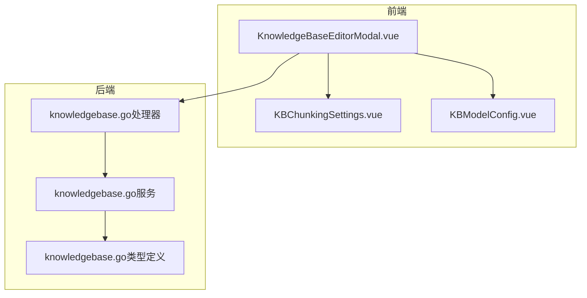
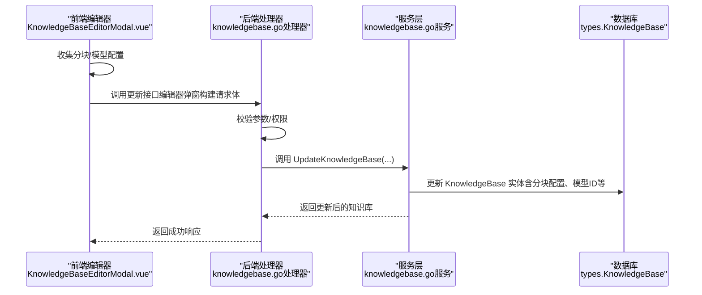
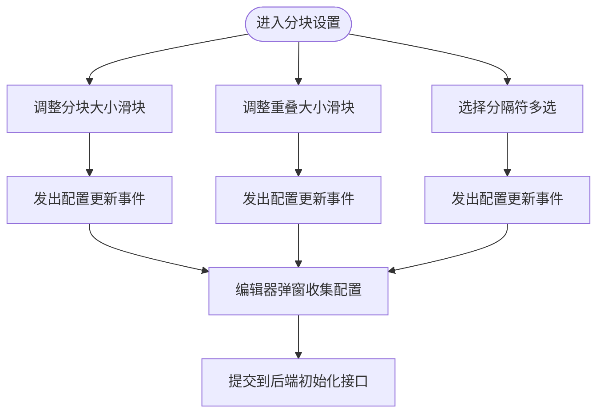
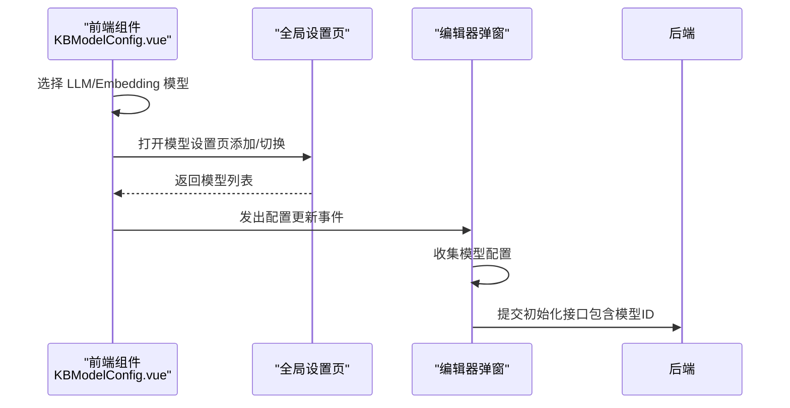
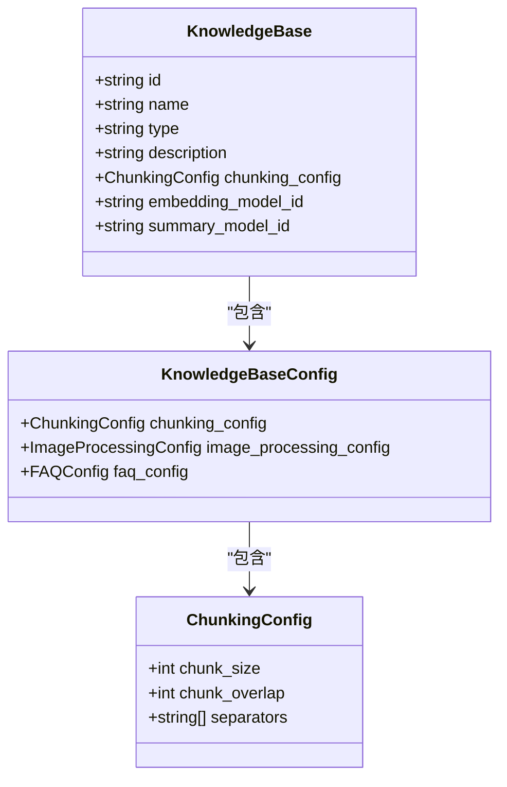
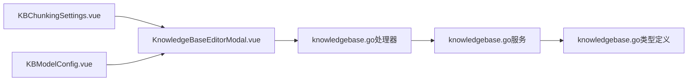

# 高级配置

<cite>
**本文引用的文件**
- [KBChunkingSettings.vue](file://frontend/src/views/knowledge/settings/KBChunkingSettings.vue)
- [KBModelConfig.vue](file://frontend/src/views/knowledge/settings/KBModelConfig.vue)
- [KnowledgeBaseEditorModal.vue](file://frontend/src/views/knowledge/KnowledgeBaseEditorModal.vue)
- [knowledgebase.go（处理器）](file://internal/handler/knowledgebase.go)
- [knowledgebase.go（服务）](file://internal/application/service/knowledgebase.go)
- [knowledgebase.go（类型定义）](file://internal/types/knowledgebase.go)
- [WeKnora.md](file://docs/Weknora.md)
- [read_config.py](file://docreader/models/read_config.py)
</cite>

## 目录
1. [简介](#简介)
2. [项目结构](#项目结构)
3. [核心组件](#核心组件)
4. [架构总览](#架构总览)
5. [详细组件分析](#详细组件分析)
6. [依赖关系分析](#依赖关系分析)
7. [性能考量](#性能考量)
8. [故障排查指南](#故障排查指南)
9. [结论](#结论)
10. [附录](#附录)

## 简介
本文件面向知识库管理员与开发者，围绕前端组件 KBChunkingSettings.vue 与 KBModelConfig.vue，系统阐述如何配置知识库的“分块策略”（分块大小、重叠大小、分隔符）与“模型配置”（嵌入模型、摘要模型），并结合后端服务 UpdateKnowledgeBase 的持久化流程，说明配置变更如何生效。同时，结合 WeKnora.md 中的性能说明，给出不同分块策略对检索效果的影响分析与大规模知识库优化建议。

## 项目结构
- 前端知识库编辑器通过弹窗分节展示：基础信息、模型配置、FAQ 配置、分块设置、图谱设置、高级设置。
- 分块设置与模型配置分别由 KBChunkingSettings.vue 与 KBModelConfig.vue 提供交互界面。
- 编辑器弹窗在“编辑模式”下，先更新基本信息与 FAQ 配置，再通过初始化接口更新完整配置（含分块、多模态、知识图谱、问题生成等）。

图表来源
- [KnowledgeBaseEditorModal.vue](file://frontend/src/views/knowledge/KnowledgeBaseEditorModal.vue#L1-L120)
- [KBChunkingSettings.vue](file://frontend/src/views/knowledge/settings/KBChunkingSettings.vue#L1-L140)
- [KBModelConfig.vue](file://frontend/src/views/knowledge/settings/KBModelConfig.vue#L1-L120)
- [knowledgebase.go（处理器）](file://internal/handler/knowledgebase.go#L180-L223)
- [knowledgebase.go（服务）](file://internal/application/service/knowledgebase.go#L168-L213)
- [knowledgebase.go（类型定义）](file://internal/types/knowledgebase.go#L86-L106)

章节来源
- [KnowledgeBaseEditorModal.vue](file://frontend/src/views/knowledge/KnowledgeBaseEditorModal.vue#L1-L120)
- [KBChunkingSettings.vue](file://frontend/src/views/knowledge/settings/KBChunkingSettings.vue#L1-L140)
- [KBModelConfig.vue](file://frontend/src/views/knowledge/settings/KBModelConfig.vue#L1-L120)
- [knowledgebase.go（处理器）](file://internal/handler/knowledgebase.go#L180-L223)
- [knowledgebase.go（服务）](file://internal/application/service/knowledgebase.go#L168-L213)
- [knowledgebase.go（类型定义）](file://internal/types/knowledgebase.go#L86-L106)

## 核心组件
- 分块设置组件（KBChunkingSettings.vue）
  - 提供分块大小、重叠大小、分隔符的选择与滑块控件，支持实时联动更新。
  - 通过事件向上游发出配置变更，供编辑器弹窗统一提交。
- 模型配置组件（KBModelConfig.vue）
  - 提供 LLM 与嵌入模型选择，支持打开全局模型设置页添加/切换模型。
  - 在知识库已有文件时，嵌入模型选择器会置灰，避免破坏已向量化索引。
- 知识库编辑器弹窗（KnowledgeBaseEditorModal.vue）
  - 编辑模式下，先调用更新基本信息接口，再调用初始化接口更新完整配置（包含分块、多模态、知识图谱、问题生成等）。
  - 提供校验与错误提示，确保必填项与配置一致性。

章节来源
- [KBChunkingSettings.vue](file://frontend/src/views/knowledge/settings/KBChunkingSettings.vue#L1-L140)
- [KBModelConfig.vue](file://frontend/src/views/knowledge/settings/KBModelConfig.vue#L1-L120)
- [KnowledgeBaseEditorModal.vue](file://frontend/src/views/knowledge/KnowledgeBaseEditorModal.vue#L400-L550)

## 架构总览
从前端到后端的配置更新链路如下：
- 前端编辑器弹窗收集分块与模型配置，构建请求体。
- 调用后端知识库更新接口（处理器），解析请求体并调用服务层。
- 服务层更新知识库实体（类型定义中包含分块配置、嵌入模型ID、摘要模型ID等字段）。
- 类型定义中的 JSON 字段映射到数据库，完成持久化。

图表来源
- [KnowledgeBaseEditorModal.vue](file://frontend/src/views/knowledge/KnowledgeBaseEditorModal.vue#L550-L644)
- [knowledgebase.go（处理器）](file://internal/handler/knowledgebase.go#L180-L223)
- [knowledgebase.go（服务）](file://internal/application/service/knowledgebase.go#L168-L213)
- [knowledgebase.go（类型定义）](file://internal/types/knowledgebase.go#L38-L68)

## 详细组件分析

### 分块策略配置（KBChunkingSettings.vue）
- 关键字段
  - 分块大小（chunkSize）：控制每个文本块的最大字符数。
  - 重叠大小（chunkOverlap）：相邻块之间的重叠字符数，增强上下文连续性。
  - 分隔符（separators）：优先级顺序的文本分隔符，如换行、中文句号等。
- 交互行为
  - 滑块与数值显示联动，实时触发更新事件。
  - 多选分隔符，支持中英文标点与空白。
- 数据流向
  - 组件内部维护本地状态，变更时通过事件向外抛出，编辑器弹窗统一收集并提交。

图表来源
- [KBChunkingSettings.vue](file://frontend/src/views/knowledge/settings/KBChunkingSettings.vue#L1-L140)
- [KnowledgeBaseEditorModal.vue](file://frontend/src/views/knowledge/KnowledgeBaseEditorModal.vue#L400-L550)

章节来源
- [KBChunkingSettings.vue](file://frontend/src/views/knowledge/settings/KBChunkingSettings.vue#L1-L140)
- [KnowledgeBaseEditorModal.vue](file://frontend/src/views/knowledge/KnowledgeBaseEditorModal.vue#L400-L550)

### 模型配置（KBModelConfig.vue）
- 关键字段
  - LLM 摘要模型（summary_model_id）：用于生成回答与摘要。
  - 嵌入模型（embedding_model_id）：用于向量化检索。
- 交互行为
  - 通过 ModelSelector 选择模型，支持打开全局模型设置页添加/切换。
  - 若知识库已有文件，嵌入模型选择器置灰，避免破坏现有索引。
- 数据流向
  - 组件内部维护本地状态，变更时通过事件向外抛出，编辑器弹窗统一收集并提交。

图表来源
- [KBModelConfig.vue](file://frontend/src/views/knowledge/settings/KBModelConfig.vue#L1-L120)
- [KnowledgeBaseEditorModal.vue](file://frontend/src/views/knowledge/KnowledgeBaseEditorModal.vue#L170-L220)

章节来源
- [KBModelConfig.vue](file://frontend/src/views/knowledge/settings/KBModelConfig.vue#L1-L120)
- [KnowledgeBaseEditorModal.vue](file://frontend/src/views/knowledge/KnowledgeBaseEditorModal.vue#L170-L220)

### 配置持久化流程（后端）
- 处理器（UpdateKnowledgeBase）
  - 校验参数与租户权限，解析请求体（名称、描述、配置）。
  - 调用服务层 UpdateKnowledgeBase，更新知识库实体。
- 服务层（UpdateKnowledgeBase）
  - 获取现有知识库，更新名称、描述、分块配置、图像处理配置、FAQ 配置等。
  - 调用仓库层持久化。
- 类型定义（KnowledgeBaseConfig/ChunkingConfig）
  - 分块配置包含 chunk_size、chunk_overlap、separators 等字段。
  - 嵌入模型ID与摘要模型ID直接映射到知识库实体。

图表来源
- [knowledgebase.go（类型定义）](file://internal/types/knowledgebase.go#L38-L106)

章节来源
- [knowledgebase.go（处理器）](file://internal/handler/knowledgebase.go#L180-L223)
- [knowledgebase.go（服务）](file://internal/application/service/knowledgebase.go#L168-L213)
- [knowledgebase.go（类型定义）](file://internal/types/knowledgebase.go#L38-L106)

### 不同分块策略对检索效果的影响
- 分块大小（chunk_size）
  - 较小分块：提升细粒度检索能力，适合需要精确定位的场景；但可能增加上下文断裂风险。
  - 较大分块：增强上下文完整性，减少跨块检索需求；但可能降低细粒度匹配精度。
- 重叠大小（chunk_overlap）
  - 适度重叠：缓解跨块边界处的信息丢失，提升检索连贯性。
  - 过大重叠：增加索引与向量存储压力，影响检索效率。
- 分隔符（separators）
  - 优先级顺序影响分块边界选择，合理设置可保持段落与标题的完整性。
- 参考 WeKnora.md 的性能说明
  - 文档解析与分块由独立的 Python 微服务完成，其分块流程严格按“原子单元”顺序切分，保证表格、图片与文本的相对顺序一致，有助于检索后的内容合并与生成。

章节来源
- [WeKnora.md](file://docs/Weknora.md#L94-L187)
- [read_config.py](file://docreader/models/read_config.py#L1-L27)

## 依赖关系分析
- 前端编辑器依赖两个子组件：KBChunkingSettings.vue 与 KBModelConfig.vue。
- 编辑器弹窗在“编辑模式”下，先更新基本信息与 FAQ 配置，再通过初始化接口更新完整配置。
- 后端处理器与服务层共同完成配置更新，类型定义确保字段映射到数据库。

图表来源
- [KBChunkingSettings.vue](file://frontend/src/views/knowledge/settings/KBChunkingSettings.vue#L1-L140)
- [KBModelConfig.vue](file://frontend/src/views/knowledge/settings/KBModelConfig.vue#L1-L120)
- [KnowledgeBaseEditorModal.vue](file://frontend/src/views/knowledge/KnowledgeBaseEditorModal.vue#L1-L120)
- [knowledgebase.go（处理器）](file://internal/handler/knowledgebase.go#L180-L223)
- [knowledgebase.go（服务）](file://internal/application/service/knowledgebase.go#L168-L213)
- [knowledgebase.go（类型定义）](file://internal/types/knowledgebase.go#L38-L106)

章节来源
- [KBChunkingSettings.vue](file://frontend/src/views/knowledge/settings/KBChunkingSettings.vue#L1-L140)
- [KBModelConfig.vue](file://frontend/src/views/knowledge/settings/KBModelConfig.vue#L1-L120)
- [KnowledgeBaseEditorModal.vue](file://frontend/src/views/knowledge/KnowledgeBaseEditorModal.vue#L1-L120)
- [knowledgebase.go（处理器）](file://internal/handler/knowledgebase.go#L180-L223)
- [knowledgebase.go（服务）](file://internal/application/service/knowledgebase.go#L168-L213)
- [knowledgebase.go（类型定义）](file://internal/types/knowledgebase.go#L38-L106)

## 性能考量
- 分块策略与检索融合
  - WeKnora.md 描述了“两次混合搜索”的设计：先用完整问句进行向量检索，再用关键词序列进行关键词检索，最后通过 RRF 融合去重并排序。合理的分块策略能提升两类检索的召回与精度。
- 重排序与生成
  - 文档指出重排序模型可显著提升质量，但成本较高；在生产环境中建议优先使用成熟的常规重排器，或在资源充足时探索基于 LLM 的重排方案。
- 大规模知识库优化建议
  - 控制分块大小与重叠比例，避免过度重叠导致索引膨胀。
  - 合理选择分隔符优先级，确保段落与标题边界清晰。
  - 在嵌入模型与检索引擎配置上，优先保证稳定性与性价比，必要时再引入更昂贵的重排序模型。
  - 对于多模态场景，注意对象存储与并发处理的资源配置，避免成为瓶颈。

章节来源
- [WeKnora.md](file://docs/Weknora.md#L192-L331)

## 故障排查指南
- 常见问题
  - 嵌入模型选择器置灰：当知识库已有文件时，嵌入模型不可更改，需先清空或重建知识库。
  - 配置未生效：确认编辑器弹窗是否正确提交“初始化接口”，检查后端处理器与服务层的日志。
  - 权限不足：后端处理器在更新前会校验租户权限，若无权限会返回错误。
- 建议排查步骤
  - 前端：检查编辑器弹窗的校验与错误提示，确认必填项与配置一致性。
  - 后端：查看处理器日志与服务层更新日志，核对请求体与数据库更新结果。
  - 类型定义：确认分块配置字段映射是否正确（chunk_size、chunk_overlap、separators）。

章节来源
- [KnowledgeBaseEditorModal.vue](file://frontend/src/views/knowledge/KnowledgeBaseEditorModal.vue#L430-L473)
- [knowledgebase.go（处理器）](file://internal/handler/knowledgebase.go#L107-L145)
- [knowledgebase.go（服务）](file://internal/application/service/knowledgebase.go#L168-L213)
- [knowledgebase.go（类型定义）](file://internal/types/knowledgebase.go#L86-L106)

## 结论
- 分块策略与模型配置直接影响检索与生成质量。前端提供了直观的交互界面，后端通过处理器与服务层完成配置持久化。
- 结合 WeKnora.md 的性能说明，建议在保证召回与精度的前提下，优先采用稳健的分块策略与成熟的重排模型，逐步评估更昂贵的优化手段。
- 对于大规模知识库，应关注索引规模、重叠比例与存储并发，确保系统在吞吐与延迟之间取得平衡。

## 附录
- 相关文件路径与用途
  - 前端组件：KBChunkingSettings.vue、KBModelConfig.vue、KnowledgeBaseEditorModal.vue
  - 后端处理器：knowledgebase.go（处理器）
  - 后端服务：knowledgebase.go（服务）
  - 类型定义：knowledgebase.go（类型定义）
  - 文档与性能说明：WeKnora.md
  - 文档解析与分块配置：read_config.py