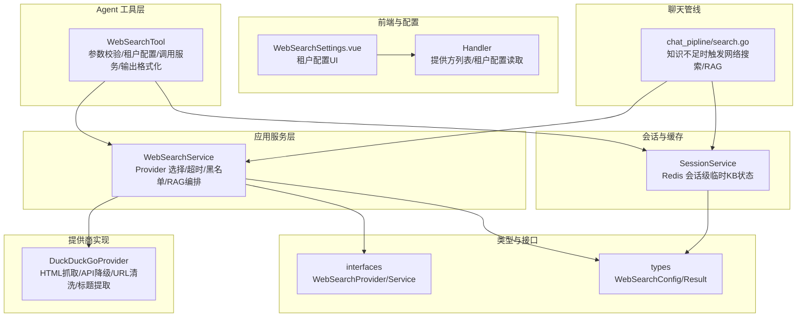
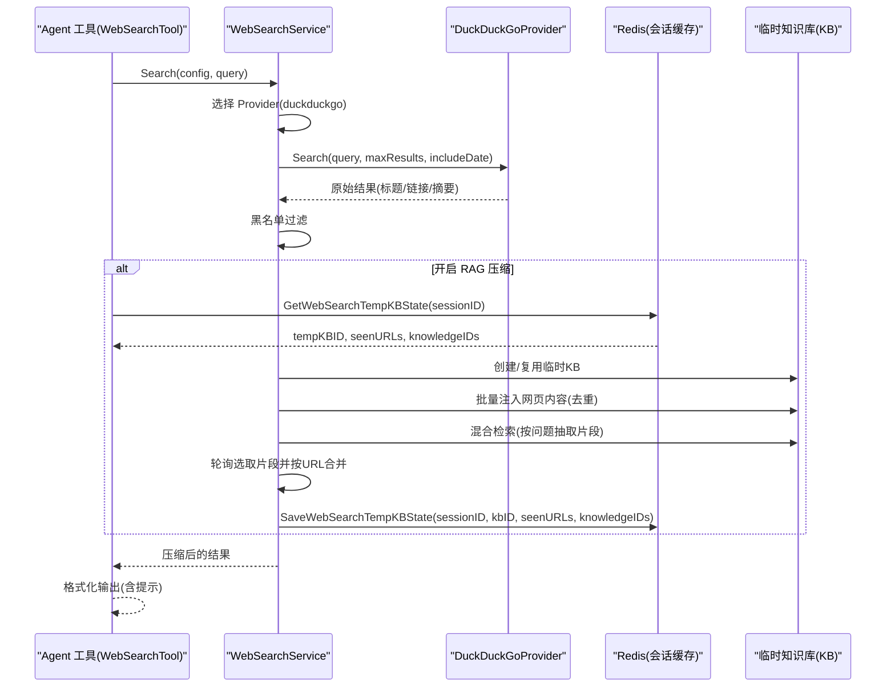
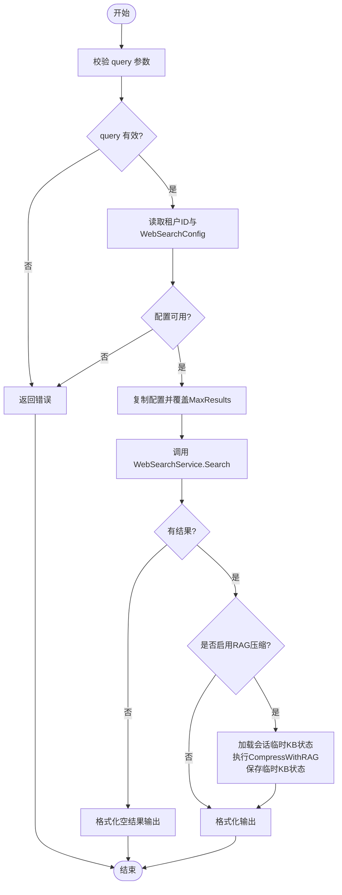
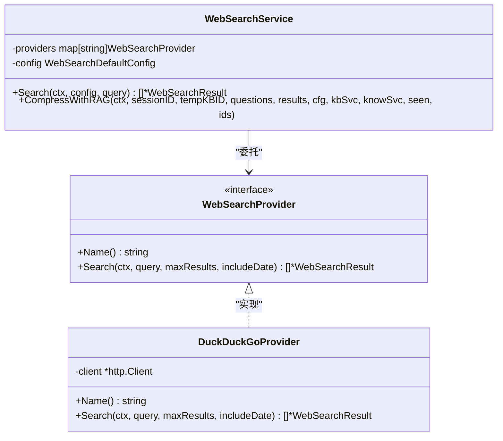
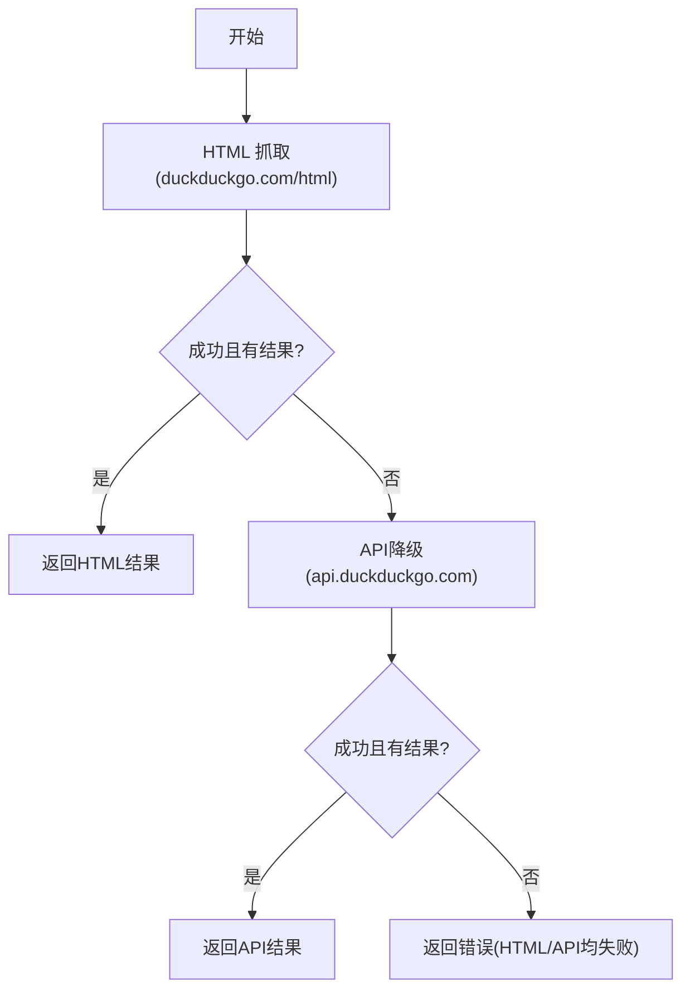
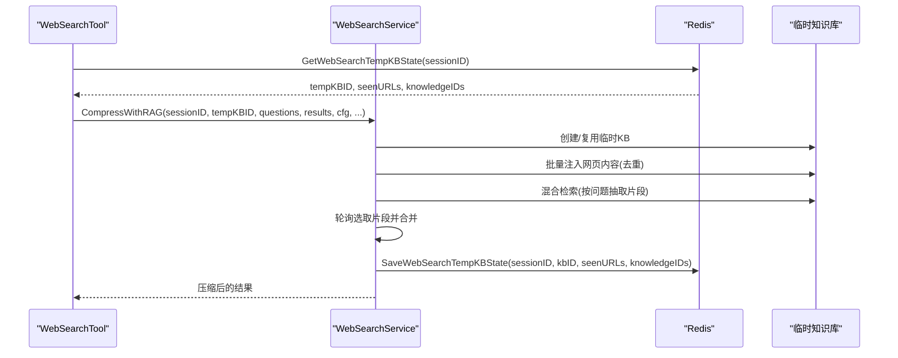
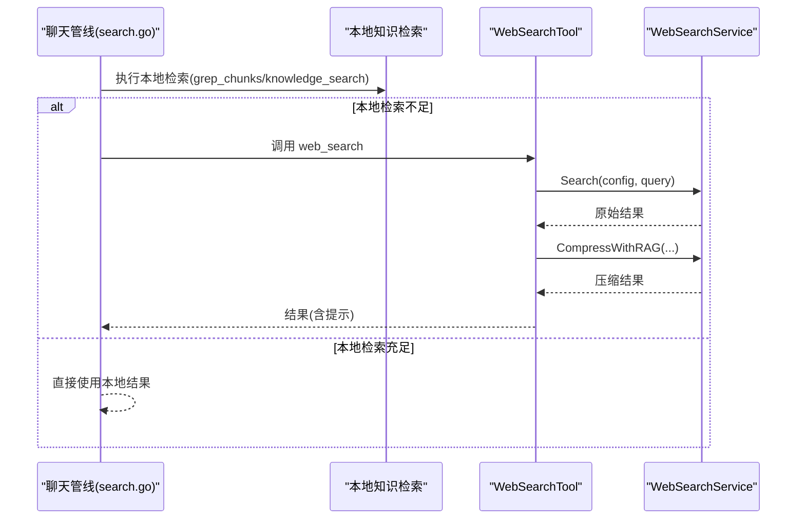
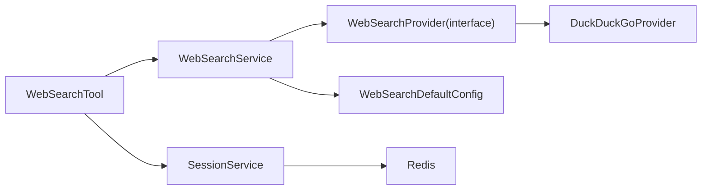

# 网络搜索

<cite>
**本文引用的文件**
- [internal/agent/tools/web_search.go](file://internal/agent/tools/web_search.go)
- [internal/application/service/web_search.go](file://internal/application/service/web_search.go)
- [internal/application/service/web_search/duckduckgo.go](file://internal/application/service/web_search/duckduckgo.go)
- [internal/types/interfaces/web_search.go](file://internal/types/interfaces/web_search.go)
- [internal/types/web_search.go](file://internal/types/web_search.go)
- [internal/types/interfaces/session.go](file://internal/types/interfaces/session.go)
- [internal/application/service/session.go](file://internal/application/service/session.go)
- [internal/application/service/chat_pipline/search.go](file://internal/application/service/chat_pipline/search.go)
- [frontend/src/views/settings/WebSearchSettings.vue](file://frontend/src/views/settings/WebSearchSettings.vue)
- [internal/handler/tenant.go](file://internal/handler/tenant.go)
- [internal/handler/web_search.go](file://internal/handler/web_search.go)
- [docs/Weknora.md](file://docs/Weknora.md)
</cite>

## 目录
1. [简介](#简介)
2. [项目结构](#项目结构)
3. [核心组件](#核心组件)
4. [架构总览](#架构总览)
5. [详细组件分析](#详细组件分析)
6. [依赖分析](#依赖分析)
7. [性能考虑](#性能考虑)
8. [故障排查指南](#故障排查指南)
9. [结论](#结论)
10. [附录](#附录)

## 简介
本文件围绕 WeKnora 的网络搜索能力，基于 duckduckgo.go 实现，系统性阐述网络搜索服务的架构设计、请求流程与结果解析机制；说明 web_search.go 工具如何被 Agent 调用并与本地知识检索结果进行融合；并给出可扩展性设计（支持接入其他搜索引擎）与缓存策略、速率限制与错误处理的最佳实践建议。文中所有技术细节均以仓库现有实现为依据，避免臆测。

## 项目结构
网络搜索相关代码分布在如下模块：
- Agent 工具层：封装网络搜索工具，负责参数校验、租户配置读取、调用服务层、RAG 压缩与输出格式化。
- 应用服务层：WebSearchService 作为统一入口，负责选择具体 Provider、超时控制、黑名单过滤、RAG 压缩编排。
- 提供商实现：DuckDuckGoProvider 通过 HTML 抓取与 API 降级两种方式解析结果。
- 类型与接口：定义 WebSearchConfig、WebSearchResult、WebSearchProvider/Service 接口。
- 会话与缓存：SessionService 通过 Redis 维护会话级临时知识库状态，避免重复索引。
- 前端与配置：WebSearchSettings 页面管理租户级网络搜索配置；Handler 提供配置读取与提供方列表。
- 管道集成：聊天管线在知识检索不足时触发网络搜索，并进行 RAG 压缩与结果转换。

图表来源
- [internal/agent/tools/web_search.go](file://internal/agent/tools/web_search.go#L1-L280)
- [internal/application/service/web_search.go](file://internal/application/service/web_search.go#L1-L381)
- [internal/application/service/web_search/duckduckgo.go](file://internal/application/service/web_search/duckduckgo.go#L1-L259)
- [internal/types/interfaces/web_search.go](file://internal/types/interfaces/web_search.go#L1-L29)
- [internal/types/web_search.go](file://internal/types/web_search.go#L1-L60)
- [internal/types/interfaces/session.go](file://internal/types/interfaces/session.go#L1-L86)
- [internal/application/service/session.go](file://internal/application/service/session.go#L1096-L1168)
- [frontend/src/views/settings/WebSearchSettings.vue](file://frontend/src/views/settings/WebSearchSettings.vue#L184-L412)
- [internal/handler/web_search.go](file://internal/handler/web_search.go#L1-L43)
- [internal/handler/tenant.go](file://internal/handler/tenant.go#L591-L640)
- [internal/application/service/chat_pipline/search.go](file://internal/application/service/chat_pipline/search.go#L374-L408)

章节来源
- [internal/agent/tools/web_search.go](file://internal/agent/tools/web_search.go#L1-L280)
- [internal/application/service/web_search.go](file://internal/application/service/web_search.go#L1-L381)
- [internal/application/service/web_search/duckduckgo.go](file://internal/application/service/web_search/duckduckgo.go#L1-L259)
- [internal/types/interfaces/web_search.go](file://internal/types/interfaces/web_search.go#L1-L29)
- [internal/types/web_search.go](file://internal/types/web_search.go#L1-L60)
- [internal/types/interfaces/session.go](file://internal/types/interfaces/session.go#L1-L86)
- [internal/application/service/session.go](file://internal/application/service/session.go#L1096-L1168)
- [frontend/src/views/settings/WebSearchSettings.vue](file://frontend/src/views/settings/WebSearchSettings.vue#L184-L412)
- [internal/handler/web_search.go](file://internal/handler/web_search.go#L1-L43)
- [internal/handler/tenant.go](file://internal/handler/tenant.go#L591-L640)
- [internal/application/service/chat_pipline/search.go](file://internal/application/service/chat_pipline/search.go#L374-L408)

## 核心组件
- WebSearchTool：Agent 工具，负责参数校验、读取租户配置、调用 WebSearchService、执行 RAG 压缩、格式化输出。
- WebSearchService：服务层入口，负责 Provider 选择、超时控制、黑名单过滤、RAG 压缩编排。
- DuckDuckGoProvider：具体搜索引擎实现，优先 HTML 抓取，失败时回退 API；解析标题、链接、摘要。
- WebSearchProvider/Service 接口：定义统一的提供商与服务接口契约。
- WebSearchConfig/Result 类型：定义租户级配置与搜索结果结构。
- SessionService：会话级缓存，通过 Redis 维护临时知识库状态，避免重复索引。
- 前端 WebSearchSettings：租户级网络搜索配置 UI，支持提供方、API Key、最大结果数、是否包含日期、压缩方法、黑名单等。
- Handler：提供可用提供商列表与租户配置读取接口。
- 聊天管线：在知识检索不足时触发网络搜索，并进行 RAG 压缩与结果转换。

章节来源
- [internal/agent/tools/web_search.go](file://internal/agent/tools/web_search.go#L1-L280)
- [internal/application/service/web_search.go](file://internal/application/service/web_search.go#L1-L381)
- [internal/application/service/web_search/duckduckgo.go](file://internal/application/service/web_search/duckduckgo.go#L1-L259)
- [internal/types/interfaces/web_search.go](file://internal/types/interfaces/web_search.go#L1-L29)
- [internal/types/web_search.go](file://internal/types/web_search.go#L1-L60)
- [internal/types/interfaces/session.go](file://internal/types/interfaces/session.go#L1-L86)
- [internal/application/service/session.go](file://internal/application/service/session.go#L1096-L1168)
- [frontend/src/views/settings/WebSearchSettings.vue](file://frontend/src/views/settings/WebSearchSettings.vue#L184-L412)
- [internal/handler/web_search.go](file://internal/handler/web_search.go#L1-L43)
- [internal/handler/tenant.go](file://internal/handler/tenant.go#L591-L640)
- [internal/application/service/chat_pipline/search.go](file://internal/application/service/chat_pipline/search.go#L374-L408)

## 架构总览
网络搜索的整体流程如下：
- Agent 工具读取租户配置，调用 WebSearchService.Search 获取原始结果。
- WebSearchService 选择具体 Provider（当前支持 duckduckgo），设置超时，调用 Provider.Search 并进行黑名单过滤。
- 若开启 RAG 压缩，WebSearchService 会在会话级临时知识库中注入网页内容，执行混合检索并按来源 URL 轮询选取片段，最终合并回原始结果。
- Agent 工具将结果格式化为人类可读文本与结构化数据，必要时提示用户使用 web_fetch 获取全文。

图表来源
- [internal/agent/tools/web_search.go](file://internal/agent/tools/web_search.go#L116-L279)
- [internal/application/service/web_search.go](file://internal/application/service/web_search.go#L245-L318)
- [internal/application/service/web_search/duckduckgo.go](file://internal/application/service/web_search/duckduckgo.go#L40-L223)
- [internal/application/service/session.go](file://internal/application/service/session.go#L1096-L1143)
- [internal/application/service/chat_pipline/search.go](file://internal/application/service/chat_pipline/search.go#L374-L408)

## 详细组件分析

### WebSearchTool（Agent 工具）
- 参数校验与租户配置：要求提供 query；从上下文读取租户 ID 与 WebSearchConfig；若未配置则直接返回错误。
- Provider 选择与调用：复制租户配置并覆盖 MaxResults，调用 WebSearchService.Search。
- RAG 压缩：若配置了压缩方法且非 none，则加载会话级临时 KB 状态，调用 CompressWithRAG，将压缩结果写回 Redis。
- 输出格式化：将结果转为人类可读文本与结构化数据，包含标题、URL、摘要、内容片段、发布时间等；对内容进行截断提示。

图表来源
- [internal/agent/tools/web_search.go](file://internal/agent/tools/web_search.go#L116-L279)

章节来源
- [internal/agent/tools/web_search.go](file://internal/agent/tools/web_search.go#L1-L280)

### WebSearchService（服务层）
- Provider 选择：根据配置 ID 初始化 Provider（当前支持 duckduckgo），并注册到 providers 映射。
- 超时控制：从全局配置读取超时，缺省 10 秒，使用 context.WithTimeout 控制调用。
- 黑名单过滤：支持通配符与正则两种规则，对结果进行过滤。
- RAG 压缩编排：创建/复用临时知识库，批量注入网页内容（去重），对问题执行混合检索，轮询选取片段并按来源 URL 合并回原始结果。

图表来源
- [internal/application/service/web_search.go](file://internal/application/service/web_search.go#L1-L381)
- [internal/types/interfaces/web_search.go](file://internal/types/interfaces/web_search.go#L1-L29)
- [internal/application/service/web_search/duckduckgo.go](file://internal/application/service/web_search/duckduckgo.go#L1-L259)

章节来源
- [internal/application/service/web_search.go](file://internal/application/service/web_search.go#L1-L381)

### DuckDuckGoProvider（HTML 抓取与 API 降级）
- HTML 抓取：访问 html.duckduckgo.com，设置 User-Agent，解析 .web-result 结构，提取标题、链接、摘要；支持清理 DDG 跳转链接。
- API 降级：当 HTML 失败时回退到 api.duckduckgo.com，解析 AbstractText/AbstractURL/RelatedTopics/Results 字段，提取标题、链接、摘要。
- URL 清洗与标题提取：cleanDDGURL 去除 DDG 跳转参数；extractTitle 从文本中提取标题并截断。

图表来源
- [internal/application/service/web_search/duckduckgo.go](file://internal/application/service/web_search/duckduckgo.go#L40-L223)

章节来源
- [internal/application/service/web_search/duckduckgo.go](file://internal/application/service/web_search/duckduckgo.go#L1-L259)

### 会话级缓存与 RAG 压缩
- 临时知识库：CompressWithRAG 会创建/复用临时知识库，注入网页内容（去重 by URL），随后对问题执行混合检索，轮询选取片段并按来源 URL 合并回原始结果。
- 会话缓存：SessionService 通过 Redis 维护 tempKBID、seenURLs、knowledgeIDs，避免同一会话内重复索引与跨请求状态丢失。
- 轮询选取：selectReferencesRoundRobin 按来源 URL 轮询选取片段，保证多来源均衡覆盖；consolidateReferencesByURL 将片段合并回原始结果。

图表来源
- [internal/agent/tools/web_search.go](file://internal/agent/tools/web_search.go#L178-L200)
- [internal/application/service/web_search.go](file://internal/application/service/web_search.go#L24-L129)
- [internal/application/service/session.go](file://internal/application/service/session.go#L1096-L1143)

章节来源
- [internal/agent/tools/web_search.go](file://internal/agent/tools/web_search.go#L178-L200)
- [internal/application/service/web_search.go](file://internal/application/service/web_search.go#L24-L129)
- [internal/application/service/session.go](file://internal/application/service/session.go#L1096-L1168)

### Agent 调用与与本地知识检索融合
- 调用时机：聊天管线在知识检索不足时触发网络搜索；Agent 工具严格要求先执行本地知识检索（grep_chunks 与 knowledge_search），仅当两者均无足够结果时才使用网络搜索。
- 融合方式：网络搜索结果经 RAG 压缩后，与本地检索结果共同参与后续重排序与生成。

图表来源
- [internal/application/service/chat_pipline/search.go](file://internal/application/service/chat_pipline/search.go#L374-L408)
- [internal/agent/tools/web_search.go](file://internal/agent/tools/web_search.go#L34-L41)

章节来源
- [internal/application/service/chat_pipline/search.go](file://internal/application/service/chat_pipline/search.go#L374-L408)
- [internal/agent/tools/web_search.go](file://internal/agent/tools/web_search.go#L34-L41)

### 可扩展性设计（接入其他搜索引擎）
- 接口契约：WebSearchProvider/Service 定义清晰的接口，新增搜索引擎只需实现 WebSearchProvider 并在 WebSearchService.NewWebSearchService 中注册。
- 配置驱动：通过配置文件的 Providers 数组添加新提供商 ID，即可无缝接入。
- 兼容性：WebSearchService.Search 仅依赖 Provider 接口，无需改动上层调用逻辑。

章节来源
- [internal/types/interfaces/web_search.go](file://internal/types/interfaces/web_search.go#L1-L29)
- [internal/application/service/web_search.go](file://internal/application/service/web_search.go#L288-L318)

## 依赖分析
- 组件耦合：WebSearchTool 依赖 WebSearchService、KnowledgeBaseService、KnowledgeService、SessionService；WebSearchService 依赖 WebSearchProvider 接口与配置；DuckDuckGoProvider 依赖 HTTP 客户端与 goquery。
- 外部依赖：goquery 用于 HTML 解析；go.mod 中声明；HTTP 客户端用于访问 DuckDuckGo API/HTML。
- 潜在循环依赖：当前实现未见循环依赖迹象；WebSearchTool 与 WebSearchService 通过接口解耦。

图表来源
- [internal/agent/tools/web_search.go](file://internal/agent/tools/web_search.go#L1-L280)
- [internal/application/service/web_search.go](file://internal/application/service/web_search.go#L1-L381)
- [internal/application/service/web_search/duckduckgo.go](file://internal/application/service/web_search/duckduckgo.go#L1-L259)
- [internal/types/interfaces/session.go](file://internal/types/interfaces/session.go#L1-L86)

章节来源
- [internal/agent/tools/web_search.go](file://internal/agent/tools/web_search.go#L1-L280)
- [internal/application/service/web_search.go](file://internal/application/service/web_search.go#L1-L381)
- [internal/application/service/web_search/duckduckgo.go](file://internal/application/service/web_search/duckduckgo.go#L1-L259)
- [internal/types/interfaces/session.go](file://internal/types/interfaces/session.go#L1-L86)

## 性能考虑
- 超时控制：WebSearchService 为 Provider 调用设置超时，避免阻塞；默认 10 秒，可通过配置调整。
- 黑名单过滤：在返回前进行过滤，减少无效结果对下游的影响。
- RAG 压缩：通过临时知识库与混合检索，减少冗余内容，提升生成阶段的上下文质量。
- 会话级缓存：Redis 缓存临时 KB 状态，避免重复索引与跨请求状态丢失，降低重复计算成本。
- 前端配置：WebSearchSettings 支持设置 max_results、include_date、compression_method、blacklist 等，便于按需优化性能与准确性。

章节来源
- [internal/application/service/web_search.go](file://internal/application/service/web_search.go#L245-L286)
- [internal/application/service/web_search.go](file://internal/application/service/web_search.go#L320-L373)
- [internal/application/service/session.go](file://internal/application/service/session.go#L1096-L1143)
- [frontend/src/views/settings/WebSearchSettings.vue](file://frontend/src/views/settings/WebSearchSettings.vue#L184-L412)
- [docs/Weknora.md](file://docs/Weknora.md#L192-L200)

## 故障排查指南
- 租户配置缺失：Agent 工具在上下文缺少租户 ID 或 WebSearchConfig 时直接报错；检查 Handler 接口是否正确返回配置。
- Provider 未初始化：WebSearchService.NewWebSearchService 仅支持 duckduckgo；若配置了未知 ID 将报错。
- HTML 抓取失败：DuckDuckGoProvider.searchHTML 返回状态码非 200 或解析失败；检查网络连通性与 User-Agent。
- API 降级失败：searchAPI 返回非 200 或 JSON 解码失败；检查 API 返回体与网络。
- 黑名单规则无效：正则或通配符规则非法时会记录警告；检查规则格式。
- RAG 压缩异常：CompressWithRAG 注入知识或混合检索失败时会记录警告并回退到原始结果；检查嵌入模型 ID、临时 KB 创建与知识注入流程。
- 会话缓存异常：Redis 读取/写入失败不影响主流程，但可能导致重复索引；检查 Redis 连接与键空间。

章节来源
- [internal/agent/tools/web_search.go](file://internal/agent/tools/web_search.go#L138-L174)
- [internal/application/service/web_search.go](file://internal/application/service/web_search.go#L288-L318)
- [internal/application/service/web_search/duckduckgo.go](file://internal/application/service/web_search/duckduckgo.go#L96-L109)
- [internal/application/service/web_search.go](file://internal/application/service/web_search.go#L349-L373)
- [internal/application/service/web_search.go](file://internal/application/service/web_search.go#L24-L129)
- [internal/application/service/session.go](file://internal/application/service/session.go#L1096-L1143)

## 结论
WeKnora 的网络搜索以接口契约与配置驱动为核心，实现了可插拔的搜索引擎接入、会话级缓存与 RAG 压缩，确保在知识不足时能够补充实时信息并提升生成质量。通过超时控制、黑名单过滤与严格的调用顺序（KB First Rule），系统在性能与稳定性方面具备良好保障。未来可通过扩展 Provider 接口快速接入其他搜索引擎，进一步增强搜索能力。

## 附录
- 配置项说明（节选）：
  - provider：搜索引擎提供商 ID（当前支持 duckduckgo）。
  - api_key：API 密钥（如需要）。
  - max_results：最大搜索结果数。
  - include_date：是否包含日期。
  - compression_method：压缩方法（none/summary/extract/rag）。
  - blacklist：黑名单规则（支持通配符与正则）。
  - EmbeddingModelID/EmbeddingDimension/RerankModelID/DocumentFragments：RAG 压缩相关配置。

章节来源
- [internal/types/web_search.go](file://internal/types/web_search.go#L9-L22)
- [internal/handler/tenant.go](file://internal/handler/tenant.go#L591-L640)
- [frontend/src/views/settings/WebSearchSettings.vue](file://frontend/src/views/settings/WebSearchSettings.vue#L184-L412)