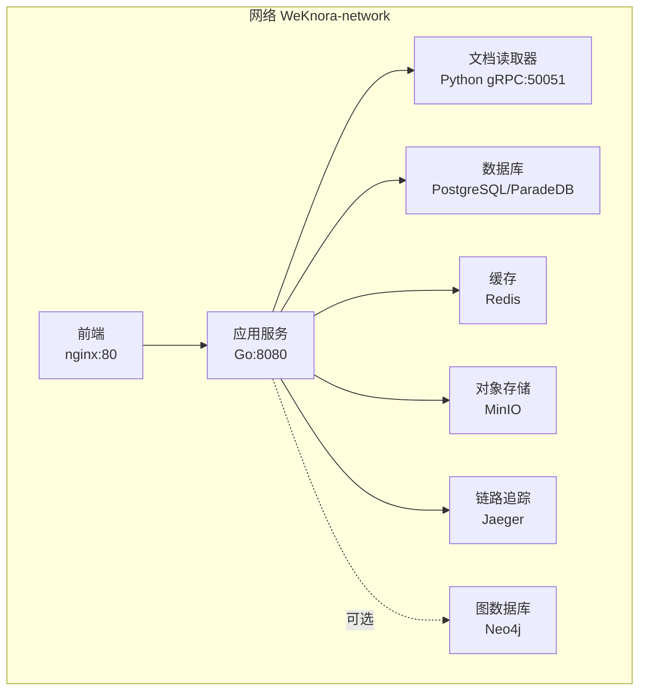
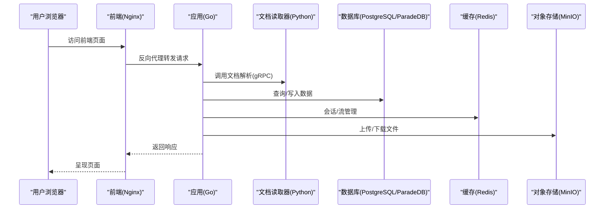
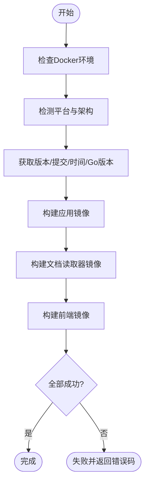
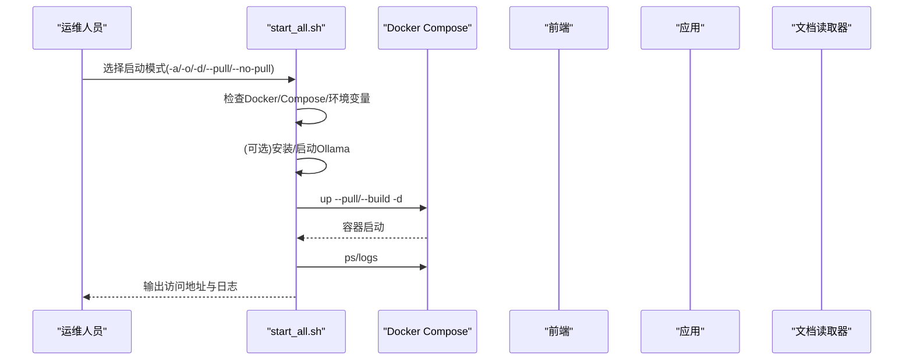
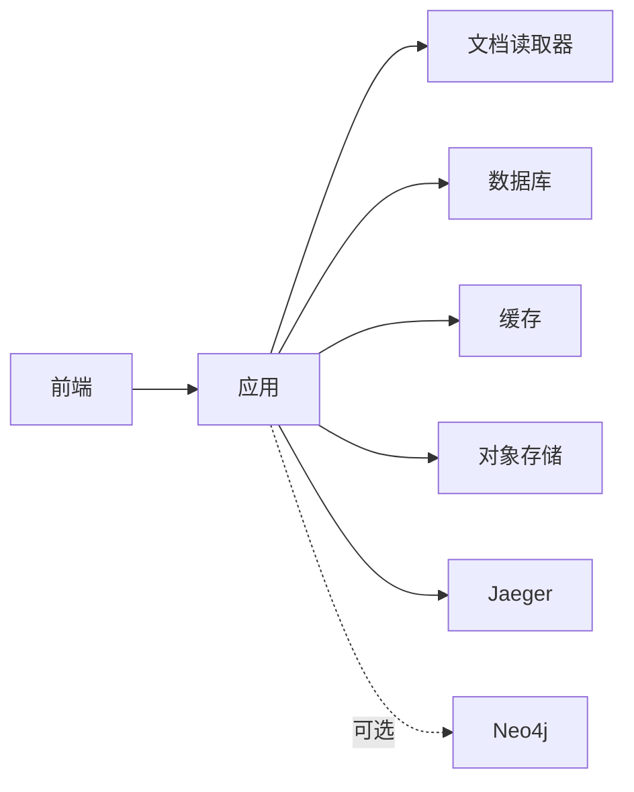

# 部署指南

<cite>
**本文引用的文件**
- [docker-compose.yml](file://docker-compose.yml)
- [scripts/build_images.sh](file://scripts/build_images.sh)
- [scripts/start_all.sh](file://scripts/start_all.sh)
- [docker/Dockerfile.app](file://docker/Dockerfile.app)
- [docker/Dockerfile.docreader](file://docker/Dockerfile.docreader)
- [frontend/Dockerfile](file://frontend/Dockerfile)
- [.env.example](file://.env.example)
- [config/config.yaml](file://config/config.yaml)
- [docker-compose.dev.yml](file://docker-compose.dev.yml)
</cite>

## 目录
1. [简介](#简介)
2. [项目结构](#项目结构)
3. [核心组件](#核心组件)
4. [架构总览](#架构总览)
5. [详细组件分析](#详细组件分析)
6. [依赖关系分析](#依赖关系分析)
7. [性能与容量规划](#性能与容量规划)
8. [安全最佳实践](#安全最佳实践)
9. [故障排查指南](#故障排查指南)
10. [结论](#结论)
11. [附录](#附录)

## 简介
本指南面向运维工程师，提供WeKnora生产环境的完整部署流程，涵盖镜像构建、Compose编排、服务启动、环境配置与安全加固、性能优化与故障排查。读者将学会如何使用仓库内的docker-compose.yml与scripts目录下的脚本，完成从构建到上线的全过程。

## 项目结构
WeKnora采用多服务容器化架构，核心服务包括：
- 前端服务（Nginx静态站点）
- 应用服务（Go后端，提供API与业务逻辑）
- 文档读取器服务（Python gRPC服务，负责文档解析与多模态处理）
- 数据库（PostgreSQL/ParadeDB）
- 缓存（Redis）
- 对象存储（MinIO）
- 链路追踪（Jaeger）
- 图数据库（Neo4j，可选）

图表来源
- [docker-compose.yml](file://docker-compose.yml#L1-L254)

章节来源
- [docker-compose.yml](file://docker-compose.yml#L1-L254)

## 核心组件
- 前端镜像：基于Nginx，构建产物直接部署，端口80。
- 应用镜像：基于Alpine，内置迁移工具与运行时依赖，暴露8080端口。
- 文档读取器镜像：基于Python，预装OCR模型与Playwright浏览器，暴露50051端口。
- 基础设施：PostgreSQL/ParadeDB、Redis、MinIO、Jaeger、Neo4j（可选）。

章节来源
- [frontend/Dockerfile](file://frontend/Dockerfile#L1-L37)
- [docker/Dockerfile.app](file://docker/Dockerfile.app#L1-L90)
- [docker/Dockerfile.docreader](file://docker/Dockerfile.docreader#L1-L161)
- [docker-compose.yml](file://docker-compose.yml#L1-L254)

## 架构总览
生产环境通过docker-compose.yml统一编排，服务间通过自定义桥接网络互通；应用服务依赖数据库、缓存、对象存储、文档读取器与链路追踪；前端通过反向代理访问应用服务。

图表来源
- [docker-compose.yml](file://docker-compose.yml#L1-L254)

## 详细组件分析

### 1) 镜像构建流程（scripts/build_images.sh）
该脚本支持按需构建应用、前端与文档读取器镜像，自动检测平台架构，注入版本信息，并提供清理本地镜像能力。默认构建全部镜像。

- 平台检测：区分x86_64与arm64，设置构建平台参数。
- 版本注入：从VERSION文件与Git获取版本、提交ID、构建时间、Go版本。
- 构建顺序：应用镜像 -> 文档读取器镜像 -> 前端镜像。
- 清理策略：停止并删除相关容器，移除镜像并清理悬空镜像。

图表来源
- [scripts/build_images.sh](file://scripts/build_images.sh#L1-L350)

章节来源
- [scripts/build_images.sh](file://scripts/build_images.sh#L1-L350)

### 2) 应用镜像（docker/Dockerfile.app）
- 多阶段构建：Go构建阶段安装迁移工具与依赖，最终阶段精简至Alpine，安装运行时依赖与工具。
- 权限与目录：创建非root用户，挂载数据目录，赋予读写权限。
- 端口暴露：8080。
- 启动命令：直接运行二进制。

章节来源
- [docker/Dockerfile.app](file://docker/Dockerfile.app#L1-L90)

### 3) 文档读取器镜像（docker/Dockerfile.docreader）
- 多阶段构建：构建阶段预装protoc、下载OCR模型、同步依赖并生成proto代码；运行阶段安装运行时依赖与Playwright浏览器。
- 健康检查：使用grpc_health_probe探测端口。
- 端口暴露：50051。
- 启动命令：uv运行Python入口模块。

章节来源
- [docker/Dockerfile.docreader](file://docker/Dockerfile.docreader#L1-L161)

### 4) 前端镜像（frontend/Dockerfile）
- 多阶段构建：Node构建产物，Nginx直接提供静态文件，端口80。
- 环境变量：启用Docker模式，限制Node内存使用。

章节来源
- [frontend/Dockerfile](file://frontend/Dockerfile#L1-L37)

### 5) 服务编排与启动（scripts/start_all.sh）
该脚本提供统一的启动/停止/诊断/拉取/重启能力，自动检测Docker Compose命令、拉取/构建镜像、健康检查与日志输出。

- Compose检测：优先docker compose插件，其次docker-compose v1。
- 环境检查：自动创建.env（基于.env.example），校验必要变量。
- Ollama处理：本地安装/启动/停止，或远程服务检测。
- 容器管理：启动/停止/拉取/重启，列出服务，输出最近日志。
- 访问提示：启动完成后打印前端、API与Jaeger访问地址。

图表来源
- [scripts/start_all.sh](file://scripts/start_all.sh#L1-L729)
- [docker-compose.yml](file://docker-compose.yml#L1-L254)

章节来源
- [scripts/start_all.sh](file://scripts/start_all.sh#L1-L729)
- [docker-compose.yml](file://docker-compose.yml#L1-L254)

### 6) 环境变量与配置
- .env.example：提供GIN_MODE、APP_PORT、FRONTEND_PORT、DB_DRIVER、STORAGE_TYPE、STREAM_MANAGER_TYPE、JWT_SECRET、REDIS_*、DB_*、MINIO_*、COS_*、OLLAMA_BASE_URL、ENABLE_GRAPH_RAG、NEO4J_*、WEB_PROXY等关键配置项。
- config/config.yaml：应用服务的运行期配置（端口、对话策略、知识库切分、WebSearch提供商等）。

章节来源
- [.env.example](file://.env.example#L1-L150)
- [config/config.yaml](file://config/config.yaml#L1-L649)

### 7) 开发与生产差异
- docker-compose.dev.yml：开发环境仅启动基础设施（postgres、redis、minio、neo4j、docreader、jaeger），app与frontend在本地运行，便于联调。
- docker-compose.yml：生产/集成环境统一编排所有服务，含健康检查、重启策略、extra_hosts等。

章节来源
- [docker-compose.dev.yml](file://docker-compose.dev.yml#L1-L147)
- [docker-compose.yml](file://docker-compose.yml#L1-L254)

## 依赖关系分析
- 应用服务依赖数据库、缓存、对象存储、文档读取器、Jaeger；前端依赖应用服务；文档读取器依赖MinIO/COS（可选）。
- 服务间通过自定义bridge网络互通，容器名称即服务名，便于内部通信。
- 健康检查保障启动顺序与可用性，extra_hosts用于本地Ollama访问。

图表来源
- [docker-compose.yml](file://docker-compose.yml#L1-L254)

章节来源
- [docker-compose.yml](file://docker-compose.yml#L1-L254)

## 性能与容量规划
- CPU/内存：根据并发与模型规模评估，建议为应用与文档读取器预留充足内存，避免容器OOM。
- 存储：MinIO/本地存储需考虑峰值写入与保留周期；数据库与Neo4j需规划卷与备份策略。
- 网络：文档读取器涉及外部模型服务（如Ollama），建议内网直连或边缘节点就近部署。
- 缓存：Redis用于会话与流管理，建议开启持久化与合理淘汰策略。
- 日志与监控：Jaeger采集链路数据，结合应用日志与指标监控，定位热点与瓶颈。

[本节为通用建议，不直接分析具体文件]

## 安全最佳实践
- 环境变量管理
  - 使用独立的.env文件，严禁提交到版本库；敏感信息（如DB_PASSWORD、JWT_SECRET、MINIO_*、COS_*）务必加密存储与轮换。
  - 在CI/CD中使用受控的密钥管理服务注入变量。
- 端口与网络
  - 仅暴露必要端口（前端80、应用8080、MinIO 9000/9001、Jaeger UI 16686等），其余端口通过内网访问。
  - 使用自定义bridge网络隔离服务，避免直接暴露宿主机端口。
- 认证与授权
  - Redis启用密码；数据库设置强口令；MinIO配置访问密钥与桶策略。
  - 应用层JWT密钥定期轮换，启用HTTPS与安全头。
- 镜像与依赖
  - 使用固定镜像标签与校验和，避免latest漂移；定期扫描镜像漏洞。
  - Go/Python依赖锁定，启用sumdb校验。
- 访问控制
  - 前端与API网关接入WAF/防火墙，限制异常请求与DDoS。
  - 对外暴露的UI/API仅允许内网或受控出口访问。

[本节为通用建议，不直接分析具体文件]

## 故障排查指南
- 健康检查失败
  - 查看应用/文档读取器健康检查配置与日志，确认依赖服务（数据库、缓存、对象存储）可达。
- 端口冲突
  - 检查APP_PORT/FRONTEND_PORT/DOCREADER_PORT是否被占用，或与宿主机端口映射冲突。
- 环境变量缺失
  - 确认.env文件存在且包含DB_DRIVER、STORAGE_TYPE、DB_*、MINIO_*、REDIS_*等关键变量。
- Ollama不可达
  - 若为本地Ollama，检查服务是否启动；若为远程，确认地址与网络连通。
- 日志定位
  - 使用start_all.sh的日志输出功能，查看最近容器日志；或进入容器查看应用日志。
- 镜像拉取/构建失败
  - 检查网络与代理设置；使用--no-pull或--pull强制拉取；必要时清理缓存后重试。

章节来源
- [scripts/start_all.sh](file://scripts/start_all.sh#L1-L729)
- [docker-compose.yml](file://docker-compose.yml#L1-L254)

## 结论
通过scripts/build_images.sh与scripts/start_all.sh，配合docker-compose.yml的统一编排，WeKnora可在生产环境中实现快速、稳定、可观测的部署。建议在上线前完成环境变量审计、安全加固与容量评估，并建立完善的监控与回滚机制。

[本节为总结，不直接分析具体文件]

## 附录

### A. 生产部署步骤清单
- 准备工作
  - 准备宿主机（建议Linux，内核支持容器与Docker）。
  - 安装Docker与Docker Compose（插件或v1均可）。
  - 准备SSL证书（如需HTTPS）与域名解析。
- 配置环境
  - 复制.env.example为.env，填写数据库、存储、缓存、模型服务等关键变量。
  - 如使用MinIO/COS，提前创建桶并配置访问凭证。
- 构建镜像
  - 执行scripts/build_images.sh构建全部镜像，或按需选择应用/前端/文档读取器。
- 启动服务
  - 执行scripts/start_all.sh启动所有服务，或分别启动Ollama与Docker服务。
  - 观察日志，确认各服务健康。
- 验证与上线
  - 访问前端与API，检查健康检查与链路追踪。
  - 配置反向代理与防火墙策略，开放必要端口。
  - 建立自动化巡检与告警。

章节来源
- [scripts/build_images.sh](file://scripts/build_images.sh#L1-L350)
- [scripts/start_all.sh](file://scripts/start_all.sh#L1-L729)
- [docker-compose.yml](file://docker-compose.yml#L1-L254)

### B. 关键配置项速查
- 应用服务
  - 端口：APP_PORT（默认8080）
  - 数据库：DB_DRIVER、DB_HOST、DB_PORT、DB_USER、DB_PASSWORD、DB_NAME
  - 缓存：REDIS_ADDR、REDIS_PASSWORD、REDIS_DB、REDIS_PREFIX
  - 存储：STORAGE_TYPE、MINIO_*、COS_*、LOCAL_STORAGE_BASE_DIR
  - 模型：OLLAMA_BASE_URL、INIT_*_MODEL_*（初始化模型配置）
  - 安全：JWT_SECRET、TENANT_AES_KEY
- 前端服务
  - 端口：FRONTEND_PORT（默认80）
- 文档读取器
  - 端口：DOCREADER_PORT（默认50051）
  - 多模态：VLM_MODEL_BASE_URL、VLM_MODEL_NAME、VLM_MODEL_API_KEY
- 基础设施
  - 数据库：ParadeDB镜像与初始化SQL
  - 缓存：Redis密码与持久化
  - 对象存储：MinIO端口与控制台端口
  - 链路追踪：Jaeger端口与OTLP配置
  - 图数据库：Neo4j开关与认证

章节来源
- [.env.example](file://.env.example#L1-L150)
- [docker-compose.yml](file://docker-compose.yml#L1-L254)