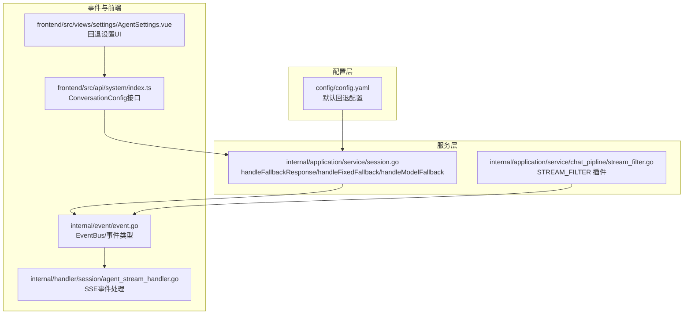
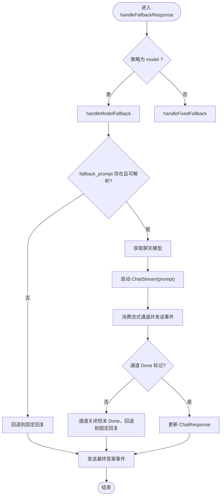
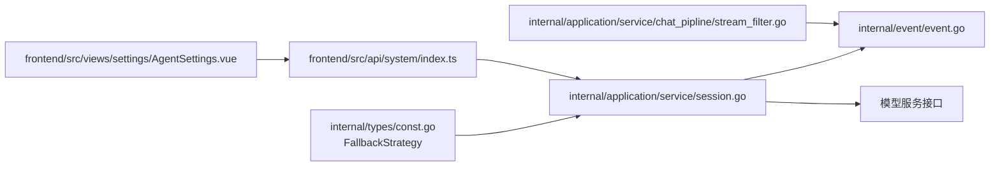

# 回退策略

<cite>
**本文引用的文件**
- [config/config.yaml](file://config/config.yaml)
- [internal/types/const.go](file://internal/types/const.go)
- [internal/types/tenant.go](file://internal/types/tenant.go)
- [internal/application/service/session.go](file://internal/application/service/session.go)
- [internal/application/service/chat_pipline/stream_filter.go](file://internal/application/service/chat_pipline/stream_filter.go)
- [internal/event/event.go](file://internal/event/event.go)
- [internal/handler/session/agent_stream_handler.go](file://internal/handler/session/agent_stream_handler.go)
- [frontend/src/views/settings/AgentSettings.vue](file://frontend/src/views/settings/AgentSettings.vue)
- [frontend/src/api/system/index.ts](file://frontend/src/api/system/index.ts)
</cite>

## 目录
1. [简介](#简介)
2. [项目结构](#项目结构)
3. [核心组件](#核心组件)
4. [架构总览](#架构总览)
5. [详细组件分析](#详细组件分析)
6. [依赖分析](#依赖分析)
7. [性能考量](#性能考量)
8. [故障排查指南](#故障排查指南)
9. [结论](#结论)
10. [附录](#附录)

## 简介
本文件聚焦于“回退策略”配置项，围绕 fallback_strategy、fallback_response 和 fallback_prompt 的设计与实现展开，解释在检索结果为空或低于阈值时，系统如何根据策略（fixed 或 model）生成回退响应；说明 fallback_response 提供的固定回复内容与 fallback_prompt 引导大模型生成动态回复的机制；并结合聊天管道的处理逻辑，阐述回退策略如何保障用户体验的连贯性。文档还提供配置示例，指导如何设置一个既诚实又提供帮助的回退提示词。

## 项目结构
回退策略涉及配置层、服务层、聊天管道层与前端设置界面的协同：
- 配置层：默认配置位于配置文件中，包含 fallback_strategy、fallback_response、fallback_prompt 等键。
- 服务层：会话服务根据策略选择固定回退或模型回退，并通过 EventBus 发送最终答案事件。
- 聊天管道层：在流式过滤阶段，若未匹配到有效内容，将触发回退事件。
- 前端设置：支持在线编辑 fallback_strategy、fallback_response、fallback_prompt，并持久化到会话配置。



图表来源
- [config/config.yaml](file://config/config.yaml#L14-L39)
- [internal/application/service/session.go](file://internal/application/service/session.go#L1200-L1358)
- [internal/application/service/chat_pipline/stream_filter.go](file://internal/application/service/chat_pipline/stream_filter.go#L66-L138)
- [internal/event/event.go](file://internal/event/event.go#L11-L65)
- [internal/handler/session/agent_stream_handler.go](file://internal/handler/session/agent_stream_handler.go#L1-L359)
- [frontend/src/views/settings/AgentSettings.vue](file://frontend/src/views/settings/AgentSettings.vue#L565-L600)
- [frontend/src/api/system/index.ts](file://frontend/src/api/system/index.ts#L52-L54)

章节来源
- [config/config.yaml](file://config/config.yaml#L14-L39)
- [frontend/src/views/settings/AgentSettings.vue](file://frontend/src/views/settings/AgentSettings.vue#L565-L600)

## 核心组件
- 回退策略枚举与类型
  - 策略类型：fixed（固定）与 model（模型）两种。
  - 类型定义与常量见类型定义文件。
- 会话服务的回退处理
  - 根据策略选择固定回退或模型回退。
  - 模型回退时，使用模板渲染 fallback_prompt 并通过流式接口生成最终答案。
- 流式过滤插件
  - 在聊天管道中拦截最终答案事件，若未匹配到有效内容，则触发回退事件。
- 前端设置与接口
  - 前端提供回退策略、固定回复与提示词的编辑入口，并通过系统配置接口保存。

章节来源
- [internal/types/const.go](file://internal/types/const.go#L12-L18)
- [internal/application/service/session.go](file://internal/application/service/session.go#L1200-L1358)
- [internal/application/service/chat_pipline/stream_filter.go](file://internal/application/service/chat_pipline/stream_filter.go#L66-L138)
- [frontend/src/views/settings/AgentSettings.vue](file://frontend/src/views/settings/AgentSettings.vue#L565-L600)
- [frontend/src/api/system/index.ts](file://frontend/src/api/system/index.ts#L52-L54)

## 架构总览
回退策略在检索与生成链路中的触发时机如下：
- 当检索阶段返回空或无效内容时，流式过滤插件检测到无有效输出，发出回退事件。
- 当策略为 fixed 时，直接使用 fallback_response 作为最终答案。
- 当策略为 model 时，使用 fallback_prompt 渲染模板，调用模型流式接口生成最终答案，并通过 EventBus 发送最终答案事件。

```mermaid
sequenceDiagram
participant P as "聊天管道"
participant SF as "流式过滤插件"
participant S as "会话服务"
participant M as "模型服务"
participant EB as "EventBus"
participant SSE as "SSE处理器"
P->>SF : 触发 STREAM_FILTER
SF->>EB : 订阅最终答案事件
P->>EB : 逐步发送答案片段
EB-->>SF : 片段事件
alt 未匹配到有效内容
SF->>EB : 发出回退事件(fallback_response)
else 匹配到有效内容
SF->>EB : 转发累积后的有效片段
end
note over SF,S : 若策略为 model
S->>S : 渲染 fallback_prompt
S->>M : ChatStream(prompt)
M-->>S : 流式片段
S->>EB : 发送最终答案事件
end
EB-->>SSE : 事件推送
SSE-->>客户端 : 实时显示最终答案
```

图表来源
- [internal/application/service/chat_pipline/stream_filter.go](file://internal/application/service/chat_pipline/stream_filter.go#L66-L138)
- [internal/application/service/session.go](file://internal/application/service/session.go#L1200-L1358)
- [internal/event/event.go](file://internal/event/event.go#L11-L65)
- [internal/handler/session/agent_stream_handler.go](file://internal/handler/session/agent_stream_handler.go#L1-L359)

## 详细组件分析

### 配置项与默认值
- fallback_strategy
  - 取值：fixed 或 model。
  - 默认值：在配置文件中设置为 fixed。
- fallback_response
  - 类型：字符串。
  - 默认值：在配置文件中提供一条礼貌且简洁的默认回复。
- fallback_prompt
  - 类型：字符串（模板），支持变量 {{.Query}}。
  - 默认值：在配置文件中提供一个模板，要求模型在超出知识库范围时生成诚实、友好且有帮助的回复。

章节来源
- [config/config.yaml](file://config/config.yaml#L14-L39)

### 会话服务的回退处理流程
- 策略选择
  - 若策略为 model：进入模型回退分支。
  - 若策略为 fixed：直接使用 fallback_response。
- 模型回退
  - 校验 fallback_prompt 是否可用。
  - 使用模板渲染，注入 Query 变量。
  - 获取聊天模型并启动流式对话。
  - 消费流式通道，逐片发送最终答案事件；若通道提前关闭且未标记 Done，则回退到固定回复。
- 固定回退
  - 设置 ChatResponse 并通过 EventBus 发送最终答案事件。



图表来源
- [internal/application/service/session.go](file://internal/application/service/session.go#L1200-L1358)

章节来源
- [internal/application/service/session.go](file://internal/application/service/session.go#L1200-L1358)

### 流式过滤插件的回退触发
- 插件在 STREAM_FILTER 阶段拦截最终答案事件，构建累积内容。
- 若累积内容未匹配到“无匹配前缀”（即有效内容），则直接转发；否则在管道结束后发出回退事件，内容来自 fallback_response。
- 该机制确保即使检索阶段未产出有效内容，也会触发回退，保障用户体验连贯性。

章节来源
- [internal/application/service/chat_pipline/stream_filter.go](file://internal/application/service/chat_pipline/stream_filter.go#L66-L138)

### 事件总线与前端流式处理
- 事件类型
  - 最终答案事件类型为 final_answer。
- 事件总线
  - EventBus 提供同步/异步发布能力，支持多订阅者。
- SSE 处理器
  - 将事件写入流管理器，前端按事件 ID 累积片段，Done 标记表示最终答案完成。

章节来源
- [internal/event/event.go](file://internal/event/event.go#L11-L65)
- [internal/handler/session/agent_stream_handler.go](file://internal/handler/session/agent_stream_handler.go#L1-L359)

### 前端设置与系统配置接口
- 前端设置页面提供：
  - 回退策略切换（fixed/model）。
  - 固定回退回复编辑框（仅在 fixed 策略下展示）。
  - 回退提示词编辑框（可选）。
- 系统配置接口定义了 ConversationConfig 的字段，包括 fallback_strategy、fallback_response、fallback_prompt。

章节来源
- [frontend/src/views/settings/AgentSettings.vue](file://frontend/src/views/settings/AgentSettings.vue#L565-L600)
- [frontend/src/api/system/index.ts](file://frontend/src/api/system/index.ts#L52-L54)

## 依赖分析
- 类型与策略
  - FallbackStrategy 类型与常量定义于类型文件，服务层据此判断策略。
- 服务层依赖
  - 会话服务依赖模型服务获取聊天模型，依赖 EventBus 发送事件。
- 管道层依赖
  - 流式过滤插件依赖 EventBus 与配置中的 NoMatchPrefix 来判定是否需要回退。
- 前端依赖
  - 前端通过系统配置接口读取/保存 ConversationConfig，从而影响回退行为。



图表来源
- [internal/types/const.go](file://internal/types/const.go#L12-L18)
- [internal/application/service/session.go](file://internal/application/service/session.go#L1200-L1358)
- [internal/application/service/chat_pipline/stream_filter.go](file://internal/application/service/chat_pipline/stream_filter.go#L66-L138)
- [internal/event/event.go](file://internal/event/event.go#L11-L65)
- [frontend/src/views/settings/AgentSettings.vue](file://frontend/src/views/settings/AgentSettings.vue#L565-L600)
- [frontend/src/api/system/index.ts](file://frontend/src/api/system/index.ts#L52-L54)

章节来源
- [internal/types/const.go](file://internal/types/const.go#L12-L18)
- [internal/application/service/session.go](file://internal/application/service/session.go#L1200-L1358)
- [internal/application/service/chat_pipline/stream_filter.go](file://internal/application/service/chat_pipline/stream_filter.go#L66-L138)
- [internal/event/event.go](file://internal/event/event.go#L11-L65)
- [frontend/src/views/settings/AgentSettings.vue](file://frontend/src/views/settings/AgentSettings.vue#L565-L600)
- [frontend/src/api/system/index.ts](file://frontend/src/api/system/index.ts#L52-L54)

## 性能考量
- 模型回退的开销
  - 模型回退会启动一次流式对话，带来额外的计算与网络开销。建议在策略为 model 时，确保 fallback_prompt 精炼，减少 token 消耗。
- 事件流式传输
  - SSE 处理器按事件 ID 累积片段，前端无需等待 Done 即可逐步展示，提升感知速度。
- 回退触发频率
  - 若检索阈值设置过低，可能导致频繁触发回退，影响整体响应时间。建议结合 keyword_threshold、vector_threshold、rerank_threshold 等参数优化召回质量。

[本节为通用建议，不直接分析具体文件]

## 故障排查指南
- 现象：策略为 model 但未生效，始终返回固定回复
  - 检查 fallback_prompt 是否为空或模板解析失败。
  - 检查 EventBus 是否可用。
  - 检查模型服务是否可获取。
- 现象：模型回退流式通道提前关闭
  - 若通道未标记 Done，系统会自动回退到固定回复；检查模型调用错误日志。
- 现象：前端未收到最终答案
  - 检查 SSE 处理器是否成功将事件写入流管理器。
  - 检查前端是否按事件 ID 累积并监听 final_answer 事件。

章节来源
- [internal/application/service/session.go](file://internal/application/service/session.go#L1200-L1358)
- [internal/handler/session/agent_stream_handler.go](file://internal/handler/session/agent_stream_handler.go#L1-L359)

## 结论
回退策略通过“固定回复”与“模型动态生成”两种路径，在检索结果为空或无效时保障用户体验的连贯性。固定策略简单可靠，适合对一致性要求高的场景；模型策略更灵活，适合希望在不可知领域提供“诚实而有帮助”的回复。结合流式过滤插件与 EventBus，系统能在不同阶段触发回退，前端以 SSE 实时展示，形成完整的回退闭环。

[本节为总结性内容，不直接分析具体文件]

## 附录

### 配置示例与最佳实践
- 固定策略（fixed）
  - 适用：需要稳定一致的回复，避免模型不确定性。
  - 建议：使用礼貌、简洁、提供替代建议的固定回复。
- 模型策略（model）
  - 适用：希望在超出知识库范围时，由模型生成“诚实且有帮助”的动态回复。
  - 建议：在 fallback_prompt 中明确要求模型：
    - 诚实承认无法提供准确答案；
    - 语气礼貌、专业；
    - 提供相关建议或替代方案；
    - 控制回复长度。
  - 变量：模板中可使用 {{.Query}} 引用用户原始问题，便于模型在回复中体现对问题的理解。

章节来源
- [config/config.yaml](file://config/config.yaml#L14-L39)
- [internal/application/service/session.go](file://internal/application/service/session.go#L1276-L1291)