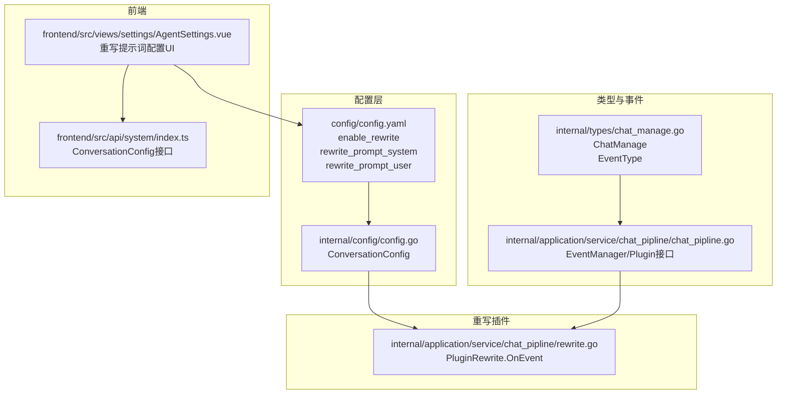
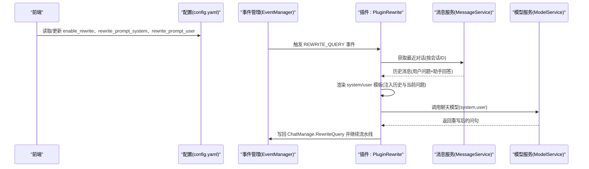
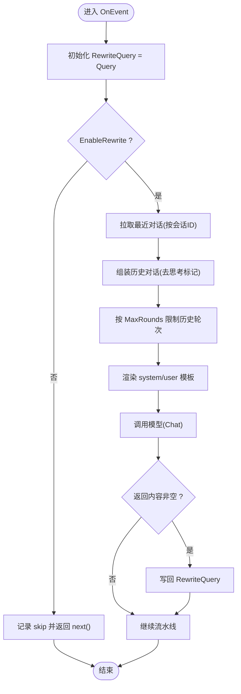
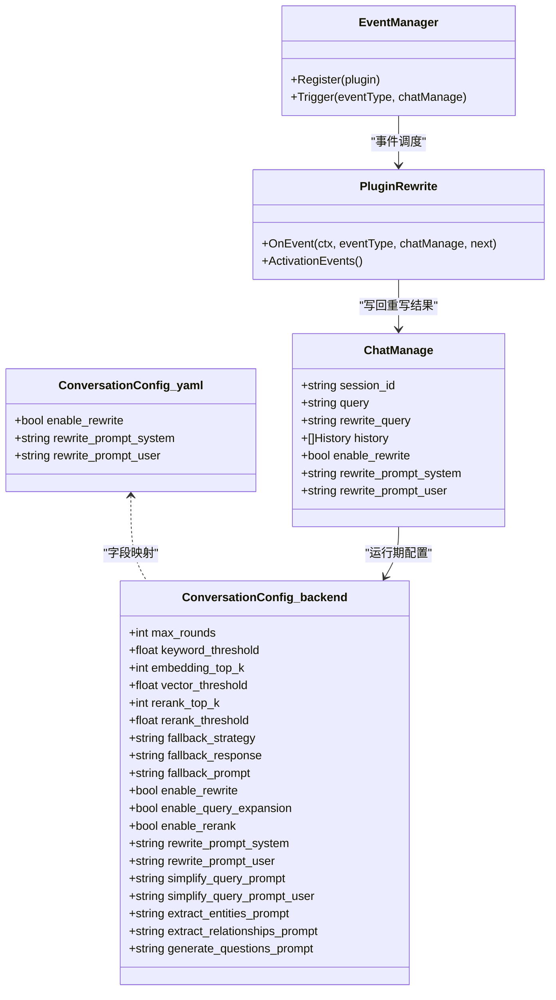

# 查询重写

<cite>
**本文引用的文件**
- [config.yaml](file://config/config.yaml)
- [config.go](file://internal/config/config.go)
- [rewrite.go](file://internal/application/service/chat_pipline/rewrite.go)
- [chat_pipline.go](file://internal/application/service/chat_pipline/chat_pipline.go)
- [chat_manage.go](file://internal/types/chat_manage.go)
- [tenant.go](file://internal/types/tenant.go)
- [AgentSettings.vue](file://frontend/src/views/settings/AgentSettings.vue)
- [index.ts](file://frontend/src/api/system/index.ts)
</cite>

## 目录
1. [简介](#简介)
2. [项目结构](#项目结构)
3. [核心组件](#核心组件)
4. [架构总览](#架构总览)
5. [详细组件分析](#详细组件分析)
6. [依赖分析](#依赖分析)
7. [性能考量](#性能考量)
8. [故障排查指南](#故障排查指南)
9. [结论](#结论)
10. [附录](#附录)

## 简介
本文件聚焦于系统中的“查询重写”能力，围绕配置项 enable_rewrite、rewrite_prompt_system 与 rewrite_prompt_user 的作用机制展开，解释其在多轮对话中如何通过指代消解与省略补全提升检索准确性，并结合 ConversationConfig 结构体说明系统角色与用户上下文模板的协作方式。文档还提供实际重写示例与提示词定制建议，以及该功能对整体问答性能的影响评估方法。

## 项目结构
查询重写功能位于后端聊天流水线模块中，涉及配置加载、事件驱动的插件执行、模板渲染与大模型调用等环节；前端提供可视化配置入口，允许管理员在开启重写的同时自定义系统与用户提示词。

图表来源
- [config.yaml](file://config/config.yaml#L37-L108)
- [config.go](file://internal/config/config.go#L37-L61)
- [chat_manage.go](file://internal/types/chat_manage.go#L99-L141)
- [chat_pipline.go](file://internal/application/service/chat_pipline/chat_pipline.go#L9-L21)
- [rewrite.go](file://internal/application/service/chat_pipline/rewrite.go#L46-L50)
- [AgentSettings.vue](file://frontend/src/views/settings/AgentSettings.vue#L536-L563)
- [index.ts](file://frontend/src/api/system/index.ts#L38-L60)

章节来源
- [config.yaml](file://config/config.yaml#L37-L108)
- [config.go](file://internal/config/config.go#L37-L61)
- [chat_manage.go](file://internal/types/chat_manage.go#L99-L141)
- [chat_pipline.go](file://internal/application/service/chat_pipline/chat_pipline.go#L9-L21)
- [rewrite.go](file://internal/application/service/chat_pipline/rewrite.go#L46-L50)
- [AgentSettings.vue](file://frontend/src/views/settings/AgentSettings.vue#L536-L563)
- [index.ts](file://frontend/src/api/system/index.ts#L38-L60)

## 核心组件
- 配置层
  - enable_rewrite：控制是否启用查询重写。
  - rewrite_prompt_system：系统角色提示词，指导模型进行指代消解与省略补全。
  - rewrite_prompt_user：用户上下文提示词，注入历史对话与当前问题，供模型生成重写后的问句。
- 类型与事件
  - ChatManage：承载会话状态、历史、重写开关与重写后的查询等字段。
  - EventType：定义流水线事件类型，其中 REWRITE_QUERY 是触发重写的关键事件。
  - EventManager/Plugin：事件驱动的插件框架，PluginRewrite 在 REWRITE_QUERY 事件上执行重写逻辑。
- 插件实现
  - PluginRewrite.OnEvent：拉取最近对话、渲染模板、调用大模型、产出重写后的查询并写回 ChatManage。

章节来源
- [config.yaml](file://config/config.yaml#L37-L108)
- [config.go](file://internal/config/config.go#L37-L61)
- [chat_manage.go](file://internal/types/chat_manage.go#L1-L51)
- [chat_manage.go](file://internal/types/chat_manage.go#L99-L141)
- [chat_pipline.go](file://internal/application/service/chat_pipline/chat_pipline.go#L9-L21)
- [rewrite.go](file://internal/application/service/chat_pipline/rewrite.go#L46-L50)
- [rewrite.go](file://internal/application/service/chat_pipline/rewrite.go#L52-L238)

## 架构总览
查询重写在“流式 RAG”模式下作为第一个阶段，先对用户问题进行重写，再进入检索与生成链路。其核心流程如下：

图表来源
- [config.yaml](file://config/config.yaml#L37-L108)
- [chat_pipline.go](file://internal/application/service/chat_pipline/chat_pipline.go#L70-L78)
- [rewrite.go](file://internal/application/service/chat_pipline/rewrite.go#L52-L238)
- [chat_manage.go](file://internal/types/chat_manage.go#L1-L51)

## 详细组件分析

### 配置项与结构体
- enable_rewrite
  - 作用：决定是否启用查询重写阶段。
  - 默认值：在配置文件中可见默认开启。
- rewrite_prompt_system
  - 作用：定义系统角色提示词，强调“指代消解”“省略补全”“保持原意”“问题格式”等约束。
  - 示例约束：代词替换、补全关键信息、保持问题性质、字数限制、仅输出改写后的问题。
- rewrite_prompt_user
  - 作用：定义用户上下文提示词，注入历史对话与当前问题，供模型生成重写后的问句。
  - 模板变量：Query、CurrentTime、Yesterday、Conversation（历史对话列表）。
- ConversationConfig 结构体
  - 后端与租户侧均包含 enable_rewrite、rewrite_prompt_system、rewrite_prompt_user 字段，支持全局与租户级覆盖。

章节来源
- [config.yaml](file://config/config.yaml#L37-L108)
- [config.go](file://internal/config/config.go#L37-L61)
- [tenant.go](file://internal/types/tenant.go#L77-L111)

### 事件与插件执行
- 事件类型
  - REWRITE_QUERY：触发查询重写阶段。
- 插件行为
  - 初始化重写查询为原始查询。
  - 若禁用重写则跳过。
  - 拉取最近对话并清洗（去除思考过程标记）。
  - 渲染 system/user 模板，调用模型生成重写后的问句。
  - 将结果写回 ChatManage.RewriteQuery，继续后续检索与生成。

图表来源
- [rewrite.go](file://internal/application/service/chat_pipline/rewrite.go#L52-L238)
- [chat_manage.go](file://internal/types/chat_manage.go#L1-L51)

章节来源
- [chat_manage.go](file://internal/types/chat_manage.go#L99-L141)
- [rewrite.go](file://internal/application/service/chat_pipline/rewrite.go#L52-L238)

### 系统角色与用户上下文协作
- 系统角色（system prompt）
  - 明确职责：专注指代消解与省略补全，确保输出为完整、明确的问题。
  - 约束：保持原意、问题格式、字数限制、仅输出改写后的问题。
- 用户上下文（user prompt）
  - 输入：当前 Query、历史对话 Conversation（按请求ID分组、去思考标记）、时间戳等。
  - 作用：为模型提供充分上下文，使其能准确识别代词与省略信息。
- 协作方式
  - system 指导模型“做什么”，user 提供“上下文与输入”，二者共同决定重写质量。

章节来源
- [config.yaml](file://config/config.yaml#L42-L108)
- [rewrite.go](file://internal/application/service/chat_pipline/rewrite.go#L143-L194)

### 多轮对话中的指代消解与省略补全
- 指代消解
  - 将“它”“这个”“那个”“他/她/它们/他们/她们”等代词替换为明确主语。
  - 示例：将“它的安全性”重写为“微信支付的安全性”。
- 省略补全
  - 补全省略的关键信息，使问题完整可检索。
  - 示例：将“时间呢？”重写为“北京到上海的高铁时长”。

章节来源
- [config.yaml](file://config/config.yaml#L42-L108)

### 前端配置与定制
- 前端界面
  - 当启用重写时，显示“系统提示词”和“用户提示词”的编辑区域。
  - 保存时将变更写回后端配置。
- 接口定义
  - ConversationConfig 接口中包含 rewrite_prompt_system 与 rewrite_prompt_user 字段，便于前后端一致。

章节来源
- [AgentSettings.vue](file://frontend/src/views/settings/AgentSettings.vue#L536-L563)
- [AgentSettings.vue](file://frontend/src/views/settings/AgentSettings.vue#L773-L790)
- [AgentSettings.vue](file://frontend/src/views/settings/AgentSettings.vue#L1786-L1804)
- [index.ts](file://frontend/src/api/system/index.ts#L38-L60)

## 依赖分析
- 配置依赖
  - config.yaml 中的 enable_rewrite、rewrite_prompt_system、rewrite_prompt_user 作为系统默认配置。
  - 后端 ConversationConfig 结构体映射上述字段，支持租户级覆盖。
- 运行时依赖
  - ChatManage 持有 EnableRewrite、RewritePromptSystem、RewritePromptUser 等运行期配置。
  - EventManager 以事件驱动方式调度 PluginRewrite。
  - PluginRewrite 依赖 MessageService 获取历史、依赖 ModelService 调用模型。

图表来源
- [config.go](file://internal/config/config.go#L37-L61)
- [tenant.go](file://internal/types/tenant.go#L77-L111)
- [chat_manage.go](file://internal/types/chat_manage.go#L1-L51)
- [chat_pipline.go](file://internal/application/service/chat_pipline/chat_pipline.go#L9-L21)
- [rewrite.go](file://internal/application/service/chat_pipline/rewrite.go#L46-L50)

章节来源
- [config.go](file://internal/config/config.go#L37-L61)
- [tenant.go](file://internal/types/tenant.go#L77-L111)
- [chat_manage.go](file://internal/types/chat_manage.go#L1-L51)
- [chat_pipline.go](file://internal/application/service/chat_pipline/chat_pipline.go#L9-L21)
- [rewrite.go](file://internal/application/service/chat_pipline/rewrite.go#L46-L50)

## 性能考量
- 计算成本
  - 重写阶段引入一次模型调用，温度较低、最大生成长度有限，有助于控制延迟与成本。
- 历史窗口
  - 通过 MaxRounds 控制历史对话轮次，避免过长历史导致上下文膨胀与性能下降。
- 错误与降级
  - 模板解析失败、历史拉取失败、模型调用失败均有错误处理路径，必要时跳过重写以保证流水线继续。

章节来源
- [rewrite.go](file://internal/application/service/chat_pipline/rewrite.go#L143-L194)
- [rewrite.go](file://internal/application/service/chat_pipline/rewrite.go#L205-L238)
- [chat_manage.go](file://internal/types/chat_manage.go#L22-L31)

## 故障排查指南
- 常见问题与定位
  - 重写未生效
    - 检查 enable_rewrite 是否开启。
    - 检查 ChatManage.EnableRewrite 是否被覆盖为 false。
  - 历史为空
    - 确认历史拉取成功且按 RequestID 分组完整。
    - 检查 MaxRounds 是否过小导致历史被截断。
  - 模板渲染失败
    - 检查 rewrite_prompt_system 与 rewrite_prompt_user 的语法与变量是否匹配。
  - 模型调用失败
    - 检查模型服务可用性与 ChatModelID。
- 日志与可观测性
  - 插件内部记录输入/输出与错误类型，便于定位问题。

章节来源
- [rewrite.go](file://internal/application/service/chat_pipline/rewrite.go#L68-L141)
- [rewrite.go](file://internal/application/service/chat_pipline/rewrite.go#L143-L194)
- [rewrite.go](file://internal/application/service/chat_pipline/rewrite.go#L205-L238)

## 结论
查询重写通过系统角色与用户上下文的协同，将多轮对话中的代词与省略信息转化为明确、可检索的问题，显著提升检索阶段的命中率与下游生成质量。结合合理的提示词设计与历史窗口控制，可在保证性能的前提下获得稳定的问答体验。前端提供了直观的配置入口，便于按需定制重写策略。

## 附录

### 实际重写示例
- 输入：它是什么？
  - 历史：用户问“微信支付有哪些功能？”助手回答“微信支付的主要功能包括转账、付款码、收款、信用卡还款等多种支付服务。”
  - 重写：微信支付的安全性
- 输入：时间呢？
  - 历史：用户问“北京到上海的高铁票价是多少？”助手回答“二等座约为553元，一等座约为933元。”
  - 重写：北京到上海的高铁时长

章节来源
- [config.yaml](file://config/config.yaml#L42-L108)

### 提示词定制建议
- 系统提示词（rewrite_prompt_system）
  - 明确约束：代词替换、补全关键信息、保持问题性质、字数限制、仅输出改写后的问题。
  - 可加入 Few-shot 示例，增强模型对任务的理解。
- 用户提示词（rewrite_prompt_user）
  - 保证历史对话结构清晰、时间顺序合理。
  - 适当增加时间戳等上下文信息，辅助模型判断时序与指代关系。
- 租户级覆盖
  - 通过租户配置覆盖全局默认提示词，满足不同业务场景需求。

章节来源
- [config.yaml](file://config/config.yaml#L42-L108)
- [tenant.go](file://internal/types/tenant.go#L77-L111)
- [AgentSettings.vue](file://frontend/src/views/settings/AgentSettings.vue#L536-L563)
- [AgentSettings.vue](file://frontend/src/views/settings/AgentSettings.vue#L1786-L1804)