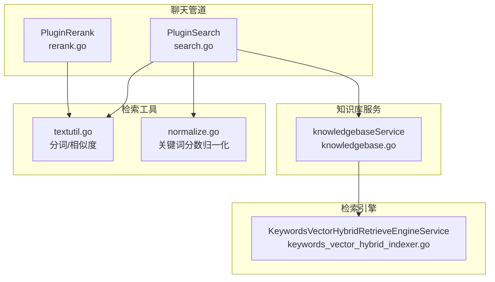
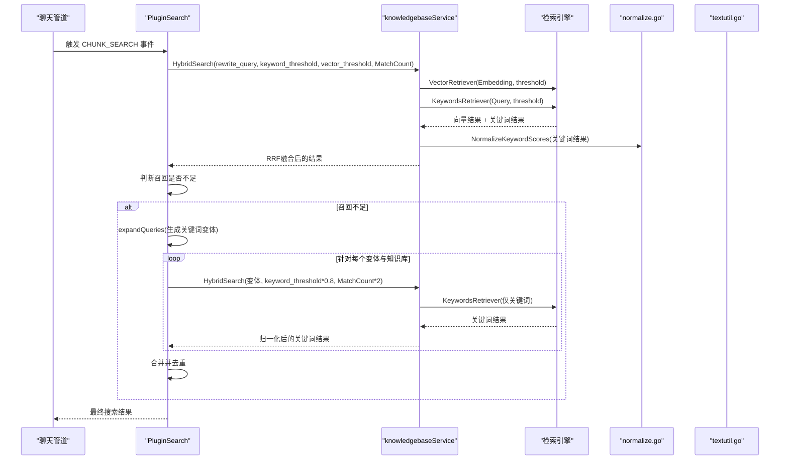
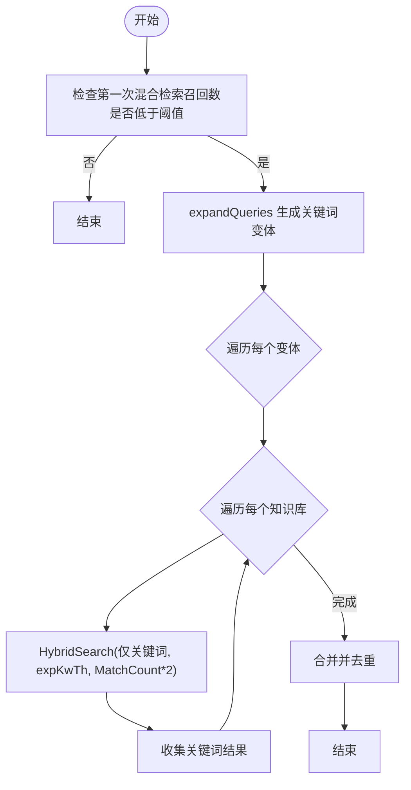
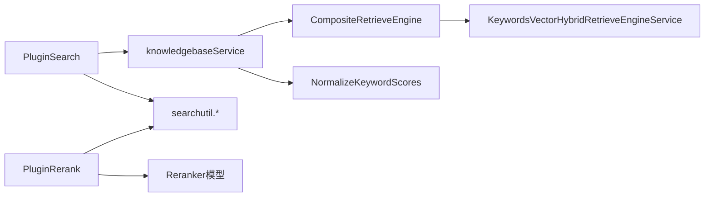

# 关键词检索

<cite>
**本文引用的文件**
- [internal/application/service/chat_pipline/search.go](file://internal/application/service/chat_pipline/search.go)
- [internal/application/service/knowledgebase.go](file://internal/application/service/knowledgebase.go)
- [internal/types/search.go](file://internal/types/search.go)
- [internal/searchutil/textutil.go](file://internal/searchutil/textutil.go)
- [internal/searchutil/normalize.go](file://internal/searchutil/normalize.go)
- [internal/application/service/chat_pipline/rerank.go](file://internal/application/service/chat_pipline/rerank.go)
- [internal/application/service/retriever/keywords_vector_hybrid_indexer.go](file://internal/application/service/retriever/keywords_vector_hybrid_indexer.go)
- [docs/WeKnora.md](file://docs/WeKnora.md)
</cite>

## 目录
1. [引言](#引言)
2. [项目结构](#项目结构)
3. [核心组件](#核心组件)
4. [架构总览](#架构总览)
5. [详细组件分析](#详细组件分析)
6. [依赖分析](#依赖分析)
7. [性能考量](#性能考量)
8. [故障排查指南](#故障排查指南)
9. [结论](#结论)

## 引言
本文件围绕关键词检索机制展开，重点解释 keyword_threshold 参数在混合检索中的作用，以及系统如何通过分词与关键词匹配（如 BM25）实现基于词项的检索。文档还结合聊天管道的搜索逻辑，阐述关键词检索在查询扩展中的应用，特别是当第一次搜索召回率较低时，触发的二次关键词优化搜索流程。最后，提供实际代码示例路径，展示 search.go 中 expandQueries 函数如何生成查询变体以提升关键词召回。

## 项目结构
本主题涉及的关键模块包括：
- 聊天管道搜索插件：负责构建检索参数、并发检索、召回不足时的二次关键词优化搜索、历史结果合并与去重。
- 知识库服务：执行混合检索（向量 + 关键词），使用 RRF 融合排序，并将关键词分数归一化。
- 检索工具：提供分词、关键词提取、相似度计算等基础能力。
- 重排插件：在混合检索后进行重排与过滤，进一步提升相关性。

图表来源
- [internal/application/service/chat_pipline/search.go](file://internal/application/service/chat_pipline/search.go#L1-L250)
- [internal/application/service/knowledgebase.go](file://internal/application/service/knowledgebase.go#L430-L629)
- [internal/searchutil/textutil.go](file://internal/searchutil/textutil.go#L1-L71)
- [internal/searchutil/normalize.go](file://internal/searchutil/normalize.go#L1-L109)
- [internal/application/service/retriever/keywords_vector_hybrid_indexer.go](file://internal/application/service/retriever/keywords_vector_hybrid_indexer.go#L1-L40)
- [internal/application/service/chat_pipline/rerank.go](file://internal/application/service/chat_pipline/rerank.go#L1-L180)

章节来源
- [internal/application/service/chat_pipline/search.go](file://internal/application/service/chat_pipline/search.go#L1-L250)
- [internal/application/service/knowledgebase.go](file://internal/application/service/knowledgebase.go#L430-L629)

## 核心组件
- PluginSearch：聊天管道的搜索插件，负责：
  - 构建检索参数（含 keyword_threshold）
  - 并发执行知识库检索与网页检索
  - 当召回不足时，调用 expandQueries 生成关键词导向的查询变体，再次执行关键词检索以提升召回
  - 历史结果合并与去重
- knowledgebaseService.HybridSearch：混合检索主流程，支持向量检索与关键词检索，使用 RRF 融合并归一化关键词分数
- 检索工具：提供分词、关键词提取、Jaccard 相似度等基础能力
- PluginRerank：在混合检索后进行重排与过滤，进一步提升相关性

章节来源
- [internal/application/service/chat_pipline/search.go](file://internal/application/service/chat_pipline/search.go#L1-L250)
- [internal/application/service/knowledgebase.go](file://internal/application/service/knowledgebase.go#L430-L629)
- [internal/searchutil/textutil.go](file://internal/searchutil/textutil.go#L1-L71)
- [internal/searchutil/normalize.go](file://internal/searchutil/normalize.go#L1-L109)
- [internal/application/service/chat_pipline/rerank.go](file://internal/application/service/chat_pipline/rerank.go#L1-L180)

## 架构总览
下图展示了关键词检索在混合检索中的位置与数据流，以及 keyword_threshold 的作用点。

图表来源
- [internal/application/service/chat_pipline/search.go](file://internal/application/service/chat_pipline/search.go#L131-L206)
- [internal/application/service/knowledgebase.go](file://internal/application/service/knowledgebase.go#L430-L629)
- [internal/searchutil/normalize.go](file://internal/searchutil/normalize.go#L1-L109)
- [internal/searchutil/textutil.go](file://internal/searchutil/textutil.go#L1-L71)

## 详细组件分析

### 关键词检索与 keyword_threshold 的作用
- 在 HybridSearch 中，关键词检索与向量检索分别设置阈值：
  - KeywordThreshold：关键词检索的相似度阈值，用于过滤关键词匹配结果
  - VectorThreshold：向量检索的相似度阈值，用于过滤向量匹配结果
- 关键词检索的阈值直接影响召回广度：阈值越低，召回越多；但过低可能导致噪声上升。
- 在混合检索中，关键词分数会在 RRF 融合前进行归一化，避免极端值主导融合权重。

章节来源
- [internal/types/search.go](file://internal/types/search.go#L54-L62)
- [internal/application/service/knowledgebase.go](file://internal/application/service/knowledgebase.go#L493-L504)
- [internal/searchutil/normalize.go](file://internal/searchutil/normalize.go#L1-L109)

### 分词与关键词匹配（BM25）实现
- 分词与关键词提取：
  - tokenize：按字符与标点拆分，保留中文单字与英文字母/数字序列
  - extractKeywords：移除常见停用词，保留长度大于1的词
  - extractPhrases：提取引号包裹的短语
  - splitByDelimiters：按逗号、顿号、分号、空格等分隔符切分
  - removeQuestionWords：去除中文疑问词前缀
- 关键词匹配与相似度：
  - 使用 TokenizeSimple 与 Jaccard 计算候选片段与查询的相似度，用于后续重排与冗余度控制

章节来源
- [internal/application/service/chat_pipline/search.go](file://internal/application/service/chat_pipline/search.go#L410-L562)
- [internal/searchutil/textutil.go](file://internal/searchutil/textutil.go#L1-L71)

### 查询扩展与二次关键词优化搜索
- 当第一次混合检索召回数量小于阈值（EmbeddingTopK/2）时，系统触发查询扩展：
  - expandQueries 生成最多5个关键词导向的查询变体（去重、长度限制）
  - 使用 expKwTh = keyword_threshold × 0.8 降低关键词阈值，扩大召回
  - 并发对每个变体与每个知识库执行关键词检索，收集结果并合并
- 该机制在“语义检索召回不足”时，通过关键词检索补充召回，提升覆盖面

图表来源
- [internal/application/service/chat_pipline/search.go](file://internal/application/service/chat_pipline/search.go#L131-L206)

章节来源
- [internal/application/service/chat_pipline/search.go](file://internal/application/service/chat_pipline/search.go#L131-L206)

### 混合检索与 RRF 融合
- HybridSearch 会根据配置启用向量检索与关键词检索，并将两者结果通过 RRF 融合：
  - RRFK=60，对向量与关键词各自的排名进行融合，得到统一的 RRF 分数
  - 融合后对结果按 RRF 分数降序排序
- 关键词分数在融合前进行归一化，避免极值影响融合权重

章节来源
- [internal/application/service/knowledgebase.go](file://internal/application/service/knowledgebase.go#L549-L624)
- [internal/searchutil/normalize.go](file://internal/searchutil/normalize.go#L1-L109)

### 重排与过滤（与关键词检索的关系）
- 重排阶段使用 rerank 模型对候选进行再排序，并结合 compositeScore 综合考虑：
  - 基础分数（来自混合检索）
  - 模型重排分数
  - 来源权重（如网页来源）
  - 位置优先（段落起止位置）
- 重排后仍可使用 MMR 控制多样性，减少冗余

章节来源
- [internal/application/service/chat_pipline/rerank.go](file://internal/application/service/chat_pipline/rerank.go#L1-L180)
- [internal/application/service/chat_pipline/rerank.go](file://internal/application/service/chat_pipline/rerank.go#L239-L321)

### 检索引擎与混合检索实现
- KeywordsVectorHybridRetrieveEngineService：提供关键词与向量混合检索能力，委托给索引仓库执行检索
- 该服务在 HybridSearch 中被 CompositeRetrieveEngine 调用，支持向量与关键词两类检索器

章节来源
- [internal/application/service/retriever/keywords_vector_hybrid_indexer.go](file://internal/application/service/retriever/keywords_vector_hybrid_indexer.go#L1-L40)
- [internal/application/service/knowledgebase.go](file://internal/application/service/knowledgebase.go#L430-L511)

## 依赖分析
- PluginSearch 依赖：
  - knowledgebaseService.HybridSearch：执行混合检索
  - searchutil：分词、相似度、内容签名
  - config、logger：日志与配置
- knowledgebaseService 依赖：
  - CompositeRetrieveEngine：聚合多种检索引擎
  - KeywordsVectorHybridRetrieveEngineService：关键词与向量混合检索
  - searchutil.normalize：关键词分数归一化
- PluginRerank 依赖：
  - rerank 模型接口
  - searchutil.TokenizeSimple/Jaccard：重排时的冗余度计算

图表来源
- [internal/application/service/chat_pipline/search.go](file://internal/application/service/chat_pipline/search.go#L1-L120)
- [internal/application/service/knowledgebase.go](file://internal/application/service/knowledgebase.go#L430-L511)
- [internal/searchutil/normalize.go](file://internal/searchutil/normalize.go#L1-L109)
- [internal/application/service/chat_pipline/rerank.go](file://internal/application/service/chat_pipline/rerank.go#L1-L120)

## 性能考量
- 并发控制：查询扩展阶段使用信号量限制并发作业数，避免过度并发导致资源争用
- 匹配数量放大：为关键词扩展检索提高 MatchCount，以保证召回充足
- 阈值调整：关键词扩展时降低 keyword_threshold，提升召回，随后在重排阶段通过阈值过滤与 MMR 控制冗余
- 归一化：对关键词分数进行稳健百分位归一化，避免极端值主导融合

章节来源
- [internal/application/service/chat_pipline/search.go](file://internal/application/service/chat_pipline/search.go#L142-L160)
- [internal/searchutil/normalize.go](file://internal/searchutil/normalize.go#L1-L109)

## 故障排查指南
- 关键词检索无结果
  - 检查 keyword_threshold 是否过高，导致过滤过于严格
  - 在召回不足时确认是否触发了查询扩展（查看日志中 recall_low 与 expansion_* 相关条目）
- 结果冗余或重复
  - 确认去重逻辑是否生效（按 chunk ID 与内容签名去重）
  - 重排阶段是否启用 MMR
- 分词与关键词提取异常
  - 检查 tokenize、extractKeywords、extractPhrases、splitByDelimiters 的行为是否符合预期
- 重排后无结果
  - 检查 rerank 阈值与阈值降级逻辑，必要时降低 rerank 阈值

章节来源
- [internal/application/service/chat_pipline/search.go](file://internal/application/service/chat_pipline/search.go#L269-L305)
- [internal/application/service/chat_pipline/rerank.go](file://internal/application/service/chat_pipline/rerank.go#L160-L205)

## 结论
keyword_threshold 在混合检索中扮演“关键词召回控制开关”的角色：它与向量阈值共同决定各自检索通道的召回范围，并在 RRF 融合前通过归一化确保公平竞争。当语义检索召回不足时，系统通过 expandQueries 生成关键词导向的查询变体，以更低的 keyword_threshold 执行关键词检索，从而在不引入 LLM 的前提下提升召回。配合重排与 MMR，最终在覆盖率与相关性之间取得平衡。