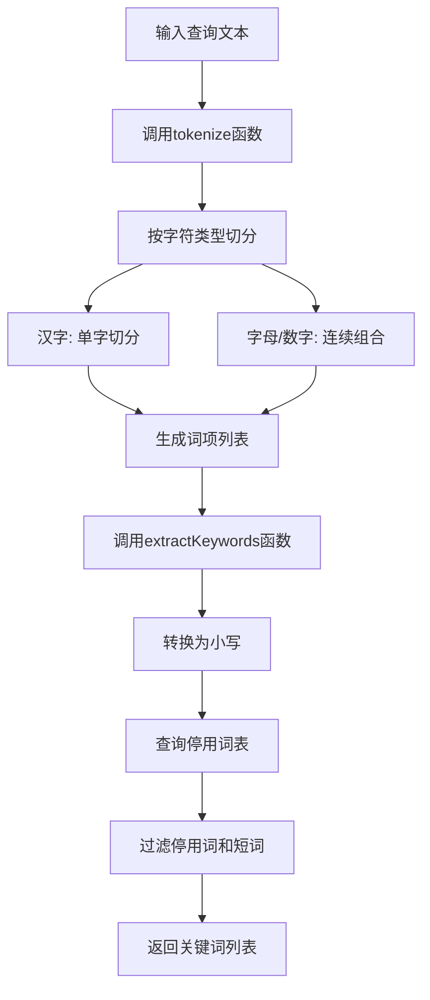
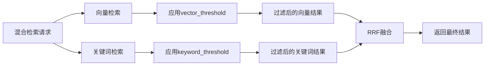
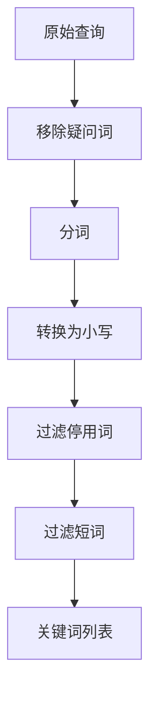
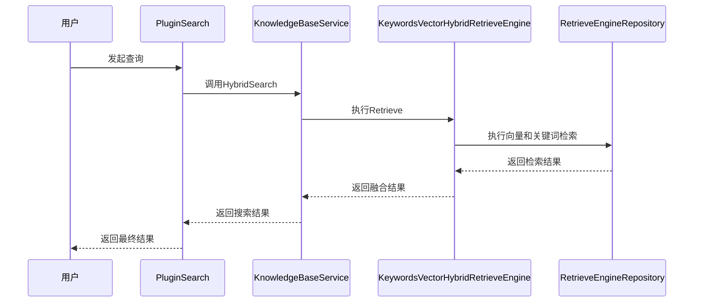

# 关键词检索机制

<cite>
**本文档中引用的文件**   
- [search.go](file://internal/application/service/chat_pipline/search.go)
- [searchutil/textutil.go](file://internal/searchutil/textutil.go)
- [keywords_vector_hybrid_indexer.go](file://internal/application/service/retriever/keywords_vector_hybrid_indexer.go)
- [knowledgebase.go](file://internal/application/service/knowledgebase.go)
- [search.go](file://internal/agent/tools/knowledge_search.go)
- [config.yaml](file://config/config.yaml)
</cite>

## 目录
1. [关键词检索机制概述](#关键词检索机制概述)
2. [分词算法与关键词提取](#分词算法与关键词提取)
3. [BM25与关键词匹配算法](#bm25与关键词匹配算法)
4. [keyword_threshold参数在混合检索中的作用](#keyword_threshold参数在混合检索中的作用)
5. [查询处理中的过滤机制](#查询处理中的过滤机制)
6. [混合检索流程与系统集成](#混合检索流程与系统集成)

## 关键词检索机制概述

关键词检索机制是WeKnora系统中实现精确信息检索的核心组件之一。该机制结合了基于词项的关键词匹配与向量语义检索，通过混合检索策略提升召回率与准确率。系统首先对用户查询进行分词处理，提取出具有实际意义的关键词，然后利用BM25等传统信息检索算法进行关键词匹配。同时，系统还支持向量检索，通过将文本转换为高维向量实现语义层面的相似度计算。两种检索方式的结果通过RRF（Reciprocal Rank Fusion）算法进行融合，最终返回综合评分最高的结果。

混合检索不仅提高了检索的全面性，还通过设置`keyword_threshold`等参数对召回结果进行精确控制。此外，系统在查询处理阶段引入了停用词（stopwords）和疑问词（questionWords）的过滤机制，以提升关键词提取的准确性。整个检索流程高度可配置，支持多种数据库后端（如PostgreSQL、Elasticsearch等），并可通过配置文件灵活调整检索策略。

**Section sources**
- [search.go](file://internal/application/service/chat_pipline/search.go#L1-L562)
- [knowledgebase.go](file://internal/application/service/knowledgebase.go#L431-L749)

## 分词算法与关键词提取

系统中的关键词提取依赖于自定义的分词算法，该算法能够处理中英文混合文本，并通过规则过滤掉无实际意义的词汇。分词过程主要由`tokenize`函数实现，该函数遍历输入文本的每个字符，根据字符类型（字母、数字、汉字）进行切分。对于汉字，每个字符被视为一个独立的词项；对于字母和数字，则连续的字符组合成一个词项。这种简单的分词策略虽然不如专业的分词工具（如jieba）精细，但足以满足关键词提取的需求。

关键词提取的核心函数是`extractKeywords`，它接收分词后的结果，并通过查询停用词表来过滤掉常见的虚词和功能词。停用词表包含了中英文常见的停用词，如“的”、“是”、“在”、“a”、“the”等。此外，函数还会过滤掉长度小于等于1的词项，以避免单个字符或字母对检索结果造成干扰。经过过滤后，剩余的词项即为提取出的关键词，这些关键词将用于后续的关键词匹配检索。



**Diagram sources **
- [search.go](file://internal/application/service/chat_pipline/search.go#L534-L561)
- [search.go](file://internal/application/service/chat_pipline/search.go#L491-L501)

**Section sources**
- [search.go](file://internal/application/service/chat_pipline/search.go#L475-L501)
- [searchutil/textutil.go](file://internal/searchutil/textutil.go#L23-L35)

## BM25与关键词匹配算法

系统利用BM25算法作为关键词匹配的核心算法，该算法是一种广泛应用于信息检索领域的概率模型，能够有效衡量查询与文档之间的相关性。BM25算法考虑了词频（TF）、逆文档频率（IDF）以及文档长度归一化等因素，相比传统的TF-IDF算法具有更好的性能。在WeKnora系统中，BM25索引由ParadeDB提供支持，该数据库扩展了PostgreSQL，专门用于全文搜索和向量检索。

在数据库层面，系统通过SQL语句创建BM25索引，指定使用`chinese_lindera`分词器来处理中文文本。分词器负责将文档内容切分为词项，并构建倒排索引。当执行关键词检索时，系统会将查询中的关键词与索引中的词项进行匹配，并计算每个文档的BM25得分。得分越高，表示文档与查询的相关性越强。检索结果按得分降序排列，确保最相关的结果排在前面。

```mermaid
erDiagram
chinese_documents {
id SERIAL PK
title TEXT
content TEXT
published_date DATE
}
idx_documents_bm25 {
key_field "id"
text_fields "content"
tokenizer "chinese_lindera"
}
chinese_documents ||--o{ idx_documents_bm25 : "使用BM25索引"
```

**Diagram sources **
- [01-migrate-to-paradedb.sql](file://migrations/paradedb/01-migrate-to-paradedb.sql#L39-L57)
- [repository.go](file://internal/application/repository/retriever/postgres/repository.go#L162-L187)

**Section sources**
- [01-migrate-to-paradedb.sql](file://migrations/paradedb/01-migrate-to-paradedb.sql#L39-L69)
- [repository.go](file://internal/application/repository/retriever/postgres/repository.go#L162-L187)

## keyword_threshold参数在混合检索中的作用

`keyword_threshold`参数在混合检索中扮演着至关重要的角色，它作为关键词匹配的相似度过滤阈值，用于控制召回结果的精确度。当系统执行混合检索时，会同时进行向量检索和关键词检索。向量检索的结果通过`vector_threshold`参数进行过滤，而关键词检索的结果则通过`keyword_threshold`参数进行过滤。只有得分高于各自阈值的结果才会被保留并参与后续的融合排序。

该参数的设置直接影响检索结果的质量。较高的阈值会返回更精确但数量较少的结果，适用于对准确率要求较高的场景；较低的阈值则会返回更多结果，但可能包含一些相关性较低的文档，适用于需要高召回率的场景。在系统配置中，`keyword_threshold`的默认值通常设置为0.5，用户可以根据具体需求进行调整。此外，在查询扩展（query expansion）过程中，系统会将`keyword_threshold`乘以0.8，以降低阈值，从而召回更多潜在相关的文档。



**Diagram sources **
- [search.go](file://internal/application/service/chat_pipline/search.go#L171-L175)
- [search.go](file://internal/application/service/chat_pipline/search.go#L321-L322)

**Section sources**
- [search.go](file://internal/application/service/chat_pipline/search.go#L165-L206)
- [search.go](file://internal/application/service/chat_pipline/search.go#L318-L323)

## 查询处理中的过滤机制

为了提升关键词提取的准确性和检索效率，系统在查询处理阶段引入了多种过滤机制，主要包括停用词（stopwords）和疑问词（questionWords）的过滤。停用词是指在信息检索中通常被忽略的常见词汇，它们对文档的主题贡献较小。系统维护了一个包含中英文停用词的集合，如“的”、“是”、“a”、“the”等。在提取关键词时，系统会检查每个词项是否存在于停用词表中，如果存在则将其过滤掉。

疑问词过滤则针对中文查询中的常见疑问词，如“什么是”、“如何”、“为什么”等。这些词语虽然表达了疑问的语气，但对关键词匹配的帮助有限。系统使用正则表达式`^(什么是|什么|如何|怎么|怎样|为什么|为何|哪个|哪些|谁|何时|何地|请问|请告诉我|帮我|我想知道|我想了解)`来匹配并移除这些疑问词前缀。通过移除疑问词，系统可以更专注于查询中的核心关键词，从而提高检索的准确性和效率。



**Diagram sources **
- [search.go](file://internal/application/service/chat_pipline/search.go#L488-L489)
- [search.go](file://internal/application/service/chat_pipline/search.go#L476-L486)

**Section sources**
- [search.go](file://internal/application/service/chat_pipline/search.go#L488-L532)
- [search.go](file://internal/application/service/chat_pipline/search.go#L475-L486)

## 混合检索流程与系统集成

混合检索的完整流程涉及多个组件的协同工作，从查询接收、关键词提取、多路检索到结果融合与排序。整个流程始于用户发起的查询请求，该请求首先被`PluginSearch`组件接收。`PluginSearch`负责协调知识库检索和网络搜索（如果启用），并行执行多个检索任务以提高效率。在知识库检索中，系统会调用`knowledgeBaseService.HybridSearch`方法，该方法根据租户配置的检索引擎（如PostgreSQL、Elasticsearch）执行混合检索。

混合检索的核心在于`KeywordsVectorHybridRetrieveEngineService`，它封装了向量检索和关键词检索的逻辑。该服务通过`RetrieveEngineRepository`接口与具体的数据库后端交互，执行实际的检索操作。检索结果返回后，系统使用RRF（Reciprocal Rank Fusion）算法对向量检索和关键词检索的结果进行融合。RRF算法通过计算每个文档在不同检索路径中的排名，生成一个综合的融合得分，确保最相关的结果获得更高的排名。最后，系统对融合后的结果进行去重、截断和格式化，返回给上层组件。



**Diagram sources **
- [keywords_vector_hybrid_indexer.go](file://internal/application/service/retriever/keywords_vector_hybrid_indexer.go#L35-L40)
- [knowledgebase.go](file://internal/application/service/knowledgebase.go#L431-L436)

**Section sources**
- [keywords_vector_hybrid_indexer.go](file://internal/application/service/retriever/keywords_vector_hybrid_indexer.go#L1-L181)
- [knowledgebase.go](file://internal/application/service/knowledgebase.go#L431-L653)