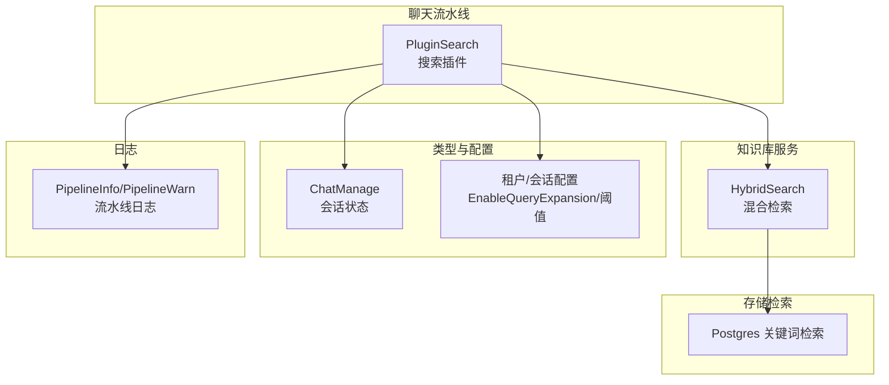
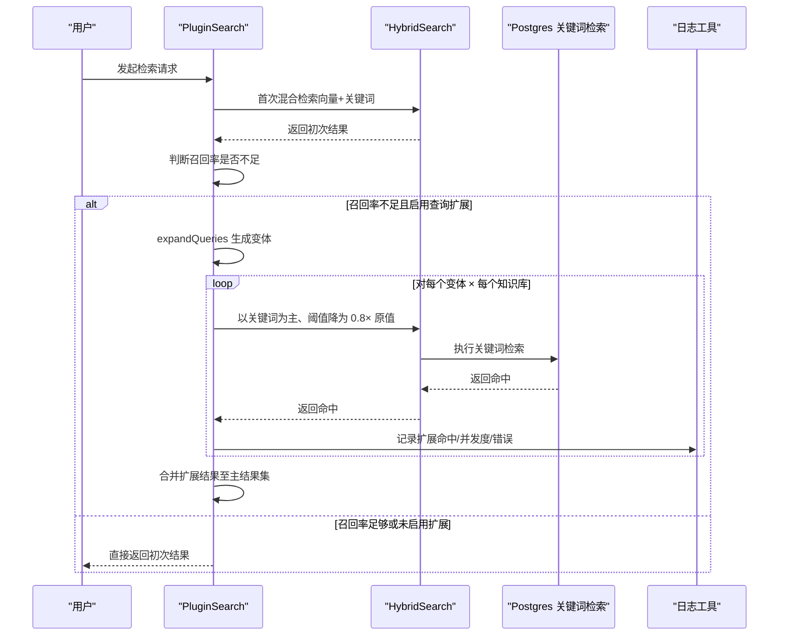
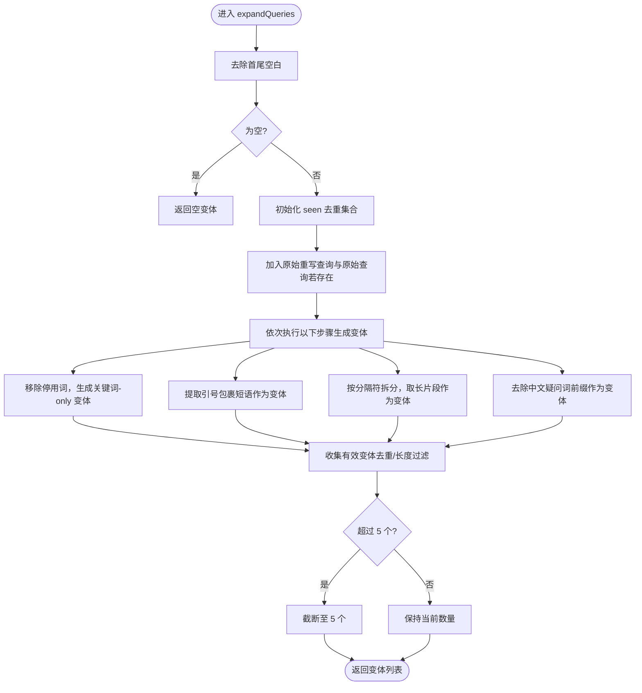
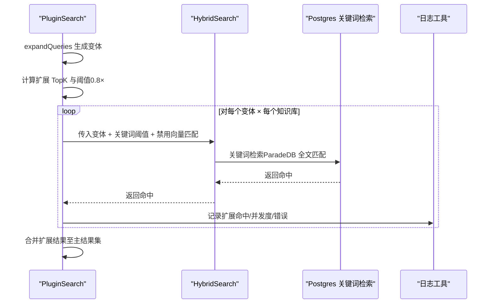
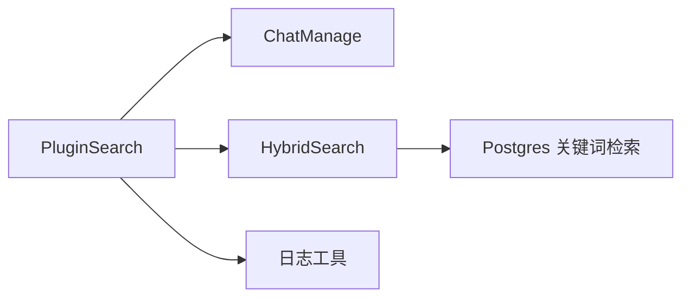

# 查询扩展机制

<cite>
**本文引用的文件列表**
- [search.go](file://internal/application/service/chat_pipline/search.go)
- [knowledgebase.go](file://internal/application/service/knowledgebase.go)
- [chat_manage.go](file://internal/types/chat_manage.go)
- [tools.go](file://internal/common/tools.go)
- [tenant.go](file://internal/handler/tenant.go)
- [session.go](file://internal/application/service/session.go)
- [repository.go](file://internal/application/repository/retriever/postgres/repository.go)
</cite>

## 目录
1. [引言](#引言)
2. [项目结构](#项目结构)
3. [核心组件](#核心组件)
4. [架构总览](#架构总览)
5. [详细组件分析](#详细组件分析)
6. [依赖关系分析](#依赖关系分析)
7. [性能考量](#性能考量)
8. [故障排查指南](#故障排查指南)
9. [结论](#结论)

## 引言
本文件围绕关键词检索中的“查询扩展”机制展开，重点解释在首次检索召回率不足时，系统如何通过本地生成查询变体的方式进行二次优化搜索。具体而言，expandQueries 函数会基于若干启发式规则（移除停用词、提取关键短语、按分隔符拆分、去除疑问词等）生成多个查询变体，并以降低的关键词阈值（0.8 倍原值）对每个变体执行并发关键词搜索，从而提升关键词召回率。本文将结合代码路径与流程图，帮助读者理解该机制的设计思路、实现细节与运行时行为。

## 项目结构
本次分析涉及的关键模块包括：
- 聊天流水线中的搜索插件：负责在首次检索后根据召回情况触发查询扩展，并并发执行关键词搜索
- 知识库服务：提供混合检索能力（向量与关键词），并在扩展阶段以关键词为主
- 类型定义：包含聊天管理状态、阈值与 TopK 等参数
- 日志工具：统一记录流水线事件，便于追踪扩展过程
- 租户与会话配置：控制是否启用查询扩展以及默认阈值

图表来源
- [search.go](file://internal/application/service/chat_pipline/search.go#L131-L206)
- [knowledgebase.go](file://internal/application/service/knowledgebase.go#L431-L463)
- [chat_manage.go](file://internal/types/chat_manage.go#L4-L51)
- [tools.go](file://internal/common/tools.go#L184-L221)
- [repository.go](file://internal/application/repository/retriever/postgres/repository.go#L162-L187)

章节来源
- [search.go](file://internal/application/service/chat_pipline/search.go#L131-L206)
- [chat_manage.go](file://internal/types/chat_manage.go#L4-L51)

## 核心组件
- expandQueries：在首次检索召回不足时，生成查询变体（移除停用词、提取关键短语、按分隔符拆分、去除疑问词等），并限制最多 5 个变体
- 扩展搜索流程：当满足条件时，使用 0.8 倍的 KeywordThreshold 对每个变体与所有知识库并发执行关键词搜索，并将结果合并回主结果集
- HybridSearch：知识库服务的混合检索入口，支持向量与关键词检索；在扩展阶段禁用向量匹配，仅启用关键词匹配
- ChatManage：承载会话状态、阈值、TopK、是否启用查询扩展等参数
- 日志工具：统一输出流水线事件，便于观测扩展触发、并发度、命中数等

章节来源
- [search.go](file://internal/application/service/chat_pipline/search.go#L131-L206)
- [search.go](file://internal/application/service/chat_pipline/search.go#L410-L473)
- [knowledgebase.go](file://internal/application/service/knowledgebase.go#L431-L463)
- [chat_manage.go](file://internal/types/chat_manage.go#L4-L51)
- [tools.go](file://internal/common/tools.go#L184-L221)

## 架构总览
下图展示了从首次检索到查询扩展的整体调用序列，突出扩展触发条件、变体生成与并发关键词搜索的关键步骤。

图表来源
- [search.go](file://internal/application/service/chat_pipline/search.go#L131-L206)
- [knowledgebase.go](file://internal/application/service/knowledgebase.go#L431-L463)
- [repository.go](file://internal/application/repository/retriever/postgres/repository.go#L162-L187)
- [tools.go](file://internal/common/tools.go#L184-L221)

## 详细组件分析

### expandQueries：查询变体生成器
expandQueries 在首次检索召回不足时被调用，其目标是通过本地规则生成多个查询变体，以增强关键词召回。生成策略如下：
- 去除常见停用词，仅保留关键词，形成“关键词-only”变体
- 提取引号包裹的短语或关键片段作为独立变体
- 按常见分隔符（逗号、顿号、句号、问号、空格等）拆分原始查询，选取长度超过阈值的最长片段作为变体
- 去除中文疑问词前缀（如“什么是/如何/怎么/为什么/哪个/请问/请告诉我/帮我/我想知道/我想了解”等），形成去疑问词变体
- 去重与长度过滤：对每个变体进行空白裁剪、最小长度检查与大小写不敏感去重
- 上限控制：最多生成 5 个变体

图表来源
- [search.go](file://internal/application/service/chat_pipline/search.go#L410-L473)
- [search.go](file://internal/application/service/chat_pipline/search.go#L475-L561)

章节来源
- [search.go](file://internal/application/service/chat_pipline/search.go#L410-L473)
- [search.go](file://internal/application/service/chat_pipline/search.go#L475-L561)

### 扩展搜索流程：并发关键词检索
当满足“启用查询扩展”且“初次检索结果数小于阈值（EmbeddingTopK/2）”时，系统将：
- 计算扩展 TopK：取 EmbeddingTopK×2 与 RerankTopK×2 的较大值
- 将关键词阈值降为 0.8 倍原值
- 并发遍历每个变体与每个知识库，构建仅启用关键词匹配、禁用向量匹配的检索参数
- 收集命中并合并回主结果集

图表来源
- [search.go](file://internal/application/service/chat_pipline/search.go#L131-L206)
- [knowledgebase.go](file://internal/application/service/knowledgebase.go#L431-L463)
- [repository.go](file://internal/application/repository/retriever/postgres/repository.go#L162-L187)
- [tools.go](file://internal/common/tools.go#L184-L221)

章节来源
- [search.go](file://internal/application/service/chat_pipline/search.go#L131-L206)

### 关键词检索实现要点
- HybridSearch：在扩展阶段禁用向量匹配，仅启用关键词匹配，确保扩展聚焦于关键词召回
- Postgres 关键词检索：使用 ParadeDB 全文匹配语法，按 score 降序返回
- 扩展后的分数已由 HybridSearch 内部归一化，后续无需再次阈值过滤

章节来源
- [knowledgebase.go](file://internal/application/service/knowledgebase.go#L431-L463)
- [repository.go](file://internal/application/repository/retriever/postgres/repository.go#L162-L187)

### 参数与配置
- EnableQueryExpansion：是否启用查询扩展（可在租户/会话层配置）
- KeywordThreshold：关键词匹配阈值（扩展阶段降为 0.8 倍）
- EmbeddingTopK/RerankTopK：影响扩展 TopK 的计算与扩展结果规模
- ChatManage：承载上述参数及会话状态

章节来源
- [tenant.go](file://internal/handler/tenant.go#L742-L795)
- [session.go](file://internal/application/service/session.go#L429-L449)
- [chat_manage.go](file://internal/types/chat_manage.go#L4-L51)

## 依赖关系分析
- PluginSearch 依赖 ChatManage 中的阈值、TopK 与开关
- PluginSearch 通过 HybridSearch 调用知识库检索引擎
- HybridSearch 在扩展阶段禁用向量匹配，仅启用关键词匹配
- 日志工具统一记录扩展触发、并发度、命中与错误
- 存储层使用 Postgres 的全文检索能力

图表来源
- [search.go](file://internal/application/service/chat_pipline/search.go#L131-L206)
- [knowledgebase.go](file://internal/application/service/knowledgebase.go#L431-L463)
- [repository.go](file://internal/application/repository/retriever/postgres/repository.go#L162-L187)
- [tools.go](file://internal/common/tools.go#L184-L221)

章节来源
- [search.go](file://internal/application/service/chat_pipline/search.go#L131-L206)
- [knowledgebase.go](file://internal/application/service/knowledgebase.go#L431-L463)
- [repository.go](file://internal/application/repository/retriever/postgres/repository.go#L162-L187)
- [tools.go](file://internal/common/tools.go#L184-L221)

## 性能考量
- 并发控制：扩展阶段采用信号量限制最大并发作业数，避免资源争用
- 结果合并：使用互斥锁保护扩展结果追加，保证线程安全
- 扩展上限：最多生成 5 个变体，避免过度膨胀
- 分数归一化：扩展阶段分数已在 HybridSearch 内部归一化，减少重复处理开销

章节来源
- [search.go](file://internal/application/service/chat_pipline/search.go#L131-L206)

## 故障排查指南
- 扩展未触发
  - 检查 EnableQueryExpansion 是否开启
  - 检查初次检索结果数是否达到阈值（EmbeddingTopK/2）
- 扩展阶段无命中
  - 检查 KeywordThreshold 是否过低导致过滤严格
  - 检查变体生成是否有效（例如原始查询为空、长度过短、去重后为空）
- 并发异常
  - 查看日志中“expansion_concurrency”条目，确认并发度与作业数
  - 观察“expansion_error”条目，定位知识库或检索错误
- 分数异常
  - 扩展阶段分数已归一化，若出现异常需检查 HybridSearch 实现与存储检索逻辑

章节来源
- [search.go](file://internal/application/service/chat_pipline/search.go#L131-L206)
- [tools.go](file://internal/common/tools.go#L184-L221)

## 结论
查询扩展机制通过本地规则生成少量高质量查询变体，并以更低的关键词阈值与并发策略对每个变体进行关键词检索，显著提升了在首次检索召回不足场景下的关键词召回表现。该机制设计简洁、可控性强，同时通过日志可观测性与并发限流保障了稳定性与性能。实际部署中，建议结合业务场景调整 EnableQueryExpansion、KeywordThreshold 与 TopK 等参数，以获得更优的召回与响应质量。