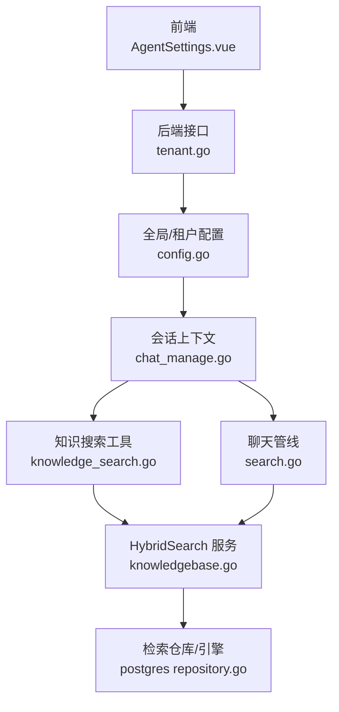
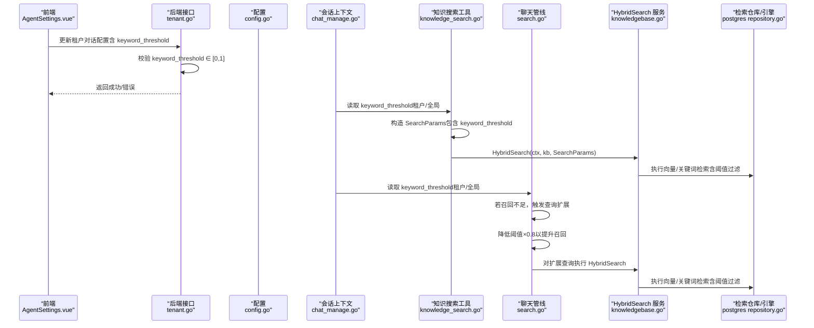
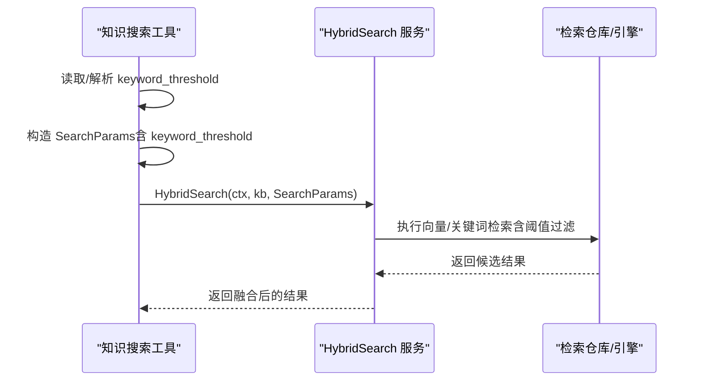
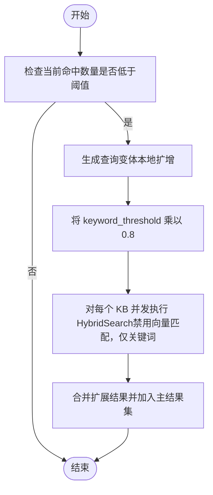
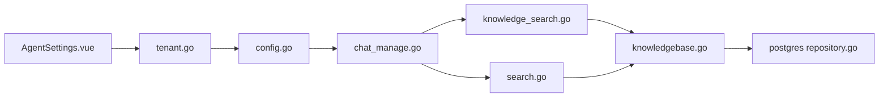

# 阈值控制策略

<cite>
**本文引用的文件**
- [internal/agent/tools/knowledge_search.go](file://internal/agent/tools/knowledge_search.go)
- [internal/application/service/chat_pipline/search.go](file://internal/application/service/chat_pipline/search.go)
- [internal/types/search.go](file://internal/types/search.go)
- [internal/types/chat_manage.go](file://internal/types/chat_manage.go)
- [internal/config/config.go](file://internal/config/config.go)
- [internal/handler/tenant.go](file://internal/handler/tenant.go)
- [frontend/src/views/settings/AgentSettings.vue](file://frontend/src/views/settings/AgentSettings.vue)
- [internal/application/service/knowledgebase.go](file://internal/application/service/knowledgebase.go)
- [internal/application/repository/retriever/postgres/repository.go](file://internal/application/repository/retriever/postgres/repository.go)
</cite>

## 目录
1. [简介](#简介)
2. [项目结构](#项目结构)
3. [核心组件](#核心组件)
4. [架构总览](#架构总览)
5. [详细组件分析](#详细组件分析)
6. [依赖分析](#依赖分析)
7. [性能考量](#性能考量)
8. [故障排查指南](#故障排查指南)
9. [结论](#结论)
10. [附录](#附录)

## 简介
本文件围绕 keyword_threshold 参数的配置与应用展开，系统性解释其作为关键词匹配相似度过滤阈值的作用机制，以及对召回率与精确度的影响。文档重点覆盖以下方面：
- keyword_threshold 在不同入口（工具调用、聊天管线、查询扩展）中的传递与使用方式
- 在并发检索流程中如何将阈值传入 HybridSearch 服务
- 不同场景下的阈值调整策略（普通搜索 vs 查询扩展）
- 前端可视化配置与后端校验联动
- 配置建议与最佳实践

## 项目结构
围绕 keyword_threshold 的关键代码分布在如下模块：
- 前端：对话阈值配置界面，支持滑条调节并持久化保存
- 后端：会话上下文 ChatManage 中携带 keyword_threshold，贯穿工具执行与聊天管线
- 搜索参数：SearchParams 结构体包含 keyword_threshold 字段
- 搜索实现：工具与聊天管线通过 HybridSearch 将阈值传递给检索引擎
- 验证层：租户配置接口对 keyword_threshold 进行范围校验

图表来源
- [frontend/src/views/settings/AgentSettings.vue](file://frontend/src/views/settings/AgentSettings.vue#L430-L463)
- [internal/handler/tenant.go](file://internal/handler/tenant.go#L666-L697)
- [internal/config/config.go](file://internal/config/config.go#L37-L62)
- [internal/types/chat_manage.go](file://internal/types/chat_manage.go#L11-L16)
- [internal/agent/tools/knowledge_search.go](file://internal/agent/tools/knowledge_search.go#L203-L248)
- [internal/application/service/chat_pipline/search.go](file://internal/application/service/chat_pipline/search.go#L318-L349)
- [internal/application/service/knowledgebase.go](file://internal/application/service/knowledgebase.go#L431-L463)
- [internal/application/repository/retriever/postgres/repository.go](file://internal/application/repository/retriever/postgres/repository.go#L252-L286)

章节来源
- [frontend/src/views/settings/AgentSettings.vue](file://frontend/src/views/settings/AgentSettings.vue#L430-L463)
- [internal/handler/tenant.go](file://internal/handler/tenant.go#L666-L697)
- [internal/config/config.go](file://internal/config/config.go#L37-L62)
- [internal/types/chat_manage.go](file://internal/types/chat_manage.go#L11-L16)
- [internal/types/search.go](file://internal/types/search.go#L54-L62)
- [internal/agent/tools/knowledge_search.go](file://internal/agent/tools/knowledge_search.go#L203-L248)
- [internal/application/service/chat_pipline/search.go](file://internal/application/service/chat_pipline/search.go#L318-L349)
- [internal/application/service/knowledgebase.go](file://internal/application/service/knowledgebase.go#L431-L463)
- [internal/application/repository/retriever/postgres/repository.go](file://internal/application/repository/retriever/postgres/repository.go#L252-L286)

## 核心组件
- keyword_threshold 的定义与作用域
  - 在会话上下文中以字段形式存在，用于控制关键词匹配的最低相似度阈值
  - 在 SearchParams 中显式传递，贯穿 HybridSearch 调用链
- 前端配置与保存
  - 提供滑条控件，范围 0~1，步进 0.05
  - 保存时写入租户对话配置
- 后端验证
  - 接口层对 keyword_threshold 进行 0~1 的范围校验
- 工具与聊天管线的使用
  - 工具执行阶段从租户配置或全局配置解析 keyword_threshold
  - 并发搜索时将阈值传入 HybridSearch
  - 聊天管线在查询扩展时按比例降低阈值以提升召回

章节来源
- [internal/types/chat_manage.go](file://internal/types/chat_manage.go#L11-L16)
- [internal/types/search.go](file://internal/types/search.go#L54-L62)
- [frontend/src/views/settings/AgentSettings.vue](file://frontend/src/views/settings/AgentSettings.vue#L430-L463)
- [internal/handler/tenant.go](file://internal/handler/tenant.go#L666-L697)
- [internal/agent/tools/knowledge_search.go](file://internal/agent/tools/knowledge_search.go#L203-L248)
- [internal/application/service/chat_pipline/search.go](file://internal/application/service/chat_pipline/search.go#L131-L206)

## 架构总览
keyword_threshold 在系统中的流转路径如下：
- 前端：用户在 AgentSettings 页面调整 keyword_threshold
- 后端：tenant 接口接收请求并校验范围
- 配置：写入租户对话配置，后续由工具与聊天管线读取
- 执行：工具与聊天管线在并发搜索中将 keyword_threshold 传入 HybridSearch
- 检索：HybridSearch 组合向量与关键词检索，内部进行阈值过滤与融合

图表来源
- [frontend/src/views/settings/AgentSettings.vue](file://frontend/src/views/settings/AgentSettings.vue#L430-L463)
- [internal/handler/tenant.go](file://internal/handler/tenant.go#L666-L697)
- [internal/config/config.go](file://internal/config/config.go#L37-L62)
- [internal/types/chat_manage.go](file://internal/types/chat_manage.go#L11-L16)
- [internal/agent/tools/knowledge_search.go](file://internal/agent/tools/knowledge_search.go#L203-L248)
- [internal/application/service/chat_pipline/search.go](file://internal/application/service/chat_pipline/search.go#L131-L206)
- [internal/application/service/knowledgebase.go](file://internal/application/service/knowledgebase.go#L431-L463)
- [internal/application/repository/retriever/postgres/repository.go](file://internal/application/repository/retriever/postgres/repository.go#L252-L286)

## 详细组件分析

### 组件A：keyword_threshold 的前端配置与保存
- 功能要点
  - 提供滑条控件，范围 0~1，步进 0.05
  - 变更后调用保存接口，写入租户对话配置
- 影响
  - 保存成功后，后续工具与聊天管线读取该值作为默认阈值
- 注意事项
  - 前端仅负责配置与保存，不参与业务逻辑判断

章节来源
- [frontend/src/views/settings/AgentSettings.vue](file://frontend/src/views/settings/AgentSettings.vue#L430-L463)

### 组件B：keyword_threshold 的后端校验与配置来源
- 校验规则
  - keyword_threshold ∈ [0, 1]，超出范围返回错误
- 配置来源优先级
  - 租户对话配置 > 全局配置 > 硬编码默认值
- 默认值
  - 若未设置，工具侧默认 keyword_threshold = 0.5

章节来源
- [internal/handler/tenant.go](file://internal/handler/tenant.go#L666-L697)
- [internal/config/config.go](file://internal/config/config.go#L37-L62)
- [internal/agent/tools/knowledge_search.go](file://internal/agent/tools/knowledge_search.go#L225-L248)

### 组件C：keyword_threshold 在工具执行中的传递
- 关键点
  - 工具执行阶段解析 keyword_threshold，构造 SearchParams
  - 并发搜索时将 SearchParams 传入 HybridSearch
  - HybridSearch 内部组合向量与关键词检索，并进行阈值过滤与融合
- 影响
  - 较高的阈值提高精确度但可能降低召回
  - 较低的阈值提升召回但可能引入噪声

图表来源
- [internal/agent/tools/knowledge_search.go](file://internal/agent/tools/knowledge_search.go#L203-L248)
- [internal/agent/tools/knowledge_search.go](file://internal/agent/tools/knowledge_search.go#L413-L465)
- [internal/application/service/knowledgebase.go](file://internal/application/service/knowledgebase.go#L431-L463)
- [internal/application/repository/retriever/postgres/repository.go](file://internal/application/repository/retriever/postgres/repository.go#L252-L286)

章节来源
- [internal/agent/tools/knowledge_search.go](file://internal/agent/tools/knowledge_search.go#L203-L248)
- [internal/agent/tools/knowledge_search.go](file://internal/agent/tools/knowledge_search.go#L413-L465)
- [internal/application/service/knowledgebase.go](file://internal/application/service/knowledgebase.go#L431-L463)
- [internal/application/repository/retriever/postgres/repository.go](file://internal/application/repository/retriever/postgres/repository.go#L252-L286)

### 组件D：keyword_threshold 在聊天管线中的使用与查询扩展
- 关键点
  - 聊天管线在执行知识库搜索后，若命中数量低于阈值，触发查询扩展
  - 扩展阶段将 keyword_threshold 乘以 0.8，以提升召回
  - 扩展查询同样通过 HybridSearch 执行，且禁用向量匹配，仅关键词匹配
- 影响
  - 查询扩展通过降低阈值缓解低召回问题，同时避免过度放宽导致的噪声

图表来源
- [internal/application/service/chat_pipline/search.go](file://internal/application/service/chat_pipline/search.go#L131-L206)

章节来源
- [internal/application/service/chat_pipline/search.go](file://internal/application/service/chat_pipline/search.go#L131-L206)

### 组件E：keyword_threshold 的数据结构与参数传递
- SearchParams
  - 包含 keyword_threshold 字段，用于控制关键词匹配的相似度阈值
- ChatManage
  - 会话上下文中包含 keyword_threshold 字段，作为默认阈值来源之一
- HybridSearch
  - 接收 SearchParams，内部进行向量与关键词检索，并基于阈值进行过滤与融合

章节来源
- [internal/types/search.go](file://internal/types/search.go#L54-L62)
- [internal/types/chat_manage.go](file://internal/types/chat_manage.go#L11-L16)
- [internal/application/service/knowledgebase.go](file://internal/application/service/knowledgebase.go#L431-L463)

## 依赖分析
- 组件耦合
  - 前端 AgentSettings.vue 与后端 tenant 接口耦合，负责 keyword_threshold 的配置与持久化
  - 工具与聊天管线均依赖会话上下文 ChatManage 中的 keyword_threshold
  - HybridSearch 依赖 SearchParams 中的 keyword_threshold 完成阈值过滤
- 外部依赖
  - 检索仓库/引擎（如 Postgres）在执行检索时会基于阈值进行候选筛选与扩展 TopK 计算

图表来源
- [frontend/src/views/settings/AgentSettings.vue](file://frontend/src/views/settings/AgentSettings.vue#L430-L463)
- [internal/handler/tenant.go](file://internal/handler/tenant.go#L666-L697)
- [internal/config/config.go](file://internal/config/config.go#L37-L62)
- [internal/types/chat_manage.go](file://internal/types/chat_manage.go#L11-L16)
- [internal/agent/tools/knowledge_search.go](file://internal/agent/tools/knowledge_search.go#L203-L248)
- [internal/application/service/chat_pipline/search.go](file://internal/application/service/chat_pipline/search.go#L318-L349)
- [internal/application/service/knowledgebase.go](file://internal/application/service/knowledgebase.go#L431-L463)
- [internal/application/repository/retriever/postgres/repository.go](file://internal/application/repository/retriever/postgres/repository.go#L252-L286)

章节来源
- [internal/agent/tools/knowledge_search.go](file://internal/agent/tools/knowledge_search.go#L203-L248)
- [internal/application/service/chat_pipline/search.go](file://internal/application/service/chat_pipline/search.go#L318-L349)
- [internal/application/service/knowledgebase.go](file://internal/application/service/knowledgebase.go#L431-L463)
- [internal/application/repository/retriever/postgres/repository.go](file://internal/application/repository/retriever/postgres/repository.go#L252-L286)

## 性能考量
- 并发与吞吐
  - 工具与聊天管线均采用 goroutine 并发执行，减少等待时间
- 候选集扩展
  - 检索仓库在执行向量/关键词检索时会扩大 TopK 以提升阈值过滤前的候选质量
- 重排序与去重
  - 工具侧在 HybridSearch 后进行去重与重排序，有助于减少重复与冗余，提升整体性能

章节来源
- [internal/agent/tools/knowledge_search.go](file://internal/agent/tools/knowledge_search.go#L267-L359)
- [internal/application/repository/retriever/postgres/repository.go](file://internal/application/repository/retriever/postgres/repository.go#L252-L286)

## 故障排查指南
- 常见问题
  - keyword_threshold 超出范围（<0 或 >1）：接口层会直接报错
  - 阈值过高导致召回过低：可考虑在聊天管线的查询扩展阶段适当降低阈值
  - 阈值过低导致噪声增多：可提高阈值以增强精确度
- 排查步骤
  - 检查前端保存是否成功（滑条值是否持久化）
  - 检查租户配置接口返回状态
  - 观察聊天管线日志中“recall_low”“expansion_*”等事件，确认是否触发了查询扩展
  - 核对 HybridSearch 的输入参数（SearchParams）是否正确传入

章节来源
- [internal/handler/tenant.go](file://internal/handler/tenant.go#L666-L697)
- [internal/application/service/chat_pipline/search.go](file://internal/application/service/chat_pipline/search.go#L131-L206)
- [internal/agent/tools/knowledge_search.go](file://internal/agent/tools/knowledge_search.go#L250-L270)

## 结论
keyword_threshold 是控制关键词匹配相似度的关键参数，直接影响检索的召回与精确度。通过前端可视化配置、后端严格校验、工具与聊天管线的统一传递，以及查询扩展阶段的动态调整，系统实现了灵活而可控的阈值策略。合理设置与监控该阈值，能够显著提升检索质量与用户体验。

## 附录

### 场景化阈值调整策略
- 普通搜索
  - 初始阈值：建议从租户配置的 keyword_threshold 出发，结合业务需求微调
  - 目标：在保证一定召回的前提下，尽量提升精确度
- 查询扩展
  - 降低阈值：当命中数量低于阈值时，将 keyword_threshold 乘以 0.8，以提升召回
  - 限制条件：扩展阶段通常禁用向量匹配，仅启用关键词匹配，避免噪声放大
- 低召回场景
  - 可适当提高 keyword_threshold 的初始值，再配合查询扩展策略逐步优化

章节来源
- [internal/application/service/chat_pipline/search.go](file://internal/application/service/chat_pipline/search.go#L131-L206)
- [internal/agent/tools/knowledge_search.go](file://internal/agent/tools/knowledge_search.go#L203-L248)

### 配置建议
- 前端配置
  - 使用滑条进行 0~1 的区间调整，步进 0.05，便于精细调节
- 后端配置
  - 优先在租户维度设置默认值，确保多租户场景下差异化控制
  - 若无特殊需求，默认值可维持在 0.5 左右，后续按效果迭代
- 实践建议
  - 以 A/B 测试的方式对比不同阈值对召回率与精确度的影响
  - 结合日志与指标（命中数、扩展命中数、去重前后变化）持续优化

章节来源
- [frontend/src/views/settings/AgentSettings.vue](file://frontend/src/views/settings/AgentSettings.vue#L430-L463)
- [internal/handler/tenant.go](file://internal/handler/tenant.go#L666-L697)
- [internal/config/config.go](file://internal/config/config.go#L37-L62)