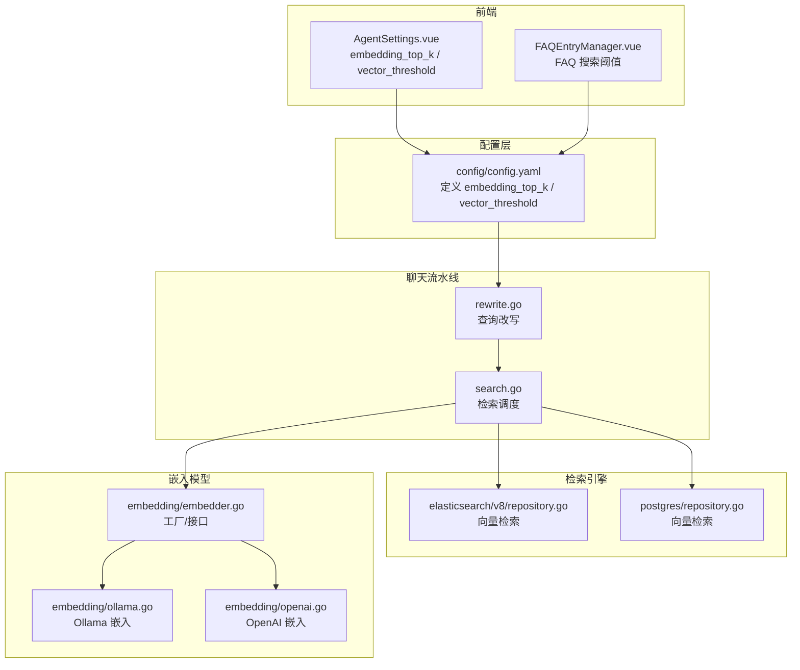
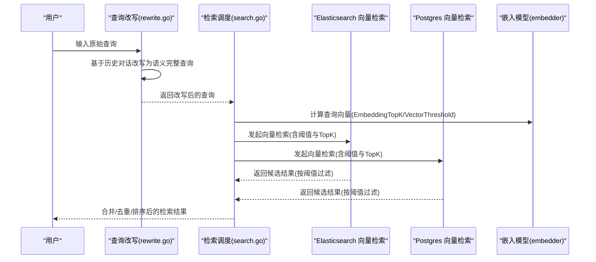
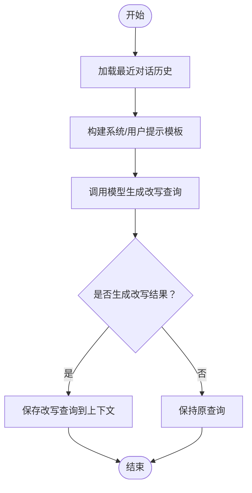
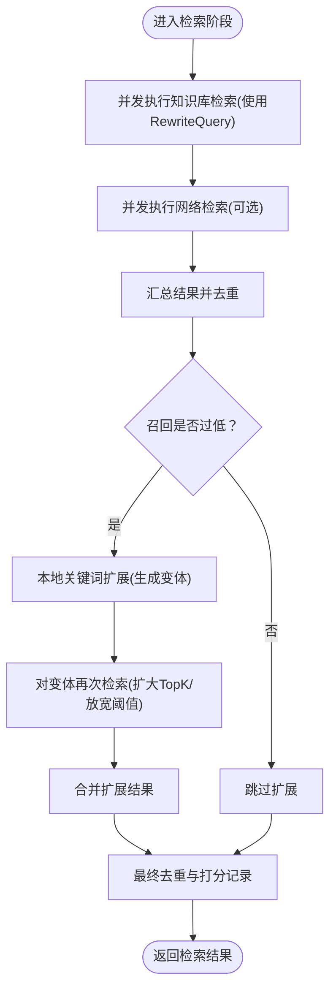
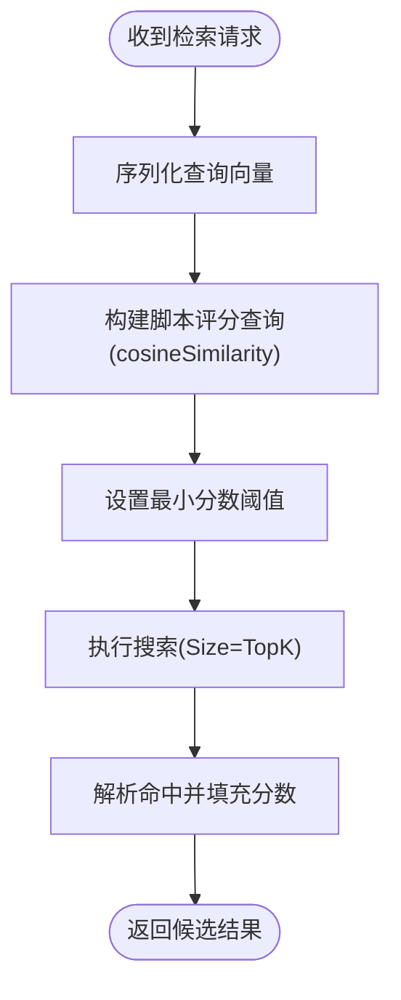
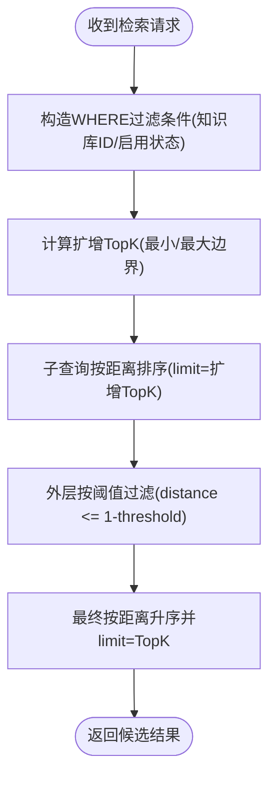
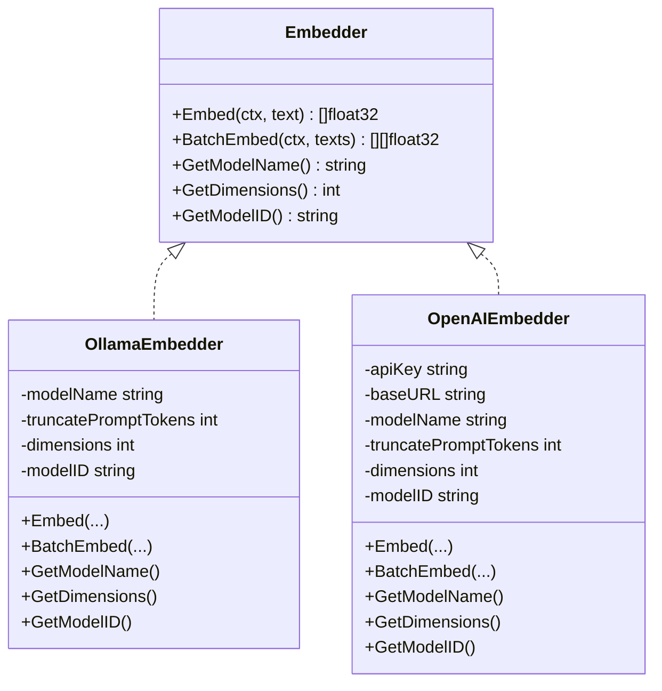
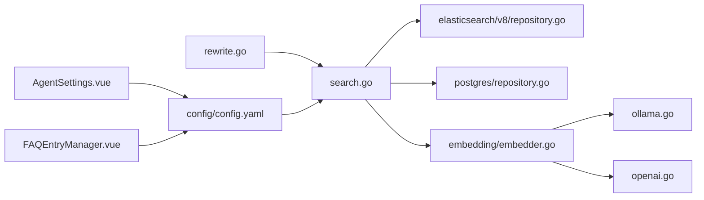

# 向量检索

<cite>
**本文引用的文件**
- [config/config.yaml](file://config/config.yaml)
- [internal/application/service/chat_pipline/rewrite.go](file://internal/application/service/chat_pipline/rewrite.go)
- [internal/application/service/chat_pipline/search.go](file://internal/application/service/chat_pipline/search.go)
- [internal/application/repository/retriever/elasticsearch/v8/repository.go](file://internal/application/repository/retriever/elasticsearch/v8/repository.go)
- [internal/application/repository/retriever/postgres/repository.go](file://internal/application/repository/retriever/postgres/repository.go)
- [internal/types/retriever.go](file://internal/types/retriever.go)
- [internal/models/embedding/embedder.go](file://internal/models/embedding/embedder.go)
- [internal/models/embedding/ollama.go](file://internal/models/embedding/ollama.go)
- [internal/models/embedding/openai.go](file://internal/models/embedding/openai.go)
- [frontend/src/views/settings/AgentSettings.vue](file://frontend/src/views/settings/AgentSettings.vue)
- [frontend/src/views/knowledge/components/FAQEntryManager.vue](file://frontend/src/views/knowledge/components/FAQEntryManager.vue)
- [docs/API.md](file://docs/API.md)
</cite>

## 目录
1. [简介](#简介)
2. [项目结构](#项目结构)
3. [核心组件](#核心组件)
4. [架构总览](#架构总览)
5. [详细组件分析](#详细组件分析)
6. [依赖分析](#依赖分析)
7. [性能考量](#性能考量)
8. [故障排查指南](#故障排查指南)
9. [结论](#结论)
10. [附录](#附录)

## 简介
本文件聚焦于系统的向量检索机制，围绕 embedding_top_k 与 vector_threshold 两个关键参数展开，解释系统如何利用嵌入模型（如 bge-m3 等）将查询与知识块转换为向量，并通过向量相似度计算实现语义检索。文档还结合 rewrite.go 中的查询改写流程，说明改写后的语义完整查询如何提升检索准确性，并提供调优建议，例如在知识库内容密集时如何调整 vector_threshold 以减少噪声。

## 项目结构
向量检索涉及多个层次：
- 配置层：在配置文件中定义 embedding_top_k、vector_threshold 等全局参数
- 管道层：聊天流水线负责查询改写与检索调度
- 检索层：分别对接 Elasticsearch 与 Postgres 向量引擎，执行向量相似度搜索
- 嵌入层：封装本地 Ollama 与远端 OpenAI 的嵌入模型调用
- 前端层：提供参数调节界面，支持滑动调节 embedding_top_k 与 vector_threshold

图表来源
- [config/config.yaml](file://config/config.yaml#L1-L60)
- [internal/application/service/chat_pipline/rewrite.go](file://internal/application/service/chat_pipline/rewrite.go#L1-L239)
- [internal/application/service/chat_pipline/search.go](file://internal/application/service/chat_pipline/search.go#L1-L200)
- [internal/application/repository/retriever/elasticsearch/v8/repository.go](file://internal/application/repository/retriever/elasticsearch/v8/repository.go#L303-L369)
- [internal/application/repository/retriever/postgres/repository.go](file://internal/application/repository/retriever/postgres/repository.go#L230-L351)
- [internal/models/embedding/embedder.go](file://internal/models/embedding/embedder.go#L1-L77)
- [internal/models/embedding/ollama.go](file://internal/models/embedding/ollama.go#L1-L126)
- [internal/models/embedding/openai.go](file://internal/models/embedding/openai.go#L1-L202)
- [frontend/src/views/settings/AgentSettings.vue](file://frontend/src/views/settings/AgentSettings.vue#L414-L463)
- [frontend/src/views/knowledge/components/FAQEntryManager.vue](file://frontend/src/views/knowledge/components/FAQEntryManager.vue#L948-L967)

章节来源
- [config/config.yaml](file://config/config.yaml#L1-L60)
- [internal/application/service/chat_pipline/rewrite.go](file://internal/application/service/chat_pipline/rewrite.go#L1-L239)
- [internal/application/service/chat_pipline/search.go](file://internal/application/service/chat_pipline/search.go#L1-L200)
- [internal/application/repository/retriever/elasticsearch/v8/repository.go](file://internal/application/repository/retriever/elasticsearch/v8/repository.go#L303-L369)
- [internal/application/repository/retriever/postgres/repository.go](file://internal/application/repository/retriever/postgres/repository.go#L230-L351)
- [internal/models/embedding/embedder.go](file://internal/models/embedding/embedder.go#L1-L77)
- [internal/models/embedding/ollama.go](file://internal/models/embedding/ollama.go#L1-L126)
- [internal/models/embedding/openai.go](file://internal/models/embedding/openai.go#L1-L202)
- [frontend/src/views/settings/AgentSettings.vue](file://frontend/src/views/settings/AgentSettings.vue#L414-L463)
- [frontend/src/views/knowledge/components/FAQEntryManager.vue](file://frontend/src/views/knowledge/components/FAQEntryManager.vue#L948-L967)

## 核心组件
- 配置参数
  - embedding_top_k：控制向量检索候选集大小，影响召回规模与后续重排/筛选成本
  - vector_threshold：最小相似度阈值，过滤低质量结果，提升命中质量
- 查询改写
  - 基于历史对话与提示模板，将原始查询改写为语义更完整的句子，提升向量匹配效果
- 向量检索
  - Elasticsearch：使用脚本评分与余弦相似度，按阈值与 TopK 返回结果
  - Postgres：使用 HNSW 索引与距离阈值，先扩增候选再按阈值过滤
- 嵌入模型
  - 工厂模式创建 Ollama/OpenAI 嵌入器，支持批量向量化与维度配置
- 前端交互
  - 提供滑动调节 embedding_top_k 与 vector_threshold 的界面入口

章节来源
- [config/config.yaml](file://config/config.yaml#L1-L60)
- [internal/application/service/chat_pipline/rewrite.go](file://internal/application/service/chat_pipline/rewrite.go#L1-L239)
- [internal/application/repository/retriever/elasticsearch/v8/repository.go](file://internal/application/repository/retriever/elasticsearch/v8/repository.go#L303-L369)
- [internal/application/repository/retriever/postgres/repository.go](file://internal/application/repository/retriever/postgres/repository.go#L230-L351)
- [internal/models/embedding/embedder.go](file://internal/models/embedding/embedder.go#L1-L77)
- [frontend/src/views/settings/AgentSettings.vue](file://frontend/src/views/settings/AgentSettings.vue#L414-L463)
- [frontend/src/views/knowledge/components/FAQEntryManager.vue](file://frontend/src/views/knowledge/components/FAQEntryManager.vue#L948-L967)

## 架构总览
下图展示了从用户查询到向量检索结果的整体流程，包括查询改写、参数传递、向量相似度计算与阈值过滤。

图表来源
- [internal/application/service/chat_pipline/rewrite.go](file://internal/application/service/chat_pipline/rewrite.go#L1-L239)
- [internal/application/service/chat_pipline/search.go](file://internal/application/service/chat_pipline/search.go#L1-L200)
- [internal/application/repository/retriever/elasticsearch/v8/repository.go](file://internal/application/repository/retriever/elasticsearch/v8/repository.go#L303-L369)
- [internal/application/repository/retriever/postgres/repository.go](file://internal/application/repository/retriever/postgres/repository.go#L230-L351)
- [internal/models/embedding/embedder.go](file://internal/models/embedding/embedder.go#L1-L77)

## 详细组件分析

### 查询改写（rewrite.go）
- 目标：将原始查询改写为语义完整、指代消解后的句子，提升向量匹配质量
- 流程要点：
  - 读取最近对话历史，构造带上下文的提示模板
  - 使用大语言模型生成改写后的查询
  - 将改写结果写回流水线状态，供后续检索使用
- 与向量检索的关系：
  - 改写后的查询更利于嵌入模型生成高质量向量表示
  - 有助于在高密度知识库中减少歧义，提升召回质量

图表来源
- [internal/application/service/chat_pipline/rewrite.go](file://internal/application/service/chat_pipline/rewrite.go#L1-L239)

章节来源
- [internal/application/service/chat_pipline/rewrite.go](file://internal/application/service/chat_pipline/rewrite.go#L1-L239)

### 检索调度与参数传递（search.go）
- embedding_top_k 与 vector_threshold 的使用：
  - embedding_top_k：决定向量检索的候选集规模（MatchCount）
  - vector_threshold：作为相似度阈值传入检索引擎
- 并发策略：
  - 并发执行知识库检索与网络检索，汇总结果后再去重与记录分数
- 低召回补救：
  - 当召回过少时，触发关键词扩展（本地变体生成），扩大搜索空间

图表来源
- [internal/application/service/chat_pipline/search.go](file://internal/application/service/chat_pipline/search.go#L1-L200)

章节来源
- [internal/application/service/chat_pipline/search.go](file://internal/application/service/chat_pipline/search.go#L1-L200)

### Elasticsearch 向量检索（elasticsearch/v8/repository.go）
- 相似度计算：使用脚本评分与余弦相似度
- 参数应用：
  - Embedding：查询向量
  - TopK：返回数量上限
  - Threshold：最小分数阈值
- 过滤条件：基础过滤（如知识库ID、启用状态等）

图表来源
- [internal/application/repository/retriever/elasticsearch/v8/repository.go](file://internal/application/repository/retriever/elasticsearch/v8/repository.go#L303-L369)

章节来源
- [internal/application/repository/retriever/elasticsearch/v8/repository.go](file://internal/application/repository/retriever/elasticsearch/v8/repository.go#L303-L369)

### Postgres 向量检索（postgres/repository.go）
- 相似度计算：使用 HNSW 索引与距离阈值
- 参数应用：
  - Embedding：查询向量
  - TopK：最终返回数量
  - Threshold：距离阈值（内部转换为 1 - threshold）
- 优化策略：
  - 先扩大 TopK（扩增因子与边界限制）以保证召回
  - 子查询先按距离排序，外层再按阈值过滤，最后裁剪至 TopK

图表来源
- [internal/application/repository/retriever/postgres/repository.go](file://internal/application/repository/retriever/postgres/repository.go#L230-L351)

章节来源
- [internal/application/repository/retriever/postgres/repository.go](file://internal/application/repository/retriever/postgres/repository.go#L230-L351)

### 嵌入模型与向量维度（embedding/*）
- 工厂与接口：统一的 Embedder 接口，支持 BatchEmbed 与维度查询
- Ollama 嵌入器：本地模型，支持截断参数与维度配置
- OpenAI 嵌入器：远端 API，支持重试与超时控制，支持维度配置
- 与 bge-m3 的关系：系统支持通过配置指定嵌入模型名称与维度，可适配 bge-m3 等模型

图表来源
- [internal/models/embedding/embedder.go](file://internal/models/embedding/embedder.go#L1-L77)
- [internal/models/embedding/ollama.go](file://internal/models/embedding/ollama.go#L1-L126)
- [internal/models/embedding/openai.go](file://internal/models/embedding/openai.go#L1-L202)

章节来源
- [internal/models/embedding/embedder.go](file://internal/models/embedding/embedder.go#L1-L77)
- [internal/models/embedding/ollama.go](file://internal/models/embedding/ollama.go#L1-L126)
- [internal/models/embedding/openai.go](file://internal/models/embedding/openai.go#L1-L202)

### 参数定义与前端交互
- 配置文件中的默认值：
  - embedding_top_k：默认 10
  - vector_threshold：默认 0.5
- 前端界面：
  - AgentSettings.vue：提供 embedding_top_k 与 vector_threshold 的滑动调节
  - FAQEntryManager.vue：FAQ 搜索界面提供相似度阈值滑块

章节来源
- [config/config.yaml](file://config/config.yaml#L1-L60)
- [frontend/src/views/settings/AgentSettings.vue](file://frontend/src/views/settings/AgentSettings.vue#L414-L463)
- [frontend/src/views/knowledge/components/FAQEntryManager.vue](file://frontend/src/views/knowledge/components/FAQEntryManager.vue#L948-L967)

## 依赖分析
- 管道与检索的耦合：
  - rewrite.go 与 search.go 通过 ChatManage 传递改写查询与阈值
  - search.go 将 embedding_top_k 与 vector_threshold 传入检索引擎
- 检索引擎与参数：
  - Elasticsearch：使用 Threshold 作为最小分数阈值
  - Postgres：使用阈值转换（1 - threshold）与扩增 TopK 策略
- 嵌入模型与维度：
  - 检索引擎均依赖查询向量维度一致，嵌入模型需提供 GetDimensions

图表来源
- [internal/application/service/chat_pipline/rewrite.go](file://internal/application/service/chat_pipline/rewrite.go#L1-L239)
- [internal/application/service/chat_pipline/search.go](file://internal/application/service/chat_pipline/search.go#L1-L200)
- [internal/application/repository/retriever/elasticsearch/v8/repository.go](file://internal/application/repository/retriever/elasticsearch/v8/repository.go#L303-L369)
- [internal/application/repository/retriever/postgres/repository.go](file://internal/application/repository/retriever/postgres/repository.go#L230-L351)
- [internal/models/embedding/embedder.go](file://internal/models/embedding/embedder.go#L1-L77)
- [internal/models/embedding/ollama.go](file://internal/models/embedding/ollama.go#L1-L126)
- [internal/models/embedding/openai.go](file://internal/models/embedding/openai.go#L1-L202)
- [config/config.yaml](file://config/config.yaml#L1-L60)
- [frontend/src/views/settings/AgentSettings.vue](file://frontend/src/views/settings/AgentSettings.vue#L414-L463)
- [frontend/src/views/knowledge/components/FAQEntryManager.vue](file://frontend/src/views/knowledge/components/FAQEntryManager.vue#L948-L967)

章节来源
- [internal/application/service/chat_pipline/rewrite.go](file://internal/application/service/chat_pipline/rewrite.go#L1-L239)
- [internal/application/service/chat_pipline/search.go](file://internal/application/service/chat_pipline/search.go#L1-L200)
- [internal/application/repository/retriever/elasticsearch/v8/repository.go](file://internal/application/repository/retriever/elasticsearch/v8/repository.go#L303-L369)
- [internal/application/repository/retriever/postgres/repository.go](file://internal/application/repository/retriever/postgres/repository.go#L230-L351)
- [internal/models/embedding/embedder.go](file://internal/models/embedding/embedder.go#L1-L77)
- [internal/models/embedding/ollama.go](file://internal/models/embedding/ollama.go#L1-L126)
- [internal/models/embedding/openai.go](file://internal/models/embedding/openai.go#L1-L202)
- [config/config.yaml](file://config/config.yaml#L1-L60)
- [frontend/src/views/settings/AgentSettings.vue](file://frontend/src/views/settings/AgentSettings.vue#L414-L463)
- [frontend/src/views/knowledge/components/FAQEntryManager.vue](file://frontend/src/views/knowledge/components/FAQEntryManager.vue#L948-L967)

## 性能考量
- embedding_top_k
  - 增大 TopK 可提升召回，但会增加下游重排与过滤的成本
  - 在 Postgres 引擎中采用“扩增候选 + 阈值过滤”的策略，避免全表扫描
- vector_threshold
  - 提高阈值可减少噪声，但可能导致漏召回
  - 在 Elasticsearch 中直接以最小分数阈值过滤；在 Postgres 中转换为距离阈值
- 嵌入模型
  - 本地 Ollama 适合离线部署与隐私场景；远端 OpenAI 适合高质量向量
  - 维度需与索引/模型一致，避免向量不匹配导致检索失败

[本节为通用指导，不直接分析具体文件]

## 故障排查指南
- 嵌入模型不可用
  - 现象：嵌入调用失败或返回空向量
  - 排查：确认模型名称、维度、远端 API Key/BaseURL、本地模型可用性
  - 参考路径：[internal/models/embedding/ollama.go](file://internal/models/embedding/ollama.go#L1-L126)、[internal/models/embedding/openai.go](file://internal/models/embedding/openai.go#L1-L202)
- 向量检索无结果
  - 现象：返回空或极少量结果
  - 排查：检查 vector_threshold 是否过高；确认知识库启用状态与过滤条件；检查扩增 TopK 是否生效
  - 参考路径：[internal/application/repository/retriever/elasticsearch/v8/repository.go](file://internal/application/repository/retriever/elasticsearch/v8/repository.go#L303-L369)、[internal/application/repository/retriever/postgres/repository.go](file://internal/application/repository/retriever/postgres/repository.go#L230-L351)
- 召回过低
  - 现象：检索结果少，影响回答质量
  - 排查：启用关键词扩展（本地变体生成）；适当增大 embedding_top_k；适度降低 vector_threshold
  - 参考路径：[internal/application/service/chat_pipline/search.go](file://internal/application/service/chat_pipline/search.go#L1-L200)

章节来源
- [internal/models/embedding/ollama.go](file://internal/models/embedding/ollama.go#L1-L126)
- [internal/models/embedding/openai.go](file://internal/models/embedding/openai.go#L1-L202)
- [internal/application/repository/retriever/elasticsearch/v8/repository.go](file://internal/application/repository/retriever/elasticsearch/v8/repository.go#L303-L369)
- [internal/application/repository/retriever/postgres/repository.go](file://internal/application/repository/retriever/postgres/repository.go#L230-L351)
- [internal/application/service/chat_pipline/search.go](file://internal/application/service/chat_pipline/search.go#L1-L200)

## 结论
- embedding_top_k 控制候选集规模，直接影响召回广度与下游成本；vector_threshold 控制相似度门槛，直接影响命中质量
- 查询改写显著提升向量匹配的语义完整性，尤其在知识库内容密集时，能有效减少歧义与噪声
- 在 Postgres 引擎中，通过“扩增候选 + 阈值过滤”策略平衡性能与召回；在 Elasticsearch 中，直接以最小分数阈值过滤
- 建议在知识库内容密集场景下，适当提高 vector_threshold 并配合关键词扩展策略，以减少噪声并维持召回

[本节为总结性内容，不直接分析具体文件]

## 附录

### 参数与配置要点
- 默认配置
  - embedding_top_k：10
  - vector_threshold：0.5
- 前端调节入口
  - AgentSettings.vue：embedding_top_k 与 vector_threshold
  - FAQEntryManager.vue：FAQ 搜索相似度阈值

章节来源
- [config/config.yaml](file://config/config.yaml#L1-L60)
- [frontend/src/views/settings/AgentSettings.vue](file://frontend/src/views/settings/AgentSettings.vue#L414-L463)
- [frontend/src/views/knowledge/components/FAQEntryManager.vue](file://frontend/src/views/knowledge/components/FAQEntryManager.vue#L948-L967)

### API 文档中的参数示例
- 任务参数中包含 vector_threshold、keyword_threshold、embedding_top_k 等字段，便于外部集成时参考

章节来源
- [docs/API.md](file://docs/API.md#L2456-L2497)