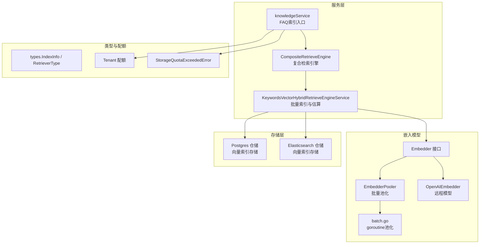
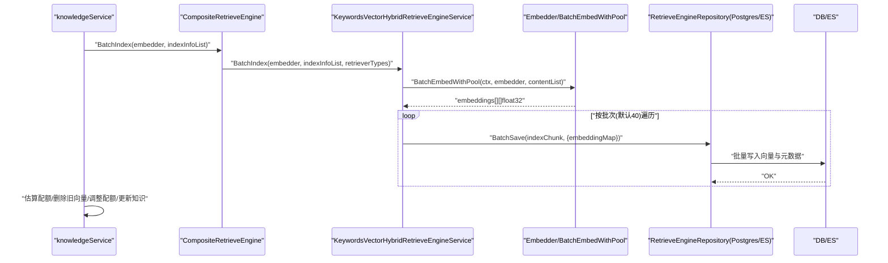
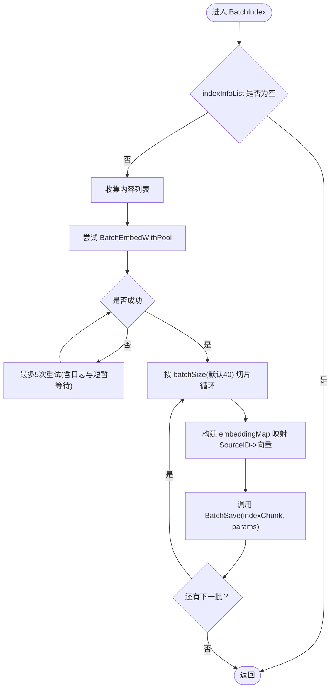
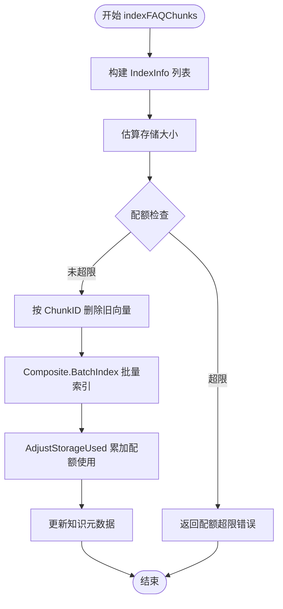
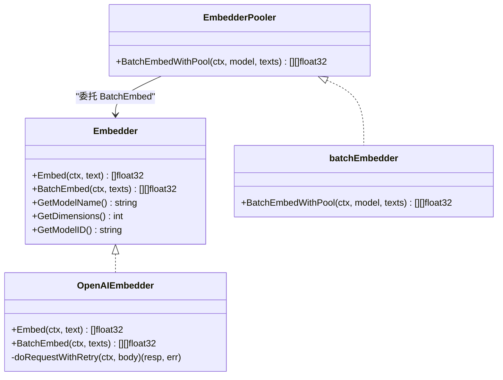
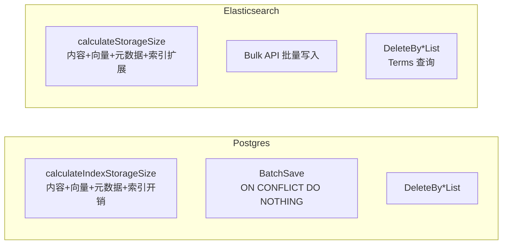
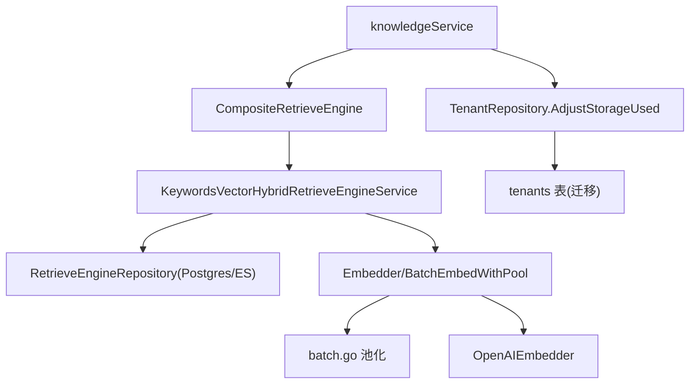

# 向量索引机制

<cite>
**本文引用的文件**
- [keywords_vector_hybrid_indexer.go](file://internal/application/service/retriever/keywords_vector_hybrid_indexer.go)
- [composite.go](file://internal/application/service/retriever/composite.go)
- [knowledge.go](file://internal/application/service/knowledge.go)
- [repository.go（Postgres）](file://internal/application/repository/retriever/postgres/repository.go)
- [repository.go（Elasticsearch v8）](file://internal/application/repository/retriever/elasticsearch/v8/repository.go)
- [embedder.go](file://internal/models/embedding/embedder.go)
- [batch.go](file://internal/models/embedding/batch.go)
- [openai.go](file://internal/models/embedding/openai.go)
- [errors.go](file://internal/types/errors.go)
- [tenant.go](file://client/tenant.go)
- [tenant.go（接口）](file://internal/types/interfaces/tenant.go)
- [tenant.go（仓储）](file://internal/application/repository/tenant.go)
- [00-init-db.sql](file://migrations/paradedb/00-init-db.sql)
</cite>

## 目录
1. [简介](#简介)
2. [项目结构](#项目结构)
3. [核心组件](#核心组件)
4. [架构总览](#架构总览)
5. [详细组件分析](#详细组件分析)
6. [依赖关系分析](#依赖关系分析)
7. [性能考量](#性能考量)
8. [故障排查指南](#故障排查指南)
9. [结论](#结论)

## 简介
本文件围绕向量索引的构建流程展开，重点解析以下内容：
- KeywordsVectorHybridRetrieveEngineService 如何通过 BatchIndex 方法批量生成与存储向量；
- 系统在处理 FAQ 与文档知识块时，如何调用嵌入模型将内容向量化，并持久化到 PostgreSQL 或 Elasticsearch 等后端存储；
- 结合 knowledgeService.indexFAQChunks 方法，阐述索引过程中的性能优化策略（分批处理、重试机制、并发与估算）；
- ExplainEstimateStorageSize 如何预估向量存储空间，并与租户配额系统集成以防止超限。

## 项目结构
与向量索引直接相关的模块分布如下：
- 服务层：检索引擎复合体与混合检索服务、知识服务（FAQ 索引入口）、嵌入模型抽象与池化；
- 仓储层：PostgreSQL 与 Elasticsearch 的向量索引存储实现；
- 类型与错误：索引信息、检索类型、租户配额、存储配额错误；
- 迁移与配置：租户表迁移包含存储配额字段。

图表来源
- [keywords_vector_hybrid_indexer.go](file://internal/application/service/retriever/keywords_vector_hybrid_indexer.go#L60-L110)
- [composite.go](file://internal/application/service/retriever/composite.go#L207-L233)
- [knowledge.go](file://internal/application/service/knowledge.go#L4096-L4201)
- [embedder.go](file://internal/models/embedding/embedder.go#L1-L77)
- [batch.go](file://internal/models/embedding/batch.go#L1-L96)
- [openai.go](file://internal/models/embedding/openai.go#L56-L148)
- [repository.go（Postgres）](file://internal/application/repository/retriever/postgres/repository.go#L44-L107)
- [repository.go（Elasticsearch v8）](file://internal/application/repository/retriever/elasticsearch/v8/repository.go#L66-L162)
- [tenant.go](file://client/tenant.go#L25-L54)
- [errors.go](file://internal/types/errors.go#L1-L21)

章节来源
- [keywords_vector_hybrid_indexer.go](file://internal/application/service/retriever/keywords_vector_hybrid_indexer.go#L60-L110)
- [composite.go](file://internal/application/service/retriever/composite.go#L207-L233)
- [knowledge.go](file://internal/application/service/knowledge.go#L4096-L4201)

## 核心组件
- KeywordsVectorHybridRetrieveEngineService：提供单条与批量索引能力，支持向量检索类型；负责将嵌入结果映射到 SourceID 并写入仓库；提供估算存储大小的能力。
- CompositeRetrieveEngine：聚合多个检索引擎，统一执行索引、批量索引与存储估算；支持并发执行与去重。
- knowledgeService.indexFAQChunks：FAQ 索引主流程，负责构建索引信息、估算配额、删除旧向量、批量索引、调整配额与更新知识元数据。
- 嵌入模型与池化：Embedder 抽象、BatchEmbedWithPool 池化、OpenAIEmbedder 重试与超时控制。
- 存储层：Postgres 与 Elasticsearch 的 BatchSave、DeleteByChunkIDList、EstimateStorageSize 实现。
- 租户配额：Tenant 模型包含配额与已用量，仓储提供 AdjustStorageUsed 原子更新；知识服务在索引前校验配额并在成功后累加。

章节来源
- [keywords_vector_hybrid_indexer.go](file://internal/application/service/retriever/keywords_vector_hybrid_indexer.go#L60-L110)
- [composite.go](file://internal/application/service/retriever/composite.go#L207-L233)
- [knowledge.go](file://internal/application/service/knowledge.go#L4096-L4201)
- [embedder.go](file://internal/models/embedding/embedder.go#L1-L77)
- [batch.go](file://internal/models/embedding/batch.go#L1-L96)
- [openai.go](file://internal/models/embedding/openai.go#L56-L148)
- [repository.go（Postgres）](file://internal/application/repository/retriever/postgres/repository.go#L44-L107)
- [repository.go（Elasticsearch v8）](file://internal/application/repository/retriever/elasticsearch/v8/repository.go#L66-L162)
- [tenant.go](file://client/tenant.go#L25-L54)
- [tenant.go（接口）](file://internal/types/interfaces/tenant.go#L33-L49)
- [tenant.go（仓储）](file://internal/application/repository/tenant.go#L104-L121)

## 架构总览
下图展示从知识服务到嵌入模型再到存储层的整体流程，以及配额检查与重试机制的交互。

图表来源
- [composite.go](file://internal/application/service/retriever/composite.go#L207-L233)
- [keywords_vector_hybrid_indexer.go](file://internal/application/service/retriever/keywords_vector_hybrid_indexer.go#L60-L110)
- [batch.go](file://internal/models/embedding/batch.go#L1-L96)
- [repository.go（Postgres）](file://internal/application/repository/retriever/postgres/repository.go#L92-L107)
- [repository.go（Elasticsearch v8）](file://internal/application/repository/retriever/elasticsearch/v8/repository.go#L128-L162)

## 详细组件分析

### KeywordsVectorHybridRetrieveEngineService：批量索引与估算
- 批量索引 BatchIndex
  - 收集所有内容文本，调用 BatchEmbedWithPool 一次性生成向量；
  - 对嵌入结果按批次切片（默认 40），将每条 SourceID 映射到对应向量；
  - 将 embeddingMap 注入额外参数，调用 BatchSave 写入仓库；
  - 若不包含向量检索类型，则按较小批次（默认 10）直接批量写入元数据。
- 估算存储大小 EstimateStorageSize
  - 当包含向量检索类型时，构造 embeddingMap（键为 ChunkID，值为长度等于维度的零向量）；
  - 调用仓库的 EstimateStorageSize 计算总字节数。
- 其他能力
  - Index 单条索引：对单条内容生成向量并保存；
  - DeleteBy*List：按 ChunkID/SourceID/KnowledgeID 删除向量；
  - CopyIndices 与 BatchUpdateChunkEnabledStatus 提供索引复制与状态批量更新。

图表来源
- [keywords_vector_hybrid_indexer.go](file://internal/application/service/retriever/keywords_vector_hybrid_indexer.go#L60-L110)

章节来源
- [keywords_vector_hybrid_indexer.go](file://internal/application/service/retriever/keywords_vector_hybrid_indexer.go#L60-L110)
- [keywords_vector_hybrid_indexer.go](file://internal/application/service/retriever/keywords_vector_hybrid_indexer.go#L138-L155)

### knowledgeService.indexFAQChunks：FAQ 索引主流程与配额控制
- 构建索引信息：根据 FAQ 配置（问题索引模式、问答索引模式）生成 IndexInfo 列表；
- 估算配额：调用 CompositeRetrieveEngine.EstimateStorageSize 计算总字节；
- 配额校验：若开启配额调整且当前使用量+估算量超过配额，抛出“存储配额超限”错误；
- 删除旧向量：按 ChunkID 列表删除历史向量，避免重复索引导致膨胀；
- 批量索引：调用 CompositeRetrieveEngine.BatchIndex 执行批量索引；
- 调整配额：成功后通过 AdjustStorageUsed 原子累加租户与知识的存储使用量；
- 更新元数据：更新知识对象的更新时间与处理时间。

图表来源
- [knowledge.go](file://internal/application/service/knowledge.go#L4096-L4201)
- [errors.go](file://internal/types/errors.go#L1-L21)
- [tenant.go（仓储）](file://internal/application/repository/tenant.go#L104-L121)

章节来源
- [knowledge.go](file://internal/application/service/knowledge.go#L4096-L4201)
- [errors.go](file://internal/types/errors.go#L1-L21)
- [tenant.go（仓储）](file://internal/application/repository/tenant.go#L104-L121)

### 嵌入模型与池化：并发与重试
- Embedder 接口定义 Embed/BatchEmbed/GetDimensions 等能力；
- BatchEmbedWithPool 通过 goroutine 池与分片（环境变量 BATCH_EMBED_SIZE 控制分片大小）并发执行 BatchEmbed；
- OpenAIEmbedder 在请求失败时采用指数退避重试（最多 3 次），并设置超时；
- 关键路径中，BatchIndex 对 BatchEmbedWithPool 失败进行最多 5 次重试并记录日志，提升稳定性。

图表来源
- [embedder.go](file://internal/models/embedding/embedder.go#L1-L77)
- [batch.go](file://internal/models/embedding/batch.go#L1-L96)
- [openai.go](file://internal/models/embedding/openai.go#L56-L148)

章节来源
- [embedder.go](file://internal/models/embedding/embedder.go#L1-L77)
- [batch.go](file://internal/models/embedding/batch.go#L1-L96)
- [openai.go](file://internal/models/embedding/openai.go#L56-L148)

### 存储层：PostgreSQL 与 Elasticsearch 的索引持久化
- Postgres 仓储
  - EstimateStorageSize：基于内容长度、向量维度（半精度 2 字节/维）、元数据固定开销与 HNSW 索引开销估算；
  - BatchSave：使用 ON CONFLICT DO NOTHING 避免重复写入；
  - DeleteByChunkIDList/DeleteBySourceIDList/DeleteByKnowledgeIDList：按不同维度删除。
- Elasticsearch 仓储
  - EstimateStorageSize：基于内容长度、向量维度（全精度 4 字节/维）、元数据与索引扩展因子估算；
  - BatchSave：使用 Bulk API 批量写入；
  - DeleteByChunkIDList/DeleteBySourceIDList/DeleteByKnowledgeIDList：使用 Terms 查询删除。

图表来源
- [repository.go（Postgres）](file://internal/application/repository/retriever/postgres/repository.go#L44-L107)
- [repository.go（Elasticsearch v8）](file://internal/application/repository/retriever/elasticsearch/v8/repository.go#L66-L162)

章节来源
- [repository.go（Postgres）](file://internal/application/repository/retriever/postgres/repository.go#L44-L107)
- [repository.go（Elasticsearch v8）](file://internal/application/repository/retriever/elasticsearch/v8/repository.go#L66-L162)

## 依赖关系分析
- 组件耦合
  - knowledgeService 依赖 CompositeRetrieveEngine 与 Embedder；
  - CompositeRetrieveEngine 依赖各 RetrieveEngineService（如混合检索服务）；
  - 混合检索服务依赖 RetrieveEngineRepository（Postgres/ES）与 Embedder；
  - 嵌入模型通过 EmbedderPooler 与 batch.go 的 goroutine 池实现并发；
  - 租户配额通过 TenantRepository 原子更新，避免并发竞争。
- 外部依赖
  - Elasticsearch v8 使用 Bulk API 与 DeleteByQuery；
  - Postgres 使用 pgvector 半精度向量与 HNSW 索引。

图表来源
- [composite.go](file://internal/application/service/retriever/composite.go#L207-L233)
- [keywords_vector_hybrid_indexer.go](file://internal/application/service/retriever/keywords_vector_hybrid_indexer.go#L60-L110)
- [batch.go](file://internal/models/embedding/batch.go#L1-L96)
- [openai.go](file://internal/models/embedding/openai.go#L56-L148)
- [tenant.go（仓储）](file://internal/application/repository/tenant.go#L104-L121)
- [00-init-db.sql](file://migrations/paradedb/00-init-db.sql#L1-L32)

章节来源
- [composite.go](file://internal/application/service/retriever/composite.go#L207-L233)
- [keywords_vector_hybrid_indexer.go](file://internal/application/service/retriever/keywords_vector_hybrid_indexer.go#L60-L110)
- [batch.go](file://internal/models/embedding/batch.go#L1-L96)
- [openai.go](file://internal/models/embedding/openai.go#L56-L148)
- [tenant.go（仓储）](file://internal/application/repository/tenant.go#L104-L121)
- [00-init-db.sql](file://migrations/paradedb/00-init-db.sql#L1-L32)

## 性能考量
- 分批处理（BatchIndex）
  - 默认批次大小为 40，减少单次写入压力与内存峰值；
  - 对于仅关键词检索场景，使用更小批次（默认 10）避免无谓的向量计算。
- 并发与池化（EmbedderPooler）
  - 通过 goroutine 池与分片并发执行 BatchEmbed，环境变量 BATCH_EMBED_SIZE 控制分片大小；
  - 减少整体延迟，提高吞吐。
- 重试与容错
  - BatchIndex 对 BatchEmbedWithPool 失败进行最多 5 次重试并记录错误日志；
  - OpenAIEmbedder 对网络请求采用指数退避重试（最多 3 次），并设置超时，提升鲁棒性。
- 存储估算与配额控制
  - EstimateStorageSize 基于内容长度与向量维度估算总字节数；
  - 知识服务在索引前校验租户配额，防止超限；成功后原子累加使用量，避免竞态。

章节来源
- [keywords_vector_hybrid_indexer.go](file://internal/application/service/retriever/keywords_vector_hybrid_indexer.go#L60-L110)
- [batch.go](file://internal/models/embedding/batch.go#L1-L96)
- [openai.go](file://internal/models/embedding/openai.go#L56-L148)
- [knowledge.go](file://internal/application/service/knowledge.go#L4096-L4201)

## 故障排查指南
- 嵌入模型失败
  - 现象：BatchEmbedWithPool 多次重试后仍失败；
  - 排查：检查嵌入模型配置、网络连通性、API 密钥与超时设置；查看日志中重试次数与错误信息。
- 存储配额超限
  - 现象：索引前配额检查失败，返回“存储配额超限”错误；
  - 排查：确认租户配额与已用量；检查估算逻辑是否正确；必要时清理历史向量或扩容配额。
- 批量写入异常
  - 现象：BatchSave 失败或部分写入；
  - 排查：Postgres 使用 ON CONFLICT DO NOTHING 可能导致重复；ES 使用 Bulk API 需检查请求体与索引存在性；核对 ChunkID/SourceID 映射是否正确。
- 删除向量无效
  - 现象：删除旧向量后仍有重复；
  - 排查：确认 DeleteByChunkIDList 参数与维度一致；检查知识 ID/Chunk ID 映射是否正确。

章节来源
- [keywords_vector_hybrid_indexer.go](file://internal/application/service/retriever/keywords_vector_hybrid_indexer.go#L60-L110)
- [knowledge.go](file://internal/application/service/knowledge.go#L4096-L4201)
- [repository.go（Postgres）](file://internal/application/repository/retriever/postgres/repository.go#L92-L107)
- [repository.go（Elasticsearch v8）](file://internal/application/repository/retriever/elasticsearch/v8/repository.go#L128-L162)
- [errors.go](file://internal/types/errors.go#L1-L21)

## 结论
本系统通过混合检索服务与复合引擎实现了可扩展的向量索引能力。FAQ 索引流程在保证性能的同时兼顾了稳定性与合规性：通过分批处理、并发池化与重试机制降低延迟与失败率；通过存储估算与租户配额控制避免资源滥用。PostgreSQL 与 Elasticsearch 的仓储实现提供了高效的向量写入与删除能力，满足不同部署场景的需求。