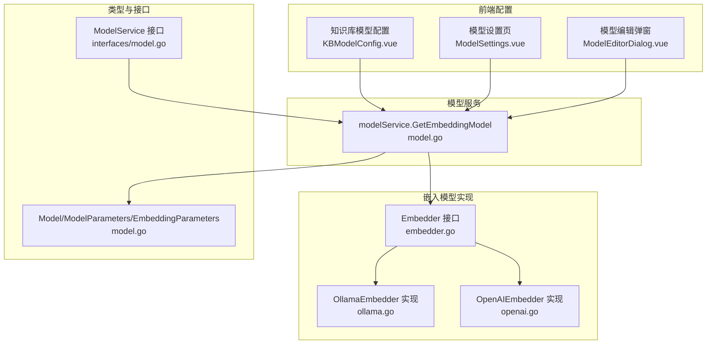
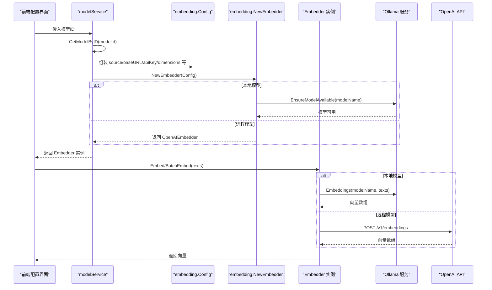
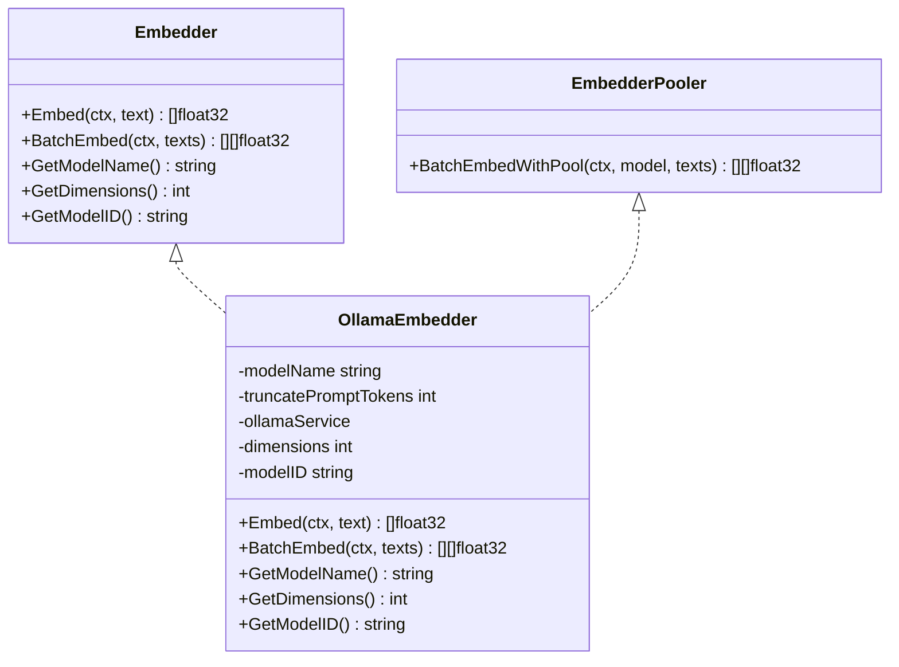
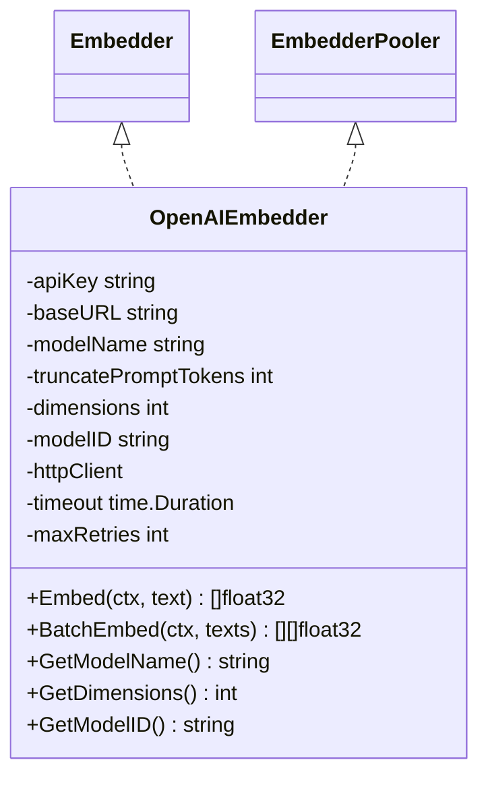
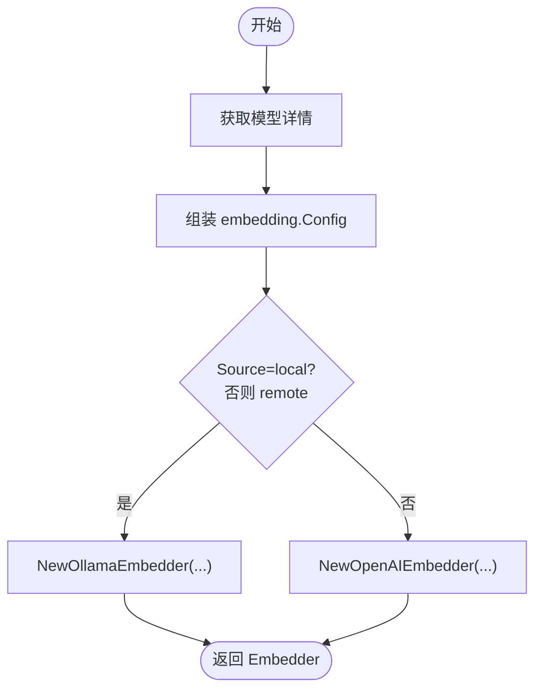
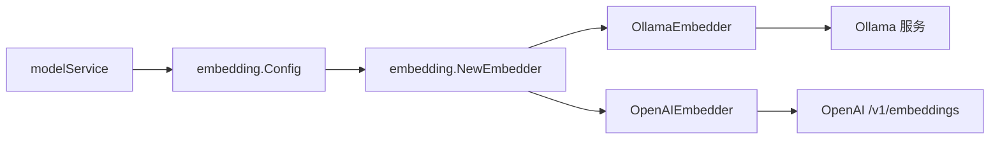

# 嵌入模型配置

<cite>
**本文引用的文件**
- [embedder.go](file://internal/models/embedding/embedder.go)
- [ollama.go](file://internal/models/embedding/ollama.go)
- [openai.go](file://internal/models/embedding/openai.go)
- [model.go](file://internal/application/service/model.go)
- [interfaces/model.go](file://internal/types/interfaces/model.go)
- [model.go](file://internal/types/model.go)
- [initialization.go](file://internal/handler/initialization.go)
- [BUILTIN_MODELS.md](file://docs/BUILTIN_MODELS.md)
- [KBModelConfig.vue](file://frontend/src/views/knowledge/settings/KBModelConfig.vue)
- [ModelSettings.vue](file://frontend/src/views/settings/ModelSettings.vue)
- [ModelEditorDialog.vue](file://frontend/src/components/ModelEditorDialog.vue)
</cite>

## 目录
1. [简介](#简介)
2. [项目结构](#项目结构)
3. [核心组件](#核心组件)
4. [架构总览](#架构总览)
5. [详细组件分析](#详细组件分析)
6. [依赖关系分析](#依赖关系分析)
7. [性能考量](#性能考量)
8. [故障排查指南](#故障排查指南)
9. [结论](#结论)
10. [附录](#附录)

## 简介
本文件面向系统集成与运维人员，系统性说明嵌入模型（Embedding Model）的配置与使用，重点覆盖以下内容：
- Embedder 接口的设计与职责边界
- OllamaEmbedder 与 OpenAIEmbedder 的实现差异与配置参数
- 通过 modelService.GetEmbeddingModel 加载嵌入模型实例的流程
- 在 config.yaml 中定义本地或远程嵌入模型的方法与注意事项
- 面向检索质量的模型选择建议与最佳实践

## 项目结构
嵌入模型相关代码集中在 internal/models/embedding，模型服务位于 internal/application/service，类型定义在 internal/types，前端配置界面位于 frontend。

图表来源
- [embedder.go](file://internal/models/embedding/embedder.go#L1-L76)
- [ollama.go](file://internal/models/embedding/ollama.go#L1-L126)
- [openai.go](file://internal/models/embedding/openai.go#L1-L202)
- [model.go](file://internal/application/service/model.go#L232-L266)
- [model.go](file://internal/types/model.go#L1-L112)
- [interfaces/model.go](file://internal/types/interfaces/model.go#L1-L30)
- [KBModelConfig.vue](file://frontend/src/views/knowledge/settings/KBModelConfig.vue#L28-L52)
- [ModelSettings.vue](file://frontend/src/views/settings/ModelSettings.vue#L76-L124)
- [ModelEditorDialog.vue](file://frontend/src/components/ModelEditorDialog.vue#L175-L206)

章节来源
- [embedder.go](file://internal/models/embedding/embedder.go#L1-L76)
- [model.go](file://internal/application/service/model.go#L232-L266)
- [model.go](file://internal/types/model.go#L1-L112)
- [interfaces/model.go](file://internal/types/interfaces/model.go#L1-L30)
- [KBModelConfig.vue](file://frontend/src/views/knowledge/settings/KBModelConfig.vue#L28-L52)
- [ModelSettings.vue](file://frontend/src/views/settings/ModelSettings.vue#L76-L124)
- [ModelEditorDialog.vue](file://frontend/src/components/ModelEditorDialog.vue#L175-L206)

## 核心组件
- Embedder 接口：定义 Embed 与 BatchEmbed 两个核心方法，以及模型名称、维度、ID 的查询能力；并包含 EmbedderPooler 的批处理池化能力。
- OllamaEmbedder：基于本地 Ollama 服务的嵌入实现，默认模型名与截断策略，通过 EnsureModelAvailable 确保模型可用。
- OpenAIEmbedder：基于远程 OpenAI API 的嵌入实现，支持重试与超时控制，构造 /v1/embeddings 请求。
- modelService.GetEmbeddingModel：根据模型 ID 获取模型详情，组装 embedding.Config 并调用 embedding.NewEmbedder 初始化具体实现。
- 类型与参数：Model、ModelParameters、EmbeddingParameters 定义了模型来源、基础参数与嵌入参数（维度、截断令牌数）。

章节来源
- [embedder.go](file://internal/models/embedding/embedder.go#L1-L76)
- [ollama.go](file://internal/models/embedding/ollama.go#L1-L126)
- [openai.go](file://internal/models/embedding/openai.go#L1-L202)
- [model.go](file://internal/application/service/model.go#L232-L266)
- [model.go](file://internal/types/model.go#L1-L112)

## 架构总览
下图展示了从“模型配置”到“嵌入调用”的端到端流程。

图表来源
- [model.go](file://internal/application/service/model.go#L232-L266)
- [embedder.go](file://internal/models/embedding/embedder.go#L51-L76)
- [ollama.go](file://internal/models/embedding/ollama.go#L62-L110)
- [openai.go](file://internal/models/embedding/openai.go#L95-L186)

## 详细组件分析

### Embedder 接口与实现机制
- 接口职责
  - Embed(ctx, text)：单文本向量化
  - BatchEmbed(ctx, texts)：批量文本向量化
  - GetModelName/GetDimensions/GetModelID：查询模型元信息
  - EmbedderPooler：提供带池化的批量嵌入能力
- 设计要点
  - 将“向量化”抽象为统一接口，便于切换本地/远程实现
  - 通过 EmbedderPooler 支持批处理池化，减少重复初始化成本

章节来源
- [embedder.go](file://internal/models/embedding/embedder.go#L1-L76)

### OllamaEmbedder 实现
- 关键行为
  - 默认模型名与截断策略：当未显式配置时采用默认值
  - 确保模型可用：调用 EnsureModelAvailable 检查并准备模型
  - 批量嵌入：构造 EmbedRequest，设置可选截断参数，调用 Ollama 服务获取向量
  - 单文本嵌入：委托 BatchEmbed 并取首个向量
- 参数映射
  - ModelName -> Ollama 模型名
  - TruncatePromptTokens -> 截断选项
  - Dimensions -> 维度（用于检索一致性）
  - ModelID -> 模型标识（用于日志与追踪）

图表来源
- [embedder.go](file://internal/models/embedding/embedder.go#L1-L76)
- [ollama.go](file://internal/models/embedding/ollama.go#L1-L126)

章节来源
- [ollama.go](file://internal/models/embedding/ollama.go#L1-L126)

### OpenAIEmbedder 实现
- 关键行为
  - 默认 BaseURL 与必填校验：未提供时使用默认远程地址；模型名必填
  - 截断策略：默认截断令牌数
  - 重试与超时：指数退避重试，最大重试次数与请求超时
  - 批量嵌入：构造请求体，发送 POST /v1/embeddings，解析响应并提取向量
  - 单文本嵌入：循环多次尝试 BatchEmbed，取首个向量
- 参数映射
  - APIKey/BaseURL/ModelName/Dimensions/TruncatePromptTokens/ModelID

图表来源
- [embedder.go](file://internal/models/embedding/embedder.go#L1-L76)
- [openai.go](file://internal/models/embedding/openai.go#L1-L202)

章节来源
- [openai.go](file://internal/models/embedding/openai.go#L1-L202)

### 模型加载与初始化：modelService.GetEmbeddingModel
- 输入：模型 ID
- 步骤
  - 通过仓库获取模型详情（含来源、参数、名称等）
  - 组装 embedding.Config（BaseURL、APIKey、ModelName、Dimensions、TruncatePromptTokens、ModelID）
  - 调用 embedding.NewEmbedder 根据 Source 选择 OllamaEmbedder 或 OpenAIEmbedder
  - 返回 Embedder 实例供后续检索/重排等流程使用

图表来源
- [model.go](file://internal/application/service/model.go#L232-L266)
- [embedder.go](file://internal/models/embedding/embedder.go#L51-L76)

章节来源
- [model.go](file://internal/application/service/model.go#L232-L266)
- [embedder.go](file://internal/models/embedding/embedder.go#L51-L76)

### 配置参数与差异对比
- 共同参数
  - source：local/remote
  - base_url：远程服务地址
  - api_key：远程鉴权
  - model_name：模型名称
  - dimensions：向量维度
  - truncate_prompt_tokens：截断令牌数
  - model_id：模型标识
- 差异点
  - OllamaEmbedder：默认模型名与默认截断策略；通过 Ollama 服务获取向量
  - OpenAIEmbedder：默认远程 BaseURL；具备重试与超时控制；通过 /v1/embeddings 获取向量

章节来源
- [embedder.go](file://internal/models/embedding/embedder.go#L40-L76)
- [ollama.go](file://internal/models/embedding/ollama.go#L35-L60)
- [openai.go](file://internal/models/embedding/openai.go#L44-L79)

### 前端配置与使用
- 知识库配置页面：选择嵌入模型 ID，绑定到知识库配置
- 模型设置页：展示嵌入模型列表，显示来源与维度
- 模型编辑弹窗：新增/编辑嵌入模型时，校验维度范围（128~4096），本地模型可自动检测维度

章节来源
- [KBModelConfig.vue](file://frontend/src/views/knowledge/settings/KBModelConfig.vue#L28-L52)
- [ModelSettings.vue](file://frontend/src/views/settings/ModelSettings.vue#L76-L124)
- [ModelEditorDialog.vue](file://frontend/src/components/ModelEditorDialog.vue#L175-L206)

## 依赖关系分析
- 组件耦合
  - modelService 依赖 embedding.NewEmbedder 与类型定义（Model/ModelParameters/EmbeddingParameters）
  - Embedder 接口与具体实现（OllamaEmbedder/OpenAIEmbedder）解耦良好
  - 前端通过模型设置与知识库配置页驱动模型选择与初始化
- 外部依赖
  - OllamaEmbedder 依赖 Ollama 服务（EnsureModelAvailable/Embeddings）
  - OpenAIEmbedder 依赖 HTTP 客户端与 /v1/embeddings 接口

图表来源
- [model.go](file://internal/application/service/model.go#L232-L266)
- [embedder.go](file://internal/models/embedding/embedder.go#L51-L76)
- [ollama.go](file://internal/models/embedding/ollama.go#L62-L110)
- [openai.go](file://internal/models/embedding/openai.go#L95-L186)

章节来源
- [model.go](file://internal/application/service/model.go#L232-L266)
- [embedder.go](file://internal/models/embedding/embedder.go#L51-L76)
- [ollama.go](file://internal/models/embedding/ollama.go#L62-L110)
- [openai.go](file://internal/models/embedding/openai.go#L95-L186)

## 性能考量
- 批量嵌入优先：通过 EmbedderPooler 与 BatchEmbed 提升吞吐，减少网络/服务调用次数
- 截断策略：合理设置 truncate_prompt_tokens，避免过长文本导致维度不一致或服务端拒绝
- 维度一致性：确保检索向量与训练/存储向量维度一致，避免检索失败或质量下降
- 重试与超时：OpenAIEmbedder 的重试与超时配置有助于提升稳定性，但需关注成本与延迟

[本节为通用指导，不直接分析具体文件]

## 故障排查指南
- 常见错误
  - 模型来源不支持：NewEmbedder 对不支持的 Source 返回错误
  - 远程模型名缺失：OpenAIEmbedder 要求模型名必填
  - 远程请求失败：检查 BaseURL、APIKey、网络连通性与服务端状态码
  - 本地模型不可用：OllamaEmbedder 会尝试 EnsureModelAvailable，确认模型已拉取
- 前端测试
  - 使用初始化处理器的 TestEmbeddingModel 接口进行连通性与功能测试，快速定位问题

章节来源
- [embedder.go](file://internal/models/embedding/embedder.go#L51-L76)
- [openai.go](file://internal/models/embedding/openai.go#L44-L79)
- [initialization.go](file://internal/handler/initialization.go#L1380-L1438)

## 结论
- 通过 Embedder 接口与 modelService.GetEmbeddingModel，系统实现了嵌入模型的统一抽象与灵活加载
- OllamaEmbedder 与 OpenAIEmbedder 在参数与行为上各有侧重，可根据部署环境与需求选择
- 前端提供了完善的模型配置入口，配合内置模型管理指南，便于统一与安全地维护模型配置

[本节为总结性内容，不直接分析具体文件]

## 附录

### 配置示例与最佳实践
- 本地嵌入模型（Ollama）
  - source: local
  - model_name: 本地可用的嵌入模型名（如 nomic-embed-text）
  - dimensions: 与本地模型一致的维度
  - truncate_prompt_tokens: 根据业务文本长度设置
  - 注意：系统会自动确保模型可用
- 远程嵌入模型（OpenAI）
  - source: remote
  - base_url: 远程服务地址（默认 OpenAI）
  - api_key: 远程鉴权密钥
  - model_name: 远程模型名（必填）
  - dimensions: 与远程模型一致的维度
  - truncate_prompt_tokens: 根据业务文本长度设置
- 内置模型
  - 可通过数据库插入内置嵌入模型，便于多租户共享与统一管理
  - 参考内置模型管理指南，确保参数格式正确与幂等性

章节来源
- [BUILTIN_MODELS.md](file://docs/BUILTIN_MODELS.md#L1-L174)
- [model.go](file://internal/types/model.go#L40-L52)
- [model.go](file://internal/application/service/model.go#L232-L266)
- [embedder.go](file://internal/models/embedding/embedder.go#L40-L76)
- [ollama.go](file://internal/models/embedding/ollama.go#L35-L60)
- [openai.go](file://internal/models/embedding/openai.go#L44-L79)