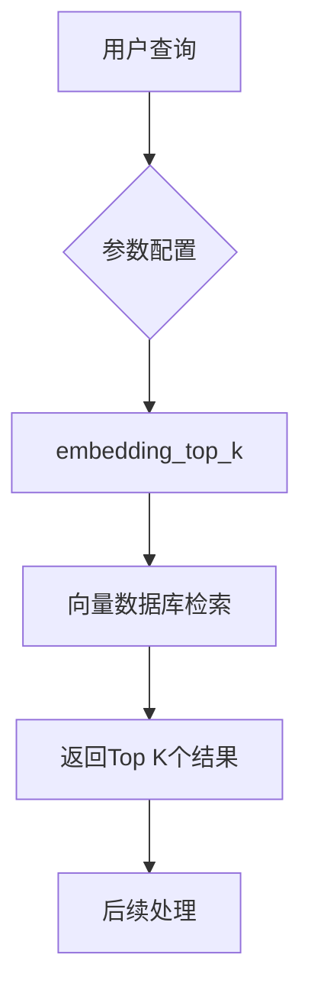
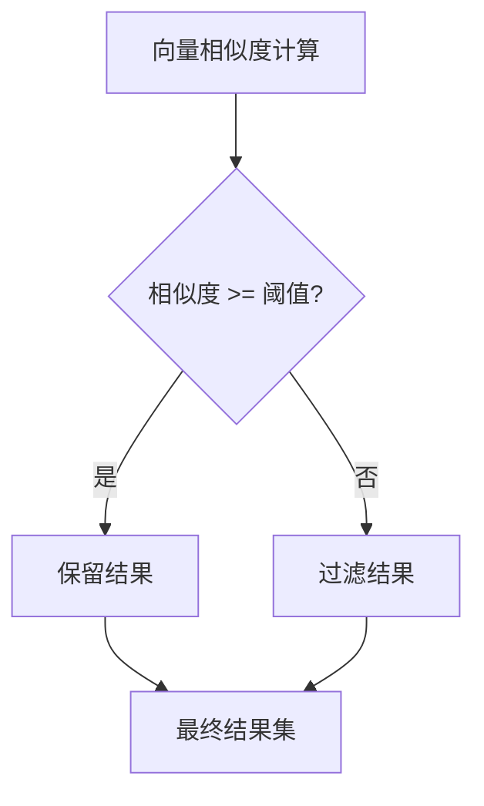
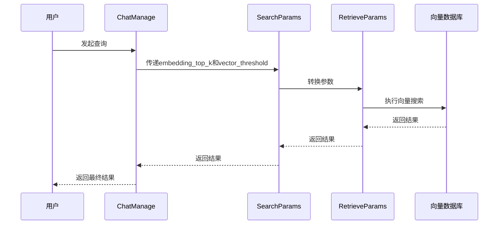
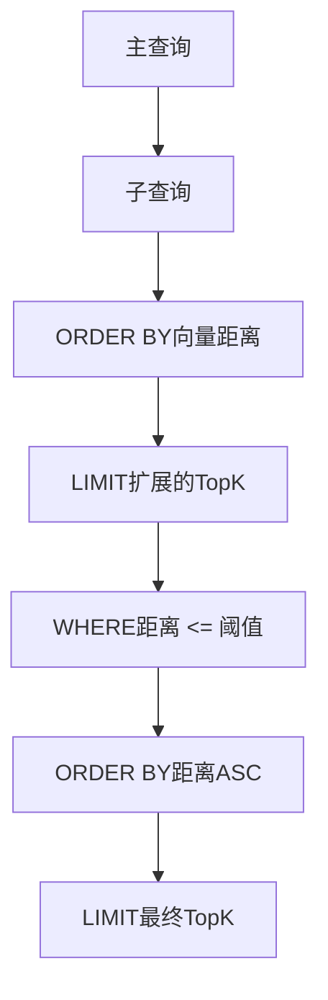
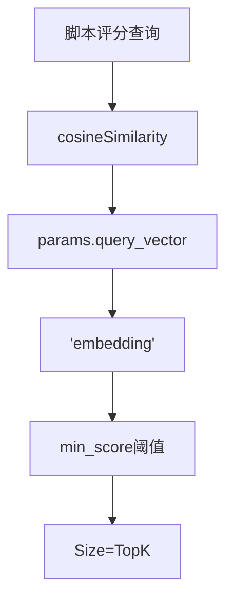
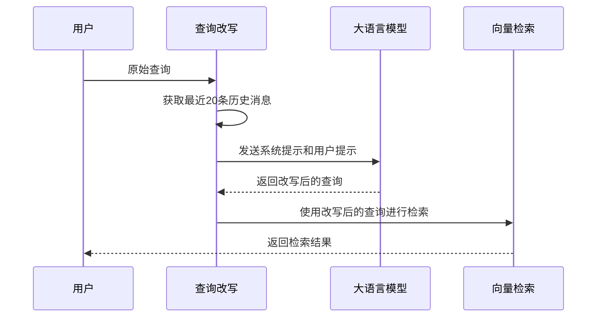

# 检索参数调优

<cite>
**本文档引用的文件**   
- [search.go](file://internal/application/service/chat_pipline/search.go)
- [rewrite.go](file://internal/application/service/chat_pipline/rewrite.go)
- [repository.go](file://internal/application/repository/retriever/postgres/repository.go)
- [repository.go](file://internal/application/repository/retriever/elasticsearch/v8/repository.go)
- [knowledgebase.go](file://internal/application/service/knowledgebase.go)
- [chat_manage.go](file://internal/types/chat_manage.go)
- [search.go](file://internal/types/search.go)
- [retriever.go](file://internal/types/retriever.go)
</cite>

## 目录
1. [引言](#引言)
2. [核心参数详解](#核心参数详解)
3. [向量检索流程分析](#向量检索流程分析)
4. [查询改写机制](#查询改写机制)
5. [调优建议](#调优建议)
6. [总结](#总结)

## 引言
本文档系统化介绍WeKnora系统中向量检索的核心参数配置，重点分析`embedding_top_k`和`vector_threshold`的作用机制。通过分析代码实现，解释这些参数如何影响检索的召回率和精度，并提供实际调优建议。

## 核心参数详解

### embedding_top_k 参数
`embedding_top_k`参数控制从向量数据库返回的候选结果数量。该参数在`ChatManage`结构体中定义，用于指定向量搜索时需要返回的最高相关性结果数量。

在检索过程中，`embedding_top_k`值被传递给`SearchParams`结构体的`MatchCount`字段，最终作为`TopK`参数用于向量检索。系统会根据此参数从向量数据库中检索出最相似的前K个结果。

**参数特点：**
- 类型：整数
- 作用：控制候选结果数量
- 影响：直接影响召回率和系统性能

**代码路径**
- [chat_manage.go](file://internal/types/chat_manage.go#L15)
- [search.go](file://internal/application/service/chat_pipline/search.go#L322)

### vector_threshold 参数
`vector_threshold`参数通过设置最小相似度阈值来过滤低相关性结果。该参数定义了向量相似度的最低可接受值，低于此阈值的结果将被过滤掉。

在PostgreSQL实现中，`vector_threshold`被转换为距离阈值（1-params.Threshold）用于查询过滤。在Elasticsearch实现中，该参数直接作为`min_score`用于脚本评分查询。

**参数特点：**
- 类型：浮点数（0-1范围）
- 作用：过滤低相关性结果
- 影响：直接影响检索精度和召回率

**代码路径**
- [chat_manage.go](file://internal/types/chat_manage.go#L13)
- [repository.go](file://internal/application/repository/retriever/postgres/repository.go#L315)

## 向量检索流程分析

### 检索参数传递流程
向量检索参数从用户请求开始，经过多个服务层传递，最终到达数据库查询层。整个流程如下：

**代码路径**
- [search.go](file://internal/application/service/chat_pipline/search.go#L318-L323)
- [knowledgebase.go](file://internal/application/service/knowledgebase.go#L486-L487)

### 不同向量数据库的实现差异

#### PostgreSQL 实现
PostgreSQL使用HNSW索引进行向量搜索，采用子查询优化策略：

系统会将`TopK`值扩大2倍（最少100，最多1000）作为子查询的LIMIT，以确保有足够的候选结果进行阈值过滤。

**代码路径**
- [repository.go](file://internal/application/repository/retriever/postgres/repository.go#L280-L312)

#### Elasticsearch 实现
Elasticsearch使用脚本评分查询实现向量搜索：

通过`script_score`查询，使用余弦相似度计算向量距离，并设置`min_score`作为最小相似度阈值。

**代码路径**
- [repository.go](file://internal/application/repository/retriever/elasticsearch/v8/repository.go#L334-L351)

## 查询改写机制

### 查询改写流程
查询改写插件通过历史对话上下文和大语言模型优化用户原始查询，提升向量匹配效果：

**代码路径**
- [rewrite.go](file://internal/application/service/chat_pipline/rewrite.go#L75-L231)

### 语义增强效果
查询改写通过以下方式提升向量匹配效果：

1. **上下文补充**：结合历史对话，理解用户查询的真实意图
2. **语义扩展**：添加相关概念和术语，丰富查询语义
3. **格式优化**：调整查询格式，使其更适合向量匹配

例如，用户查询"它怎么样？"在结合上下文后可能被改写为"腾讯WeKnora系统的性能表现如何？"，从而显著提升检索效果。

**代码路径**
- [rewrite.go](file://internal/application/service/chat_pipline/rewrite.go#L205-L220)

## 调优建议

### 参数配置建议
根据知识库密度和应用场景，建议采用以下参数配置策略：

| 知识库密度 | embedding_top_k | vector_threshold | 说明 |
|-----------|----------------|-----------------|------|
| 高密度 | 10-20 | 0.7-0.8 | 提高阈值减少噪声干扰 |
| 中密度 | 15-25 | 0.6-0.7 | 平衡召回率和精度 |
| 低密度 | 20-30 | 0.5-0.6 | 降低阈值提高召回率 |

### 高密度知识库优化
在高密度知识库中，建议适当提高`vector_threshold`以减少噪声干扰：

同时，可以适当降低`embedding_top_k`值，避免返回过多相似结果造成信息过载。

**代码路径**
- [search.go](file://internal/application/service/chat_pipline/search.go#L142-L143)

### 动态参数调整
系统支持基于租户配置的动态参数调整，优先级如下：

1. 租户会话配置
2. 全局配置
3. 硬编码默认值

这种分层配置机制允许不同租户根据自身需求定制检索参数。

**代码路径**
- [knowledge_search.go](file://internal/agent/tools/knowledge_search.go#L208-L234)

## 总结
`embedding_top_k`和`vector_threshold`是向量检索中两个关键参数，分别控制候选结果数量和过滤低相关性结果。通过合理配置这两个参数，并结合查询改写等语义增强技术，可以显著提升检索系统的召回率和精度。在实际应用中，应根据知识库密度和业务需求进行针对性调优，以达到最佳效果。

**代码路径**
- [search.go](file://internal/application/service/chat_pipline/search.go)
- [rewrite.go](file://internal/application/service/chat_pipline/rewrite.go)