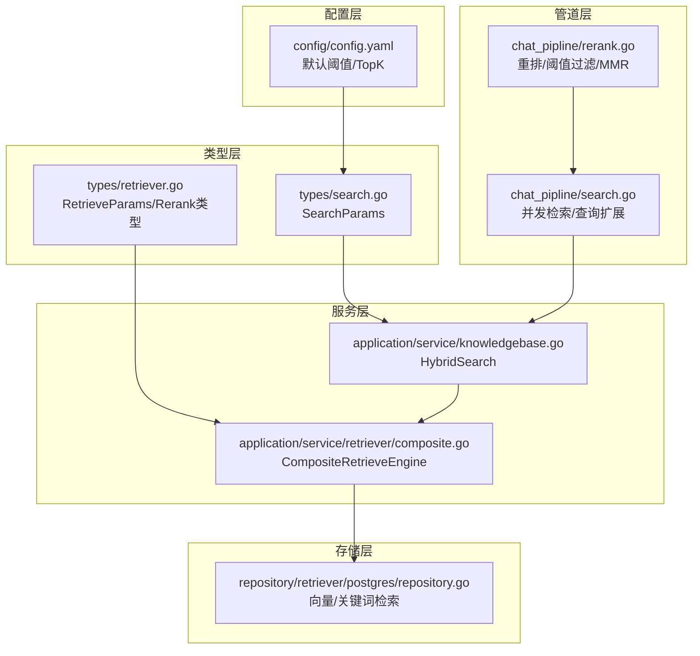
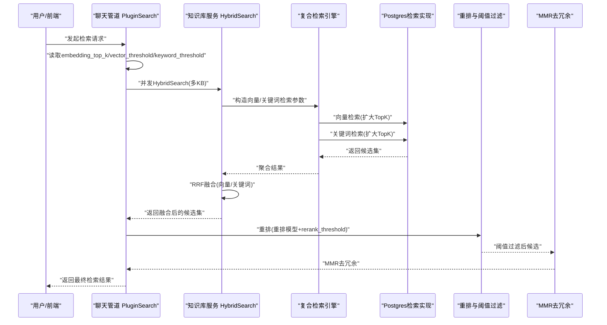
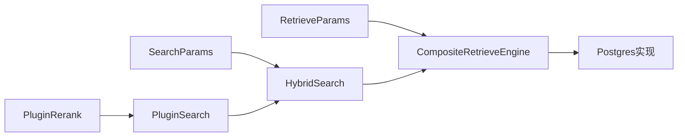
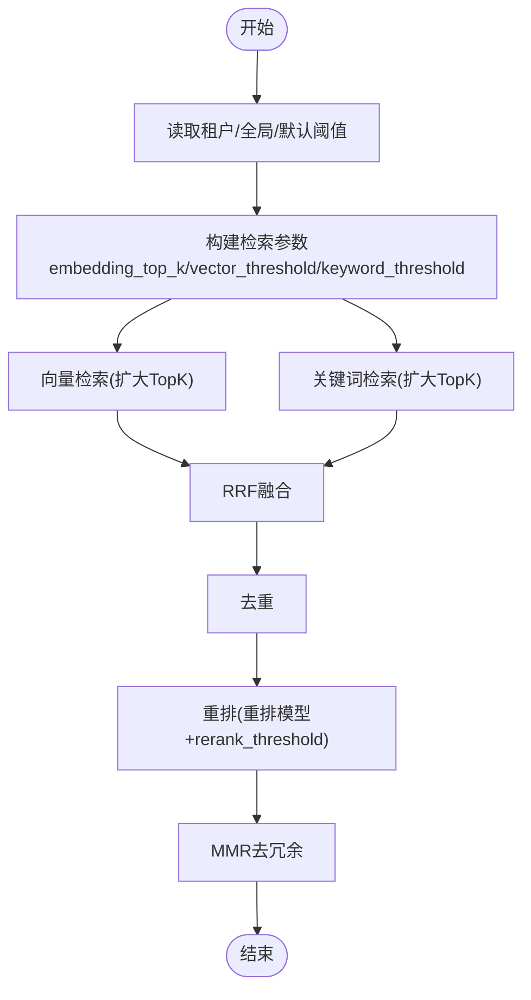

# 检索策略

<cite>
**本文引用的文件**
- [config/config.yaml](file://config/config.yaml)
- [internal/types/search.go](file://internal/types/search.go)
- [internal/types/retriever.go](file://internal/types/retriever.go)
- [internal/application/service/knowledgebase.go](file://internal/application/service/knowledgebase.go)
- [internal/application/service/chat_pipline/search.go](file://internal/application/service/chat_pipline/search.go)
- [internal/application/service/chat_pipline/rerank.go](file://internal/application/service/chat_pipline/rerank.go)
- [internal/application/service/retriever/composite.go](file://internal/application/service/retriever/composite.go)
- [internal/application/repository/retriever/postgres/repository.go](file://internal/application/repository/retriever/postgres/repository.go)
- [internal/agent/tools/knowledge_search.go](file://internal/agent/tools/knowledge_search.go)
- [frontend/src/views/settings/AgentSettings.vue](file://frontend/src/views/settings/AgentSettings.vue)
- [frontend/src/views/knowledge/components/FAQEntryManager.vue](file://frontend/src/views/knowledge/components/FAQEntryManager.vue)
</cite>

## 目录
1. [简介](#简介)
2. [项目结构](#项目结构)
3. [核心组件](#核心组件)
4. [架构总览](#架构总览)
5. [详细组件分析](#详细组件分析)
6. [依赖分析](#依赖分析)
7. [性能考量](#性能考量)
8. [故障排查指南](#故障排查指南)
9. [结论](#结论)
10. [附录](#附录)

## 简介
本文件聚焦于混合检索策略的配置与执行，围绕三个关键阈值参数：keyword_threshold（关键词阈值）、embedding_top_k（向量候选集大小）、vector_threshold（向量相似度阈值）。文档解释关键词检索与向量检索在混合检索中的协同机制，以及这些阈值如何共同影响召回率与精确率的平衡。结合聊天管道的搜索逻辑，阐明参数在检索流程中的作用时机与相互影响，并提供调优建议，例如在知识库内容密集时如何调整vector_threshold以减少噪声。

## 项目结构
检索策略涉及多层协作：
- 配置层：全局默认阈值与TopK参数来源于配置文件。
- 类型层：定义检索参数结构（SearchParams）与检索引擎接口。
- 服务层：知识库服务负责混合检索（向量+关键词），并进行Rerank与MMR。
- 管道层：聊天管道在不同阶段读取阈值、执行并发检索、处理召回不足时的查询扩展。
- 存储层：向量与关键词检索分别通过复合检索引擎路由到具体仓库实现（如PostgreSQL向量与关键词检索）。

图表来源
- [config/config.yaml](file://config/config.yaml#L1-L60)
- [internal/types/search.go](file://internal/types/search.go#L54-L61)
- [internal/types/retriever.go](file://internal/types/retriever.go#L25-L45)
- [internal/application/service/knowledgebase.go](file://internal/application/service/knowledgebase.go#L431-L629)
- [internal/application/service/retriever/composite.go](file://internal/application/service/retriever/composite.go#L1-L120)
- [internal/application/repository/retriever/postgres/repository.go](file://internal/application/repository/retriever/postgres/repository.go#L162-L320)
- [internal/application/service/chat_pipline/search.go](file://internal/application/service/chat_pipline/search.go#L1-L120)
- [internal/application/service/chat_pipline/rerank.go](file://internal/application/service/chat_pipline/rerank.go#L1-L120)

章节来源
- [config/config.yaml](file://config/config.yaml#L1-L60)
- [internal/types/search.go](file://internal/types/search.go#L54-L61)
- [internal/types/retriever.go](file://internal/types/retriever.go#L25-L45)
- [internal/application/service/knowledgebase.go](file://internal/application/service/knowledgebase.go#L431-L629)
- [internal/application/service/retriever/composite.go](file://internal/application/service/retriever/composite.go#L1-L120)
- [internal/application/repository/retriever/postgres/repository.go](file://internal/application/repository/retriever/postgres/repository.go#L162-L320)
- [internal/application/service/chat_pipline/search.go](file://internal/application/service/chat_pipline/search.go#L1-L120)
- [internal/application/service/chat_pipline/rerank.go](file://internal/application/service/chat_pipline/rerank.go#L1-L120)

## 核心组件
- 搜索参数结构
  - SearchParams：包含查询文本、向量阈值、关键词阈值、匹配数量、禁用开关等。
- 检索参数结构
  - RetrieveParams：包含查询、向量、知识库ID、排除ID、TopK、阈值、附加参数、检索器类型等。
- 混合检索服务
  - HybridSearch：根据配置创建复合检索引擎，构造向量与关键词检索参数，执行检索并进行RRF融合。
- 复合检索引擎
  - CompositeRetrieveEngine：并发调度不同检索器类型，聚合结果。
- 存储实现
  - Postgres向量检索：先扩大TopK候选，再按阈值过滤，利用HNSW索引高效排序。
  - Postgres关键词检索：基于全文检索算子，支持知识库ID过滤与启用状态过滤。
- 聊天管道
  - 并发检索：对多个知识库并发执行混合检索。
  - 查询扩展：当召回不足时，使用关键词检索扩展召回，降低关键词阈值以提升召回。
  - 重排与阈值过滤：基于重排模型与阈值进行二次筛选，并应用MMR去除冗余。
- 参数来源与默认值
  - 优先从租户对话配置读取，其次使用全局配置，最后使用硬编码默认值。

章节来源
- [internal/types/search.go](file://internal/types/search.go#L54-L61)
- [internal/types/retriever.go](file://internal/types/retriever.go#L25-L45)
- [internal/application/service/knowledgebase.go](file://internal/application/service/knowledgebase.go#L431-L629)
- [internal/application/service/retriever/composite.go](file://internal/application/service/retriever/composite.go#L1-L120)
- [internal/application/repository/retriever/postgres/repository.go](file://internal/application/repository/retriever/postgres/repository.go#L162-L320)
- [internal/application/service/chat_pipline/search.go](file://internal/application/service/chat_pipline/search.go#L1-L120)
- [internal/application/service/chat_pipline/rerank.go](file://internal/application/service/chat_pipline/rerank.go#L1-L120)
- [config/config.yaml](file://config/config.yaml#L1-L60)

## 架构总览
混合检索的整体流程如下：
- 输入阶段：从聊天管理器读取rewrite后的查询、embedding_top_k、vector_threshold、keyword_threshold。
- 参数解析：优先租户对话配置，其次全局配置，最后硬编码默认值。
- 并发检索：对每个知识库并发执行HybridSearch，分别生成向量与关键词候选。
- RRF融合：对向量与关键词结果进行Reciprocal Rank Fusion，得到统一评分。
- 去重与重排：去重后进入重排阶段，使用重排模型与rerank_threshold进行阈值过滤，并应用MMR。
- 查询扩展：若召回过少，触发关键词检索扩展，降低关键词阈值以提升召回。
- 输出：最终结果进入后续生成阶段。

图表来源
- [internal/application/service/chat_pipline/search.go](file://internal/application/service/chat_pipline/search.go#L1-L120)
- [internal/application/service/knowledgebase.go](file://internal/application/service/knowledgebase.go#L431-L629)
- [internal/application/service/retriever/composite.go](file://internal/application/service/retriever/composite.go#L1-L120)
- [internal/application/repository/retriever/postgres/repository.go](file://internal/application/repository/retriever/postgres/repository.go#L162-L320)
- [internal/application/service/chat_pipline/rerank.go](file://internal/application/service/chat_pipline/rerank.go#L1-L120)

## 详细组件分析

### 参数定义与来源
- SearchParams
  - 字段：query_text、vector_threshold、keyword_threshold、match_count、禁用开关。
- 参数来源优先级
  - 租户对话配置 > 全局配置 > 硬编码默认值。
- 默认值
  - keyword_threshold、embedding_top_k、vector_threshold、rerank_threshold等在配置文件中定义。

章节来源
- [internal/types/search.go](file://internal/types/search.go#L54-L61)
- [internal/agent/tools/knowledge_search.go](file://internal/agent/tools/knowledge_search.go#L201-L269)
- [config/config.yaml](file://config/config.yaml#L1-L60)

### 混合检索与RRF融合
- HybridSearch
  - 构造向量检索参数：match_count扩大为三倍，使用向量阈值；生成查询向量并调用检索引擎。
  - 构造关键词检索参数：match_count扩大为三倍，使用关键词阈值；支持禁用关键词检索。
  - 并发执行检索，分离向量与关键词结果，使用RRF融合，k常量为60。
  - 记录融合前后统计，便于调试与评估。
- 复合检索引擎
  - 根据检索器类型分派到具体实现，支持并发执行与错误收集。

章节来源
- [internal/application/service/knowledgebase.go](file://internal/application/service/knowledgebase.go#L431-L629)
- [internal/application/service/retriever/composite.go](file://internal/application/service/retriever/composite.go#L1-L120)

### 向量检索与阈值过滤
- Postgres向量检索
  - 先将TopK扩大为2倍（最小100，最大1000），利用HNSW索引排序，再在外层按阈值过滤，最后限制返回TopK。
  - 通过距离阈值转换为score，确保与关键词检索在同一评分体系下参与RRF。
- 向量阈值的作用
  - 控制候选集质量：较高的阈值减少噪声，但可能降低召回；较低的阈值提升召回，但可能引入噪声。

章节来源
- [internal/application/repository/retriever/postgres/repository.go](file://internal/application/repository/retriever/postgres/repository.go#L252-L320)

### 关键词检索与阈值过滤
- Postgres关键词检索
  - 使用全文检索算子，支持知识库ID过滤与启用状态过滤。
  - 扩大TopK以保证融合前有足够候选。
- 关键词阈值的作用
  - 控制关键词匹配的严格程度：较高阈值提升精确率，较低阈值提升召回。

章节来源
- [internal/application/repository/retriever/postgres/repository.go](file://internal/application/repository/retriever/postgres/repository.go#L162-L210)

### 聊天管道中的检索流程
- 并发检索
  - 对每个知识库并发执行HybridSearch，汇总结果。
- 召回不足时的查询扩展
  - 当召回数量低于embedding_top_k的一半时，触发关键词检索扩展，降低关键词阈值以提升召回。
- 去重与重排
  - 去重后进入重排阶段，使用重排模型与rerank_threshold进行阈值过滤，并应用MMR去除冗余。
- MMR参数
  - 使用lambda=0.7平衡相关性与多样性。

章节来源
- [internal/application/service/chat_pipline/search.go](file://internal/application/service/chat_pipline/search.go#L131-L206)
- [internal/application/service/chat_pipline/search.go](file://internal/application/service/chat_pipline/search.go#L311-L359)
- [internal/application/service/chat_pipline/rerank.go](file://internal/application/service/chat_pipline/rerank.go#L240-L321)

### 参数对召回率与精确率的影响
- embedding_top_k
  - 控制候选集规模：较大的TopK能提升召回，但增加重排与MMR成本；较小的TopK提升精确率，但可能漏召回。
- vector_threshold
  - 控制向量相似度门槛：较高的阈值提升精确率，减少噪声；较低的阈值提升召回，但可能引入低质量候选。
- keyword_threshold
  - 控制关键词匹配门槛：较高的阈值提升精确率；较低的阈值提升召回，适合召回不足时的扩展。

章节来源
- [internal/application/service/knowledgebase.go](file://internal/application/service/knowledgebase.go#L459-L505)
- [internal/application/service/chat_pipline/search.go](file://internal/application/service/chat_pipline/search.go#L131-L206)
- [internal/application/repository/retriever/postgres/repository.go](file://internal/application/repository/retriever/postgres/repository.go#L252-L320)

### 调优建议
- 知识库内容密集场景
  - 建议提高vector_threshold，减少低质量向量候选进入融合阶段，从而降低噪声。
  - 同时适当提高embedding_top_k，确保融合前有足够候选。
- 召回不足场景
  - 启用查询扩展，降低keyword_threshold以提升召回；随后通过重排与MMR恢复精确率。
- 重排与阈值
  - 使用rerank_threshold对重排后的结果进行二次过滤，必要时进行阈值降级以保证至少有少量结果。
- MMR
  - 保持lambda=0.7，平衡相关性与多样性；根据业务需求微调k值。

章节来源
- [internal/application/service/chat_pipline/search.go](file://internal/application/service/chat_pipline/search.go#L131-L206)
- [internal/application/service/chat_pipline/rerank.go](file://internal/application/service/chat_pipline/rerank.go#L1-L120)

## 依赖分析
- 参数依赖
  - SearchParams与RetrieveParams在HybridSearch中被转换为具体检索参数。
- 引擎依赖
  - 复合检索引擎根据检索器类型分派到具体实现，支持并发与错误传播。
- 存储依赖
  - Postgres实现对向量与关键词检索分别优化，向量检索利用HNSW索引与阈值过滤。
- 管道依赖
  - 聊天管道在不同阶段读取阈值并驱动检索、扩展、重排与去冗余。

图表来源
- [internal/types/search.go](file://internal/types/search.go#L54-L61)
- [internal/types/retriever.go](file://internal/types/retriever.go#L25-L45)
- [internal/application/service/knowledgebase.go](file://internal/application/service/knowledgebase.go#L431-L629)
- [internal/application/service/retriever/composite.go](file://internal/application/service/retriever/composite.go#L1-L120)
- [internal/application/repository/retriever/postgres/repository.go](file://internal/application/repository/retriever/postgres/repository.go#L162-L320)
- [internal/application/service/chat_pipline/search.go](file://internal/application/service/chat_pipline/search.go#L1-L120)
- [internal/application/service/chat_pipline/rerank.go](file://internal/application/service/chat_pipline/rerank.go#L1-L120)

章节来源
- [internal/types/search.go](file://internal/types/search.go#L54-L61)
- [internal/types/retriever.go](file://internal/types/retriever.go#L25-L45)
- [internal/application/service/knowledgebase.go](file://internal/application/service/knowledgebase.go#L431-L629)
- [internal/application/service/retriever/composite.go](file://internal/application/service/retriever/composite.go#L1-L120)
- [internal/application/repository/retriever/postgres/repository.go](file://internal/application/repository/retriever/postgres/repository.go#L162-L320)
- [internal/application/service/chat_pipline/search.go](file://internal/application/service/chat_pipline/search.go#L1-L120)
- [internal/application/service/chat_pipline/rerank.go](file://internal/application/service/chat_pipline/rerank.go#L1-L120)

## 性能考量
- 向量检索
  - 先扩大TopK再阈值过滤，利用HNSW索引排序，减少不必要的扫描。
- 关键词检索
  - 使用全文检索算子并支持知识库ID过滤与启用状态过滤，减少无关数据参与。
- 并发与去重
  - 管道层并发检索与去重，减少整体延迟。
- 重排与MMR
  - 在候选集规模可控的前提下进行重排与去冗余，避免过度计算。

[本节为通用指导，无需列出章节来源]

## 故障排查指南
- 召回过少
  - 检查是否触发查询扩展（keyword_threshold降级）。
  - 检查embedding_top_k是否过小。
- 精确率下降
  - 提高vector_threshold与keyword_threshold。
  - 检查重排阈值rerank_threshold是否过高。
- 向量检索性能差
  - 检查向量维度与索引配置，确认HNSW索引可用。
- 关键词检索性能差
  - 检查全文检索索引与过滤条件。

章节来源
- [internal/application/service/chat_pipline/search.go](file://internal/application/service/chat_pipline/search.go#L131-L206)
- [internal/application/service/chat_pipline/rerank.go](file://internal/application/service/chat_pipline/rerank.go#L1-L120)
- [internal/application/repository/retriever/postgres/repository.go](file://internal/application/repository/retriever/postgres/repository.go#L252-L320)

## 结论
混合检索通过向量与关键词的协同，结合RRF融合、重排与MMR，实现了召回与精确率的平衡。keyword_threshold、embedding_top_k、vector_threshold三者相互影响：embedding_top_k决定候选规模，keyword_threshold与vector_threshold分别控制关键词与向量的匹配严格度。在知识库内容密集时，应提高vector_threshold以减少噪声；在召回不足时，可通过查询扩展降低keyword_threshold并配合重排与MMR恢复质量。最终效果取决于参数组合与业务场景的适配。

[本节为总结性内容，无需列出章节来源]

## 附录
- 参数可视化（概念示意）

[本图为概念示意，无需列出图表来源]