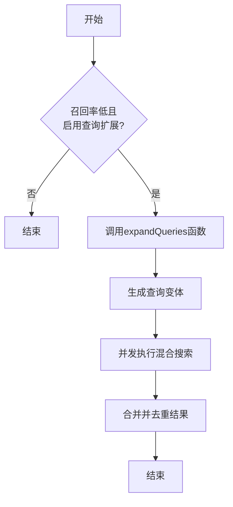
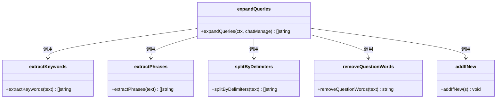

# 查询扩展策略

<cite>
**本文档引用的文件**
- [search.go](file://internal/application/service/chat_pipline/search.go#L410-L562)
- [WeKnora.md](file://docs/WeKnora.md#L200-L230)
- [chat_manage.go](file://internal/types/chat_manage.go#L31)
</cite>

## 目录
1. [引言](#引言)
2. [查询扩展机制](#查询扩展机制)
3. [本地化查询变体生成技术](#本地化查询变体生成技术)
4. [查询扩展策略的协同工作流程](#查询扩展策略的协同工作流程)
5. [与关键词检索广度的关联](#与关键词检索广度的关联)
6. [配置与启用](#配置与启用)

## 引言
在WeKnora系统中，为了提升检索的召回率和鲁棒性，实现了一套无需调用大语言模型（LLM）的本地化查询扩展策略。该策略通过在`PluginSearch`插件中调用`expandQueries`函数，对用户改写后的查询进行处理，生成一组多样化的查询变体。这些变体随后被用于第二次混合搜索，旨在覆盖更广泛的匹配可能性，从而确保最相关的知识不会被遗漏。此策略结合了语义检索的深度与关键词检索的广度，是系统实现高精度检索的关键组成部分。

**Section sources**
- [WeKnora.md](file://docs/WeKnora.md#L200-L230)

## 查询扩展机制
查询扩展机制的核心是`expandQueries`函数，该函数在`OnEvent`事件处理流程中被调用。当系统检测到初步检索的召回率较低（即检索结果数量少于`EmbeddingTopK`的一半）且`EnableQueryExpansion`配置项被启用时，该机制将被触发。

**Diagram sources**
- [search.go](file://internal/application/service/chat_pipline/search.go#L131-L206)

**Section sources**
- [search.go](file://internal/application/service/chat_pipline/search.go#L131-L206)

## 本地化查询变体生成技术
`expandQueries`函数通过四种本地化技术生成查询变体，这些技术均不依赖外部LLM，而是基于简单的文本处理和正则表达式匹配。

### 1. 移除停用词生成关键词序列
该技术通过调用`extractKeywords`函数，从原始查询中移除常见的停用词（如“的”、“是”、“在”、“了”等），从而创建一个纯粹的关键词序列。此序列能有效提升关键词检索的广度，确保即使知识区块的表述方式不同，但只要包含核心关键词，就能被成功检索到。

**Section sources**
- [search.go](file://internal/application/service/chat_pipline/search.go#L438-L442)

### 2. 提取引号内的关键短语
该技术利用`extractPhrases`函数，通过正则表达式`["'"'「」『』]([^"'"'「」『』]+)["'"'「」『』]`提取查询中被引号包围的关键短语。这些短语通常代表了用户查询中的核心概念或专有名词，将其作为独立的查询变体可以显著提高对特定信息的检索精度。

**Section sources**
- [search.go](file://internal/application/service/chat_pipline/search.go#L444-L448)

### 3. 按标点符号分割长句
该技术通过`splitByDelimiters`函数，使用正则表达式`[,，;；、。！？!?\s]+`按常见的中文和英文标点符号（如逗号、分号、句号、感叹号、问号和空格）将长查询分割成多个独立的片段。这些片段作为独立的查询变体，有助于捕捉查询中分散的、但可能非常重要的信息点。

**Section sources**
- [search.go](file://internal/application/service/chat_pipline/search.go#L450-L456)

### 4. 去除中文疑问词
该技术通过`removeQuestionWords`函数，利用正则表达式`^(什么是|什么|如何|怎么|怎样|为什么|为何|哪个|哪些|谁|何时|何地|请问|请告诉我|帮我|我想知道|我想了解)`移除查询开头的中文疑问词。这能将“什么是熊猫？”这样的问题转化为“熊猫”这样的关键词，使其更符合向量和关键词搜索引擎的匹配逻辑，从而提高检索效率。

**Section sources**
- [search.go](file://internal/application/service/chat_pipline/search.go#L458-L461)

## 查询扩展策略的协同工作流程
这四种技术协同工作，共同生成一组多样化的查询变体。整个流程如下：
1.  **初始化**：以用户改写后的查询`RewriteQuery`作为输入。
2.  **生成变体**：依次应用上述四种技术，生成多个查询变体。
3.  **去重与过滤**：使用`addIfNew`函数确保所有生成的变体都是唯一的，并过滤掉长度小于3个字符的无效查询。
4.  **限制数量**：最终生成的查询变体列表被限制在最多5个，以平衡检索的广度和性能开销。
5.  **并发检索**：系统使用这些变体，在所有相关的知识库中并发执行混合搜索（仅启用关键词匹配，禁用向量匹配，以提高效率）。
6.  **结果合并**：将所有变体的检索结果合并，并与初步检索的结果进行去重，最终形成一个更全面、更可靠的知识集合。

**Diagram sources**
- [search.go](file://internal/application/service/chat_pipline/search.go#L410-L562)

**Section sources**
- [search.go](file://internal/application/service/chat_pipline/search.go#L410-L562)

## 与关键词检索广度的关联
根据`WeKnora.md`文档中关于“关键词检索的广度”的论述，系统执行两次混合搜索的目的是为了**最大化检索的准确性和召回率**。第一次搜索使用完整的自然语言问句，侧重于**语义检索的深度**；而第二次搜索则使用`expandQueries`函数生成的多样化查询变体，其核心目的正是为了实现**关键词检索的广度**。

通过移除停用词、提取关键短语、分割长句和去除疑问词，系统能够从原始查询中提炼出最核心、最本质的信息单元。这些信息单元作为查询变体，极大地扩展了搜索的覆盖范围，确保了即使知识库中的表述方式与用户提问的句式不同，但只要包含了这些核心信息，就能被成功检索到。这种“用多种不同的‘问法’去问同一个问题”的策略，是提升系统鲁棒性和检索召回率的关键。

**Section sources**
- [WeKnora.md](file://docs/WeKnora.md#L206-L207)

## 配置与启用
查询扩展策略的启用由`ChatManage`结构体中的`EnableQueryExpansion`布尔字段控制。该字段的值通常由租户（Tenant）级别的配置决定，并在会话初始化时加载。用户可以在前端的“智能体设置”中找到“启用查询扩展”开关，通过开启此功能来激活该策略。

**Section sources**
- [chat_manage.go](file://internal/types/chat_manage.go#L31)
- [tenant.go](file://internal/handler/tenant.go#L764-L765)
- [AgentSettings.vue](file://frontend/src/views/settings/AgentSettings.vue#L507-L519)