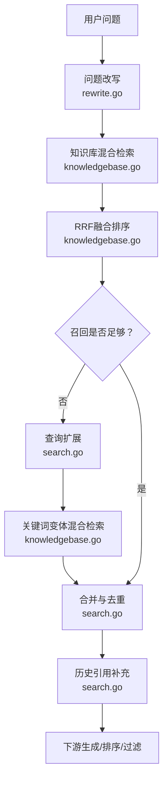
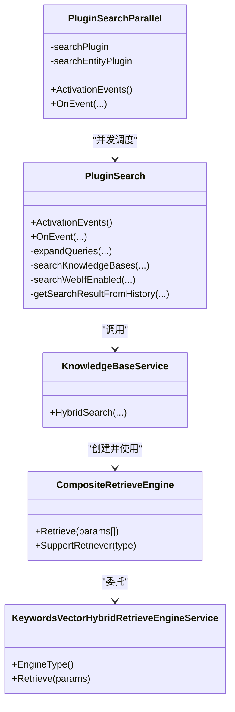
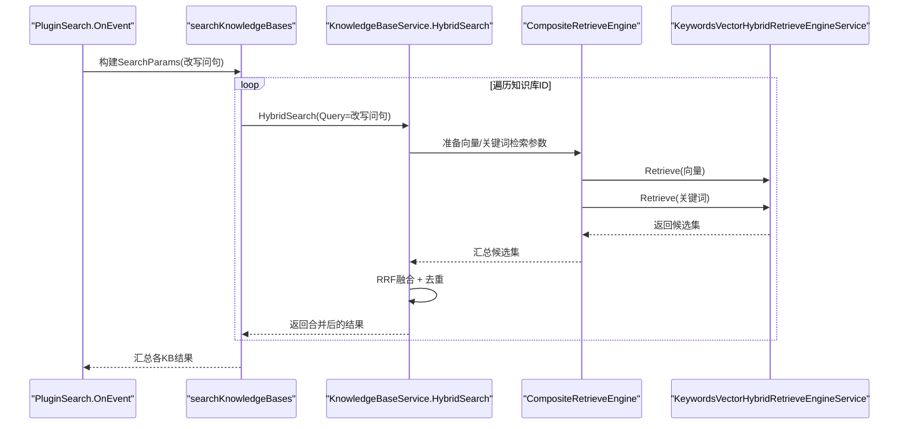
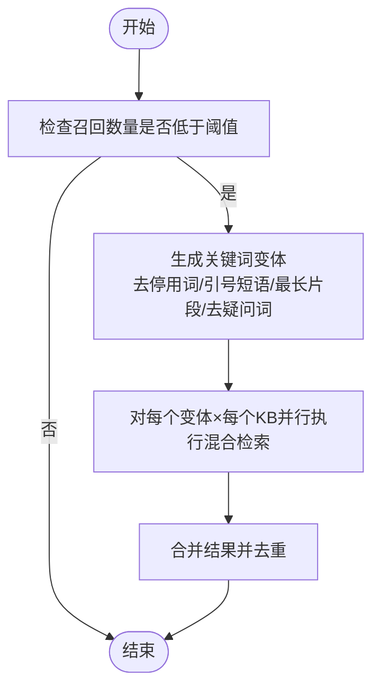
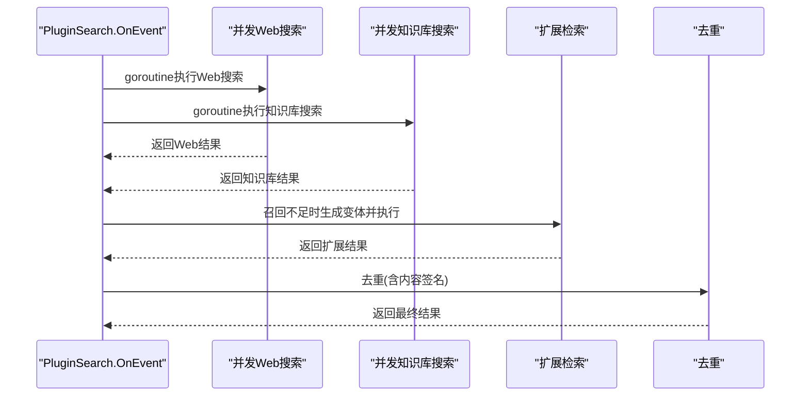
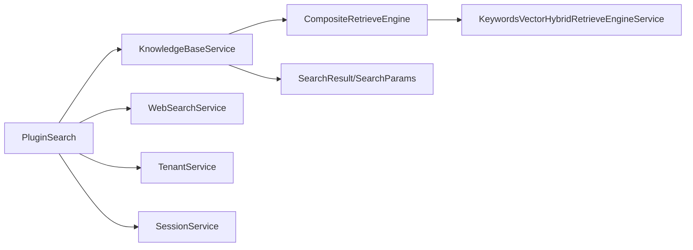

# 混合检索机制

<cite>
**本文引用的文件**
- [docs/Weknora.md](file://docs/Weknora.md)
- [internal/application/service/chat_pipline/search.go](file://internal/application/service/chat_pipline/search.go)
- [internal/application/service/chat_pipline/search_parallel.go](file://internal/application/service/chat_pipline/search_parallel.go)
- [internal/application/service/knowledgebase.go](file://internal/application/service/knowledgebase.go)
- [internal/application/service/retriever/composite.go](file://internal/application/service/retriever/composite.go)
- [internal/application/service/retriever/keywords_vector_hybrid_indexer.go](file://internal/application/service/retriever/keywords_vector_hybrid_indexer.go)
- [internal/types/search.go](file://internal/types/search.go)
- [internal/types/interfaces/retriever.go](file://internal/types/interfaces/retriever.go)
- [internal/agent/tools/knowledge_search.go](file://internal/agent/tools/knowledge_search.go)
- [internal/application/service/chat_pipline/rewrite.go](file://internal/application/service/chat_pipline/rewrite.go)
</cite>

## 目录
1. [简介](#简介)
2. [项目结构](#项目结构)
3. [核心组件](#核心组件)
4. [架构总览](#架构总览)
5. [详细组件分析](#详细组件分析)
6. [依赖关系分析](#依赖关系分析)
7. [性能考量](#性能考量)
8. [故障排查指南](#故障排查指南)
9. [结论](#结论)

## 简介
本文件围绕“混合检索机制”展开，系统性解释为何在WeKnora中执行两次混合搜索以最大化准确性和召回率。文档结合WeKnora.md中的QA说明，阐述第一次搜索使用改写后的完整问句进行深度语义匹配，第二次搜索在召回率不足时通过关键词优化进行广度覆盖；并在代码层面展示search.go中如何并发执行两种检索策略并合并结果，以及HybridSearch如何融合向量与关键词检索并进行RRF融合排序。

## 项目结构
WeKnora的检索链路由“问题改写”“知识库混合检索”“网页检索（可选）”“查询扩展（召回不足时）”“结果去重与历史补充”等环节组成。其中：
- 问题改写：由rewrite插件完成，增强上下文理解，生成更精确的改写问句。
- 知识库混合检索：在knowledgebase服务中执行，同时进行向量检索与关键词检索，并通过RRF融合。
- 查询扩展：在search插件中，当召回不足时，基于改写问句生成关键词变体，再次执行关键词为主的混合检索。
- 并发与合并：search.go与search_parallel.go负责并发调度、结果合并与历史补充。

图表来源
- [internal/application/service/chat_pipline/rewrite.go](file://internal/application/service/chat_pipline/rewrite.go#L1-L239)
- [internal/application/service/knowledgebase.go](file://internal/application/service/knowledgebase.go#L431-L629)
- [internal/application/service/chat_pipline/search.go](file://internal/application/service/chat_pipline/search.go#L131-L206)

章节来源
- [docs/Weknora.md](file://docs/Weknora.md#L199-L233)
- [internal/application/service/chat_pipline/rewrite.go](file://internal/application/service/chat_pipline/rewrite.go#L1-L239)
- [internal/application/service/chat_pipline/search.go](file://internal/application/service/chat_pipline/search.go#L131-L206)
- [internal/application/service/knowledgebase.go](file://internal/application/service/knowledgebase.go#L431-L629)

## 核心组件
- 问题改写插件：基于会话历史与LLM生成更精确的改写问句，为后续检索提供高质量查询文本。
- 知识库混合检索服务：同时执行向量检索与关键词检索，使用RRF融合并去重，输出统一的检索结果。
- 查询扩展插件：在召回不足时，基于改写问句生成关键词变体，再次执行关键词为主的混合检索，扩大召回。
- 并发与合并：search.go与search_parallel.go负责并发执行、结果合并、历史引用补充与错误处理。

章节来源
- [internal/application/service/chat_pipline/rewrite.go](file://internal/application/service/chat_pipline/rewrite.go#L1-L239)
- [internal/application/service/knowledgebase.go](file://internal/application/service/knowledgebase.go#L431-L629)
- [internal/application/service/chat_pipline/search.go](file://internal/application/service/chat_pipline/search.go#L131-L206)
- [internal/application/service/chat_pipline/search_parallel.go](file://internal/application/service/chat_pipline/search_parallel.go#L1-L182)

## 架构总览
WeKnora的检索子系统采用“复合检索引擎 + 混合检索 + RRF融合”的架构：
- 复合检索引擎：根据租户配置聚合多种检索后端（向量/关键词等），统一对外提供检索能力。
- 混合检索：同一查询同时走向量与关键词两条路径，分别产出候选集，再进行RRF融合。
- 查询扩展：在召回不足时，对改写问句做关键词化处理，生成变体，再次执行混合检索。
- 并发控制：使用goroutine与互斥锁，保证结果收集与去重的正确性。

图表来源
- [internal/application/service/chat_pipline/search.go](file://internal/application/service/chat_pipline/search.go#L1-L249)
- [internal/application/service/chat_pipline/search_parallel.go](file://internal/application/service/chat_pipline/search_parallel.go#L1-L182)
- [internal/application/service/knowledgebase.go](file://internal/application/service/knowledgebase.go#L431-L629)
- [internal/application/service/retriever/composite.go](file://internal/application/service/retriever/composite.go#L1-L152)
- [internal/application/service/retriever/keywords_vector_hybrid_indexer.go](file://internal/application/service/retriever/keywords_vector_hybrid_indexer.go#L1-L40)

## 详细组件分析

### 问题改写与预处理
- 作用：基于会话历史与提示模板，将用户原始问题改写为更精确的完整问句，提升语义检索的准确性。
- 关键点：改写后的完整问句作为第一次混合检索的查询文本；同时对改写问句进行分词，得到关键词序列，作为第二次混合检索的查询文本。

章节来源
- [internal/application/service/chat_pipline/rewrite.go](file://internal/application/service/chat_pipline/rewrite.go#L1-L239)
- [docs/Weknora.md](file://docs/Weknora.md#L199-L233)

### 知识库混合检索（第一次）
- 并发执行：对每个知识库ID并行执行一次混合检索，收集结果。
- 检索策略：同时进行向量检索与关键词检索，使用RRF融合，去重后返回。
- 输出：统一的SearchResult列表，包含Score、MatchType等字段，供后续处理。

图表来源
- [internal/application/service/chat_pipline/search.go](file://internal/application/service/chat_pipline/search.go#L311-L359)
- [internal/application/service/knowledgebase.go](file://internal/application/service/knowledgebase.go#L431-L629)
- [internal/application/service/retriever/composite.go](file://internal/application/service/retriever/composite.go#L32-L62)
- [internal/application/service/retriever/keywords_vector_hybrid_indexer.go](file://internal/application/service/retriever/keywords_vector_hybrid_indexer.go#L1-L40)

章节来源
- [internal/application/service/chat_pipline/search.go](file://internal/application/service/chat_pipline/search.go#L311-L359)
- [internal/application/service/knowledgebase.go](file://internal/application/service/knowledgebase.go#L431-L629)

### 查询扩展与第二次混合检索（召回不足时）
- 触发条件：当第一次混合检索结果数量小于阈值（EmbeddingTopK/2）时，启用查询扩展。
- 变体生成：基于改写问句，去除停用词、提取引号短语、最长片段、去除疑问词等，生成关键词变体。
- 检索策略：对每个变体与每个知识库ID并行执行混合检索（关键词为主），收集结果并合并。
- 优化：降低关键词阈值、扩大匹配数量，提升召回。

图表来源
- [internal/application/service/chat_pipline/search.go](file://internal/application/service/chat_pipline/search.go#L131-L206)
- [internal/application/service/chat_pipline/search.go](file://internal/application/service/chat_pipline/search.go#L410-L501)

章节来源
- [internal/application/service/chat_pipline/search.go](file://internal/application/service/chat_pipline/search.go#L131-L206)
- [internal/application/service/chat_pipline/search.go](file://internal/application/service/chat_pipline/search.go#L410-L501)

### 并发执行与结果合并
- 并发策略：使用WaitGroup与互斥锁，避免竞态；对扩展检索使用信号量限制并发作业数。
- 合并策略：基于ID与父ChunkID去重，同时对内容签名去重，减少重复块。
- 历史补充：从最近会话中提取知识引用，补充到最终结果集中。

图表来源
- [internal/application/service/chat_pipline/search.go](file://internal/application/service/chat_pipline/search.go#L83-L121)
- [internal/application/service/chat_pipline/search.go](file://internal/application/service/chat_pipline/search.go#L131-L206)
- [internal/application/service/chat_pipline/search.go](file://internal/application/service/chat_pipline/search.go#L218-L249)

章节来源
- [internal/application/service/chat_pipline/search.go](file://internal/application/service/chat_pipline/search.go#L83-L121)
- [internal/application/service/chat_pipline/search.go](file://internal/application/service/chat_pipline/search.go#L218-L249)

### 并行搜索插件（可选）
- 作用：在存在实体搜索时，与块搜索并行执行，最终合并结果并去重。
- 场景：当存在实体抽取结果时，实体搜索与块搜索并行，提升整体吞吐。

章节来源
- [internal/application/service/chat_pipline/search_parallel.go](file://internal/application/service/chat_pipline/search_parallel.go#L1-L182)

### 混合检索与RRF融合
- 向量检索：生成查询向量，按向量相似度检索。
- 关键词检索：按关键词匹配检索。
- RRF融合：对同一Chunk在向量与关键词两个路径上的排名取倒数和，统一评分并排序，随后去重。

章节来源
- [internal/application/service/knowledgebase.go](file://internal/application/service/knowledgebase.go#L431-L629)

### 查询扩展工具（Agent侧）
- Agent工具同样支持并发混合检索，并在HybridSearch内部使用RRF融合，减少后续重排压力。
- 该工具展示了与服务端一致的混合检索与去重思路，便于理解整体策略。

章节来源
- [internal/agent/tools/knowledge_search.go](file://internal/agent/tools/knowledge_search.go#L250-L465)

## 依赖关系分析
- 插件依赖：PluginSearch依赖KnowledgeBaseService、WebSearchService、TenantService、SessionService。
- 检索引擎：KnowledgeBaseService通过CompositeRetrieveEngine聚合多种检索后端，支持向量与关键词检索。
- 数据结构：SearchResult与SearchParams贯穿检索全链路，承载Score、MatchType、ChunkID等关键字段。

图表来源
- [internal/application/service/chat_pipline/search.go](file://internal/application/service/chat_pipline/search.go#L1-L74)
- [internal/application/service/knowledgebase.go](file://internal/application/service/knowledgebase.go#L431-L629)
- [internal/types/search.go](file://internal/types/search.go#L1-L135)
- [internal/types/interfaces/retriever.go](file://internal/types/interfaces/retriever.go#L1-L123)

章节来源
- [internal/application/service/chat_pipline/search.go](file://internal/application/service/chat_pipline/search.go#L1-L74)
- [internal/application/service/knowledgebase.go](file://internal/application/service/knowledgebase.go#L431-L629)
- [internal/types/search.go](file://internal/types/search.go#L1-L135)
- [internal/types/interfaces/retriever.go](file://internal/types/interfaces/retriever.go#L1-L123)

## 性能考量
- 并发与限流：扩展检索使用信号量限制并发作业数，避免资源争用；WaitGroup保证结果收集的正确性。
- RRF融合：在HybridSearch中统一融合向量与关键词结果，减少下游重排成本。
- 去重策略：基于ChunkID与内容签名去重，降低冗余，提升后续排序与生成效率。
- 召回优化：召回不足时启用关键词变体扩展，提高覆盖面；同时降低关键词阈值与扩大匹配数量，兼顾召回与质量。

章节来源
- [internal/application/service/chat_pipline/search.go](file://internal/application/service/chat_pipline/search.go#L131-L206)
- [internal/application/service/knowledgebase.go](file://internal/application/service/knowledgebase.go#L431-L629)

## 故障排查指南
- 无结果：检查改写问句是否为空、知识库ID是否有效、租户配置是否包含所需检索引擎。
- 召回不足：确认EnableQueryExpansion开关、EmbeddingTopK阈值设置；查看扩展检索是否生成变体并执行。
- 并发异常：关注扩展检索的并发作业数与信号量设置，避免过度并发导致资源瓶颈。
- 去重异常：若出现重复块，检查去重逻辑（ID与内容签名）是否生效。

章节来源
- [internal/application/service/chat_pipline/search.go](file://internal/application/service/chat_pipline/search.go#L131-L206)
- [internal/application/service/chat_pipline/search.go](file://internal/application/service/chat_pipline/search.go#L218-L249)

## 结论
WeKnora通过“两次混合搜索 + 查询扩展”的策略，在保证语义深度的同时扩大召回范围。第一次混合搜索使用改写后的完整问句，强调语义匹配；第二次混合搜索在召回不足时使用关键词变体，强调覆盖面。HybridSearch采用RRF融合与严格去重，确保最终结果的准确性与多样性。search.go与search_parallel.go提供了稳健的并发执行与合并机制，配合CompositeRetrieveEngine与KeywordsVectorHybridRetrieveEngineService，形成高可用、高性能的检索子系统。