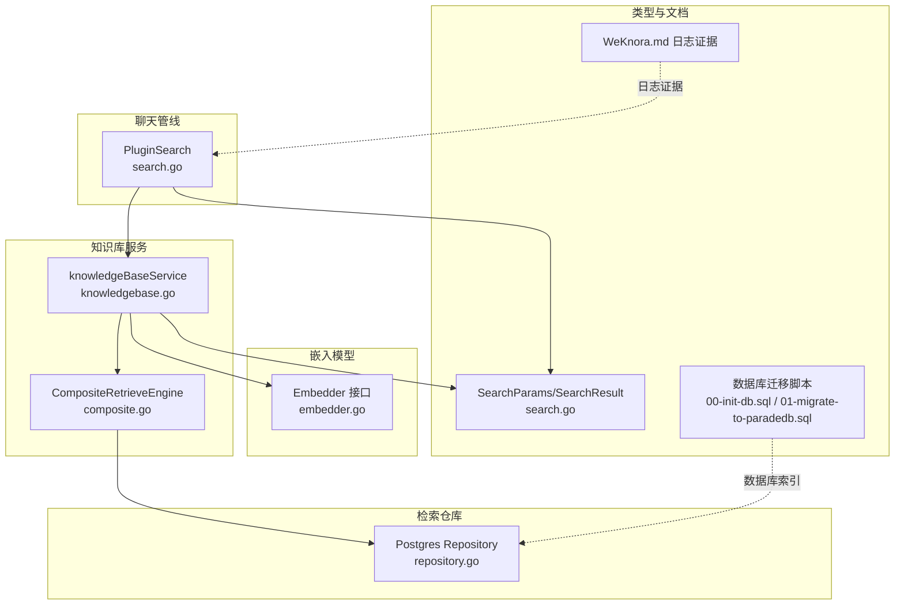
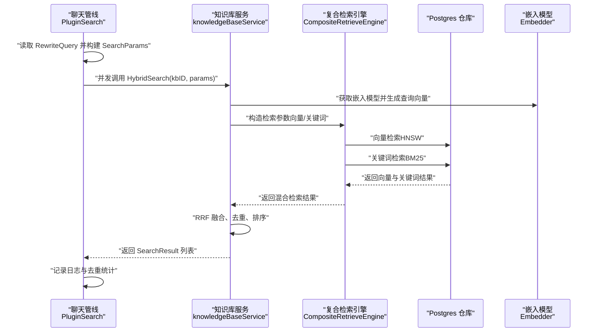
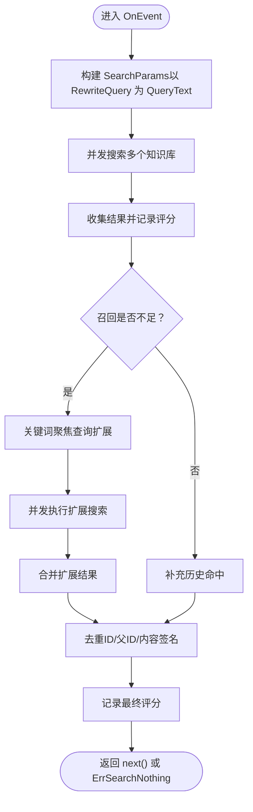
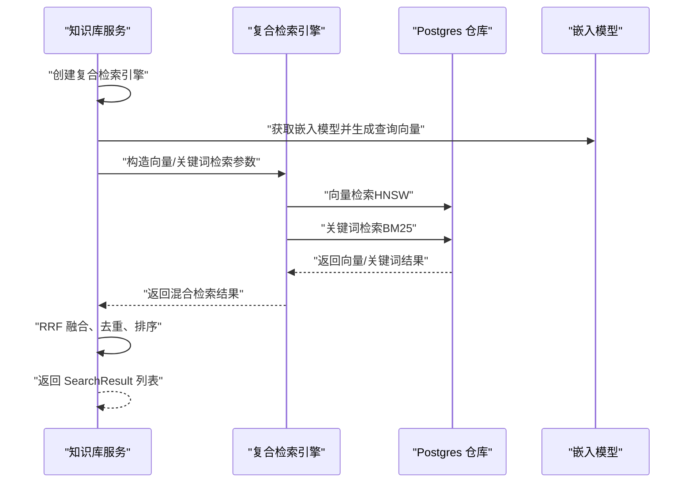
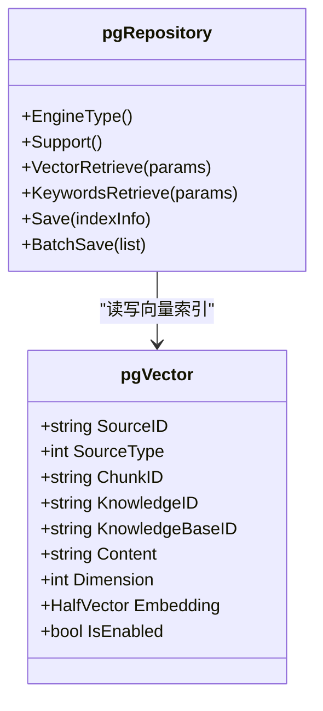
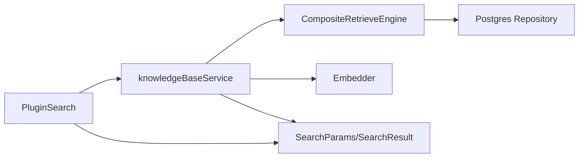

# 第一次混合搜索

<cite>
**本文引用的文件**
- [search.go](file://internal/application/service/chat_pipline/search.go)
- [knowledgebase.go](file://internal/application/service/knowledgebase.go)
- [composite.go](file://internal/application/service/retriever/composite.go)
- [repository.go](file://internal/application/repository/retriever/postgres/repository.go)
- [structs.go](file://internal/application/repository/retriever/postgres/structs.go)
- [embedder.go](file://internal/models/embedding/embedder.go)
- [search.go](file://internal/types/search.go)
- [WeKnora.md](file://docs/Weknora.md)
- [00-init-db.sql](file://migrations/paradedb/00-init-db.sql)
- [01-migrate-to-paradedb.sql](file://migrations/paradedb/01-migrate-to-paradedb.sql)
</cite>

## 目录
1. [简介](#简介)
2. [项目结构](#项目结构)
3. [核心组件](#核心组件)
4. [架构总览](#架构总览)
5. [详细组件分析](#详细组件分析)
6. [依赖关系分析](#依赖关系分析)
7. [性能考量](#性能考量)
8. [故障排查指南](#故障排查指南)
9. [结论](#结论)
10. [附录](#附录)

## 简介
本章节聚焦“第一次混合搜索”，即在聊天管线中作为首个检索阶段的混合检索流程。该阶段以“完整改写句（RewriteQuery）”为查询输入，结合向量检索与关键词检索进行深度语义匹配，旨在最大化召回与准确性。系统通过嵌入模型将自然语言问句转换为向量，并在PostgreSQL等向量数据库中进行相似度搜索；同时，关键词检索使用BM25等算法进行匹配。随后，系统并发执行多个知识库的搜索，并在日志中记录查询文本的具体内容，为后续重排序与合并提供高质量候选集。

## 项目结构
围绕“第一次混合搜索”的关键代码分布在以下模块：
- 聊天管线插件：负责事件编排、并发搜索、查询扩展与结果去重
- 知识库服务：封装混合检索（向量+关键词），执行融合与阈值过滤
- 检索引擎复合体：按检索类型路由到具体仓库（PostgreSQL）
- PostgreSQL仓库：实现向量检索（HNSW索引）与关键词检索（BM25）
- 嵌入模型接口：抽象不同来源的嵌入模型（本地/远程）
- 类型定义：统一搜索参数与结果结构
- 文档与迁移：提供日志证据与数据库索引配置

图表来源
- [search.go](file://internal/application/service/chat_pipline/search.go#L1-L250)
- [knowledgebase.go](file://internal/application/service/knowledgebase.go#L430-L629)
- [composite.go](file://internal/application/service/retriever/composite.go#L1-L120)
- [repository.go](file://internal/application/repository/retriever/postgres/repository.go#L160-L228)
- [embedder.go](file://internal/models/embedding/embedder.go#L1-L77)
- [search.go](file://internal/types/search.go#L1-L135)
- [WeKnora.md](file://docs/Weknora.md#L192-L231)
- [00-init-db.sql](file://migrations/paradedb/00-init-db.sql#L193-L215)
- [01-migrate-to-paradedb.sql](file://migrations/paradedb/01-migrate-to-paradedb.sql#L39-L69)

章节来源
- [search.go](file://internal/application/service/chat_pipline/search.go#L1-L250)
- [knowledgebase.go](file://internal/application/service/knowledgebase.go#L430-L629)
- [composite.go](file://internal/application/service/retriever/composite.go#L1-L120)
- [repository.go](file://internal/application/repository/retriever/postgres/repository.go#L160-L228)
- [embedder.go](file://internal/models/embedding/embedder.go#L1-L77)
- [search.go](file://internal/types/search.go#L1-L135)
- [WeKnora.md](file://docs/Weknora.md#L192-L231)
- [00-init-db.sql](file://migrations/paradedb/00-init-db.sql#L193-L215)
- [01-migrate-to-paradedb.sql](file://migrations/paradedb/01-migrate-to-paradedb.sql#L39-L69)

## 核心组件
- PluginSearch（聊天管线插件）
  - 以 RewriteQuery 为查询输入，构建 SearchParams 并并发搜索多个知识库
  - 记录输入、计划、结果评分、去重前后统计等日志
  - 在召回不足时触发查询扩展（关键词聚焦），并并发执行扩展搜索
- knowledgeBaseService（知识库服务）
  - 构建复合检索引擎，按需启用向量与关键词检索
  - 生成查询向量，调用嵌入模型；执行向量与关键词检索；使用RRF融合结果
  - 输出统一的 SearchResult 列表
- Postgres 仓库
  - 向量检索：基于 pgvector 的 HNSW 索引，使用余弦距离近似
  - 关键词检索：基于 Paradedb 的 BM25 索引，支持中文分词
- 嵌入模型接口
  - 抽象本地/远程嵌入模型，统一 Embed/EmbedBatch 接口
- 类型定义
  - SearchParams：查询文本、阈值、TopK、禁用开关
  - SearchResult：包含 chunk 信息、分数、匹配类型、元数据等

章节来源
- [search.go](file://internal/application/service/chat_pipline/search.go#L311-L359)
- [knowledgebase.go](file://internal/application/service/knowledgebase.go#L431-L629)
- [repository.go](file://internal/application/repository/retriever/postgres/repository.go#L160-L228)
- [embedder.go](file://internal/models/embedding/embedder.go#L1-L77)
- [search.go](file://internal/types/search.go#L1-L135)

## 架构总览
第一次混合搜索在聊天管线中作为核心检索阶段，其流程如下：
- 事件触发：rewrite_query 完成后，进入 chunk_search 事件
- 构建参数：以 RewriteQuery 为 QueryText，设置向量/关键词阈值与 TopK
- 并发搜索：对多个知识库并行执行 HybridSearch
- 混合检索：向量检索（bge-m3 等嵌入模型）+ 关键词检索（BM25）
- 结果融合：向量与关键词结果使用 RRF 融合，去重并排序
- 日志记录：记录输入查询、计划参数、各阶段命中数与最终评分
- 查询扩展：若召回不足，基于关键词聚焦生成变体并再次检索

图表来源
- [search.go](file://internal/application/service/chat_pipline/search.go#L311-L359)
- [knowledgebase.go](file://internal/application/service/knowledgebase.go#L431-L629)
- [composite.go](file://internal/application/service/retriever/composite.go#L1-L120)
- [repository.go](file://internal/application/repository/retriever/postgres/repository.go#L160-L228)
- [embedder.go](file://internal/models/embedding/embedder.go#L1-L77)

## 详细组件分析

### 组件A：PluginSearch（聊天管线插件）
- 作用
  - 以 RewriteQuery 为唯一查询输入，构建 SearchParams 并并发搜索多个知识库
  - 记录输入、计划、结果评分、去重前后统计等日志
  - 在召回不足时触发关键词聚焦的查询扩展，并并发执行扩展搜索
- 关键实现要点
  - 并发搜索多个知识库，使用 WaitGroup 与互斥锁收集结果
  - 记录“输入”“计划”“结果评分（未归一化）”“最终评分”等阶段日志
  - 若当前结果数小于阈值，触发查询扩展，扩大关键词检索范围
  - 历史命中结果补充，去重策略基于 chunk ID 与父 chunk ID，以及内容签名
- 与 WeKnora.md 的日志证据关联
  - 文档中明确展示了“第一次混合搜索（使用改写后的完整问句）”的日志证据，体现以 RewriteQuery 为输入的检索行为

图表来源
- [search.go](file://internal/application/service/chat_pipline/search.go#L83-L249)
- [search.go](file://internal/application/service/chat_pipline/search.go#L311-L359)
- [search.go](file://internal/application/service/chat_pipline/search.go#L131-L206)

章节来源
- [search.go](file://internal/application/service/chat_pipline/search.go#L83-L249)
- [search.go](file://internal/application/service/chat_pipline/search.go#L311-L359)
- [search.go](file://internal/application/service/chat_pipline/search.go#L131-L206)
- [WeKnora.md](file://docs/Weknora.md#L192-L231)

### 组件B：knowledgeBaseService（知识库服务）
- 作用
  - 构建复合检索引擎，按需启用向量与关键词检索
  - 生成查询向量，调用嵌入模型；执行向量与关键词检索；使用 RRF 融合结果
- 关键实现要点
  - 根据租户配置创建复合检索引擎，支持向量与关键词两种检索类型
  - 向量检索：获取嵌入模型，生成查询向量，调用检索引擎
  - 关键词检索：直接使用 QueryText，调用检索引擎
  - RRF 融合：对向量与关键词各自排序后的 chunk，计算 Reciprocal Rank Fusion 分数并排序
  - 去重与阈值：按 chunk ID 去重，按阈值过滤，最终返回 SearchResult 列表

图表来源
- [knowledgebase.go](file://internal/application/service/knowledgebase.go#L431-L629)
- [composite.go](file://internal/application/service/retriever/composite.go#L1-L120)
- [repository.go](file://internal/application/repository/retriever/postgres/repository.go#L160-L228)
- [embedder.go](file://internal/models/embedding/embedder.go#L1-L77)

章节来源
- [knowledgebase.go](file://internal/application/service/knowledgebase.go#L431-L629)
- [composite.go](file://internal/application/service/retriever/composite.go#L1-L120)

### 组件C：Postgres 仓库（向量检索与关键词检索）
- 向量检索（HNSW）
  - 使用 pgvector 的半精度向量类型与 HNSW 索引，按余弦距离近似进行相似度搜索
  - 通过维度过滤与知识库 ID 过滤，避免跨库误匹配
  - 扩展 TopK 获取候选，再按阈值筛选，最后截断至 TopK
- 关键词检索（BM25）
  - 使用 Paradedb 的 bm25 索引，支持中文分词（如 lindera tokenizer）
  - 通过 match(field => 'content', value => ?) 进行匹配，按 score 降序返回
- 数据库索引
  - embeddings 表包含 content、embedding、knowledge_base_id 等字段
  - 为 content 建立 bm25 索引；为 embedding 建立 HNSW 索引（cosine 距离）

图表来源
- [repository.go](file://internal/application/repository/retriever/postgres/repository.go#L1-L228)
- [structs.go](file://internal/application/repository/retriever/postgres/structs.go#L1-L28)
- [00-init-db.sql](file://migrations/paradedb/00-init-db.sql#L193-L215)
- [01-migrate-to-paradedb.sql](file://migrations/paradedb/01-migrate-to-paradedb.sql#L39-L69)

章节来源
- [repository.go](file://internal/application/repository/retriever/postgres/repository.go#L160-L228)
- [structs.go](file://internal/application/repository/retriever/postgres/structs.go#L1-L28)
- [00-init-db.sql](file://migrations/paradedb/00-init-db.sql#L193-L215)
- [01-migrate-to-paradedb.sql](file://migrations/paradedb/01-migrate-to-paradedb.sql#L39-L69)

### 组件D：嵌入模型（bge-m3 等）
- 嵌入模型接口
  - 统一 Embed/EmbedBatch 接口，支持本地（Ollama）与远程（OpenAI）两种来源
  - 提供模型名称、维度、模型 ID 等元信息
- 在第一次混合搜索中的作用
  - 生成查询向量，作为向量检索的输入
  - 与知识库服务协同完成向量检索参数构建

章节来源
- [embedder.go](file://internal/models/embedding/embedder.go#L1-L77)
- [knowledgebase.go](file://internal/application/service/knowledgebase.go#L466-L489)

### 组件E：类型定义（SearchParams 与 SearchResult）
- SearchParams
  - 包含 QueryText、VectorThreshold、KeywordThreshold、MatchCount、禁用开关等
- SearchResult
  - 包含 chunk ID、内容、知识库 ID、分数、匹配类型、元数据等
- 在第一次混合搜索中的作用
  - 作为插件与知识库服务之间的统一数据契约
  - 插件负责填充 QueryText（RewriteQuery）与阈值，知识库服务据此执行检索

章节来源
- [search.go](file://internal/types/search.go#L1-L135)
- [search.go](file://internal/application/service/chat_pipline/search.go#L318-L323)
- [knowledgebase.go](file://internal/application/service/knowledgebase.go#L482-L503)

## 依赖关系分析
- 耦合与内聚
  - PluginSearch 与 knowledgeBaseService 通过 SearchParams/Result 进行解耦
  - knowledgeBaseService 通过复合检索引擎与具体仓库解耦，便于扩展其他向量数据库
  - Postgres 仓库与数据库索引紧密耦合，但对外暴露统一接口
- 外部依赖
  - 嵌入模型：本地 Ollama 或远程 OpenAI
  - 数据库：PostgreSQL + pgvector + Paradedb（BM25）
- 循环依赖
  - 未见循环依赖迹象；插件 -> 服务 -> 引擎 -> 仓库 -> 数据库

图表来源
- [search.go](file://internal/application/service/chat_pipline/search.go#L311-L359)
- [knowledgebase.go](file://internal/application/service/knowledgebase.go#L431-L629)
- [composite.go](file://internal/application/service/retriever/composite.go#L1-L120)
- [repository.go](file://internal/application/repository/retriever/postgres/repository.go#L160-L228)
- [embedder.go](file://internal/models/embedding/embedder.go#L1-L77)
- [search.go](file://internal/types/search.go#L1-L135)

章节来源
- [search.go](file://internal/application/service/chat_pipline/search.go#L311-L359)
- [knowledgebase.go](file://internal/application/service/knowledgebase.go#L431-L629)
- [composite.go](file://internal/application/service/retriever/composite.go#L1-L120)
- [repository.go](file://internal/application/repository/retriever/postgres/repository.go#L160-L228)
- [embedder.go](file://internal/models/embedding/embedder.go#L1-L77)
- [search.go](file://internal/types/search.go#L1-L135)

## 性能考量
- 向量检索
  - HNSW 索引与半精度向量降低存储与计算成本，提升近似相似度搜索性能
  - 通过维度过滤与知识库过滤减少无关扫描
- 关键词检索
  - BM25 索引配合中文分词器，提升中文场景下的召回与相关性
- 并发与限流
  - 插件层对知识库搜索与扩展搜索均采用并发与信号量控制，避免过载
- RRF 融合
  - 通过 Reciprocal Rank Fusion 平衡向量与关键词贡献，提升稳定性
- 去重与阈值
  - 基于 ID/父 ID/内容签名的去重策略，避免重复；阈值过滤减少噪声

[本节为通用指导，无需列出章节来源]

## 故障排查指南
- 常见问题
  - 无结果：检查向量/关键词检索参数是否正确，确认知识库 ID 与启用状态
  - 召回不足：开启查询扩展，调整 KeywordThreshold 与 MatchCount
  - 嵌入模型错误：确认模型来源与维度配置一致
- 日志定位
  - 插件层记录“输入”“计划”“结果评分（未归一化）”“最终评分”“去重摘要”等
  - 知识库服务记录“向量/关键词检索参数”“RRF 融合日志”“无结果”等
- 参考日志证据
  - WeKnora.md 中提供了“第一次混合搜索（使用改写后的完整问句）”的日志证据，可用于核对查询文本与检索行为

章节来源
- [search.go](file://internal/application/service/chat_pipline/search.go#L75-L129)
- [search.go](file://internal/application/service/chat_pipline/search.go#L226-L234)
- [knowledgebase.go](file://internal/application/service/knowledgebase.go#L436-L450)
- [knowledgebase.go](file://internal/application/service/knowledgebase.go#L542-L546)
- [WeKnora.md](file://docs/Weknora.md#L192-L231)

## 结论
第一次混合搜索以 RewriteQuery 为核心输入，结合向量检索与关键词检索，通过嵌入模型与数据库索引实现高效、准确的语义匹配。系统在插件层并发执行多知识库搜索，在知识库服务层完成向量与关键词的 RRF 融合与去重，最终输出高质量候选集。WeKnora.md 的日志证据进一步佐证了该阶段以完整改写句为查询输入的实现细节。该设计既保证了召回广度，又兼顾了语义深度，为后续重排序与生成阶段奠定坚实基础。

[本节为总结性内容，无需列出章节来源]

## 附录
- 查询文本日志证据
  - WeKnora.md 中明确记录了“第一次混合搜索（使用改写后的完整问句）”的日志片段，展示了以 RewriteQuery 为输入的检索行为
- 数据库索引配置
  - embeddings 表的 bm25 与 HNSW 索引配置，支撑关键词与向量检索的高性能实现

章节来源
- [WeKnora.md](file://docs/Weknora.md#L192-L231)
- [00-init-db.sql](file://migrations/paradedb/00-init-db.sql#L193-L215)
- [01-migrate-to-paradedb.sql](file://migrations/paradedb/01-migrate-to-paradedb.sql#L39-L69)