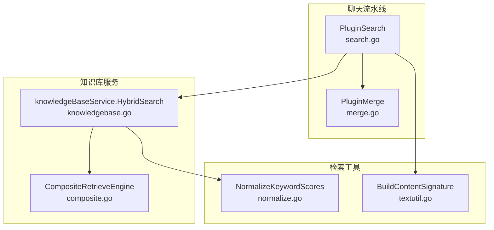
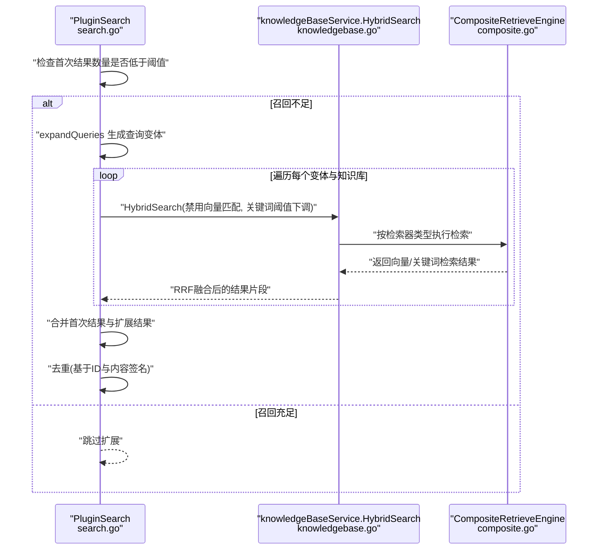
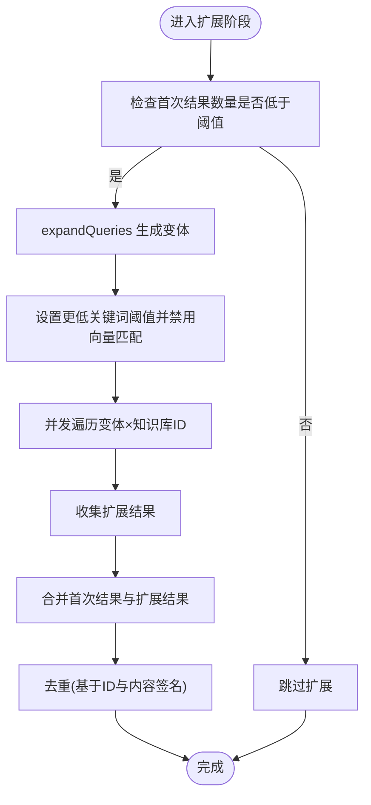
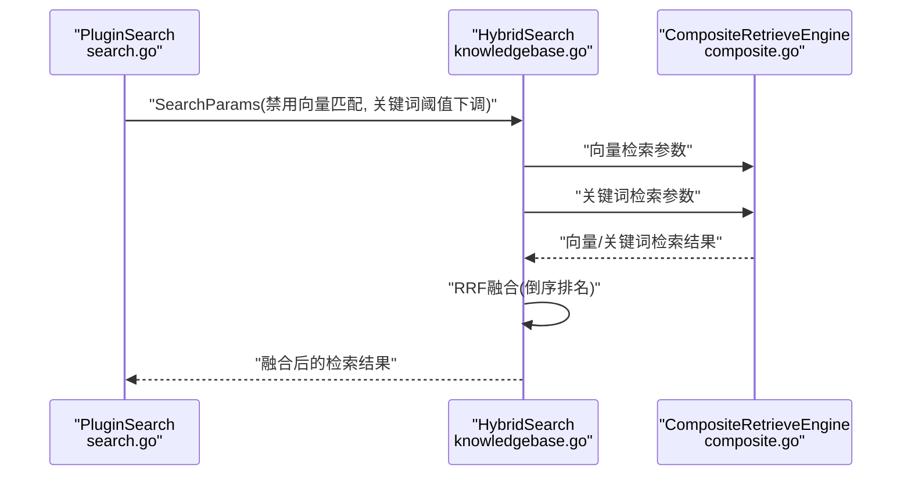
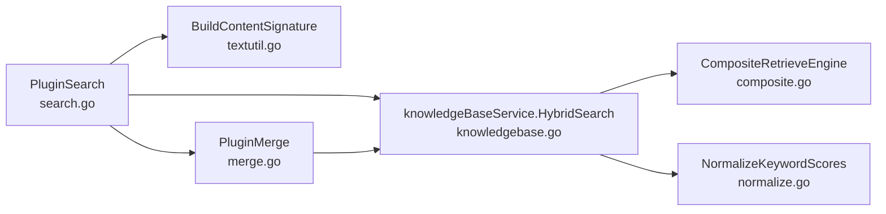

# 第二次混合搜索

<cite>
**本文引用的文件列表**
- [search.go](file://internal/application/service/chat_pipline/search.go)
- [knowledgebase.go](file://internal/application/service/knowledgebase.go)
- [composite.go](file://internal/application/service/retriever/composite.go)
- [search.go](file://internal/types/search.go)
- [textutil.go](file://internal/searchutil/textutil.go)
- [normalize.go](file://internal/searchutil/normalize.go)
- [merge.go](file://internal/application/service/chat_pipline/merge.go)
</cite>

## 目录
1. [引言](#引言)
2. [项目结构](#项目结构)
3. [核心组件](#核心组件)
4. [架构总览](#架构总览)
5. [详细组件分析](#详细组件分析)
6. [依赖关系分析](#依赖关系分析)
7. [性能考量](#性能考量)
8. [故障排查指南](#故障排查指南)
9. [结论](#结论)

## 引言
本文件围绕“第二次混合搜索”展开，系统性阐述其作为查询扩展（Query Expansion）机制的补充作用。当首次混合搜索召回不足时，系统会在关键词检索路径上触发二次扩展：通过本地生成的查询变体（移除停用词、抽取关键短语、拆分长句、去除疑问词等），以更低的关键词阈值并禁用向量匹配的方式，扩大检索广度，从而提升整体召回率。随后将扩展结果与首次结果合并去重，形成最终候选集，供后续重排与合并流程使用。

## 项目结构
与“第二次混合搜索”直接相关的核心代码位于聊天流水线服务与知识库混合检索服务中：
- 聊天流水线搜索插件负责判定召回是否不足、生成查询变体、并发执行扩展检索、合并结果与去重。
- 知识库混合检索服务负责向量与关键词检索的融合（RRF）与阈值过滤。
- 检索工具包提供文本规范化、内容签名去重等辅助能力。
- 合并插件负责最终候选块的合并与上下文扩展。

图表来源
- [search.go](file://internal/application/service/chat_pipline/search.go#L131-L206)
- [knowledgebase.go](file://internal/application/service/knowledgebase.go#L431-L630)
- [composite.go](file://internal/application/service/retriever/composite.go#L1-L120)
- [normalize.go](file://internal/searchutil/normalize.go#L1-L58)
- [textutil.go](file://internal/searchutil/textutil.go#L1-L21)
- [merge.go](file://internal/application/service/chat_pipline/merge.go#L1-L149)

章节来源
- [search.go](file://internal/application/service/chat_pipline/search.go#L1-L249)
- [knowledgebase.go](file://internal/application/service/knowledgebase.go#L431-L630)
- [composite.go](file://internal/application/service/retriever/composite.go#L1-L120)
- [textutil.go](file://internal/searchutil/textutil.go#L1-L21)
- [normalize.go](file://internal/searchutil/normalize.go#L1-L58)
- [merge.go](file://internal/application/service/chat_pipline/merge.go#L1-L149)

## 核心组件
- PluginSearch（聊天流水线搜索插件）
  - 负责首次混合搜索、召回不足检测、查询扩展、并发扩展检索、结果合并与去重。
- knowledgeBaseService.HybridSearch（知识库混合检索）
  - 负责向量检索与关键词检索的参数装配、执行与RRF融合。
- CompositeRetrieveEngine（复合检索引擎）
  - 负责按检索器类型分派到具体检索引擎并聚合结果。
- 检索工具（searchutil）
  - 提供关键词分数归一化与内容签名去重等能力。
- PluginMerge（聊天流水线合并插件）
  - 在重排后对候选块进行分组、排序、合并与上下文扩展。

章节来源
- [search.go](file://internal/application/service/chat_pipline/search.go#L1-L249)
- [knowledgebase.go](file://internal/application/service/knowledgebase.go#L431-L630)
- [composite.go](file://internal/application/service/retriever/composite.go#L1-L120)
- [textutil.go](file://internal/searchutil/textutil.go#L1-L21)
- [normalize.go](file://internal/searchutil/normalize.go#L1-L58)
- [merge.go](file://internal/application/service/chat_pipline/merge.go#L1-L149)

## 架构总览
“第二次混合搜索”在首次混合搜索之后触发，其核心流程如下：
- 首次混合搜索完成后，若命中数量低于阈值，则进入查询扩展阶段。
- 本地生成最多5个查询变体（移除停用词、抽取关键短语、拆分长句、去除疑问词）。
- 使用更低的关键词阈值（降低约20%）并禁用向量匹配，仅进行关键词检索。
- 并发遍历所有知识库ID与查询变体，收集扩展结果。
- 将扩展结果与首次结果合并，并进行去重（基于ID与内容签名）。
- 最终结果进入后续重排与合并流程。

图表来源
- [search.go](file://internal/application/service/chat_pipline/search.go#L131-L206)
- [knowledgebase.go](file://internal/application/service/knowledgebase.go#L431-L630)
- [composite.go](file://internal/application/service/retriever/composite.go#L1-L120)

## 详细组件分析

### 组件A：PluginSearch（聊天流水线搜索插件）
- 召回不足检测
  - 当首次混合搜索结果数量小于 EmbeddingTopK 的一半时，触发查询扩展。
- 查询扩展（expandQueries）
  - 基于分词与正则规则，生成多种查询变体：
    - 移除常见停用词，保留关键词序列。
    - 抽取引号包裹的关键短语。
    - 按标点与空格拆分，选取较长片段。
    - 去除中文常见疑问词前缀。
  - 限制最多5个变体，避免过度膨胀。
- 扩展检索执行
  - 设置更低的关键词阈值（约降低20%），并显式禁用向量匹配。
  - 并发遍历所有知识库ID与查询变体，收集扩展结果。
  - 使用信号量控制并发作业数，避免资源争用。
- 结果合并与去重
  - 将扩展结果追加到首次结果后，进行去重：
    - 基于 chunk ID 与父 chunk ID 的组合键去重。
    - 基于内容签名（MD5）进一步去重，避免重复内容块。

图表来源
- [search.go](file://internal/application/service/chat_pipline/search.go#L131-L206)
- [textutil.go](file://internal/searchutil/textutil.go#L1-L21)

章节来源
- [search.go](file://internal/application/service/chat_pipline/search.go#L131-L206)
- [textutil.go](file://internal/searchutil/textutil.go#L1-L21)

### 组件B：knowledgeBaseService.HybridSearch（知识库混合检索）
- 参数装配
  - 若支持向量检索且未禁用向量匹配，则生成查询向量并加入检索参数。
  - 若支持关键词检索且未禁用关键词匹配，则加入关键词检索参数。
- 执行检索
  - 通过复合检索引擎按检索器类型分别执行，再统一聚合。
- RRF 融合
  - 对向量与关键词检索结果按 RRK=60 进行倒序排名融合，去重后按 RRF 分数降序排序。
- 返回结果
  - 返回融合后的检索结果，供后续流程使用。

图表来源
- [knowledgebase.go](file://internal/application/service/knowledgebase.go#L431-L630)
- [composite.go](file://internal/application/service/retriever/composite.go#L1-L120)

章节来源
- [knowledgebase.go](file://internal/application/service/knowledgebase.go#L431-L630)
- [composite.go](file://internal/application/service/retriever/composite.go#L1-L120)

### 组件C：检索工具（searchutil）
- 内容签名去重
  - 通过构建内容的标准化签名（小写、空白折叠、MD5），用于快速识别重复内容块。
- 关键词分数归一化
  - 对关键词匹配分数进行稳健百分位归一化，保证不同来源的关键词分数在同一尺度上，便于后续融合与排序。

章节来源
- [textutil.go](file://internal/searchutil/textutil.go#L1-L21)
- [normalize.go](file://internal/searchutil/normalize.go#L1-L58)

### 组件D：PluginMerge（聊天流水线合并插件）
- 在重排后对候选块进行分组、排序与合并，提升最终呈现质量。
- 对短文本块进行邻居上下文扩展，增强可读性与完整性。

章节来源
- [merge.go](file://internal/application/service/chat_pipline/merge.go#L1-L149)

## 依赖关系分析
- PluginSearch 依赖：
  - 知识库服务（HybridSearch）执行检索。
  - 检索工具（内容签名去重）进行结果去重。
  - 类型定义（SearchParams、SearchResult）承载检索参数与结果结构。
- HybridSearch 依赖：
  - 复合检索引擎（CompositeRetrieveEngine）按检索器类型分派执行。
  - 检索工具（NormalizeKeywordScores）进行关键词分数归一化。
- PluginMerge 依赖：
  - Chunk 仓库接口获取基础块信息，进行上下文扩展与内容填充。

图表来源
- [search.go](file://internal/application/service/chat_pipline/search.go#L131-L206)
- [knowledgebase.go](file://internal/application/service/knowledgebase.go#L431-L630)
- [composite.go](file://internal/application/service/retriever/composite.go#L1-L120)
- [textutil.go](file://internal/searchutil/textutil.go#L1-L21)
- [normalize.go](file://internal/searchutil/normalize.go#L1-L58)
- [merge.go](file://internal/application/service/chat_pipline/merge.go#L1-L149)

章节来源
- [search.go](file://internal/application/service/chat_pipline/search.go#L131-L206)
- [knowledgebase.go](file://internal/application/service/knowledgebase.go#L431-L630)
- [composite.go](file://internal/application/service/retriever/composite.go#L1-L120)
- [textutil.go](file://internal/searchutil/textutil.go#L1-L21)
- [normalize.go](file://internal/searchutil/normalize.go#L1-L58)
- [merge.go](file://internal/application/service/chat_pipline/merge.go#L1-L149)

## 性能考量
- 并发控制
  - 扩展阶段采用信号量限制并发作业数，避免过多并发导致资源争用与抖动。
- 阈值策略
  - 关键词阈值下调约20%，有助于扩大召回范围，但需结合后续去重与重排避免噪声。
- RRF 融合
  - 向量与关键词结果通过 RRF 融合，兼顾相关性与多样性，减少单一模态偏差。
- 去重成本
  - 基于 ID 与内容签名的双重去重策略，有效降低重复块对下游的影响。

[本节为通用性能讨论，不直接分析具体文件]

## 故障排查指南
- 扩展阶段无结果
  - 检查首次结果数量是否低于阈值，确认 EnableQueryExpansion 是否开启。
  - 查看扩展并发日志，确认变体生成是否成功。
- 扩展结果异常
  - 关注关键词阈值下调与向量匹配禁用是否生效。
  - 检查去重日志，确认是否存在大量重复内容块。
- HybridSearch 执行异常
  - 查看复合检索引擎是否正确分派向量与关键词检索。
  - 检查 RRF 融合过程中的 rank 映射是否正确。
- 合并阶段问题
  - 检查 PluginMerge 的分组与排序逻辑，确认短文本块扩展是否按预期执行。

章节来源
- [search.go](file://internal/application/service/chat_pipline/search.go#L131-L206)
- [knowledgebase.go](file://internal/application/service/knowledgebase.go#L431-L630)
- [merge.go](file://internal/application/service/chat_pipline/merge.go#L1-L149)

## 结论
“第二次混合搜索”通过本地查询扩展与关键词聚焦检索，在首次混合搜索召回不足时显著提升整体召回率。系统在扩展阶段采用更低的关键词阈值与禁用向量匹配，配合并发控制与严格去重策略，确保扩展结果的质量与稳定性。最终将扩展结果与首次结果合并，为后续重排与合并流程提供更丰富的候选集，从而提升最终回答的准确性与覆盖度。