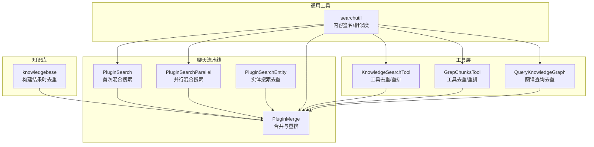
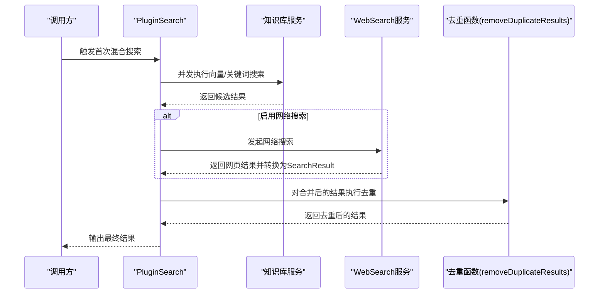
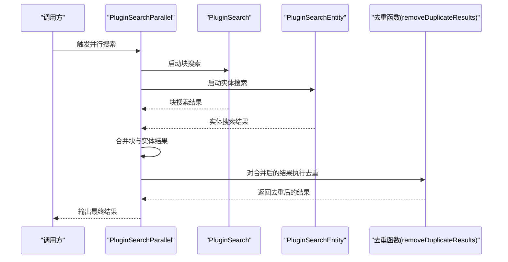
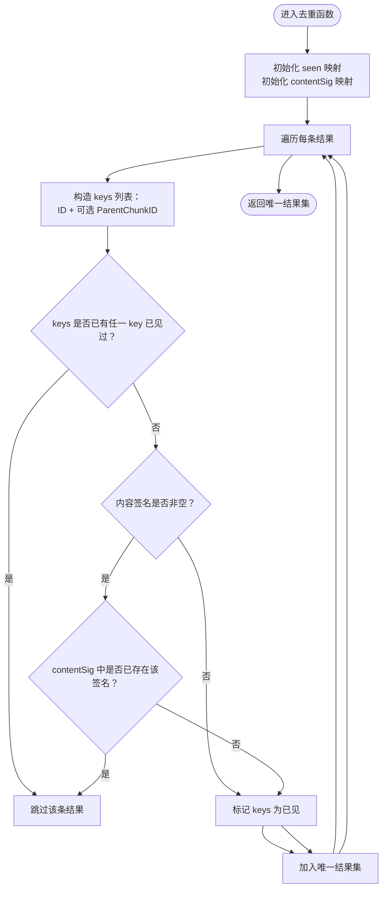
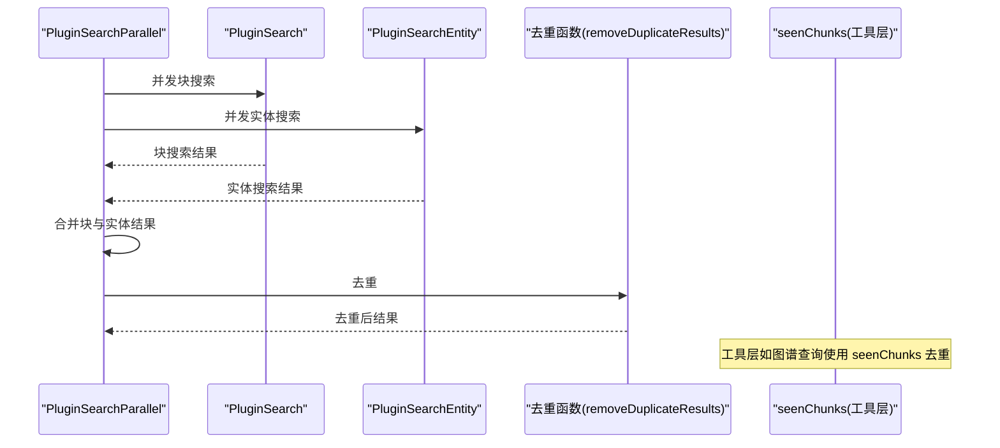
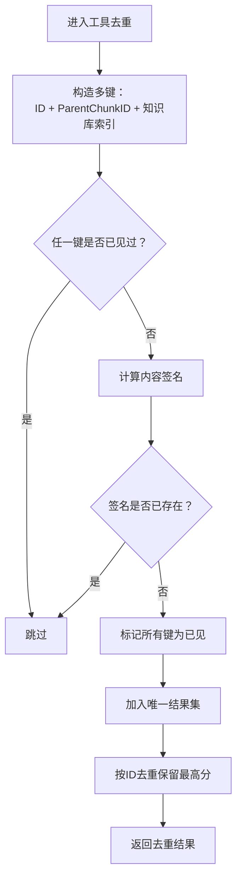
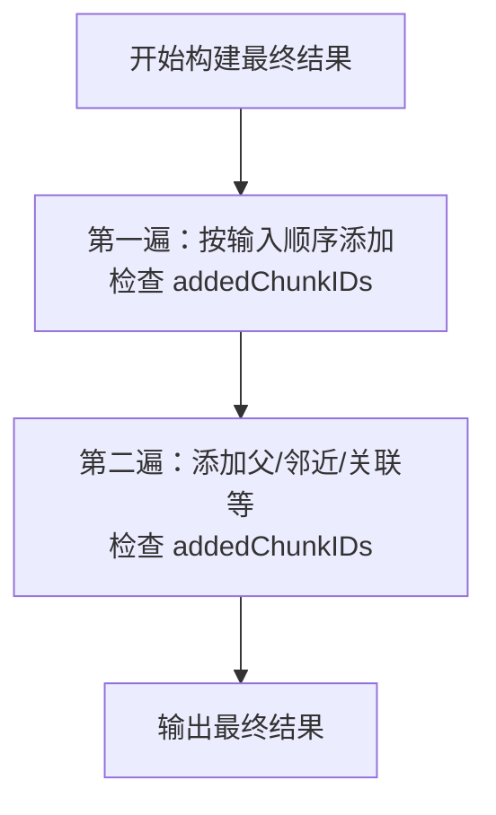
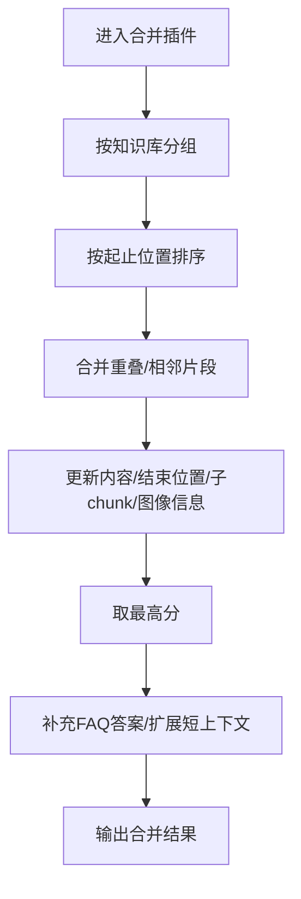
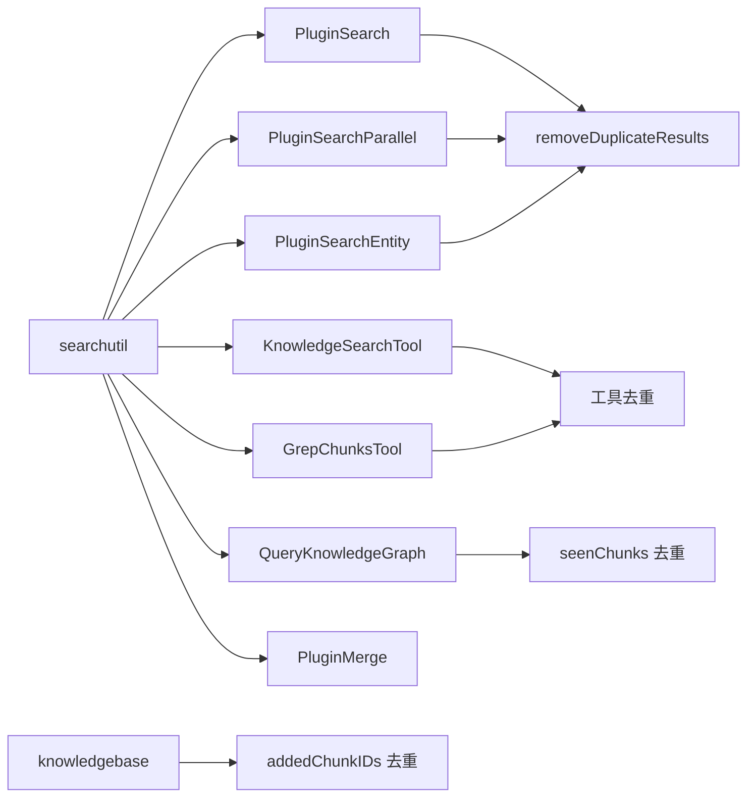

# 结果合并与去重

<cite>
**本文引用的文件**
- [internal/application/service/chat_pipline/search.go](file://internal/application/service/chat_pipline/search.go)
- [internal/application/service/chat_pipline/search_parallel.go](file://internal/application/service/chat_pipline/search_parallel.go)
- [internal/application/service/chat_pipline/merge.go](file://internal/application/service/chat_pipline/merge.go)
- [internal/application/service/chat_pipline/search_entity.go](file://internal/application/service/chat_pipline/search_entity.go)
- [internal/searchutil/textutil.go](file://internal/searchutil/textutil.go)
- [internal/agent/tools/knowledge_search.go](file://internal/agent/tools/knowledge_search.go)
- [internal/agent/tools/grep_chunks.go](file://internal/agent/tools/grep_chunks.go)
- [internal/agent/tools/query_knowledge_graph.go](file://internal/agent/tools/query_knowledge_graph.go)
- [internal/application/service/knowledgebase.go](file://internal/application/service/knowledgebase.go)
</cite>

## 目录
1. [引言](#引言)
2. [项目结构](#项目结构)
3. [核心组件](#核心组件)
4. [架构总览](#架构总览)
5. [详细组件分析](#详细组件分析)
6. [依赖关系分析](#依赖关系分析)
7. [性能考量](#性能考量)
8. [故障排查指南](#故障排查指南)
9. [结论](#结论)

## 引言
本文件聚焦“检索结果合并与去重”机制，系统性说明以下关键点：
- 如何将第一次与第二次混合搜索（如向量/关键词搜索与网络搜索、实体搜索等）的结果进行汇总；
- 在汇总后，通过 removeDuplicateResults 函数执行去重；
- 去重策略包括两类：
  1) 基于唯一ID（ID、ParentChunkID）的精确匹配；
  2) 基于内容签名（buildContentSignature）的语义去重，消除内容相同但ID不同的重复项；
- 在并发搜索场景下，如何通过 seenChunks 映射避免来自不同知识库的同一知识区块被重复添加；
- 强调该流程对保证最终传递给大模型的上下文既全面又简洁的重要性。

## 项目结构
围绕检索与合并的关键模块分布如下：
- 检索与去重主流程：chat_pipline 中的 PluginSearch、PluginSearchParallel、PluginMerge、PluginSearchEntity
- 内容签名与相似度工具：searchutil
- 工具层去重与重排：agent/tools 下的 knowledge_search、grep_chunks
- 知识图谱查询去重：query_knowledge_graph
- 知识库构建结果时的去重：knowledgebase

图表来源
- [internal/application/service/chat_pipline/search.go](file://internal/application/service/chat_pipline/search.go#L83-L120)
- [internal/application/service/chat_pipline/search_parallel.go](file://internal/application/service/chat_pipline/search_parallel.go#L99-L154)
- [internal/application/service/chat_pipline/merge.go](file://internal/application/service/chat_pipline/merge.go#L63-L148)
- [internal/application/service/chat_pipline/search_entity.go](file://internal/application/service/chat_pipline/search_entity.go#L129-L172)
- [internal/agent/tools/knowledge_search.go](file://internal/agent/tools/knowledge_search.go#L260-L359)
- [internal/agent/tools/grep_chunks.go](file://internal/agent/tools/grep_chunks.go#L490-L546)
- [internal/agent/tools/query_knowledge_graph.go](file://internal/agent/tools/query_knowledge_graph.go#L178-L215)
- [internal/searchutil/textutil.go](file://internal/searchutil/textutil.go#L1-L21)
- [internal/application/service/knowledgebase.go](file://internal/application/service/knowledgebase.go#L970-L1023)

章节来源
- [internal/application/service/chat_pipline/search.go](file://internal/application/service/chat_pipline/search.go#L83-L120)
- [internal/application/service/chat_pipline/search_parallel.go](file://internal/application/service/chat_pipline/search_parallel.go#L99-L154)
- [internal/application/service/chat_pipline/merge.go](file://internal/application/service/chat_pipline/merge.go#L63-L148)
- [internal/application/service/chat_pipline/search_entity.go](file://internal/application/service/chat_pipline/search_entity.go#L129-L172)
- [internal/agent/tools/knowledge_search.go](file://internal/agent/tools/knowledge_search.go#L260-L359)
- [internal/agent/tools/grep_chunks.go](file://internal/agent/tools/grep_chunks.go#L490-L546)
- [internal/agent/tools/query_knowledge_graph.go](file://internal/agent/tools/query_knowledge_graph.go#L178-L215)
- [internal/searchutil/textutil.go](file://internal/searchutil/textutil.go#L1-L21)
- [internal/application/service/knowledgebase.go](file://internal/application/service/knowledgebase.go#L970-L1023)

## 核心组件
- PluginSearch：负责首次混合搜索（知识库向量/关键词 + 可选网络搜索），随后统一去重。
- PluginSearchParallel：并行运行“块搜索 + 实体搜索”，再合并并去重。
- PluginMerge：按知识库分组、排序、合并相邻/重叠片段，并补充FAQ答案、扩展短上下文。
- searchutil：提供内容签名（MD5）与词元集合、Jaccard相似度等工具，支撑语义去重与多样性控制。
- KnowledgeSearchTool/GrepChunksTool：工具层的去重与重排，包含基于ID/父ID/知识库索引的多键去重与内容签名去重。
- QueryKnowledgeGraph：跨知识库聚合并去重，避免重复chunk。
- knowledgebase：构建最终结果时，使用 addedChunkIDs 避免重复添加。

章节来源
- [internal/application/service/chat_pipline/search.go](file://internal/application/service/chat_pipline/search.go#L269-L309)
- [internal/application/service/chat_pipline/search_parallel.go](file://internal/application/service/chat_pipline/search_parallel.go#L151-L154)
- [internal/application/service/chat_pipline/merge.go](file://internal/application/service/chat_pipline/merge.go#L63-L148)
- [internal/searchutil/textutil.go](file://internal/searchutil/textutil.go#L1-L21)
- [internal/agent/tools/knowledge_search.go](file://internal/agent/tools/knowledge_search.go#L860-L932)
- [internal/agent/tools/grep_chunks.go](file://internal/agent/tools/grep_chunks.go#L490-L546)
- [internal/agent/tools/query_knowledge_graph.go](file://internal/agent/tools/query_knowledge_graph.go#L178-L215)
- [internal/application/service/knowledgebase.go](file://internal/application/service/knowledgebase.go#L970-L1023)

## 架构总览
下面的序列图展示了“首次混合搜索 + 去重”的典型流程，以及“并行搜索 + 合并 + 去重”的流程。

图表来源
- [internal/application/service/chat_pipline/search.go](file://internal/application/service/chat_pipline/search.go#L83-L120)
- [internal/application/service/chat_pipline/search.go](file://internal/application/service/chat_pipline/search.go#L218-L225)

图表来源
- [internal/application/service/chat_pipline/search_parallel.go](file://internal/application/service/chat_pipline/search_parallel.go#L99-L154)

## 详细组件分析

### 去重函数 removeDuplicateResults 的实现与策略
- 策略一：基于唯一ID的精确匹配
  - 使用 keys 列表包含：r.ID、可选的 "parent:" + ParentChunkID；
  - 一旦任一 key 已存在 seen 中，则跳过该条目。
- 策略二：基于内容签名的语义去重
  - 通过 buildContentSignature 对内容进行标准化处理（小写、去空白、归一化空格），再计算 MD5；
  - 若内容签名已存在 contentSig 中，则视为近似重复，跳过该条目；
  - 仅当签名非空时才参与签名去重。
- 最终将所有 keys 标记为已见，加入唯一结果集。

图表来源
- [internal/application/service/chat_pipline/search.go](file://internal/application/service/chat_pipline/search.go#L269-L309)
- [internal/searchutil/textutil.go](file://internal/searchutil/textutil.go#L1-L21)

章节来源
- [internal/application/service/chat_pipline/search.go](file://internal/application/service/chat_pipline/search.go#L269-L309)
- [internal/searchutil/textutil.go](file://internal/searchutil/textutil.go#L1-L21)

### 并发搜索中的去重：seenChunks 映射
- 在 PluginSearchParallel 中，先分别执行块搜索与实体搜索，再将两者结果合并；
- 合并后再次调用 removeDuplicateResults 进行去重，确保来自不同子任务的重复结果被剔除。
- 在工具层（如 QueryKnowledgeGraph）中，使用 seenChunks map 以 chunk ID 为键，只保留首次出现的条目，从而避免跨知识库重复。

图表来源
- [internal/application/service/chat_pipline/search_parallel.go](file://internal/application/service/chat_pipline/search_parallel.go#L99-L154)
- [internal/agent/tools/query_knowledge_graph.go](file://internal/agent/tools/query_knowledge_graph.go#L178-L215)

章节来源
- [internal/application/service/chat_pipline/search_parallel.go](file://internal/application/service/chat_pipline/search_parallel.go#L99-L154)
- [internal/agent/tools/query_knowledge_graph.go](file://internal/agent/tools/query_knowledge_graph.go#L178-L215)

### 工具层去重：KnowledgeSearchTool 与 GrepChunksTool
- 多键去重：ID、ParentChunkID、知识库ID+索引（kb:knowledgeID#chunkIndex）
- 内容签名去重：与全局去重一致，使用 searchutil.BuildContentSignature
- 额外优化：若同一ID出现多次但分数不同，保留更高分数的条目，减少后续重排成本

图表来源
- [internal/agent/tools/knowledge_search.go](file://internal/agent/tools/knowledge_search.go#L860-L932)
- [internal/agent/tools/grep_chunks.go](file://internal/agent/tools/grep_chunks.go#L490-L546)
- [internal/searchutil/textutil.go](file://internal/searchutil/textutil.go#L1-L21)

章节来源
- [internal/agent/tools/knowledge_search.go](file://internal/agent/tools/knowledge_search.go#L860-L932)
- [internal/agent/tools/grep_chunks.go](file://internal/agent/tools/grep_chunks.go#L490-L546)
- [internal/searchutil/textutil.go](file://internal/searchutil/textutil.go#L1-L21)

### 知识库构建阶段的去重：addedChunkIDs
- 在构建最终结果时，使用 addedChunkIDs 哈希表避免重复添加同一 chunk；
- 先按输入顺序第一遍添加，再第二遍添加父/邻近/关联等额外 chunk，同时检查是否已添加。

图表来源
- [internal/application/service/knowledgebase.go](file://internal/application/service/knowledgebase.go#L970-L1023)

章节来源
- [internal/application/service/knowledgebase.go](file://internal/application/service/knowledgebase.go#L970-L1023)

### 合并与重排：PluginMerge
- 按知识库分组，按原文位置排序；
- 合并重叠/相邻片段，更新内容、结束位置、子chunk列表与图像信息；
- 保留最高分；
- 补充FAQ答案、扩展短上下文（前后邻接chunk）。

图表来源
- [internal/application/service/chat_pipline/merge.go](file://internal/application/service/chat_pipline/merge.go#L63-L148)

章节来源
- [internal/application/service/chat_pipline/merge.go](file://internal/application/service/chat_pipline/merge.go#L63-L148)

## 依赖关系分析
- 去重依赖 searchutil 的内容签名与相似度工具：
  - BuildContentSignature：标准化内容并生成 MD5 签名；
  - TokenizeSimple/Jaccard：用于工具层的 MMR 与相似度计算。
- PluginSearch/PluginSearchParallel 调用 removeDuplicateResults；
- PluginSearchEntity 在实体搜索后也调用 removeDuplicateResults；
- 工具层（KnowledgeSearchTool/GrepChunksTool）自定义去重逻辑；
- QueryKnowledgeGraph 使用 seenChunks 去重；
- knowledgebase 使用 addedChunkIDs 去重。

图表来源
- [internal/searchutil/textutil.go](file://internal/searchutil/textutil.go#L1-L21)
- [internal/application/service/chat_pipline/search.go](file://internal/application/service/chat_pipline/search.go#L269-L309)
- [internal/application/service/chat_pipline/search_parallel.go](file://internal/application/service/chat_pipline/search_parallel.go#L151-L154)
- [internal/application/service/chat_pipline/search_entity.go](file://internal/application/service/chat_pipline/search_entity.go#L129-L172)
- [internal/agent/tools/knowledge_search.go](file://internal/agent/tools/knowledge_search.go#L860-L932)
- [internal/agent/tools/grep_chunks.go](file://internal/agent/tools/grep_chunks.go#L490-L546)
- [internal/agent/tools/query_knowledge_graph.go](file://internal/agent/tools/query_knowledge_graph.go#L178-L215)
- [internal/application/service/knowledgebase.go](file://internal/application/service/knowledgebase.go#L970-L1023)

章节来源
- [internal/searchutil/textutil.go](file://internal/searchutil/textutil.go#L1-L21)
- [internal/application/service/chat_pipline/search.go](file://internal/application/service/chat_pipline/search.go#L269-L309)
- [internal/application/service/chat_pipline/search_parallel.go](file://internal/application/service/chat_pipline/search_parallel.go#L151-L154)
- [internal/application/service/chat_pipline/search_entity.go](file://internal/application/service/chat_pipline/search_entity.go#L129-L172)
- [internal/agent/tools/knowledge_search.go](file://internal/agent/tools/knowledge_search.go#L860-L932)
- [internal/agent/tools/grep_chunks.go](file://internal/agent/tools/grep_chunks.go#L490-L546)
- [internal/agent/tools/query_knowledge_graph.go](file://internal/agent/tools/query_knowledge_graph.go#L178-L215)
- [internal/application/service/knowledgebase.go](file://internal/application/service/knowledgebase.go#L970-L1023)

## 性能考量
- 去重复杂度
  - removeDuplicateResults：O(N)，N 为候选数量；哈希表查找与插入均为平均 O(1)。
  - 工具层去重：同样为 O(N)，但多键构造与内容签名计算带来常数开销。
- 并发与锁
  - PluginSearch/PluginSearchParallel 使用互斥锁保护共享结果切片的追加，避免竞态；
  - 去重阶段不再并发访问，降低锁竞争。
- 内容签名
  - 标准化处理（小写、去空白、归一化空格）后计算 MD5，代价较低；
  - 对于长文本，建议在上游阶段控制内容长度，避免不必要的签名计算。
- 合并阶段
  - 合并重叠片段与扩展短上下文会增加字符串拼接与JSON解析成本，应结合 TopK 与阈值控制候选规模。

[本节为通用指导，不直接分析具体文件]

## 故障排查指南
- 去重后结果异常少
  - 检查是否误用内容签名导致正常重复被误删；
  - 确认 ParentChunkID 是否正确传入，避免因父ID缺失导致的误判。
- 并发搜索结果重复
  - 确认 PluginSearchParallel 合并后确实调用了去重；
  - 工具层（如 QueryKnowledgeGraph）需确保 seenChunks 的键设计合理（以 chunk ID 为主）。
- 合并后上下文不完整
  - 检查 PluginMerge 的扩展短上下文逻辑是否生效；
  - 确认邻接 chunk 的关联字段（PreChunkID/NextChunkID）正确。

章节来源
- [internal/application/service/chat_pipline/search_parallel.go](file://internal/application/service/chat_pipline/search_parallel.go#L151-L154)
- [internal/application/service/chat_pipline/merge.go](file://internal/application/service/chat_pipline/merge.go#L342-L585)
- [internal/agent/tools/query_knowledge_graph.go](file://internal/agent/tools/query_knowledge_graph.go#L178-L215)

## 结论
通过“首次/并行混合搜索 + 统一去重 + 合并与重排”的流水线，系统在保证覆盖面的同时有效避免了重复与冗余。去重策略兼顾精确匹配与语义相似，既能处理同一知识库内的重复，也能识别内容相同但ID不同的近似重复；在并发场景下，通过 seenChunks 与互斥锁配合，确保跨来源的重复被可靠剔除。最终经 PluginMerge 合并与扩展，形成既全面又简洁的上下文，为后续大模型推理提供高质量输入。