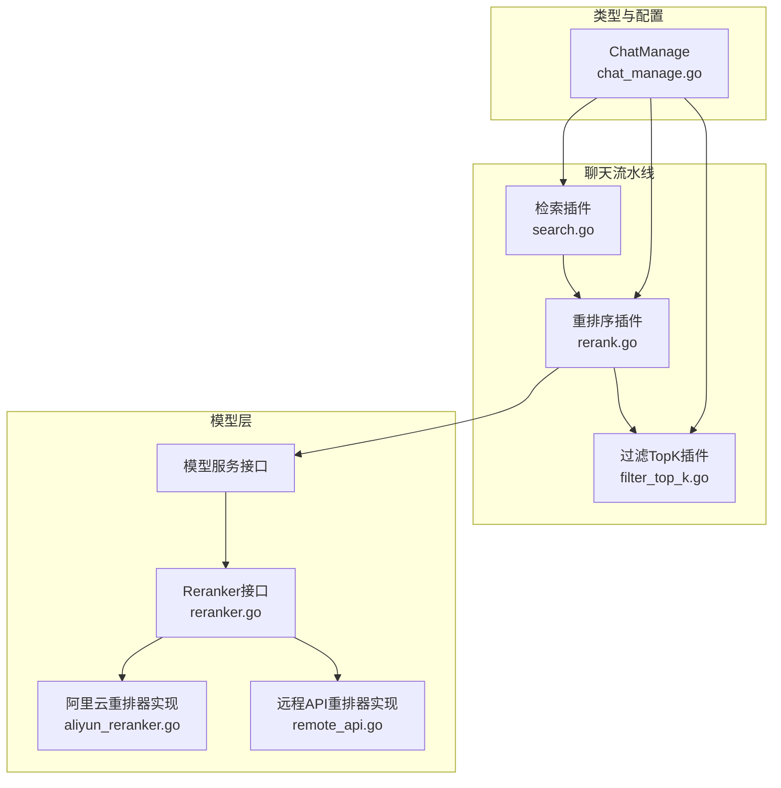
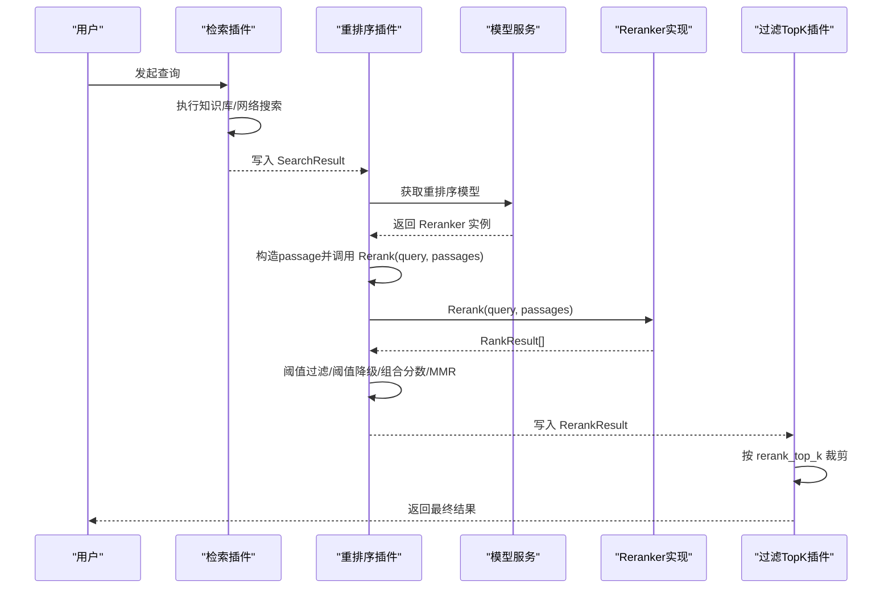
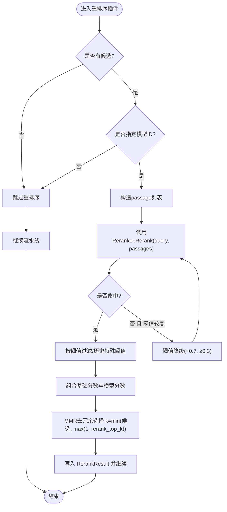
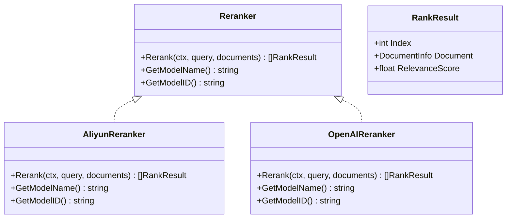
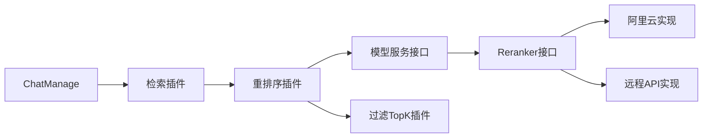

# 结果重排序

<cite>
**本文引用的文件列表**
- [rerank.go](file://internal/application/service/chat_pipline/rerank.go)
- [reranker.go](file://internal/models/rerank/reranker.go)
- [aliyun_reranker.go](file://internal/models/rerank/aliyun_reranker.go)
- [remote_api.go](file://internal/models/rerank/remote_api.go)
- [chat_manage.go](file://internal/types/chat_manage.go)
- [search.go](file://internal/application/service/chat_pipline/search.go)
- [filter_top_k.go](file://internal/application/service/chat_pipline/filter_top_k.go)
- [AgentSettings.vue](file://frontend/src/views/settings/AgentSettings.vue)
- [index.ts](file://frontend/src/api/initialization/index.ts)
- [WeKnora.md](file://docs/WeKnora.md)
</cite>

## 目录
1. [简介](#简介)
2. [项目结构](#项目结构)
3. [核心组件](#核心组件)
4. [架构总览](#架构总览)
5. [详细组件分析](#详细组件分析)
6. [依赖关系分析](#依赖关系分析)
7. [性能与精度权衡](#性能与精度权衡)
8. [故障排查指南](#故障排查指南)
9. [结论](#结论)
10. [附录](#附录)

## 简介
本文件围绕结果重排序功能展开，重点解释以下配置项的作用与影响：
- enable_rerank：是否启用重排序（前端界面中存在该开关，用于控制是否对检索结果进行二次排序）
- rerank_threshold：重排序后结果的最低相关性阈值，低于阈值的片段会被过滤掉
- rerank_top_k：最终输出的重排序候选集合大小，决定最终展示与引用的片段数量

文档将结合代码中的重排序实现，说明重排序在检索流程中的位置、调用方式、阈值降级策略、MMR去冗余选择，以及如何通过专用重排序模型提升最终结果的相关性。同时给出性能与精度的权衡建议及模型选择指引。

## 项目结构
重排序功能位于聊天流水线的“重排序插件”中，上游由“检索插件”产出候选结果，下游由“过滤TopK插件”裁剪最终输出。重排序插件负责：
- 从模型服务获取指定的重排序模型
- 构造重排序输入（合并内容、图像描述、OCR文本、问题增强等）
- 调用重排序模型，得到相关性分数
- 应用阈值过滤与历史匹配特殊阈值
- 组合基础分数与模型分数，再进行MMR去冗余
- 输出最终重排序结果

图表来源
- [search.go](file://internal/application/service/chat_pipline/search.go#L1-L200)
- [rerank.go](file://internal/application/service/chat_pipline/rerank.go#L1-L380)
- [filter_top_k.go](file://internal/application/service/chat_pipline/filter_top_k.go#L37-L66)
- [reranker.go](file://internal/models/rerank/reranker.go#L1-L100)
- [aliyun_reranker.go](file://internal/models/rerank/aliyun_reranker.go#L1-L165)
- [remote_api.go](file://internal/models/rerank/remote_api.go#L1-L122)
- [chat_manage.go](file://internal/types/chat_manage.go#L4-L50)

章节来源
- [search.go](file://internal/application/service/chat_pipline/search.go#L1-L200)
- [rerank.go](file://internal/application/service/chat_pipline/rerank.go#L1-L380)
- [filter_top_k.go](file://internal/application/service/chat_pipline/filter_top_k.go#L37-L66)
- [reranker.go](file://internal/models/rerank/reranker.go#L1-L100)
- [aliyun_reranker.go](file://internal/models/rerank/aliyun_reranker.go#L1-L165)
- [remote_api.go](file://internal/models/rerank/remote_api.go#L1-L122)
- [chat_manage.go](file://internal/types/chat_manage.go#L4-L50)

## 核心组件
- 重排序插件（PluginRerank）
  - 负责在聊天流水线中监听“重排序”事件，拉取重排序模型，准备候选文本，调用模型，应用阈值过滤与阈值降级，组合分数并进行MMR去冗余，最终写回重排序结果。
- Reranker接口与实现
  - 定义统一的重排序接口；提供阿里云与远程API两种实现，支持不同厂商的重排序服务。
- ChatManage配置
  - 包含rerank_model_id、rerank_top_k、rerank_threshold等关键字段，驱动重排序行为。

章节来源
- [rerank.go](file://internal/application/service/chat_pipline/rerank.go#L1-L380)
- [reranker.go](file://internal/models/rerank/reranker.go#L1-L100)
- [aliyun_reranker.go](file://internal/models/rerank/aliyun_reranker.go#L1-L165)
- [remote_api.go](file://internal/models/rerank/remote_api.go#L1-L122)
- [chat_manage.go](file://internal/types/chat_manage.go#L4-L50)

## 架构总览
重排序在检索流程中的位置如下：
- 检索阶段：产生初步候选（可能来自知识库与网络搜索），写入ChatManage.SearchResult
- 重排序阶段：读取SearchResult，构造passage，调用Reranker，得到RankResult，按阈值过滤，组合分数，MMR去冗余，写入ChatManage.RerankResult
- 过滤TopK阶段：依据rerank_top_k裁剪最终输出

图表来源
- [search.go](file://internal/application/service/chat_pipline/search.go#L54-L120)
- [rerank.go](file://internal/application/service/chat_pipline/rerank.go#L35-L175)
- [filter_top_k.go](file://internal/application/service/chat_pipline/filter_top_k.go#L37-L66)

## 详细组件分析

### 重排序插件（PluginRerank）
- 输入与前置条件
  - 若无候选或未指定模型ID，则跳过重排序
- 候选文本构造
  - 合并Content、ImageInfo（解析JSON后提取caption/OCR）、ChunkMetadata中的GeneratedQuestions，形成最终passage
- 单次重排序调用
  - 使用RewriteQuery作为查询，传入全部passage，调用Reranker.Rerank
- 阈值降级策略
  - 若第一次调用后无命中且原始阈值较高（>0.3），则降低阈值（乘以0.7，不低于0.3），再次调用，然后恢复原阈值
- 阈值过滤与历史匹配特殊处理
  - 使用rerank_threshold过滤；若匹配类型为历史，则对阈值做小幅上调（最大至0.5）
- 分数组合与日志
  - 保留基础分数，组合模型分数与基础分数，记录组合过程与前若干高分片段
- MMR去冗余
  - 对重排序后的候选集，预计算token集合，按lambda=0.7进行MMR选择，选取k=min(候选数, max(1, rerank_top_k))个片段
- 输出
  - 将最终结果写入ChatManage.RerankResult；若为空则返回“无结果”错误

图表来源
- [rerank.go](file://internal/application/service/chat_pipline/rerank.go#L35-L175)
- [rerank.go](file://internal/application/service/chat_pipline/rerank.go#L176-L240)
- [rerank.go](file://internal/application/service/chat_pipline/rerank.go#L240-L380)

章节来源
- [rerank.go](file://internal/application/service/chat_pipline/rerank.go#L35-L175)
- [rerank.go](file://internal/application/service/chat_pipline/rerank.go#L176-L240)
- [rerank.go](file://internal/application/service/chat_pipline/rerank.go#L240-L380)

### Reranker接口与实现
- 接口定义
  - Reranker接口提供Rerank(ctx, query, documents)返回[]RankResult，以及GetModelName/GetModelID
- RankResult
  - 包含Index、Document、RelevanceScore；支持反序列化兼容“relevance_score”或“score”
- 实现
  - 阿里云重排器：调用DashScope文本重排服务，参数包含TopN与是否返回文档
  - 远程API重排器：通过HTTP POST调用外部重排服务，支持OpenAI风格的请求格式

图表来源
- [reranker.go](file://internal/models/rerank/reranker.go#L1-L100)
- [aliyun_reranker.go](file://internal/models/rerank/aliyun_reranker.go#L1-L165)
- [remote_api.go](file://internal/models/rerank/remote_api.go#L1-L122)

章节来源
- [reranker.go](file://internal/models/rerank/reranker.go#L1-L100)
- [aliyun_reranker.go](file://internal/models/rerank/aliyun_reranker.go#L1-L165)
- [remote_api.go](file://internal/models/rerank/remote_api.go#L1-L122)

### ChatManage配置与重排序参数
- 关键字段
  - rerank_model_id：重排序模型ID
  - rerank_top_k：重排序后输出的TopK数量
  - rerank_threshold：重排序后结果的最低阈值
- 其他相关字段
  - rewrite_query：重写后的查询，用于重排序
  - embedding_top_k、vector_threshold、keyword_threshold：上游检索参数，间接影响重排序候选规模

章节来源
- [chat_manage.go](file://internal/types/chat_manage.go#L4-L50)

### 重排序在检索流程中的位置
- 检索插件完成知识库与网络搜索，写入SearchResult
- 重排序插件在收到“重排序”事件后，从模型服务获取Reranker，调用Rerank，应用阈值与MMR，写入RerankResult
- 过滤TopK插件依据rerank_top_k裁剪最终输出

章节来源
- [search.go](file://internal/application/service/chat_pipline/search.go#L54-L120)
- [rerank.go](file://internal/application/service/chat_pipline/rerank.go#L35-L175)
- [filter_top_k.go](file://internal/application/service/chat_pipline/filter_top_k.go#L37-L66)

### 前端配置与交互
- 前端提供rerank_model_id、rerank_top_k、rerank_threshold的设置入口，并支持保存
- 提供rerank模型可用性检测接口，便于在设置页面校验模型连通性

章节来源
- [AgentSettings.vue](file://frontend/src/views/settings/AgentSettings.vue#L465-L496)
- [AgentSettings.vue](file://frontend/src/views/settings/AgentSettings.vue#L1728-L1765)
- [index.ts](file://frontend/src/api/initialization/index.ts#L295-L313)

## 依赖关系分析
- 重排序插件依赖模型服务接口获取具体Reranker实现
- Reranker实现依赖外部服务（阿里云或远程API），通过HTTP请求与响应
- ChatManage承载重排序所需的所有配置与中间状态
- 过滤TopK插件在重排序之后统一裁剪最终输出

图表来源
- [chat_manage.go](file://internal/types/chat_manage.go#L4-L50)
- [search.go](file://internal/application/service/chat_pipline/search.go#L54-L120)
- [rerank.go](file://internal/application/service/chat_pipline/rerank.go#L35-L175)
- [filter_top_k.go](file://internal/application/service/chat_pipline/filter_top_k.go#L37-L66)
- [reranker.go](file://internal/models/rerank/reranker.go#L1-L100)
- [aliyun_reranker.go](file://internal/models/rerank/aliyun_reranker.go#L1-L165)
- [remote_api.go](file://internal/models/rerank/remote_api.go#L1-L122)

## 性能与精度权衡
- rerank_top_k
  - 影响最终输出数量与下游LLM引用长度，增大TopK可提升召回但增加推理成本与上下文开销
  - 建议：先以较小TopK（如3~5）观察效果，逐步增大
- rerank_threshold
  - 控制重排序后结果的最低相关性门槛，提高阈值可提升精度但可能漏召回
  - 建议：默认从0.5开始，结合业务反馈调整；对历史匹配可适当放宽
- 阈值降级
  - 当首次重排序无命中且阈值较高时自动降级，有助于在低召回场景下仍获得少量高质量片段
- MMR去冗余
  - 通过预计算token集合与Jaccard相似度，减少重复信息，提升多样性与可读性
- 模型选择
  - 文档提供了三种重排器类型的对比与建议，建议优先采用成熟的交叉编码器（Normal Reranker），在资源充足时再尝试基于LLM的重排器

章节来源
- [rerank.go](file://internal/application/service/chat_pipline/rerank.go#L80-L120)
- [rerank.go](file://internal/application/service/chat_pipline/rerank.go#L176-L240)
- [WeKnora.md](file://docs/WeKnora.md#L234-L299)

## 故障排查指南
- 无候选或模型ID为空
  - 插件会跳过重排序并记录原因；检查上游检索是否正常、是否正确设置rerank_model_id
- 模型调用失败
  - 记录错误信息与查询变体；检查模型服务连通性、鉴权与请求格式
- 重排序后无结果
  - 可能触发阈值降级；若仍无结果，建议降低rerank_threshold或增大rerank_top_k
- 历史匹配阈值
  - 历史匹配类型会提高阈值，若历史片段过多导致整体命中率下降，可适当调整阈值或优化历史策略

章节来源
- [rerank.go](file://internal/application/service/chat_pipline/rerank.go#L35-L120)
- [rerank.go](file://internal/application/service/chat_pipline/rerank.go#L160-L205)

## 结论
重排序通过专用模型对初步检索结果进行精细化排序，结合阈值过滤与MMR去冗余，有效提升最终结果的相关性与可读性。合理设置rerank_top_k与rerank_threshold，并选择合适的重排序模型，可在精度与性能之间取得良好平衡。前端提供的配置入口与可用性检测接口，使得重排序参数的调试与优化更加便捷。

## 附录

### 配置项说明与建议
- enable_rerank
  - 前端存在该开关，用于控制是否启用重排序；建议在生产环境默认开启，仅在特定场景关闭
- rerank_threshold
  - 建议从0.5起步，结合业务反馈微调；历史匹配类型可适度放宽
- rerank_top_k
  - 建议从3~5开始，逐步增大以观察效果；注意推理成本与上下文长度限制

章节来源
- [AgentSettings.vue](file://frontend/src/views/settings/AgentSettings.vue#L465-L496)
- [AgentSettings.vue](file://frontend/src/views/settings/AgentSettings.vue#L1728-L1765)
- [WeKnora.md](file://docs/WeKnora.md#L234-L299)