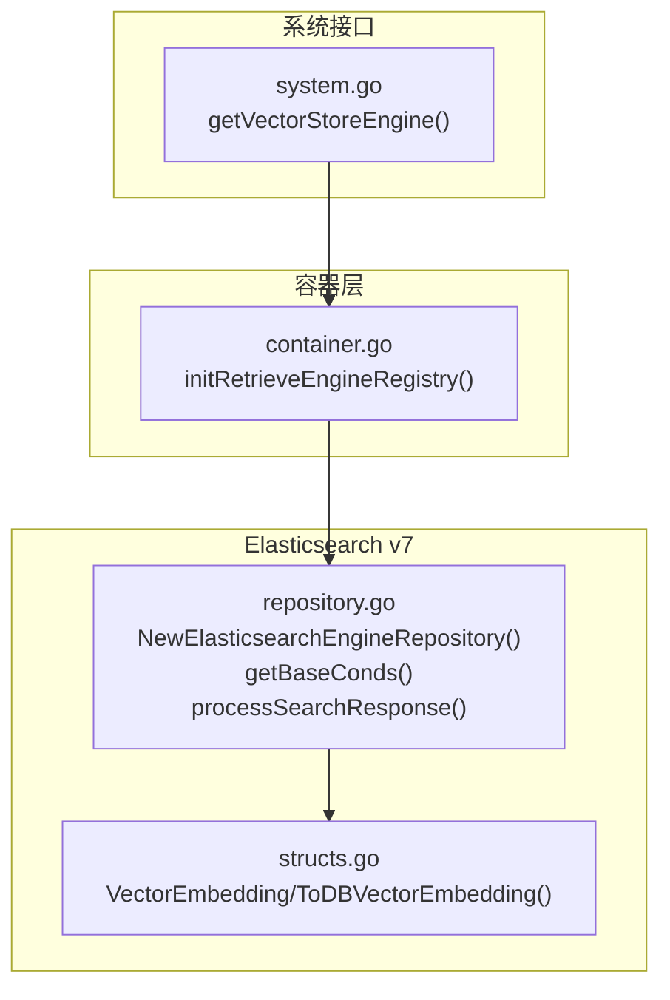
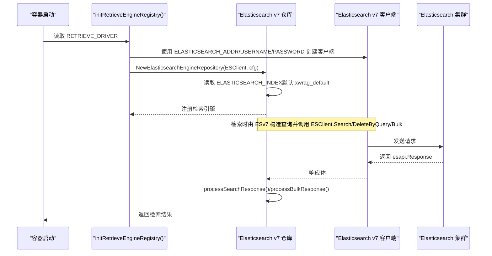
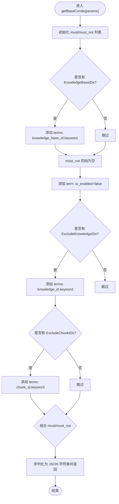
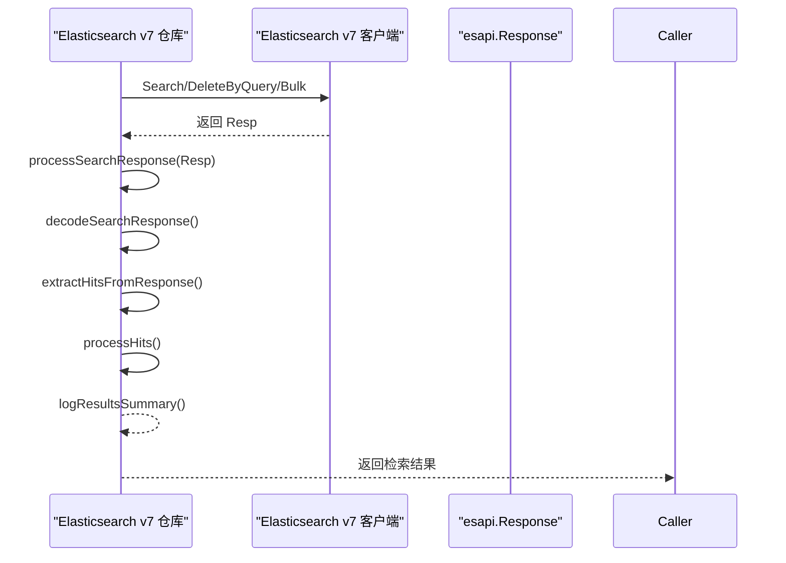
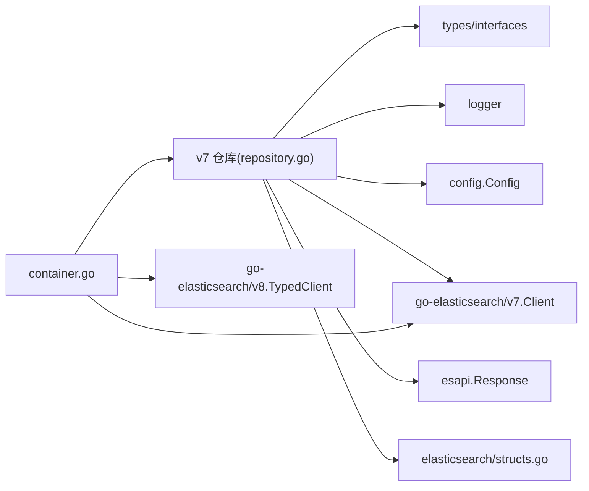

# Elasticsearch v7 配置

<cite>
**本文引用的文件**
- [repository.go](file://internal/application/repository/retriever/elasticsearch/v7/repository.go)
- [container.go](file://internal/container/container.go)
- [structs.go](file://internal/application/repository/retriever/elasticsearch/structs.go)
- [system.go](file://internal/handler/system.go)
- [go.sum](file://go.sum)
</cite>

## 目录
1. [简介](#简介)
2. [项目结构](#项目结构)
3. [核心组件](#核心组件)
4. [架构总览](#架构总览)
5. [详细组件分析](#详细组件分析)
6. [依赖关系分析](#依赖关系分析)
7. [性能与扩展性考虑](#性能与扩展性考虑)
8. [故障排查指南](#故障排查指南)
9. [结论](#结论)
10. [附录：环境变量与索引映射示例](#附录环境变量与索引映射示例)

## 简介
本文件面向在 WeKnora 中使用 Elasticsearch v7 的用户，系统化说明如何通过设置 RETRIEVE_DRIVER=elasticsearch_v7 启用该检索后端；详解 ELASTICSEARCH_ADDR、ELASTICSEARCH_USERNAME、ELASTICSEARCH_PASSWORD 等环境变量的配置方式；结合 v7/repository.go 中 NewElasticsearchEngineRepository 函数解析客户端初始化流程；重点阐述 v7 版本基于字符串拼接的查询构造（getBaseConds 方法）以及使用 esapi.Response 进行响应处理的机制；最后给出索引映射配置示例，并说明 v7 不支持原生向量检索、需依赖 script_score 实现向量相似度匹配的限制。

## 项目结构
围绕 Elasticsearch v7 的关键代码位于以下模块：
- 容器初始化：从环境变量读取地址与认证信息，创建 v7 客户端并注册到检索引擎注册表
- v7 检索仓库：负责索引创建、批量写入、删除、关键词检索、向量检索、结果处理
- 数据模型：定义 ES 文档结构（含 embedding 字段）
- 系统接口：对外展示当前启用的检索引擎（包含是否支持向量）

图表来源
- [container.go](file://internal/container/container.go#L358-L425)
- [repository.go](file://internal/application/repository/retriever/elasticsearch/v7/repository.go#L33-L48)
- [structs.go](file://internal/application/repository/retriever/elasticsearch/structs.go#L10-L26)
- [system.go](file://internal/handler/system.go#L99-L132)

章节来源
- [container.go](file://internal/container/container.go#L358-L425)
- [repository.go](file://internal/application/repository/retriever/elasticsearch/v7/repository.go#L33-L48)
- [structs.go](file://internal/application/repository/retriever/elasticsearch/structs.go#L10-L26)
- [system.go](file://internal/handler/system.go#L99-L132)

## 核心组件
- 容器初始化与驱动选择
  - 通过 RETRIEVE_DRIVER=elasticsearch_v7 启用 v7 检索引擎
  - 从环境变量读取 ELASTICSEARCH_ADDR、ELASTICSEARCH_USERNAME、ELASTICSEARCH_PASSWORD
  - 创建 github.com/elastic/go-elasticsearch/v7 客户端并注册到检索引擎注册表
- v7 检索仓库
  - NewElasticsearchEngineRepository：根据 ELASTICSEARCH_INDEX 初始化索引名（默认 xwrag_default），返回仓库实例
  - getBaseConds：构建基础过滤条件（must/must_not），以 JSON 字符串形式返回
  - KeywordsRetrieve/VectorRetrieve：分别执行关键词与向量检索
  - processSearchResponse：统一处理 esapi.Response，解码、提取 hits、转换为领域模型
- 数据模型
  - VectorEmbedding：ES 文档结构，包含 content、source_id、chunk_id、knowledge_id、knowledge_base_id、embedding、is_enabled
  - ToDBVectorEmbedding：将业务 IndexInfo 转换为 ES 文档格式

章节来源
- [container.go](file://internal/container/container.go#L358-L425)
- [repository.go](file://internal/application/repository/retriever/elasticsearch/v7/repository.go#L33-L48)
- [repository.go](file://internal/application/repository/retriever/elasticsearch/v7/repository.go#L356-L425)
- [repository.go](file://internal/application/repository/retriever/elasticsearch/v7/repository.go#L443-L518)
- [repository.go](file://internal/application/repository/retriever/elasticsearch/v7/repository.go#L623-L765)
- [structs.go](file://internal/application/repository/retriever/elasticsearch/structs.go#L10-L26)
- [structs.go](file://internal/application/repository/retriever/elasticsearch/structs.go#L28-L54)

## 架构总览
下图展示了从应用启动到检索执行的关键调用链路，强调 v7 客户端初始化、查询构造与响应处理的职责边界。

图表来源
- [container.go](file://internal/container/container.go#L358-L425)
- [repository.go](file://internal/application/repository/retriever/elasticsearch/v7/repository.go#L33-L48)
- [repository.go](file://internal/application/repository/retriever/elasticsearch/v7/repository.go#L623-L765)

## 详细组件分析

### 客户端初始化与驱动启用
- 启用方式
  - 设置环境变量 RETRIEVE_DRIVER=elasticsearch_v7
  - 容器初始化时按逗号拆分驱动列表，命中 elasticsearch_v7 分支
- 客户端参数
  - 地址：ELASTICSEARCH_ADDR
  - 用户名：ELASTICSEARCH_USERNAME
  - 密码：ELASTICSEARCH_PASSWORD
- 索引名
  - ELASTICSEARCH_INDEX 为空时，默认使用 xwrag_default
- 外部依赖
  - go.sum 显示使用 github.com/elastic/go-elasticsearch/v7

章节来源
- [container.go](file://internal/container/container.go#L358-L425)
- [repository.go](file://internal/application/repository/retriever/elasticsearch/v7/repository.go#L33-L48)
- [go.sum](file://go.sum#L65-L66)

### 查询构造：getBaseConds（字符串拼接与 JSON 输出）
- 功能定位
  - 基于检索参数构建 must/must_not 条件，返回 JSON 字符串
- 关键逻辑
  - must：包含知识库 ID 列表
  - must_not：排除禁用块（is_enabled=false）、排除知识 ID 列表、排除块 ID 列表
  - 组合策略：根据是否存在 must/must_not 决定最终布尔查询结构
  - 最终以 JSON 字符串形式返回，供上层拼接到完整查询体
- 注意事项
  - 仅支持关键词检索类型（Support 返回仅包含 KeywordsRetrieverType）
  - 向量检索通过 script_score 在上层构造完整查询体

图表来源
- [repository.go](file://internal/application/repository/retriever/elasticsearch/v7/repository.go#L356-L425)

章节来源
- [repository.go](file://internal/application/repository/retriever/elasticsearch/v7/repository.go#L356-L425)

### 响应处理：统一使用 esapi.Response
- 关键路径
  - KeywordsRetrieve/VectorRetrieve 执行搜索后，均通过 processSearchResponse 统一处理
  - processSearchResponse 对 esapi.Response 进行错误检查、解码、提取 hits、转换为领域模型
- 错误处理
  - 若 IsError() 为真，记录错误并返回
  - 解码失败或格式异常时，记录警告并返回空结果
- 结果转换
  - 将 ES 文档的 _id、_source、_score 提取并转换为 IndexWithScore

图表来源
- [repository.go](file://internal/application/repository/retriever/elasticsearch/v7/repository.go#L623-L765)

章节来源
- [repository.go](file://internal/application/repository/retriever/elasticsearch/v7/repository.go#L623-L765)

### 向量检索：基于 script_score 的限制与实现
- 支持情况
  - v7 仓库仅声明支持关键词检索（Support 返回仅包含 KeywordsRetrieverType）
  - 系统接口 getVectorStoreEngine 仅将 elasticsearch_v8 视作向量引擎，v7 不在其中
- 实现方式
  - v7 通过 buildVectorSearchQuery 构造包含 script_score 的查询体，使用 cosineSimilarity(params.query_vector,'embedding')
  - 通过 min_score 参数实现阈值过滤
  - 通过 size 控制 TopK
- 限制说明
  - v7 不支持原生向量字段与向量查询 DSL，必须依赖 script_score 计算相似度
  - 因此性能与可扩展性不及原生向量检索方案（如 v8 typed API 的向量能力）

章节来源
- [repository.go](file://internal/application/repository/retriever/elasticsearch/v7/repository.go#L54-L56)
- [system.go](file://internal/handler/system.go#L99-L132)
- [repository.go](file://internal/application/repository/retriever/elasticsearch/v7/repository.go#L473-L518)

### 索引映射配置示例（基于文档结构）
- 文档字段
  - content：文本内容
  - source_id：源文档 ID
  - source_type：源类型
  - chunk_id：块 ID
  - knowledge_id：知识 ID
  - knowledge_base_id：知识库 ID
  - embedding：向量数组（float32）
  - is_enabled：是否启用
- 映射要点
  - embedding 字段需映射为数值数组，以便 script_score 计算
  - 关键词检索字段（如 content）需可分词
  - 过滤字段（knowledge_base_id、knowledge_id、chunk_id）建议使用 keyword 类型
  - is_enabled 可用于 must_not 排除禁用块

章节来源
- [structs.go](file://internal/application/repository/retriever/elasticsearch/structs.go#L10-L26)

## 依赖关系分析
- 外部依赖
  - github.com/elastic/go-elasticsearch/v7：v7 客户端
  - github.com/elastic/go-elasticsearch/v8：v8 typed 客户端（用于对比与参考）
- 内部依赖
  - types/interfaces.RetrieveEngineRepository：统一检索接口
  - internal/config.Config：配置对象（用于仓库初始化）
  - internal/logger：日志
  - internal/types：领域模型（IndexInfo/IndexWithScore 等）

图表来源
- [repository.go](file://internal/application/repository/retriever/elasticsearch/v7/repository.go#L1-L26)
- [container.go](file://internal/container/container.go#L1-L26)
- [go.sum](file://go.sum#L65-L66)

章节来源
- [repository.go](file://internal/application/repository/retriever/elasticsearch/v7/repository.go#L1-L26)
- [container.go](file://internal/container/container.go#L1-L26)
- [go.sum](file://go.sum#L65-L66)

## 性能与扩展性考虑
- script_score 向量检索
  - v7 无法使用原生向量字段，性能不及原生向量检索方案
  - 建议在高并发场景评估是否切换至 elasticsearch_v8 或其他向量数据库
- 批量写入
  - v7 使用 Bulk 接口进行批量索引，注意控制批次大小与内存增长
- 过滤与排序
  - 基础过滤通过 getBaseConds 构建，尽量减少 must_not 的复杂度
- 日志与可观测性
  - 通过日志记录查询体、响应状态与错误，便于定位问题

[本节为通用指导，无需列出具体文件来源]

## 故障排查指南
- 客户端初始化失败
  - 检查 ELASTICSEARCH_ADDR/USERNAME/PASSWORD 是否正确
  - 确认网络连通与认证凭据有效
- 索引不存在或映射不匹配
  - v7 仓库不会自动创建索引；请确保索引已存在且字段映射符合 VectorEmbedding 定义
- 检索无结果
  - 关注 getBaseConds 的 must_not 条件（is_enabled=false）是否排除了历史数据
  - 检查阈值（min_score）与 TopK 设置是否合理
- 响应处理异常
  - processSearchResponse 对 esapi.Response 进行统一错误检查与解码，若出现格式异常，查看日志并确认 ES 返回体结构

章节来源
- [container.go](file://internal/container/container.go#L405-L424)
- [repository.go](file://internal/application/repository/retriever/elasticsearch/v7/repository.go#L623-L765)

## 结论
- 通过 RETRIEVE_DRIVER=elasticsearch_v7 即可启用 v7 检索引擎
- v7 仓库不支持原生向量检索，需依赖 script_score 实现相似度计算
- 查询构造采用结构化对象转 JSON 字符串的方式，响应处理统一使用 esapi.Response
- 建议在对向量检索性能有较高要求的场景，优先考虑 elasticsearch_v8 或其他向量数据库

[本节为总结性内容，无需列出具体文件来源]

## 附录：环境变量与索引映射示例

- 环境变量清单
  - RETRIEVE_DRIVER：elasticsearch_v7（启用 v7 检索引擎）
  - ELASTICSEARCH_ADDR：Elasticsearch 地址（例如 http://localhost:9200）
  - ELASTICSEARCH_USERNAME：用户名
  - ELASTICSEARCH_PASSWORD：密码
  - ELASTICSEARCH_INDEX：索引名称（为空则使用默认 xwrag_default）

- 索引映射要点（基于 VectorEmbedding 字段）
  - content：text（可分词）
  - source_id：keyword
  - source_type：integer
  - chunk_id：keyword
  - knowledge_id：keyword
  - knowledge_base_id：keyword
  - embedding：dense_vector（与脚本计算兼容即可）
  - is_enabled：boolean

章节来源
- [container.go](file://internal/container/container.go#L405-L424)
- [repository.go](file://internal/application/repository/retriever/elasticsearch/v7/repository.go#L33-L48)
- [structs.go](file://internal/application/repository/retriever/elasticsearch/structs.go#L10-L26)