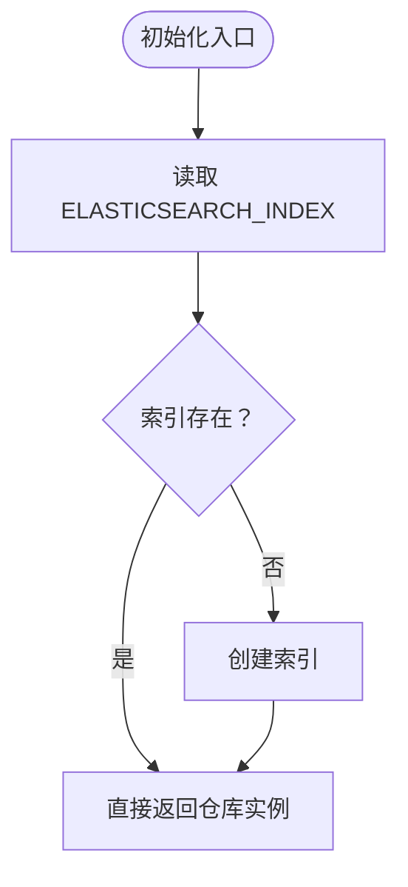

# Elasticsearch v8 配置

<cite>
**本文引用的文件**
- [repository.go](file://internal/application/repository/retriever/elasticsearch/v8/repository.go)
- [container.go](file://internal/container/container.go)
- [docker-compose.yml](file://docker-compose.yml)
- [使用其他向量数据库.md](file://docs/使用其他向量数据库.md)
- [system.go](file://internal/handler/system.go)
- [config.go](file://internal/config/config.go)
- [structs.go](file://internal/application/repository/retriever/elasticsearch/structs.go)
</cite>

## 目录
1. [简介](#简介)
2. [项目结构](#项目结构)
3. [核心组件](#核心组件)
4. [架构总览](#架构总览)
5. [详细组件分析](#详细组件分析)
6. [依赖关系分析](#依赖关系分析)
7. [性能考量](#性能考量)
8. [故障排查指南](#故障排查指南)
9. [结论](#结论)
10. [附录](#附录)

## 简介
本文件面向希望在系统中启用 Elasticsearch v8 作为检索后端的用户与开发者，围绕以下目标展开：  
- 通过设置 RETRIEVE_DRIVER=elasticsearch_v8 启用 Elasticsearch v8 检索引擎  
- 说明 ELASTICSEARCH_ADDR、ELASTICSEARCH_USERNAME、ELASTICSEARCH_PASSWORD、ELASTICSEARCH_INDEX 等环境变量的配置方式  
- 结合 v8/repository.go 中 NewElasticsearchEngineRepository 的实现，解析 TypedClient 初始化与索引自动创建机制  
- 强调 v8 版本使用 types.Query 结构体构建类型安全查询（getBaseConds 方法）的优势  
- 说明通过 UpdateByQuery 实现批量状态更新的能力  
- 展示 v8 支持原生向量检索与 Painless 脚本的高级特性，并给出最佳实践建议

## 项目结构
Elasticsearch v8 的相关实现集中在 v8 子目录，容器初始化逻辑在 container.go 中，环境变量通过 docker-compose.yml 注入，系统侧对向量检索引擎的支持由 system.go 与 config.go 协同体现。

图表来源
- [container.go](file://internal/container/container.go#L358-L403)
- [repository.go](file://internal/application/repository/retriever/elasticsearch/v8/repository.go#L26-L49)

章节来源
- [container.go](file://internal/container/container.go#L358-L403)
- [docker-compose.yml](file://docker-compose.yml#L50-L60)

## 核心组件
- Elasticsearch v8 仓库实现：负责检索、索引管理、批量写入、复制索引、状态更新等  
- 容器初始化：根据 RETRIEVE_DRIVER 动态注册 Elasticsearch v8 检索引擎  
- 环境变量注入：通过 docker-compose.yml 将连接与索引参数注入容器  
- 类型安全查询：使用 types.Query 构建布尔过滤条件，提升可维护性与安全性  
- 批量状态更新：基于 UpdateByQuery 与 Painless 脚本进行批量 is_enabled 更新

章节来源
- [repository.go](file://internal/application/repository/retriever/elasticsearch/v8/repository.go#L26-L49)
- [container.go](file://internal/container/container.go#L358-L403)
- [docker-compose.yml](file://docker-compose.yml#L50-L60)

## 架构总览
Elasticsearch v8 在系统中的工作流如下：

图表来源
- [container.go](file://internal/container/container.go#L358-L403)
- [repository.go](file://internal/application/repository/retriever/elasticsearch/v8/repository.go#L26-L49)

## 详细组件分析

### 启用 Elasticsearch v8 检索引擎
- 通过设置环境变量 RETRIEVE_DRIVER=elasticsearch_v8，容器初始化时会创建 Elasticsearch v8 的 TypedClient 并注册为检索引擎  
- 若未包含 elasticsearch_v8，则不会初始化对应仓库与检索引擎

章节来源
- [container.go](file://internal/container/container.go#L358-L403)
- [system.go](file://internal/handler/system.go#L99-L132)

### 环境变量配置
- ELASTICSEARCH_ADDR：Elasticsearch 地址（数组形式，逗号分隔）  
- ELASTICSEARCH_USERNAME：用户名  
- ELASTICSEARCH_PASSWORD：密码  
- ELASTICSEARCH_INDEX：索引名称，默认为空时使用默认值  
- docker-compose.yml 中已将上述变量注入容器

章节来源
- [container.go](file://internal/container/container.go#L383-L388)
- [docker-compose.yml](file://docker-compose.yml#L50-L60)

### TypedClient 初始化与索引自动创建
- NewElasticsearchEngineRepository 接收 *elasticsearch.TypedClient 与配置对象，内部读取 ELASTICSEARCH_INDEX 并调用 createIndexIfNotExists  
- createIndexIfNotExists 会先判断索引是否存在，不存在则创建；成功后返回仓库实例供后续检索使用

图表来源
- [repository.go](file://internal/application/repository/retriever/elasticsearch/v8/repository.go#L26-L49)
- [repository.go](file://internal/application/repository/retriever/elasticsearch/v8/repository.go#L265-L293)

章节来源
- [repository.go](file://internal/application/repository/retriever/elasticsearch/v8/repository.go#L26-L49)
- [repository.go](file://internal/application/repository/retriever/elasticsearch/v8/repository.go#L265-L293)

### 类型安全查询：getBaseConds 与 types.Query
- getBaseConds 使用 types.Query 构建 must/must_not 条件，统一封装过滤逻辑  
- 支持按知识库 ID、排除的知识 ID、排除的分片 ID、禁用状态（is_enabled=false）等条件组合  
- 通过 types.Query/BoolQuery/TermsQuery/TermQuery 等类型，避免手写字符串拼接，降低错误风险并提升可读性

图表来源
- [repository.go](file://internal/application/repository/retriever/elasticsearch/v8/repository.go#L235-L263)

章节来源
- [repository.go](file://internal/application/repository/retriever/elasticsearch/v8/repository.go#L235-L263)

### 向量检索与关键词检索
- 向量检索：使用 ScriptScoreQuery，以 cosineSimilarity 计算相似度，结合 getBaseConds 的过滤条件与最小分数阈值  
- 关键词检索：使用 Match 查询在 content 字段上匹配，同样受 getBaseConds 过滤  
- 两者均通过 client.Search().Index(...).Request(...) 执行，并将结果映射为领域模型

图表来源
- [repository.go](file://internal/application/repository/retriever/elasticsearch/v8/repository.go#L316-L434)

章节来源
- [repository.go](file://internal/application/repository/retriever/elasticsearch/v8/repository.go#L316-L434)
- [structs.go](file://internal/application/repository/retriever/elasticsearch/structs.go#L28-L72)

### 批量状态更新：UpdateByQuery 与 Painless
- BatchUpdateChunkEnabledStatus 将待更新的 chunk 分组为启用/禁用两类，分别构造 Query 与 Painless 脚本  
- 使用 UpdateByQuery 执行批量更新，脚本语言选择 Painless，语义清晰且性能稳定  
- 适用于大规模开关 is_enabled 的场景

图表来源
- [repository.go](file://internal/application/repository/retriever/elasticsearch/v8/repository.go#L572-L652)

章节来源
- [repository.go](file://internal/application/repository/retriever/elasticsearch/v8/repository.go#L572-L652)

### 索引复制与批量写入
- CopyIndices 通过分页查询源知识库的数据，收集目标映射关系与向量，再调用 BatchSave 写入目标索引  
- BatchSave 使用 Bulk API，逐条 Create 操作，适合大批量导入  
- 该流程避免重复计算向量，直接复用已有 embedding

章节来源
- [repository.go](file://internal/application/repository/retriever/elasticsearch/v8/repository.go#L443-L571)
- [structs.go](file://internal/application/repository/retriever/elasticsearch/structs.go#L28-L54)

## 依赖关系分析
- 初始化注册依赖 RETRIEVE_DRIVER，仅当包含 elasticsearch_v8 时才创建 TypedClient 并注册仓库  
- 仓库依赖 Elasticsearch v8 客户端与 types.Query 类型体系  
- 环境变量通过 docker-compose.yml 注入，容器启动时生效

图表来源
- [container.go](file://internal/container/container.go#L358-L403)
- [docker-compose.yml](file://docker-compose.yml#L50-L60)

章节来源
- [container.go](file://internal/container/container.go#L358-L403)
- [docker-compose.yml](file://docker-compose.yml#L50-L60)

## 性能考量
- 向量检索使用 ScriptScore 与最小分数阈值，有助于减少无效匹配，提高吞吐  
- 批量写入采用 Bulk API，显著降低网络往返开销  
- UpdateByQuery 与 Painless 脚本在服务端执行，减少数据传输与客户端处理成本  
- 建议合理设置 TopK 与阈值，避免过大的返回集导致内存与网络压力  
- 索引复制采用分页批量处理，避免一次性拉取过多数据

## 故障排查指南
- 无法连接 Elasticsearch：检查 ELASTICSEARCH_ADDR、ELASTICSEARCH_USERNAME、ELASTICSEARCH_PASSWORD 是否正确  
- 索引创建失败：查看 createIndexIfNotExists 的日志输出，确认权限与集群可用性  
- 检索无结果：确认 getBaseConds 的过滤条件是否过于严格，或阈值设置过高  
- 批量状态更新失败：检查 chunkID 列表是否为空，或 UpdateByQuery 的查询条件是否匹配  
- 环境变量未生效：确认 docker-compose.yml 中变量已注入，或在本地运行时确保环境变量已导出

章节来源
- [repository.go](file://internal/application/repository/retriever/elasticsearch/v8/repository.go#L265-L293)
- [repository.go](file://internal/application/repository/retriever/elasticsearch/v8/repository.go#L316-L434)
- [repository.go](file://internal/application/repository/retriever/elasticsearch/v8/repository.go#L572-L652)
- [docker-compose.yml](file://docker-compose.yml#L50-L60)

## 结论
通过 RETRIEVE_DRIVER=elasticsearch_v8，系统可在启动时自动完成 Elasticsearch v8 的客户端初始化与索引准备，并提供类型安全的查询构建、原生向量检索与 Painless 脚本支持。配合批量写入与批量状态更新能力，能够满足大规模知识检索与治理需求。建议在生产环境中结合合理的阈值、TopK 与分页策略，持续监控日志与性能指标，确保稳定性与效率。

## 附录

### 环境变量清单
- RETRIEVE_DRIVER：启用的检索引擎列表，如 elasticsearch_v8  
- ELASTICSEARCH_ADDR：Elasticsearch 地址（逗号分隔）  
- ELASTICSEARCH_USERNAME：用户名  
- ELASTICSEARCH_PASSWORD：密码  
- ELASTICSEARCH_INDEX：索引名称（未设置时使用默认值）

章节来源
- [container.go](file://internal/container/container.go#L383-L388)
- [docker-compose.yml](file://docker-compose.yml#L50-L60)
- [repository.go](file://internal/application/repository/retriever/elasticsearch/v8/repository.go#L26-L49)

### 最佳实践建议
- 明确索引命名策略，ELASTICSEARCH_INDEX 建议按租户/知识库维度区分  
- 使用 getBaseConds 统一过滤条件，避免分散的字符串拼接  
- 向量检索时合理设置阈值与 TopK，兼顾召回与性能  
- 批量状态更新优先使用 UpdateByQuery + Painless，避免逐条请求  
- 复制索引时注意分批大小与映射关系校验，确保 chunk_id 与 knowledge_id 的一致性