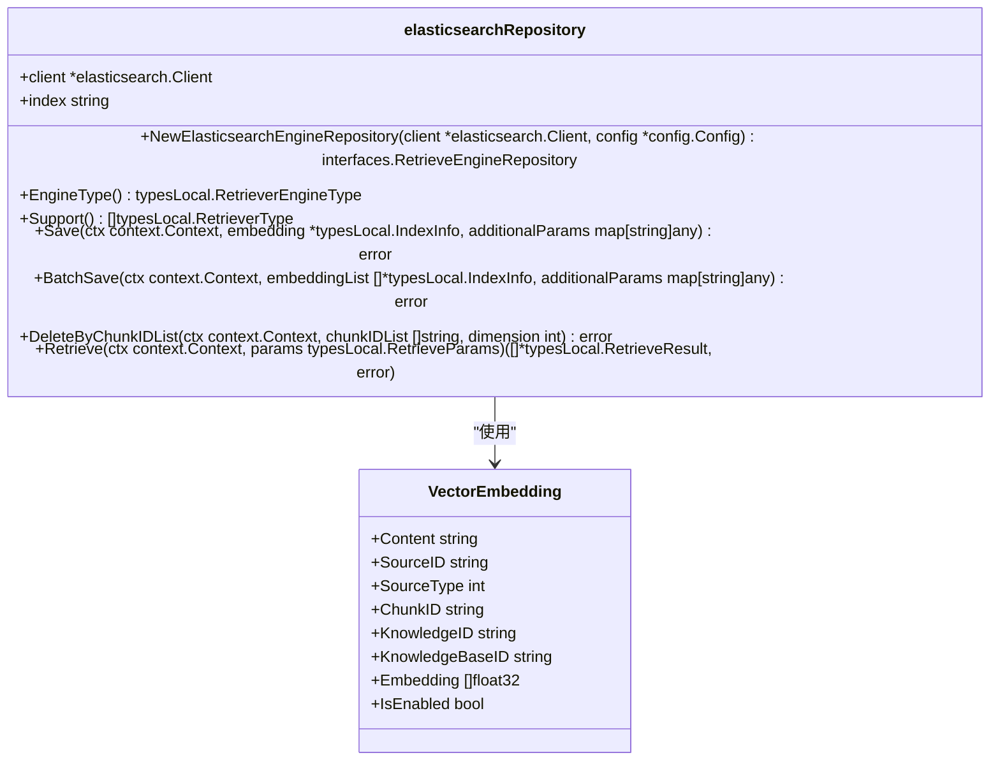
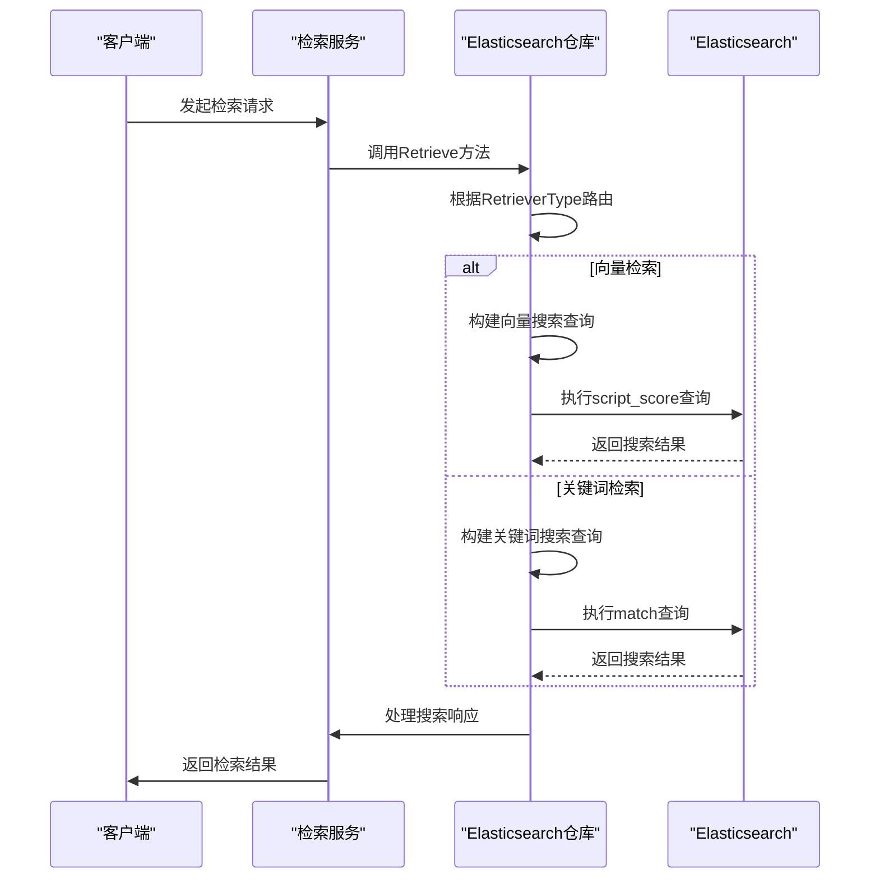

# Elasticsearch向量存储配置

<cite>
**本文档引用文件**   
- [v7/repository.go](file://internal/application/repository/retriever/elasticsearch/v7/repository.go)
- [v8/repository.go](file://internal/application/repository/retriever/elasticsearch/v8/repository.go)
- [structs.go](file://internal/application/repository/retriever/elasticsearch/structs.go)
- [config.go](file://internal/config/config.go)
- [.env.example](file://.env.example)
- [container.go](file://internal/container/container.go)
</cite>

## 目录
1. [简介](#简介)
2. [环境变量配置](#环境变量配置)
3. [Elasticsearch适配器实现](#elasticsearch适配器实现)
4. [索引映射与向量字段定义](#索引映射与向量字段定义)
5. [混合检索实现](#混合检索实现)
6. [索引模板与分片策略](#索引模板与分片策略)
7. [安全认证配置](#安全认证配置)
8. [集群健康检查](#集群健康检查)

## 简介
本文档详细说明了WeKnora系统中Elasticsearch向量存储的配置方法，涵盖`RETRIEVE_DRIVER=elasticsearch_v7`和`elasticsearch_v8`两种模式。文档将结合Go代码分析，解释Elasticsearch适配器如何创建索引映射、执行混合检索（关键词+向量），并提供索引模板配置、分片策略、向量字段类型定义的最佳实践。

**Section sources**
- [v7/repository.go](file://internal/application/repository/retriever/elasticsearch/v7/repository.go#L1-L1199)
- [v8/repository.go](file://internal/application/repository/retriever/elasticsearch/v8/repository.go#L1-L652)

## 环境变量配置
WeKnora系统通过环境变量配置Elasticsearch连接参数。以下是关键环境变量的设置方法：

- **ELASTICSEARCH_ADDR**: Elasticsearch服务地址，例如 `http://localhost:9200`
- **ELASTICSEARCH_USERNAME**: Elasticsearch用户名，用于身份验证
- **ELASTICSEARCH_PASSWORD**: Elasticsearch密码，用于身份验证
- **ELASTICSEARCH_INDEX**: Elasticsearch索引名称，用于存储向量数据
- **RETRIEVE_DRIVER**: 检索驱动类型，设置为 `elasticsearch_v7` 或 `elasticsearch_v8`

在 `.env` 文件中配置示例：
```
RETRIEVE_DRIVER=elasticsearch_v8
ELASTICSEARCH_ADDR=http://localhost:9200
ELASTICSEARCH_USERNAME=elastic
ELASTICSEARCH_PASSWORD=your_password
ELASTICSEARCH_INDEX=WeKnora
```

**Section sources**
- [.env.example](file://.env.example#L75-L87)
- [container.go](file://internal/container/container.go#L383-L425)

## Elasticsearch适配器实现
WeKnora系统为Elasticsearch v7和v8提供了独立的适配器实现，分别位于 `internal/application/repository/retriever/elasticsearch/v7/` 和 `internal/application/repository/retriever/elasticsearch/v8/` 目录下。

### v7适配器
v7适配器使用 `github.com/elastic/go-elasticsearch/v7` 客户端库，通过低级API执行操作。`NewElasticsearchEngineRepository` 函数初始化客户端并设置默认索引名称。

### v8适配器
v8适配器使用 `github.com/elastic/go-elasticsearch/v8` 客户端库，采用类型安全的高级API。`NewElasticsearchEngineRepository` 函数不仅初始化客户端，还会检查并创建索引（如果不存在）。

两种适配器都实现了 `RetrieveEngineRepository` 接口，支持保存、批量保存、删除和检索操作。



**Diagram sources **
- [v7/repository.go](file://internal/application/repository/retriever/elasticsearch/v7/repository.go#L27-L48)
- [v8/repository.go](file://internal/application/repository/retriever/elasticsearch/v8/repository.go#L20-L49)
- [structs.go](file://internal/application/repository/retriever/elasticsearch/structs.go#L10-L20)

## 索引映射与向量字段定义
Elasticsearch中的向量存储基于 `VectorEmbedding` 结构体定义的映射。该结构体包含文本内容、元数据和向量嵌入字段。

### 字段定义
- **content**: 文本内容，用于关键词检索
- **source_id**: 源文档ID
- **source_type**: 源文档类型
- **chunk_id**: 文本块唯一ID
- **knowledge_id**: 知识项ID
- **knowledge_base_id**: 知识库ID
- **embedding**: 向量嵌入，存储浮点数数组
- **is_enabled**: 块是否启用的标志

向量字段在Elasticsearch中使用 `dense_vector` 类型，支持余弦相似度计算。

**Section sources**
- [structs.go](file://internal/application/repository/retriever/elasticsearch/structs.go#L10-L20)
- [v7/repository.go](file://internal/application/repository/retriever/elasticsearch/v7/repository.go#L473-L503)
- [v8/repository.go](file://internal/application/repository/retriever/elasticsearch/v8/repository.go#L334-L345)

## 混合检索实现
WeKnora系统支持混合检索，结合关键词检索和向量检索两种模式。

### 关键词检索
关键词检索使用Elasticsearch的 `match` 查询，在 `content` 字段上执行全文搜索。检索参数包括查询文本、topK值和过滤条件。

### 向量检索
向量检索使用脚本评分（script_score）查询，计算查询向量与存储向量之间的余弦相似度。查询使用 `cosineSimilarity` 函数，并设置最小分数阈值。



**Diagram sources **
- [v7/repository.go](file://internal/application/repository/retriever/elasticsearch/v7/repository.go#L443-L544)
- [v8/repository.go](file://internal/application/repository/retriever/elasticsearch/v8/repository.go#L316-L386)

## 索引模板与分片策略
### 索引创建
v8适配器在初始化时会自动检查并创建索引（如果不存在）。索引名称通过 `ELASTICSEARCH_INDEX` 环境变量配置，默认为 `xwrag_default`。

### 分片策略
当前实现使用默认分片策略。建议根据数据量和查询负载配置适当的分片数量：
- 小型部署：1-3个主分片
- 中型部署：3-5个主分片
- 大型部署：5个以上主分片

### 存储估算
系统提供了 `EstimateStorageSize` 方法估算存储空间。估算考虑了文本内容大小、向量存储大小、元数据开销和索引放大系数（约1.5倍）。

**Section sources**
- [v8/repository.go](file://internal/application/repository/retriever/elasticsearch/v8/repository.go#L265-L293)
- [v7/repository.go](file://internal/application/repository/retriever/elasticsearch/v7/repository.go#L58-L76)
- [v8/repository.go](file://internal/application/repository/retriever/elasticsearch/v8/repository.go#L84-L97)

## 安全认证配置
Elasticsearch适配器支持基本身份验证。在 `container.go` 文件中，客户端配置包含用户名和密码：

```go
client, err := elasticsearch.NewTypedClient(elasticsearch.Config{
    Addresses: []string{os.Getenv("ELASTICSEARCH_ADDR")},
    Username:  os.Getenv("ELASTICSEARCH_USERNAME"),
    Password:  os.Getenv("ELASTICSEARCH_PASSWORD"),
})
```

确保在生产环境中使用安全的连接（HTTPS）和强密码策略。

**Section sources**
- [container.go](file://internal/container/container.go#L384-L388)
- [v8/repository.go](file://internal/application/repository/retriever/elasticsearch/v8/repository.go#L28-L48)

## 集群健康检查
虽然当前代码中没有显式的健康检查实现，但可以通过以下方式监控Elasticsearch集群健康状态：

1. **连接验证**: 在客户端初始化时，系统会尝试连接到Elasticsearch服务。
2. **操作监控**: 所有Elasticsearch操作都有错误处理，可以记录和监控失败的操作。
3. **日志记录**: 系统在关键操作点记录日志，可用于监控和故障排除。

建议在生产环境中配置Elasticsearch的健康检查端点，并集成到系统的监控体系中。

**Section sources**
- [container.go](file://internal/container/container.go#L383-L425)
- [v7/repository.go](file://internal/application/repository/retriever/elasticsearch/v7/repository.go#L32-L48)