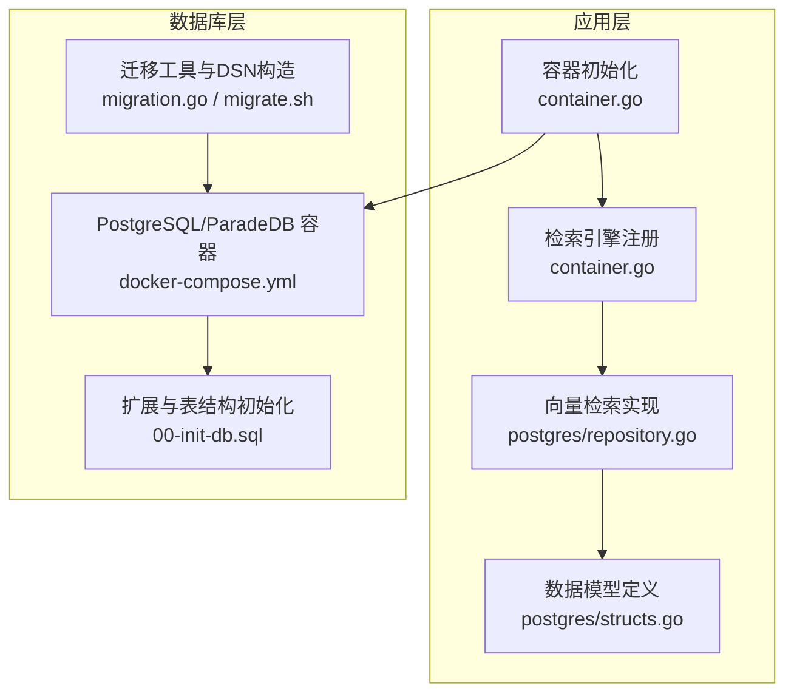
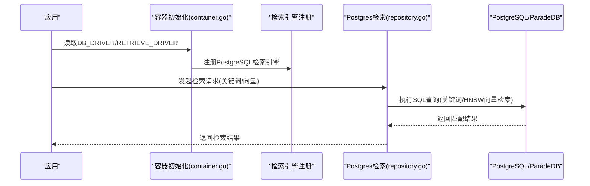
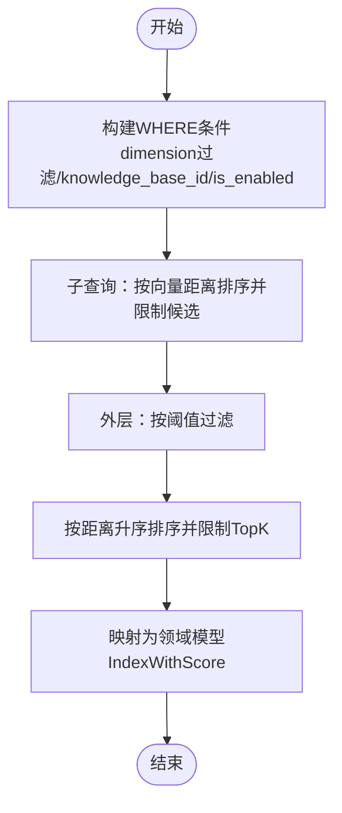
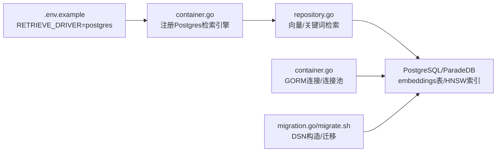

# PostgreSQL向量存储配置

<cite>
**本文引用的文件**
- [repository.go](file://internal/application/repository/retriever/postgres/repository.go)
- [structs.go](file://internal/application/repository/retriever/postgres/structs.go)
- [.env.example](file://.env.example)
- [container.go](file://internal/container/container.go)
- [00-init-db.sql](file://migrations/paradedb/00-init-db.sql)
- [migrate.sh](file://scripts/migrate.sh)
- [docker-compose.yml](file://docker-compose.yml)
- [migration.go](file://internal/database/migration.go)
- [check-env.sh](file://scripts/check-env.sh)
</cite>

## 目录
1. [简介](#简介)
2. [项目结构](#项目结构)
3. [核心组件](#核心组件)
4. [架构总览](#架构总览)
5. [详细组件分析](#详细组件分析)
6. [依赖关系分析](#依赖关系分析)
7. [性能考虑](#性能考虑)
8. [故障排查指南](#故障排查指南)
9. [结论](#结论)
10. [附录](#附录)

## 简介
本文件面向希望在WeKnora中启用PostgreSQL向量存储（pgvector）的用户与开发者，系统性说明如何通过RETRIEVE_DRIVER=postgres启用向量检索能力，详解DATABASE_URL环境变量格式（含SSL模式、连接池配置），并结合Go代码实现解析postgres/repository.go中的向量索引创建与相似性搜索SQL实现原理。同时提供pgvector扩展安装、向量维度配置与HNSW索引优化的最佳实践，以及连接测试与性能调优建议。

## 项目结构
围绕PostgreSQL向量存储的关键文件组织如下：
- 向量检索实现：internal/application/repository/retriever/postgres/repository.go
- 数据模型定义：internal/application/repository/retriever/postgres/structs.go
- 环境变量与驱动选择：.env.example
- 数据库连接与迁移：internal/container/container.go、internal/database/migration.go
- 初始化脚本与索引：migrations/paradedb/00-init-db.sql
- 迁移脚本与Docker编排：scripts/migrate.sh、docker-compose.yml
- 环境检查脚本：scripts/check-env.sh

图表来源
- [container.go](file://internal/container/container.go#L358-L475)
- [repository.go](file://internal/application/repository/retriever/postgres/repository.go#L1-L120)
- [structs.go](file://internal/application/repository/retriever/postgres/structs.go#L1-L55)
- [docker-compose.yml](file://docker-compose.yml#L144-L174)
- [00-init-db.sql](file://migrations/paradedb/00-init-db.sql#L1-L215)
- [migration.go](file://internal/database/migration.go#L101-L126)
- [migrate.sh](file://scripts/migrate.sh#L33-L60)

章节来源
- [container.go](file://internal/container/container.go#L358-L475)
- [repository.go](file://internal/application/repository/retriever/postgres/repository.go#L1-L120)
- [structs.go](file://internal/application/repository/retriever/postgres/structs.go#L1-L55)
- [docker-compose.yml](file://docker-compose.yml#L144-L174)
- [00-init-db.sql](file://migrations/paradedb/00-init-db.sql#L1-L215)
- [migration.go](file://internal/database/migration.go#L101-L126)
- [migrate.sh](file://scripts/migrate.sh#L33-L60)

## 核心组件
- 检索引擎注册与启用
  - 通过环境变量RETRIEVE_DRIVER=postgres启用PostgreSQL向量检索；container.go中根据该值注册PostgreSQL检索引擎。
- 数据模型与表结构
  - embeddings表包含source_id、source_type、chunk_id、knowledge_id、knowledge_base_id、content、dimension、embedding等字段；使用halfvec类型存储向量。
- 向量检索实现
  - repository.go提供向量相似度检索、关键词检索、批量写入、删除、复制与状态更新等能力。
- 连接与迁移
  - container.go负责GORM连接、自动迁移、连接池配置；migration.go/migrate.sh负责DSN构造与迁移执行。

章节来源
- [container.go](file://internal/container/container.go#L358-L475)
- [repository.go](file://internal/application/repository/retriever/postgres/repository.go#L1-L120)
- [structs.go](file://internal/application/repository/retriever/postgres/structs.go#L1-L55)
- [00-init-db.sql](file://migrations/paradedb/00-init-db.sql#L188-L215)
- [migration.go](file://internal/database/migration.go#L101-L126)
- [migrate.sh](file://scripts/migrate.sh#L33-L60)

## 架构总览
PostgreSQL向量检索的整体流程：
- 应用启动时，container.go读取DB_DRIVER与RETRIEVE_DRIVER，建立GORM连接并注册PostgreSQL检索引擎。
- 检索请求进入repository.go，根据检索类型（关键词/向量）执行相应SQL。
- 向量检索使用HNSW索引与半精度向量类型，先按距离排序再阈值过滤，提升性能。
- 初始化脚本00-init-db.sql创建扩展、表与索引，支持不同维度的HNSW索引。

图表来源
- [container.go](file://internal/container/container.go#L358-L475)
- [repository.go](file://internal/application/repository/retriever/postgres/repository.go#L148-L228)
- [00-init-db.sql](file://migrations/paradedb/00-init-db.sql#L188-L215)

## 详细组件分析

### 启用PostgreSQL向量存储（RETRIEVE_DRIVER=postgres）
- 在环境变量中将RETRIEVE_DRIVER设置为postgres，container.go会注册PostgreSQL检索引擎，从而启用向量检索能力。
- 该机制允许在同一系统中同时启用多种检索后端（如elasticsearch、qdrant等），通过逗号分隔进行组合启用。

章节来源
- [.env.example](file://.env.example#L13-L20)
- [container.go](file://internal/container/container.go#L358-L475)

### DATABASE_URL与连接配置
- 连接字符串格式
  - 项目默认使用PostgreSQL连接字符串，形如：postgres://用户名:密码@主机:端口/数据库名?sslmode=disable
  - scripts/migrate.sh与internal/container/container.go均采用该格式构造DSN，确保sslmode=disable（开发环境）。
- SSL模式
  - 开发环境默认sslmode=disable；若需强制SSL或首选SSL，可在DB_URL中显式指定，但脚本会优先保证sslmode=disable。
- 密码转义
  - 迁移脚本使用url.QueryEscape对密码进行编码，避免特殊字符导致的连接异常。
- 连接池配置
  - container.go中设置最大空闲连接数与连接最大生命周期，便于在高并发场景下稳定运行。

章节来源
- [migrate.sh](file://scripts/migrate.sh#L33-L60)
- [container.go](file://internal/container/container.go#L251-L307)
- [migration.go](file://internal/database/migration.go#L101-L126)

### 数据模型与表结构（embeddings）
- 字段说明
  - source_id、source_type、chunk_id、knowledge_id、knowledge_base_id：标识来源与归属。
  - content：文本内容。
  - dimension：向量维度。
  - embedding：半精度向量类型halfvec。
  - is_enabled：启用状态索引。
- 表名与索引
  - 表名为embeddings；包含唯一索引（source_id, source_type）、BM25全文检索索引、HNSW索引（按维度分区）。

章节来源
- [structs.go](file://internal/application/repository/retriever/postgres/structs.go#L1-L55)
- [00-init-db.sql](file://migrations/paradedb/00-init-db.sql#L188-L215)

### 向量索引创建与HNSW优化
- HNSW索引策略
  - 使用halfvec类型与cosine距离；按维度分区创建索引，确保不同维度的向量能命中对应索引。
  - 索引参数m与ef_construction在SQL中设定，影响索引质量与构建成本。
- 索引维护
  - repository.go提供批量写入、删除、复制与状态更新接口，配合HNSW索引实现高效检索与维护。

章节来源
- [00-init-db.sql](file://migrations/paradedb/00-init-db.sql#L188-L215)
- [repository.go](file://internal/application/repository/retriever/postgres/repository.go#L78-L146)

### 相似性搜索SQL实现原理
- 查询策略
  - 使用子查询先按向量距离排序并限制候选数量，再在外层按阈值过滤，最后按距离升序返回TopK。
  - 通过ORDER BY embedding::halfvec(dimension) <=> $1::halfvec计算距离，利用HNSW索引加速。
- 参数化与安全
  - 使用$1、$2…占位符传参，避免SQL注入风险。
- 过滤条件
  - 必须包含dimension过滤（HNSW索引WHERE约束），并支持knowledge_base_id与is_enabled过滤。
- 结果映射
  - 将查询结果映射为领域模型IndexWithScore，包含chunk_id、knowledge_id、knowledge_base_id、content与score。

图表来源
- [repository.go](file://internal/application/repository/retriever/postgres/repository.go#L230-L351)

章节来源
- [repository.go](file://internal/application/repository/retriever/postgres/repository.go#L230-L351)

### 关键词检索与混合检索
- 关键词检索
  - 使用BM25索引与paradedb.match进行全文检索，支持按knowledge_base_id过滤与is_enabled过滤。
- 混合检索
  - 支持关键词与向量两种检索类型，检索引擎注册时统一暴露KV混合能力。

章节来源
- [repository.go](file://internal/application/repository/retriever/postgres/repository.go#L162-L228)
- [container.go](file://internal/container/container.go#L358-L475)

### 批量操作与数据维护
- 批量写入
  - 使用OnConflict{DoNothing}避免重复插入，提高导入效率。
- 删除与复制
  - 支持按chunk_id、source_id、knowledge_id删除；支持按知识库复制索引数据。
- 状态更新
  - 批量更新chunk的启用状态，便于灰度与治理。

章节来源
- [repository.go](file://internal/application/repository/retriever/postgres/repository.go#L91-L146)
- [repository.go](file://internal/application/repository/retriever/postgres/repository.go#L353-L467)
- [repository.go](file://internal/application/repository/retriever/postgres/repository.go#L469-L518)

## 依赖关系分析
- 检索引擎注册
  - container.go依据RETRIEVE_DRIVER注册PostgreSQL检索引擎，使repository.go可用。
- 数据库连接
  - container.go使用GORM打开数据库连接，设置连接池参数；migration.go/migrate.sh构造DSN并执行迁移。
- 表与索引
  - 00-init-db.sql创建embeddings表与HNSW/BM25索引，支撑向量与关键词检索。

图表来源
- [.env.example](file://.env.example#L13-L20)
- [container.go](file://internal/container/container.go#L358-L475)
- [repository.go](file://internal/application/repository/retriever/postgres/repository.go#L148-L228)
- [00-init-db.sql](file://migrations/paradedb/00-init-db.sql#L188-L215)
- [migration.go](file://internal/database/migration.go#L101-L126)
- [migrate.sh](file://scripts/migrate.sh#L33-L60)

章节来源
- [.env.example](file://.env.example#L13-L20)
- [container.go](file://internal/container/container.go#L358-L475)
- [repository.go](file://internal/application/repository/retriever/postgres/repository.go#L148-L228)
- [00-init-db.sql](file://migrations/paradedb/00-init-db.sql#L188-L215)
- [migration.go](file://internal/database/migration.go#L101-L126)
- [migrate.sh](file://scripts/migrate.sh#L33-L60)

## 性能考虑
- HNSW索引优化
  - 为不同维度分别创建HNSW索引，确保查询命中正确索引。
  - 索引参数m与ef_construction影响索引质量与构建成本，应结合数据规模与查询延迟需求权衡。
- 查询策略
  - 子查询先排序再阈值过滤，减少最终扫描与排序的数据量。
  - TopK扩展策略（默认扩大候选至TopK*2，最小100，最大1000）平衡召回与性能。
- 连接池
  - container.go设置最大空闲连接数与连接最大生命周期，避免连接抖动与资源浪费。
- 索引维护
  - 批量写入使用冲突忽略策略，降低重复写入开销；删除与复制采用分页批处理，避免长事务锁表。

章节来源
- [repository.go](file://internal/application/repository/retriever/postgres/repository.go#L279-L351)
- [repository.go](file://internal/application/repository/retriever/postgres/repository.go#L91-L146)
- [container.go](file://internal/container/container.go#L302-L306)

## 故障排查指南
- 环境变量检查
  - 使用scripts/check-env.sh检查DB_DRIVER、DB_HOST、DB_PORT、DB_USER、DB_PASSWORD、DB_NAME等关键变量是否配置。
- 连接失败
  - 确认DATABASE_URL格式正确且sslmode=disable（开发环境）；检查密码是否包含特殊字符并已正确转义。
- 迁移失败
  - 查看migration.go/migrate.sh输出的日志，确认DSN构造与权限；必要时手动执行迁移。
- 索引缺失
  - 确认00-init-db.sql已执行，embeddings表与HNSW/BM25索引存在；不同维度需对应HNSW索引。
- 检索无结果
  - 检查is_enabled过滤与knowledge_base_id过滤条件；确认维度与向量维度一致。

章节来源
- [check-env.sh](file://scripts/check-env.sh#L60-L113)
- [migrate.sh](file://scripts/migrate.sh#L33-L60)
- [migration.go](file://internal/database/migration.go#L101-L126)
- [00-init-db.sql](file://migrations/paradedb/00-init-db.sql#L188-L215)
- [repository.go](file://internal/application/repository/retriever/postgres/repository.go#L230-L351)

## 结论
通过RETRIEVE_DRIVER=postgres即可启用PostgreSQL向量检索能力。结合halfvec与HNSW索引，repository.go实现了高效的相似性搜索与关键词检索。配合合理的连接池配置、索引分区与查询策略，可在大规模向量数据场景下获得稳定性能。建议在生产环境中根据业务负载调整索引参数与连接池大小，并定期评估索引质量与查询延迟。

## 附录

### 环境变量与配置要点
- RETRIEVE_DRIVER=postgres：启用PostgreSQL向量检索。
- DB_DRIVER=postgres：数据库驱动为PostgreSQL。
- DB_HOST/DB_PORT/DB_USER/DB_PASSWORD/DB_NAME：数据库连接参数。
- sslmode=disable：开发环境默认，生产环境建议按需调整。
- 连接池：container.go设置最大空闲连接与连接生命周期。

章节来源
- [.env.example](file://.env.example#L13-L20)
- [container.go](file://internal/container/container.go#L251-L307)

### Docker与初始化脚本
- docker-compose.yml使用ParadeDB镜像并挂载初始化SQL脚本，自动创建扩展与表结构。
- scripts/migrate.sh与internal/database/migration.go负责DSN构造与迁移执行。

章节来源
- [docker-compose.yml](file://docker-compose.yml#L144-L174)
- [migrate.sh](file://scripts/migrate.sh#L33-L60)
- [migration.go](file://internal/database/migration.go#L101-L126)