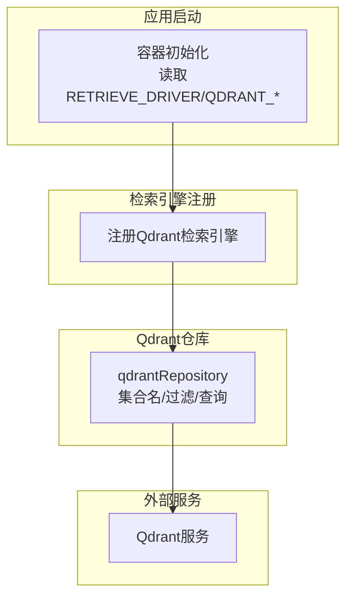
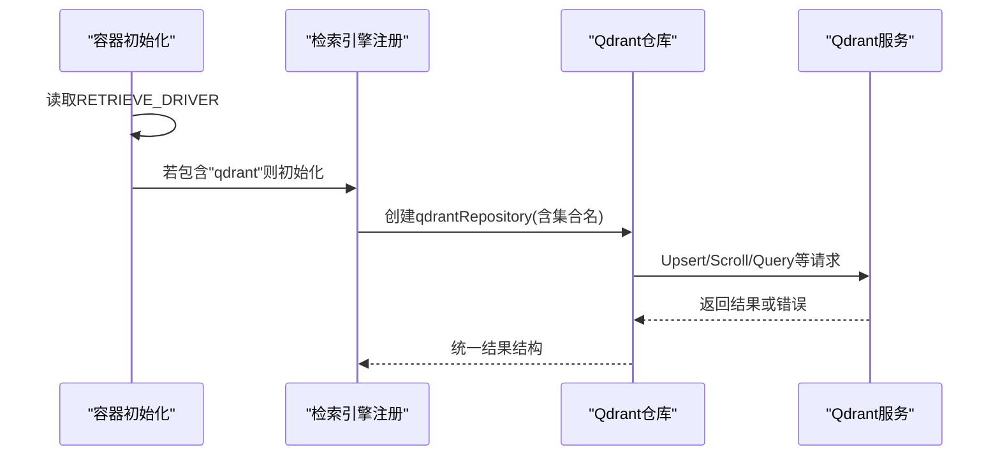
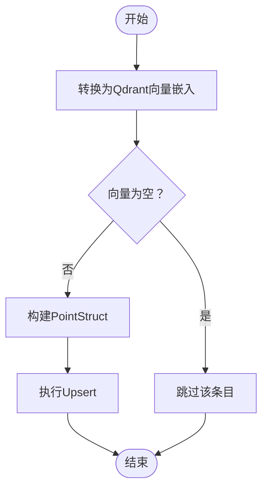
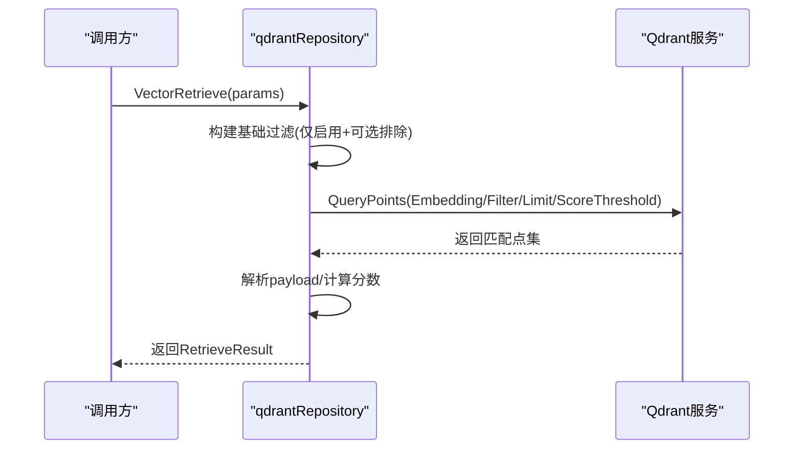
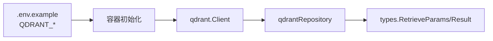

# Qdrant向量存储配置

<cite>
**本文引用的文件**
- [container.go](file://internal/container/container.go)
- [.env.example](file://.env.example)
- [repository.go](file://internal/application/repository/retriever/qdrant/repository.go)
- [structs.go](file://internal/application/repository/retriever/qdrant/structs.go)
- [retriever.go](file://internal/types/retriever.go)
</cite>

## 目录
1. [简介](#简介)
2. [项目结构](#项目结构)
3. [核心组件](#核心组件)
4. [架构总览](#架构总览)
5. [详细组件分析](#详细组件分析)
6. [依赖关系分析](#依赖关系分析)
7. [性能与容量规划](#性能与容量规划)
8. [故障排查指南](#故障排查指南)
9. [结论](#结论)
10. [附录：环境变量与最佳实践](#附录环境变量与最佳实践)

## 简介
本文件面向在WeKnora中启用并配置Qdrant向量存储的用户与开发者，围绕“RETRIEVE_DRIVER=qdrant”这一关键入口，系统讲解QDRANT_HOST、QDRANT_PORT、QDRANT_API_KEY、QDRANT_USE_TLS、QDRANT_COLLECTION等环境变量的配置方法；基于Go代码实现，深入分析qdrant/repository.go中的集合创建、向量插入、相似性搜索、关键词检索、批量更新与复制等流程；并提供集合配置、距离度量类型选择（余弦、欧几里得等）、索引参数优化的最佳实践，以及连接故障排查与性能监控建议。

## 项目结构
与Qdrant集成的关键位置：
- 容器初始化：根据RETRIEVE_DRIVER选择加载Qdrant驱动，并读取QDRANT_*环境变量建立客户端。
- Qdrant仓库实现：封装集合名、Upsert/Scroll/Query等操作，负责向量与元数据的存取。
- 类型定义：检索参数、结果与引擎类型统一由types层定义。

图表来源
- [container.go](file://internal/container/container.go#L427-L473)
- [repository.go](file://internal/application/repository/retriever/qdrant/repository.go#L31-L49)

章节来源
- [container.go](file://internal/container/container.go#L427-L473)
- [repository.go](file://internal/application/repository/retriever/qdrant/repository.go#L31-L49)

## 核心组件
- 检索引擎类型与参数
  - 引擎类型：QdrantRetrieverEngineType
  - 检索类型：KeywordsRetrieverType、VectorRetrieverType
  - 检索参数：Query、Embedding、TopK、Threshold、排除条件、附加参数
- Qdrant仓库
  - 支持能力：关键词检索、向量检索、批量写入、按Chunk/Knowledge/Source删除、批量更新启用状态、复制索引
  - 关键字段：content、source_id、source_type、chunk_id、knowledge_id、knowledge_base_id、embedding、is_enabled

章节来源
- [retriever.go](file://internal/types/retriever.go#L1-L89)
- [structs.go](file://internal/application/repository/retriever/qdrant/structs.go#L1-L25)
- [repository.go](file://internal/application/repository/retriever/qdrant/repository.go#L51-L60)

## 架构总览
下图展示从应用启动到Qdrant检索的关键交互：

图表来源
- [container.go](file://internal/container/container.go#L427-L473)
- [repository.go](file://internal/application/repository/retriever/qdrant/repository.go#L31-L49)

## 详细组件分析

### 1) 启动与环境变量配置
- 启动入口
  - 当RETRIEVE_DRIVER包含"qdrant"时，容器初始化会读取QDRANT_HOST、QDRANT_PORT、QDRANT_API_KEY、QDRANT_USE_TLS等环境变量，构造qdrant.Config并创建客户端，随后注册Qdrant检索引擎。
- 默认行为
  - QDRANT_HOST默认localhost；QDRANT_PORT默认6334；QDRANT_USE_TLS默认false；若显式设置为"false"/"0"则禁用TLS。
- 集合名
  - QDRANT_COLLECTION未设置时，默认使用weknora_embeddings。

章节来源
- [container.go](file://internal/container/container.go#L427-L473)
- [.env.example](file://.env.example#L88-L103)
- [repository.go](file://internal/application/repository/retriever/qdrant/repository.go#L31-L49)

### 2) 集合与字段设计
- 字段映射
  - 内容：content
  - 来源标识：source_id
  - 来源类型：source_type
  - 分块标识：chunk_id
  - 知识标识：knowledge_id
  - 知识库标识：knowledge_base_id
  - 向量：embedding
  - 启用状态：is_enabled
- 集合名
  - 优先使用QDRANT_COLLECTION；未设置时使用默认集合名。

章节来源
- [repository.go](file://internal/application/repository/retriever/qdrant/repository.go#L18-L29)
- [repository.go](file://internal/application/repository/retriever/qdrant/repository.go#L31-L49)

### 3) 向量插入与批量写入
- 单条插入
  - 将IndexInfo转换为QdrantVectorEmbedding，校验embedding非空后，生成唯一pointID，构造PointStruct并调用Upsert。
- 批量插入
  - 对列表逐个转换并过滤空向量，组装PointStruct切片后一次性Upsert，提升吞吐。

图表来源
- [repository.go](file://internal/application/repository/retriever/qdrant/repository.go#L74-L107)
- [repository.go](file://internal/application/repository/retriever/qdrant/repository.go#L109-L154)

章节来源
- [repository.go](file://internal/application/repository/retriever/qdrant/repository.go#L74-L154)

### 4) 相似性搜索（向量检索）
- 过滤条件
  - 默认仅返回is_enabled=true的记录；可按knowledge_base_id、exclude_knowledge_ids、exclude_chunk_ids进行过滤。
- 查询参数
  - 使用传入的Embedding执行QueryPoints，限制TopK并设置ScoreThreshold。
- 结果处理
  - 解析payload为QdrantVectorEmbeddingWithScore，转换为IndexWithScore并封装为RetrieveResult。

图表来源
- [repository.go](file://internal/application/repository/retriever/qdrant/repository.go#L303-L326)
- [repository.go](file://internal/application/repository/retriever/qdrant/repository.go#L347-L400)

章节来源
- [repository.go](file://internal/application/repository/retriever/qdrant/repository.go#L303-L400)

### 5) 关键词检索
- 使用ScrollPoints滚动扫描，按content字段文本匹配，限制TopK并返回结果。
- 适合对内容进行全文检索或关键词匹配的场景。

章节来源
- [repository.go](file://internal/application/repository/retriever/qdrant/repository.go#L402-L451)

### 6) 删除与批量更新
- 按ChunkID/KnowledgeID/SourceID删除
  - 通过DeletePoints+Filter实现。
- 批量更新启用状态
  - 将chunkStatusMap按启用/禁用分组，分别调用SetPayload更新is_enabled字段。

章节来源
- [repository.go](file://internal/application/repository/retriever/qdrant/repository.go#L156-L210)
- [repository.go](file://internal/application/repository/retriever/qdrant/repository.go#L241-L301)

### 7) 索引复制
- 通过ScrollPoints分批拉取源知识库的数据，重写payload中的目标知识库/分块ID，再批量Upsert到目标集合，实现跨KB复制。

章节来源
- [repository.go](file://internal/application/repository/retriever/qdrant/repository.go#L453-L576)

### 8) 存储估算
- 提供估算函数，按payload长度、向量字节数（float32）与HNSW索引大小（默认M=16）计算每条记录的近似占用，便于容量规划。

章节来源
- [repository.go](file://internal/application/repository/retriever/qdrant/repository.go#L602-L632)

## 依赖关系分析
- 容器初始化依赖环境变量决定是否启用Qdrant驱动，并创建qdrant.Client。
- qdrantRepository依赖qdrant.Client与集合名，封装Upsert/Scroll/Query等操作。
- 类型层定义了检索参数、结果与引擎类型，保证不同检索后端的一致接口。

图表来源
- [.env.example](file://.env.example#L88-L103)
- [container.go](file://internal/container/container.go#L427-L473)
- [repository.go](file://internal/application/repository/retriever/qdrant/repository.go#L31-L49)
- [retriever.go](file://internal/types/retriever.go#L1-L89)

章节来源
- [.env.example](file://.env.example#L88-L103)
- [container.go](file://internal/container/container.go#L427-L473)
- [repository.go](file://internal/application/repository/retriever/qdrant/repository.go#L31-L49)
- [retriever.go](file://internal/types/retriever.go#L1-L89)

## 性能与容量规划
- 向量维度与索引
  - HNSW索引默认M=16，索引大小约为dimensions×32×4字节；向量存储为dimensions×4字节；每条记录还包含payload与ID追踪元数据。
- TopK与阈值
  - 合理设置TopK与ScoreThreshold可减少无效匹配，提高召回质量与性能。
- 批量写入
  - 使用BatchSave合并多次Upsert，显著降低网络往返与写入开销。
- 连接与TLS
  - 在高延迟或跨网段场景建议启用TLS；同时注意证书与防火墙策略。
- 容量估算
  - 使用EstimateStorageSize对批量索引进行容量预估，结合业务规模制定扩容计划。

章节来源
- [repository.go](file://internal/application/repository/retriever/qdrant/repository.go#L602-L632)
- [repository.go](file://internal/application/repository/retriever/qdrant/repository.go#L109-L154)

## 故障排查指南
- 启动失败（无法创建Qdrant客户端）
  - 检查QDRANT_HOST/QDRANT_PORT/QDRANT_API_KEY/QDRANT_USE_TLS配置是否正确；确认Qdrant服务可达且端口开放。
- 写入失败（Upsert错误）
  - 确认embedding非空且维度一致；检查集合是否存在且字段类型匹配；查看日志中的具体错误信息。
- 查询无结果
  - 检查is_enabled过滤条件；确认TopK与ScoreThreshold设置是否过严；核对过滤条件（knowledge_base_id/exclude_*）。
- 删除/更新异常
  - 确认传入的ID列表非空；检查过滤条件是否正确；关注批量操作的分组逻辑。
- 复制索引失败
  - 检查源知识库ID映射表是否完整；确认目标集合存在且字段一致；观察分批滚动offset是否正确推进。

章节来源
- [container.go](file://internal/container/container.go#L427-L473)
- [repository.go](file://internal/application/repository/retriever/qdrant/repository.go#L74-L154)
- [repository.go](file://internal/application/repository/retriever/qdrant/repository.go#L303-L400)
- [repository.go](file://internal/application/repository/retriever/qdrant/repository.go#L453-L576)

## 结论
通过RETRIEVE_DRIVER=qdrant即可快速启用Qdrant向量存储。结合QDRANT_HOST、QDRANT_PORT、QDRANT_API_KEY、QDRANT_USE_TLS、QDRANT_COLLECTION等环境变量，配合qdrantRepository提供的插入、检索、删除、更新与复制能力，可在WeKnora中实现稳定高效的向量检索。建议在生产环境中合理设置TopK与阈值、采用批量写入、关注索引参数与容量估算，并完善连接与监控以保障稳定性。

## 附录：环境变量与最佳实践

- 环境变量清单
  - RETRIEVE_DRIVER：设置为qdrant以启用Qdrant驱动
  - QDRANT_HOST：Qdrant服务主机地址，默认localhost
  - QDRANT_PORT：Qdrant服务端口，默认6334
  - QDRANT_API_KEY：可选，用于API密钥认证
  - QDRANT_USE_TLS：可选，true/false或1/0控制是否启用TLS，默认false
  - QDRANT_COLLECTION：可选，集合名称，默认weknora_embeddings

- 最佳实践
  - 集合配置
    - 确保集合存在且字段类型与payload一致；向量维度与Embedding保持一致。
  - 距离度量与索引
    - 余弦相似度通常适用于归一化后的向量；欧几里得适用于未归一化的密集向量；根据Embedding生成策略选择合适度量。
    - HNSW索引M值影响索引大小与查询速度，可根据数据规模与查询延迟权衡调整。
  - 参数调优
    - TopK与ScoreThreshold：先宽松后收紧，逐步优化召回质量与响应时间。
    - 批量写入：合并多条Upsert，减少网络开销。
  - 监控与告警
    - 记录写入/查询成功率、延迟分布、错误码统计；对高频过滤条件与慢查询进行专项优化。

章节来源
- [.env.example](file://.env.example#L88-L103)
- [container.go](file://internal/container/container.go#L427-L473)
- [repository.go](file://internal/application/repository/retriever/qdrant/repository.go#L602-L632)