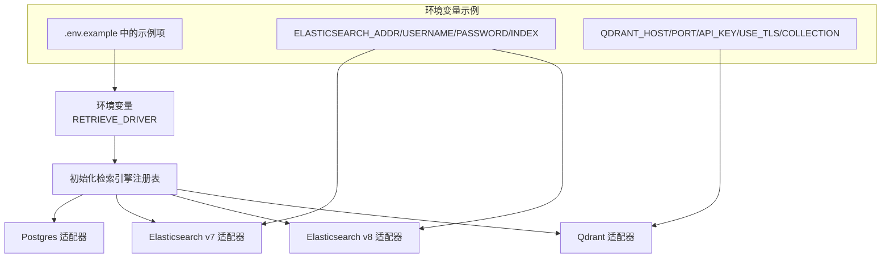
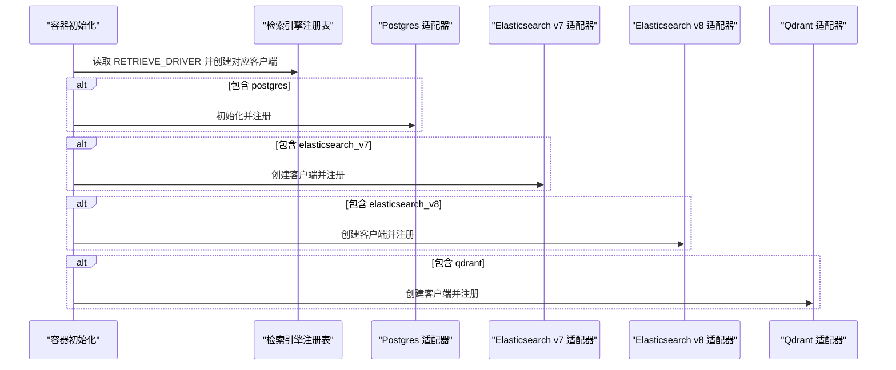
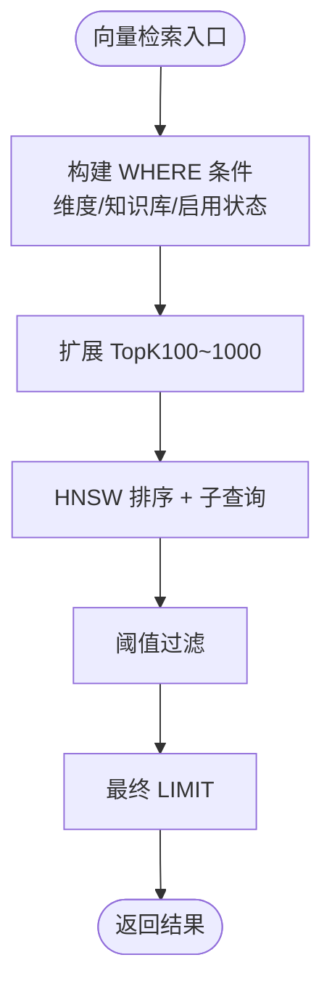
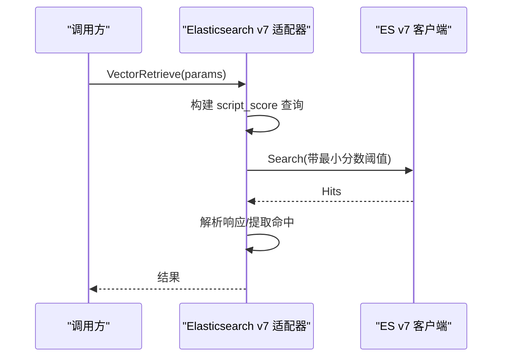
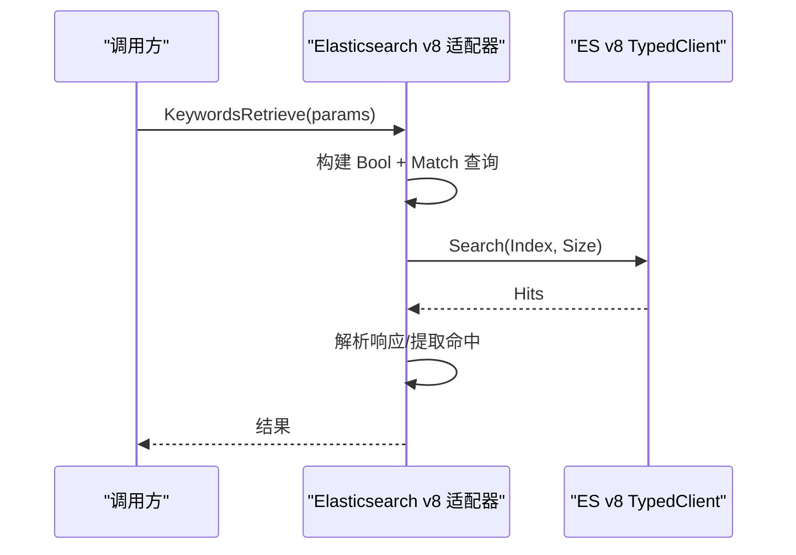
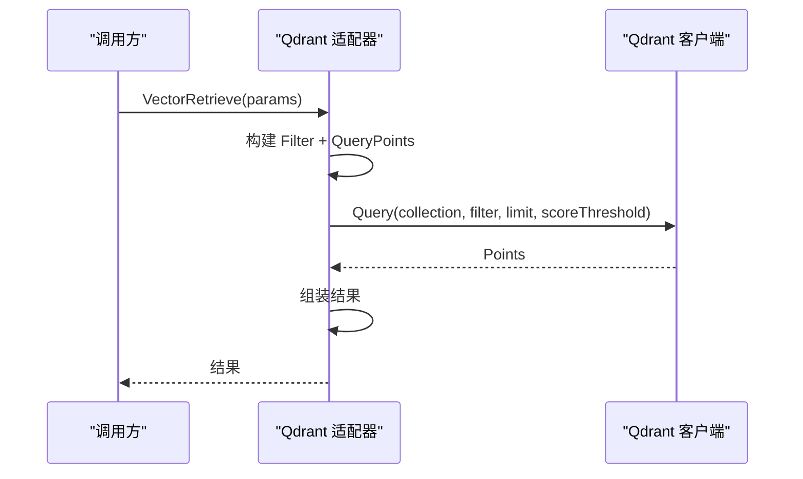
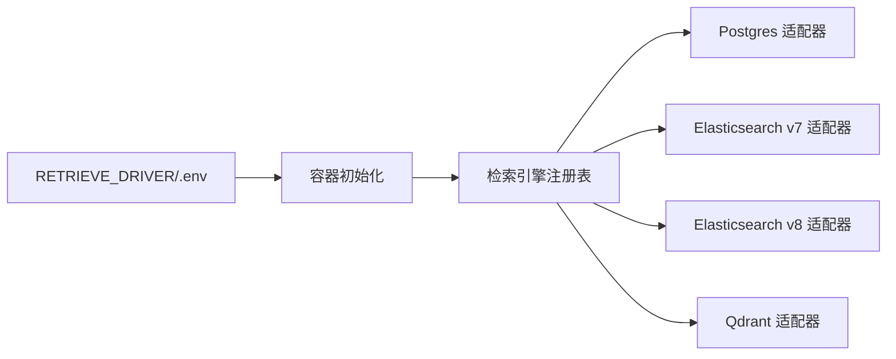

# 向量存储配置

<cite>
**本文引用的文件**
- [container.go](file://internal/container/container.go)
- [.env.example](file://.env.example)
- [repository.go（Postgres）](file://internal/application/repository/retriever/postgres/repository.go)
- [repository.go（Elasticsearch v7）](file://internal/application/repository/retriever/elasticsearch/v7/repository.go)
- [repository.go（Elasticsearch v8）](file://internal/application/repository/retriever/elasticsearch/v8/repository.go)
- [repository.go（Qdrant）](file://internal/application/repository/retriever/qdrant/repository.go)
- [system.go](file://internal/handler/system.go)
</cite>

## 目录
1. [简介](#简介)
2. [项目结构与适配器概览](#项目结构与适配器概览)
3. [核心组件与配置要点](#核心组件与配置要点)
4. [架构总览](#架构总览)
5. [详细组件分析](#详细组件分析)
6. [依赖关系分析](#依赖关系分析)
7. [性能与容量估算](#性能与容量估算)
8. [故障排查与连接测试](#故障排查与连接测试)
9. [结论](#结论)

## 简介
本文件面向系统运维与开发人员，提供在 WeKnora 中配置与使用四种向量存储后端（Postgres、Elasticsearch v7、Elasticsearch v8、Qdrant）的完整指南。内容覆盖：
- 关键环境变量与配置项的设置方法
- 各适配器的工作原理与性能差异
- Elasticsearch 索引与 Qdrant 集合的配置建议
- 错误处理与连接测试的实操指引

## 项目结构与适配器概览
系统通过统一的检索引擎注册流程按需加载多种向量存储后端。RETRIEVE_DRIVER 控制启用哪些后端，容器初始化时根据该变量创建对应客户端并注册到检索引擎注册表中。

图表来源
- [container.go](file://internal/container/container.go#L358-L475)
- [.env.example](file://.env.example#L17-L103)

章节来源
- [container.go](file://internal/container/container.go#L358-L475)
- [.env.example](file://.env.example#L17-L103)

## 核心组件与配置要点
- RETRIEVE_DRIVER：以逗号分隔的驱动列表，支持 postgres、elasticsearch_v7、elasticsearch_v8、qdrant。系统会据此创建对应客户端并注册到检索引擎注册表。
- Elasticsearch 关键参数：
  - ELASTICSEARCH_ADDR：ES 地址（如 http://localhost:9200）
  - ELASTICSEARCH_USERNAME：用户名（可选）
  - ELASTICSEARCH_PASSWORD：密码（可选）
  - ELASTICSEARCH_INDEX：索引名（默认 xwrag_default）
- Qdrant 关键参数：
  - QDRANT_HOST：主机（默认 localhost）
  - QDRANT_PORT：端口（默认 6334）
  - QDRANT_API_KEY：API 密钥（可选）
  - QDRANT_USE_TLS：是否启用 TLS（默认 false；显式设置为 false 或 0 将禁用）
  - QDRANT_COLLECTION：集合名（默认 weknora_embeddings）

章节来源
- [container.go](file://internal/container/container.go#L358-L475)
- [.env.example](file://.env.example#L75-L103)

## 架构总览
下图展示检索引擎注册与各后端适配器的关系，以及检索请求在不同后端中的执行路径。

图表来源
- [container.go](file://internal/container/container.go#L358-L475)

章节来源
- [container.go](file://internal/container/container.go#L358-L475)

## 详细组件分析

### Postgres 适配器
- 支持能力
  - 关键词检索：基于全文检索与过滤条件查询
  - 向量检索：使用半精度向量与 HNSW 索引，先排序再阈值过滤，提升性能
- 关键实现要点
  - 维度过滤与 is_enabled 过滤参与 WHERE 条件，确保索引命中
  - 扩展 TopK（最小 100，最大 1000）以减少阈值过滤成本
  - 批量复制与批量更新状态采用分页与批量写入策略
- 环境变量
  - 由数据库连接配置决定（非直接环境变量），但检索参数（TopK、阈值、过滤字段）来自检索请求
- 容量估算
  - 单条索引占用 ≈ 文本内容 + 向量（半精度 2 字节/维）+ 元数据 + HNSW 索引开销（约 2×向量）

图表来源
- [repository.go（Postgres）](file://internal/application/repository/retriever/postgres/repository.go#L230-L351)

章节来源
- [repository.go（Postgres）](file://internal/application/repository/retriever/postgres/repository.go#L44-L76)
- [repository.go（Postgres）](file://internal/application/repository/retriever/postgres/repository.go#L230-L351)
- [repository.go（Postgres）](file://internal/application/repository/retriever/postgres/repository.go#L353-L467)

### Elasticsearch v7 适配器
- 支持能力
  - 关键词检索（关键词检索）
  - 向量检索（通过 script_score + cosineSimilarity）
- 关键实现要点
  - 默认索引名：ELASTICSEARCH_INDEX（未设置时使用默认值）
  - 使用脚本评分计算相似度，支持最小分数阈值
  - 批量写入采用 Bulk 请求体拼接
  - 删除支持按 chunk_id/source_id/knowledge_id 的 terms 查询
- 环境变量
  - ELASTICSEARCH_ADDR、ELASTICSEARCH_USERNAME、ELASTICSEARCH_PASSWORD、ELASTICSEARCH_INDEX

图表来源
- [repository.go（Elasticsearch v7）](file://internal/application/repository/retriever/elasticsearch/v7/repository.go#L443-L518)
- [repository.go（Elasticsearch v7）](file://internal/application/repository/retriever/elasticsearch/v7/repository.go#L519-L621)

章节来源
- [repository.go（Elasticsearch v7）](file://internal/application/repository/retriever/elasticsearch/v7/repository.go#L33-L48)
- [repository.go（Elasticsearch v7）](file://internal/application/repository/retriever/elasticsearch/v7/repository.go#L443-L518)
- [repository.go（Elasticsearch v7）](file://internal/application/repository/retriever/elasticsearch/v7/repository.go#L519-L621)

### Elasticsearch v8 适配器
- 支持能力
  - 关键词检索、向量检索（支持向量检索）
- 关键实现要点
  - 自动检查并创建索引（若不存在）
  - 使用 TypedClient，脚本评分与最小分数阈值一致
  - 批量写入使用 Bulk API 的 CreateOp
  - 删除使用 DeleteByQuery + Terms 查询
- 环境变量
  - ELASTICSEARCH_ADDR、ELASTICSEARCH_USERNAME、ELASTICSEARCH_PASSWORD、ELASTICSEARCH_INDEX

图表来源
- [repository.go（Elasticsearch v8）](file://internal/application/repository/retriever/elasticsearch/v8/repository.go#L388-L441)

章节来源
- [repository.go（Elasticsearch v8）](file://internal/application/repository/retriever/elasticsearch/v8/repository.go#L26-L49)
- [repository.go（Elasticsearch v8）](file://internal/application/repository/retriever/elasticsearch/v8/repository.go#L316-L441)
- [repository.go（Elasticsearch v8）](file://internal/application/repository/retriever/elasticsearch/v8/repository.go#L443-L515)

### Qdrant 适配器
- 支持能力
  - 关键词检索（文本匹配 + 滚动）
  - 向量检索（QueryPoints + 分数阈值）
- 关键实现要点
  - 默认集合名：QDRANT_COLLECTION（未设置时使用默认值）
  - 默认端口 6334，支持 API Key 与 TLS（默认关闭）
  - 过滤条件包含 is_enabled=true、知识库 ID、排除 ID 列表
  - 批量复制使用 Scroll + Upsert
- 环境变量
  - QDRANT_HOST、QDRANT_PORT、QDRANT_API_KEY、QDRANT_USE_TLS、QDRANT_COLLECTION

图表来源
- [repository.go（Qdrant）](file://internal/application/repository/retriever/qdrant/repository.go#L347-L400)

章节来源
- [repository.go（Qdrant）](file://internal/application/repository/retriever/qdrant/repository.go#L18-L49)
- [repository.go（Qdrant）](file://internal/application/repository/retriever/qdrant/repository.go#L347-L451)
- [repository.go（Qdrant）](file://internal/application/repository/retriever/qdrant/repository.go#L453-L576)

## 依赖关系分析
- 容器层负责根据 RETRIEVE_DRIVER 动态创建各后端客户端并注册到检索引擎注册表
- 各适配器均实现统一的检索接口，支持关键词与向量两种检索类型（部分后端仅支持关键词）
- 系统侧通过环境变量控制后端选择与连接参数

图表来源
- [container.go](file://internal/container/container.go#L358-L475)
- [.env.example](file://.env.example#L17-L103)

章节来源
- [container.go](file://internal/container/container.go#L358-L475)
- [.env.example](file://.env.example#L17-L103)

## 性能与容量估算
- Postgres
  - 向量存储采用半精度（2 字节/维），HNSW 索引开销约为向量大小的 2 倍
  - 建议：合理设置 TopK 扩展范围（100~1000），避免过大的阈值过滤导致回表
- Elasticsearch v7/v8
  - script_score + cosineSimilarity，最小分数阈值可显著减少返回集
  - v8 会自动创建索引，建议提前建立合适的映射与分片策略
- Qdrant
  - 默认 HNSW 参数（M=16），向量存储与索引开销按维度线性增长
  - 建议：根据业务规模调整集合分片与副本，启用 TLS 与 API Key 提升安全性

章节来源
- [repository.go（Postgres）](file://internal/application/repository/retriever/postgres/repository.go#L44-L76)
- [repository.go（Elasticsearch v7）](file://internal/application/repository/retriever/elasticsearch/v7/repository.go#L61-L82)
- [repository.go（Elasticsearch v8）](file://internal/application/repository/retriever/elasticsearch/v8/repository.go#L61-L82)
- [repository.go（Qdrant）](file://internal/application/repository/retriever/qdrant/repository.go#L603-L632)

## 故障排查与连接测试

### 环境变量与配置核对
- 确认 RETRIEVE_DRIVER 已包含目标后端（postgres、elasticsearch_v7、elasticsearch_v8、qdrant）
- Elasticsearch
  - ELASTICSEARCH_ADDR、ELASTICSEARCH_USERNAME、ELASTICSEARCH_PASSWORD、ELASTICSEARCH_INDEX
- Qdrant
  - QDRANT_HOST、QDRANT_PORT、QDRANT_API_KEY、QDRANT_USE_TLS、QDRANT_COLLECTION

章节来源
- [.env.example](file://.env.example#L17-L103)
- [container.go](file://internal/container/container.go#L358-L475)

### 启动期连接与注册检查
- 容器初始化会尝试创建各后端客户端并注册到检索引擎注册表。若创建失败，日志会记录错误原因（如连接失败、认证失败等）。请关注启动日志中的“Create ... client failed”和“Register ... retrieve engine failed”。

章节来源
- [container.go](file://internal/container/container.go#L383-L403)
- [container.go](file://internal/container/container.go#L405-L473)

### 检索能力确认
- 通过系统状态接口查看当前启用的向量存储后端（支持向量检索的引擎会显示）。

章节来源
- [system.go](file://internal/handler/system.go#L99-L132)

### 常见问题定位
- Elasticsearch
  - 若脚本评分报错或相似度异常，检查查询向量维度与索引映射是否一致
  - 若批量写入失败，检查 Bulk 响应中的错误项并逐条定位
- Qdrant
  - 若查询无结果，检查 is_enabled 过滤、集合名与过滤条件
  - 若滚动复制卡住，检查分页偏移与集合数据量
- Postgres
  - 若向量检索慢，检查 HNSW 索引是否生效、维度过滤是否正确传入

章节来源
- [repository.go（Elasticsearch v7）](file://internal/application/repository/retriever/elasticsearch/v7/repository.go#L519-L621)
- [repository.go（Elasticsearch v8）](file://internal/application/repository/retriever/elasticsearch/v8/repository.go#L316-L441)
- [repository.go（Qdrant）](file://internal/application/repository/retriever/qdrant/repository.go#L347-L451)
- [repository.go（Postgres）](file://internal/application/repository/retriever/postgres/repository.go#L230-L351)

## 结论
- 通过 RETRIEVE_DRIVER 与 .env 中的关键参数，系统可灵活启用多种向量存储后端
- Elasticsearch v8 在初始化时自动创建索引，适合快速上线；Elasticsearch v7 与 Qdrant 提供更细粒度的过滤与查询能力
- Postgres 适配器针对 HNSW 索引做了针对性优化，适合对 SQL 生态有依赖的场景
- 建议结合业务规模与查询特征选择合适后端，并在生产环境启用 TLS、API Key 与合理的索引/集合配置