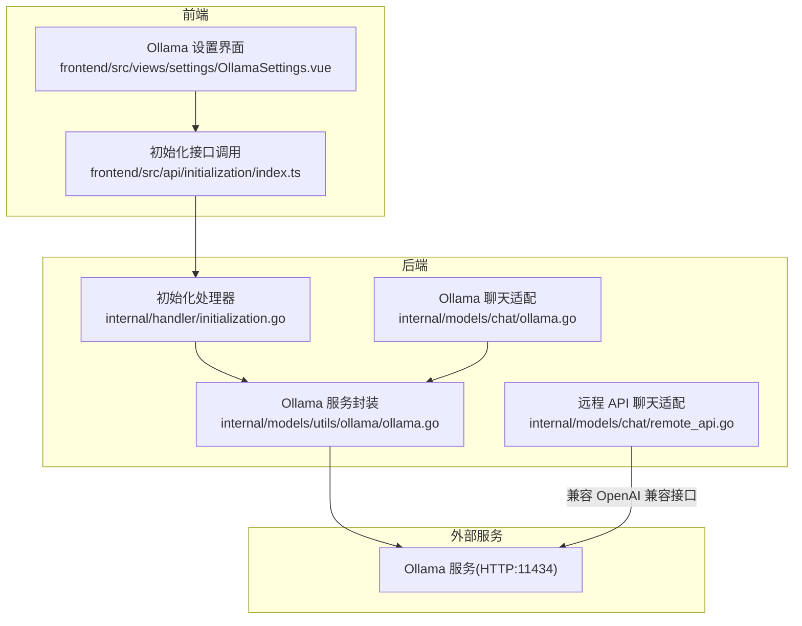
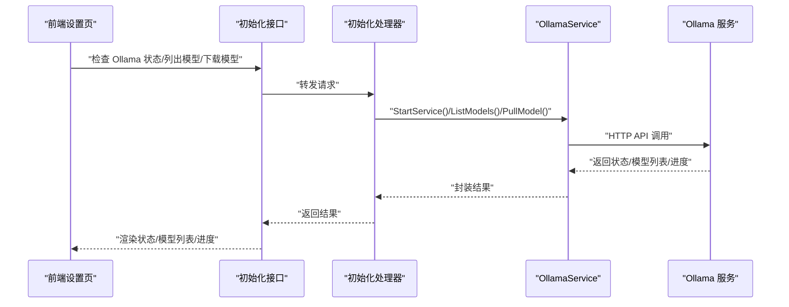
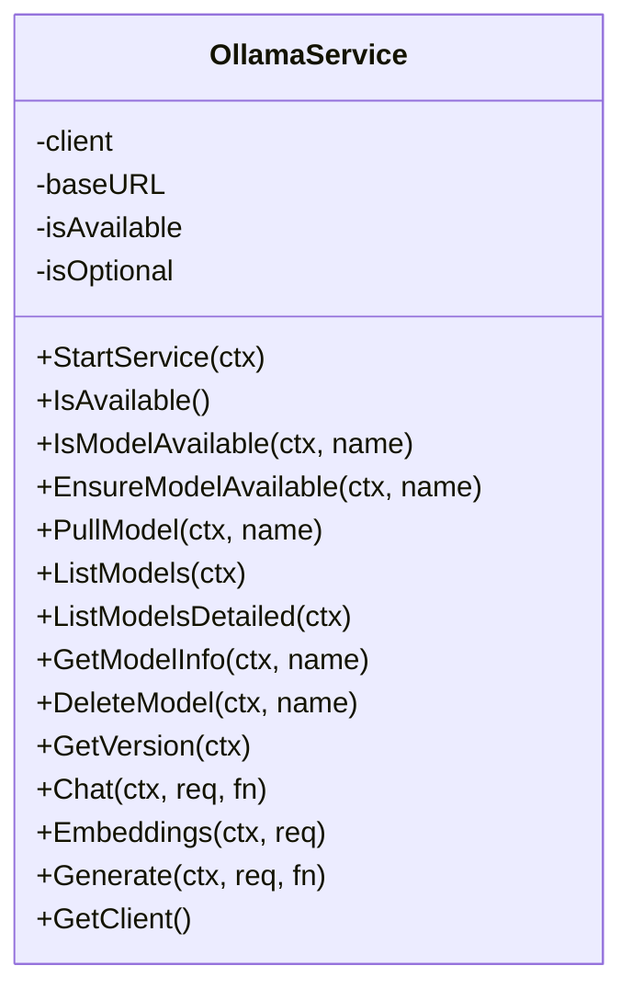
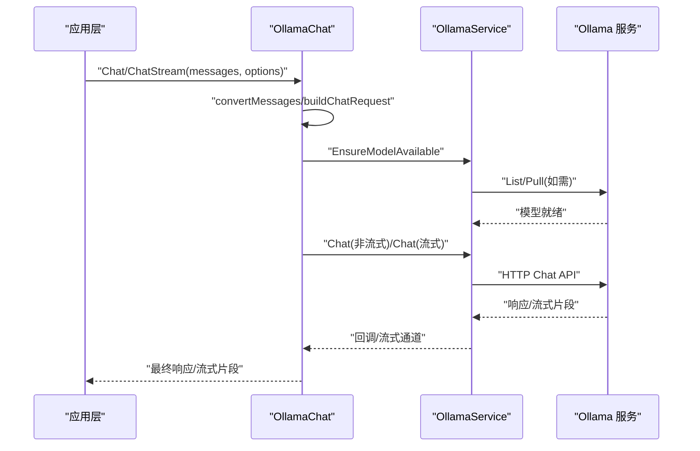
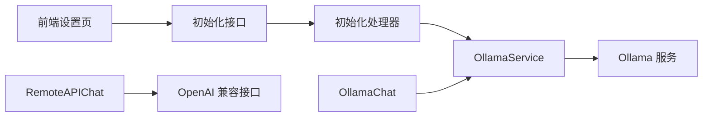

# 大模型服务集成配置

<cite>
**本文引用的文件**
- [.env.example](file://.env.example)
- [scripts/start_all.sh](file://scripts/start_all.sh)
- [scripts/check-env.sh](file://scripts/check-env.sh)
- [internal/models/utils/ollama/ollama.go](file://internal/models/utils/ollama/ollama.go)
- [internal/models/chat/ollama.go](file://internal/models/chat/ollama.go)
- [internal/models/chat/remote_api.go](file://internal/models/chat/remote_api.go)
- [frontend/src/views/settings/OllamaSettings.vue](file://frontend/src/views/settings/OllamaSettings.vue)
- [frontend/src/api/initialization/index.ts](file://frontend/src/api/initialization/index.ts)
- [internal/handler/initialization.go](file://internal/handler/initialization.go)
</cite>

## 目录
1. [简介](#简介)
2. [项目结构](#项目结构)
3. [核心组件](#核心组件)
4. [架构总览](#架构总览)
5. [详细组件分析](#详细组件分析)
6. [依赖关系分析](#依赖关系分析)
7. [性能考量](#性能考量)
8. [故障排查指南](#故障排查指南)
9. [结论](#结论)
10. [附录](#附录)

## 简介
本文件面向需要在系统中集成大模型服务的开发者与运维人员，重点说明 OLLAMA_BASE_URL 环境变量的设置方法及其在连接本地或远程 Ollama 服务时的作用；结合 Go 客户端代码，解释如何通过 HTTP API 与 Ollama 服务通信，包括模型加载、推理请求与流式响应处理；并提供跨网络访问配置建议（如使用 host.docker.internal），以及在使用其他大模型（如 Qwen、DeepSeek）时的适配方法。

## 项目结构
围绕“大模型服务集成”的关键文件分布如下：
- 环境变量与脚本：.env.example、scripts/start_all.sh、scripts/check-env.sh
- Go 客户端与服务封装：internal/models/utils/ollama/ollama.go、internal/models/chat/ollama.go、internal/models/chat/remote_api.go
- 前端设置与初始化接口：frontend/src/views/settings/OllamaSettings.vue、frontend/src/api/initialization/index.ts
- 初始化处理器（含 Ollama 模型拉取与状态检查）：internal/handler/initialization.go

图表来源
- [frontend/src/views/settings/OllamaSettings.vue](file://frontend/src/views/settings/OllamaSettings.vue#L1-L120)
- [frontend/src/api/initialization/index.ts](file://frontend/src/api/initialization/index.ts#L147-L181)
- [internal/handler/initialization.go](file://internal/handler/initialization.go#L1-L120)
- [internal/models/utils/ollama/ollama.go](file://internal/models/utils/ollama/ollama.go#L1-L60)
- [internal/models/chat/ollama.go](file://internal/models/chat/ollama.go#L1-L75)
- [internal/models/chat/remote_api.go](file://internal/models/chat/remote_api.go#L1-L45)

章节来源
- [frontend/src/views/settings/OllamaSettings.vue](file://frontend/src/views/settings/OllamaSettings.vue#L1-L120)
- [frontend/src/api/initialization/index.ts](file://frontend/src/api/initialization/index.ts#L147-L181)
- [internal/handler/initialization.go](file://internal/handler/initialization.go#L1-L120)
- [internal/models/utils/ollama/ollama.go](file://internal/models/utils/ollama/ollama.go#L1-L60)
- [internal/models/chat/ollama.go](file://internal/models/chat/ollama.go#L1-L75)
- [internal/models/chat/remote_api.go](file://internal/models/chat/remote_api.go#L1-L45)

## 核心组件
- OLLAMA_BASE_URL 环境变量：决定 Ollama 服务的访问地址，默认值为 http://host.docker.internal:11434，便于容器内访问宿主机 Ollama 服务。
- OllamaService：封装 Ollama 官方 Go 客户端，负责心跳检测、模型列表查询、模型拉取、模型可用性保障、版本查询、模型信息查询、模型删除等。
- OllamaChat：将内部消息格式转换为 Ollama API 请求，支持非流式与流式两种聊天方式。
- RemoteAPIChat：适配 OpenAI 兼容接口，支持 Qwen、DeepSeek 等第三方模型，具备工具调用、温度、TopP、最大生成长度等参数映射。
- 初始化处理器：提供 Ollama 状态检查、模型列表查询、模型下载任务管理等能力，供前端设置页调用。

章节来源
- [.env.example](file://.env.example#L10-L12)
- [internal/models/utils/ollama/ollama.go](file://internal/models/utils/ollama/ollama.go#L1-L60)
- [internal/models/chat/ollama.go](file://internal/models/chat/ollama.go#L1-L75)
- [internal/models/chat/remote_api.go](file://internal/models/chat/remote_api.go#L1-L45)
- [internal/handler/initialization.go](file://internal/handler/initialization.go#L1-L120)

## 架构总览
系统通过前端设置页发起初始化请求，后端初始化处理器调用 OllamaService 与 Ollama 服务交互，完成模型可用性校验、模型拉取与状态反馈；同时，聊天流程通过 OllamaChat 或 RemoteAPIChat 适配不同模型来源。

图表来源
- [frontend/src/views/settings/OllamaSettings.vue](file://frontend/src/views/settings/OllamaSettings.vue#L180-L222)
- [frontend/src/api/initialization/index.ts](file://frontend/src/api/initialization/index.ts#L147-L181)
- [internal/handler/initialization.go](file://internal/handler/initialization.go#L1-L120)
- [internal/models/utils/ollama/ollama.go](file://internal/models/utils/ollama/ollama.go#L62-L124)

## 详细组件分析

### OLLAMA_BASE_URL 环境变量与跨网络访问
- 默认值与用途
  - 默认值：http://host.docker.internal:11434，便于容器内访问宿主机 Ollama 服务。
  - 作用：作为 Ollama 官方 Go 客户端的 BaseURL，决定后续所有 HTTP API 调用的根地址。
- 本地 vs 远程
  - 本地：通常为 http://localhost:11434 或 http://host.docker.internal:11434。
  - 远程：填写远端 Ollama 服务地址，如 https://your-host:11434。
- 脚本辅助
  - scripts/start_all.sh 会读取 OLLAMA_BASE_URL 并判断是否为远程服务，进行相应提示与健康检查。
  - scripts/check-env.sh 会检查 OLLAMA_BASE_URL 是否设置，确保初始化流程可用。

章节来源
- [.env.example](file://.env.example#L10-L12)
- [scripts/start_all.sh](file://scripts/start_all.sh#L154-L172)
- [scripts/start_all.sh](file://scripts/start_all.sh#L496-L537)
- [scripts/check-env.sh](file://scripts/check-env.sh#L96-L107)

### OllamaService：HTTP API 与模型生命周期
- 初始化与心跳
  - 从环境变量读取 OLLAMA_BASE_URL，构造官方客户端；支持 OLLAMA_OPTIONAL=true 时，服务不可用也不中断应用。
  - Heartbeat 用于检测服务可用性，维护 isAvailable 状态。
- 模型可用性与拉取
  - IsModelAvailable：先检查服务可用性，再通过 List 比对模型是否存在；若无版本后缀则自动追加 :latest。
  - EnsureModelAvailable：若模型不存在则触发 PullModel，并持续输出进度。
  - PullModel：调用官方 Pull API，回调中输出状态与百分比。
- 模型管理
  - ListModels/ListModelsDetailed：获取模型列表与详细信息。
  - GetModelInfo/DeleteModel：查询与删除模型。
  - GetVersion：获取 Ollama 版本。
- 聊天与嵌入
  - Chat/Embeddings/Generate：封装官方 Chat/Embed/Generate，统一前置服务可用性检查。

图表来源
- [internal/models/utils/ollama/ollama.go](file://internal/models/utils/ollama/ollama.go#L1-L60)
- [internal/models/utils/ollama/ollama.go](file://internal/models/utils/ollama/ollama.go#L93-L124)
- [internal/models/utils/ollama/ollama.go](file://internal/models/utils/ollama/ollama.go#L126-L176)
- [internal/models/utils/ollama/ollama.go](file://internal/models/utils/ollama/ollama.go#L203-L215)
- [internal/models/utils/ollama/ollama.go](file://internal/models/utils/ollama/ollama.go#L237-L249)
- [internal/models/utils/ollama/ollama.go](file://internal/models/utils/ollama/ollama.go#L259-L297)
- [internal/models/utils/ollama/ollama.go](file://internal/models/utils/ollama/ollama.go#L319-L354)

章节来源
- [internal/models/utils/ollama/ollama.go](file://internal/models/utils/ollama/ollama.go#L1-L60)
- [internal/models/utils/ollama/ollama.go](file://internal/models/utils/ollama/ollama.go#L93-L124)
- [internal/models/utils/ollama/ollama.go](file://internal/models/utils/ollama/ollama.go#L126-L176)
- [internal/models/utils/ollama/ollama.go](file://internal/models/utils/ollama/ollama.go#L203-L215)
- [internal/models/utils/ollama/ollama.go](file://internal/models/utils/ollama/ollama.go#L237-L249)
- [internal/models/utils/ollama/ollama.go](file://internal/models/utils/ollama/ollama.go#L259-L297)
- [internal/models/utils/ollama/ollama.go](file://internal/models/utils/ollama/ollama.go#L319-L354)

### OllamaChat：消息格式转换与聊天流程
- 消息转换
  - 将内部消息结构转换为 Ollama API 的消息数组，支持角色与内容映射。
- 非流式聊天
  - 构造 ChatRequest，设置模型、消息、选项（温度、TopP、最大生成长度、思维开关等），通过 Chat 回调获取最终内容与 Token 统计。
- 流式聊天
  - 同样构造 ChatRequest，设置 Stream=true；在回调中逐块推送内容，结束时发送 Done 标记。

图表来源
- [internal/models/chat/ollama.go](file://internal/models/chat/ollama.go#L29-L73)
- [internal/models/chat/ollama.go](file://internal/models/chat/ollama.go#L75-L120)
- [internal/models/chat/ollama.go](file://internal/models/chat/ollama.go#L122-L175)
- [internal/models/utils/ollama/ollama.go](file://internal/models/utils/ollama/ollama.go#L178-L201)
- [internal/models/utils/ollama/ollama.go](file://internal/models/utils/ollama/ollama.go#L319-L354)

章节来源
- [internal/models/chat/ollama.go](file://internal/models/chat/ollama.go#L29-L73)
- [internal/models/chat/ollama.go](file://internal/models/chat/ollama.go#L75-L120)
- [internal/models/chat/ollama.go](file://internal/models/chat/ollama.go#L122-L175)
- [internal/models/utils/ollama/ollama.go](file://internal/models/utils/ollama/ollama.go#L178-L201)
- [internal/models/utils/ollama/ollama.go](file://internal/models/utils/ollama/ollama.go#L319-L354)

### RemoteAPIChat：适配 Qwen、DeepSeek 等第三方模型
- 兼容 OpenAI 兼容接口
  - 通过 openai.Client 配置 BaseURL 与 API Key，实现与 OpenAI 兼容的聊天接口。
- 模型差异化处理
  - Qwen：在非流式请求中强制禁用思维开关；对特定模型（如 qwen3-）进行特殊处理。
  - DeepSeek：不支持 tool_choice，自动跳过设置。
- 参数映射
  - Temperature、TopP、MaxTokens、MaxCompletionTokens、频率/存在惩罚、工具定义与选择等均映射至 OpenAI 兼容请求。
- 流式与工具调用
  - 支持流式响应与工具调用（tool_calls）的序列化与还原。

章节来源
- [internal/models/chat/remote_api.go](file://internal/models/chat/remote_api.go#L1-L45)
- [internal/models/chat/remote_api.go](file://internal/models/chat/remote_api.go#L87-L111)
- [internal/models/chat/remote_api.go](file://internal/models/chat/remote_api.go#L113-L196)
- [internal/models/chat/remote_api.go](file://internal/models/chat/remote_api.go#L198-L200)

### 前端设置与初始化接口
- 设置页
  - 提供 Ollama 服务状态检测、模型列表刷新、模型下载与进度查询。
  - 初始化时优先使用后端返回的 baseUrl，否则回退到默认值。
- 初始化接口
  - 提供检查 Ollama 状态、列出模型、下载模型的任务 ID 与进度查询等 API。

章节来源
- [frontend/src/views/settings/OllamaSettings.vue](file://frontend/src/views/settings/OllamaSettings.vue#L180-L222)
- [frontend/src/views/settings/OllamaSettings.vue](file://frontend/src/views/settings/OllamaSettings.vue#L224-L321)
- [frontend/src/views/settings/OllamaSettings.vue](file://frontend/src/views/settings/OllamaSettings.vue#L323-L376)
- [frontend/src/api/initialization/index.ts](file://frontend/src/api/initialization/index.ts#L147-L181)

### 初始化处理器：模型拉取与状态管理
- 下载任务管理
  - 维护全局下载任务 map，记录任务 ID、模型名、状态、进度、开始/结束时间。
- Ollama 状态与模型操作
  - 提供 Ollama 状态检查、模型列表查询、模型拉取进度查询等能力，供前端设置页调用。

章节来源
- [internal/handler/initialization.go](file://internal/handler/initialization.go#L1-L120)
- [internal/handler/initialization.go](file://internal/handler/initialization.go#L200-L400)

## 依赖关系分析
- 组件耦合
  - OllamaChat 依赖 OllamaService；OllamaService 依赖 Ollama 官方 Go 客户端。
  - RemoteAPIChat 依赖 openai.Client，通过 BaseURL 与第三方模型兼容。
  - 初始化处理器依赖 OllamaService 与前端设置页 API。
- 外部依赖
  - Ollama 服务（HTTP:11434），支持本地与远程部署。
  - 第三方模型（Qwen、DeepSeek 等）通过 OpenAI 兼容接口接入。

图表来源
- [internal/models/utils/ollama/ollama.go](file://internal/models/utils/ollama/ollama.go#L1-L60)
- [internal/models/chat/ollama.go](file://internal/models/chat/ollama.go#L1-L75)
- [internal/models/chat/remote_api.go](file://internal/models/chat/remote_api.go#L1-L45)
- [internal/handler/initialization.go](file://internal/handler/initialization.go#L1-L120)

## 性能考量
- 流式响应
  - 使用流式接口可显著降低首字节延迟，适合长文本生成与工具调用场景。
- 模型预热
  - 在容器启动或初始化阶段提前拉取常用模型，减少首次请求等待。
- 并发与重试
  - 对第三方模型接口建议增加指数退避与重试策略，避免瞬时错误导致失败。
- 日志与可观测性
  - 记录模型拉取进度、推理耗时与 Token 使用统计，便于定位性能瓶颈。

## 故障排查指南
- OLLAMA_BASE_URL 未设置或错误
  - 现象：初始化失败或无法连接 Ollama。
  - 处理：在 .env 中设置正确的 OLLAMA_BASE_URL；脚本会检查该变量。
- 服务不可用
  - 现象：Heartbeat 失败，isAvailable=false。
  - 处理：确认 Ollama 服务已启动；若设置 OLLAMA_OPTIONAL=true，系统将继续运行但模型相关功能受限。
- 模型不存在
  - 现象：IsModelAvailable 返回 false。
  - 处理：通过 EnsureModelAvailable 自动拉取；或手动在前端设置页下载。
- 远程访问异常
  - 现象：容器内无法访问宿主机 Ollama。
  - 处理：使用 http://host.docker.internal:11434；确保防火墙与端口开放。
- 第三方模型工具调用不生效
  - 现象：DeepSeek 不支持 tool_choice。
  - 处理：不设置 tool_choice，让 API 自动使用工具；或切换到支持 tool_choice 的模型。

章节来源
- [scripts/check-env.sh](file://scripts/check-env.sh#L96-L107)
- [internal/models/utils/ollama/ollama.go](file://internal/models/utils/ollama/ollama.go#L62-L84)
- [internal/models/utils/ollama/ollama.go](file://internal/models/utils/ollama/ollama.go#L93-L124)
- [internal/models/chat/remote_api.go](file://internal/models/chat/remote_api.go#L170-L196)

## 结论
通过 OLLAMA_BASE_URL 环境变量与 OllamaService 的封装，系统实现了对本地与远程 Ollama 服务的统一接入；配合 OllamaChat 的消息转换与流式处理，满足多样化的聊天需求。同时，RemoteAPIChat 提供了对 Qwen、DeepSeek 等第三方模型的适配能力。建议在生产环境中固定 OLLAMA_BASE_URL，开启 OLLAMA_OPTIONAL 以增强健壮性，并结合前端设置页进行模型管理与状态监控。

## 附录
- 环境变量清单
  - OLLAMA_BASE_URL：Ollama 服务地址（默认 http://host.docker.internal:11434）
  - OLLAMA_OPTIONAL：是否将 Ollama 设为可选（true/false）
  - DEEPSEEK_API_KEY、ALIYUN_API_KEY：第三方模型 API 密钥
- 跨网络访问建议
  - 容器内访问宿主机：使用 host.docker.internal:11434
  - 远程服务：填写远端 HTTPS 地址，确保端口开放与证书有效
- 第三方模型适配要点
  - Qwen：非流式请求中禁用思维开关；特定模型（如 qwen3-）需特殊处理
  - DeepSeek：不支持 tool_choice，自动跳过设置

章节来源
- [.env.example](file://.env.example#L10-L12)
- [internal/models/chat/remote_api.go](file://internal/models/chat/remote_api.go#L87-L111)
- [internal/models/chat/remote_api.go](file://internal/models/chat/remote_api.go#L170-L196)