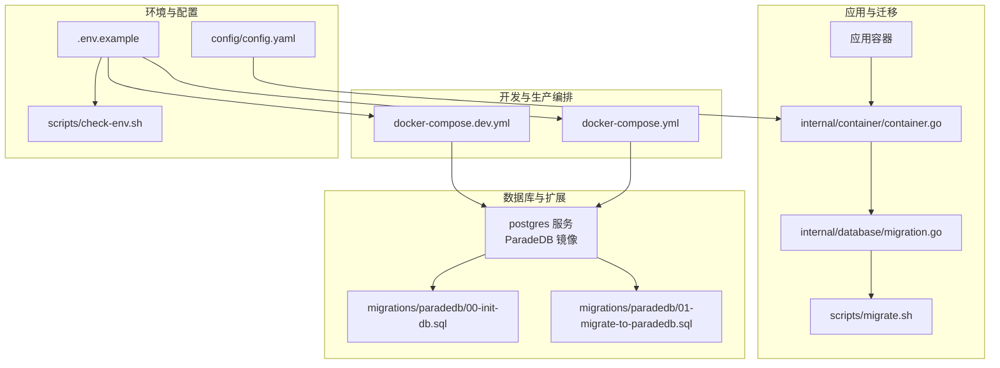
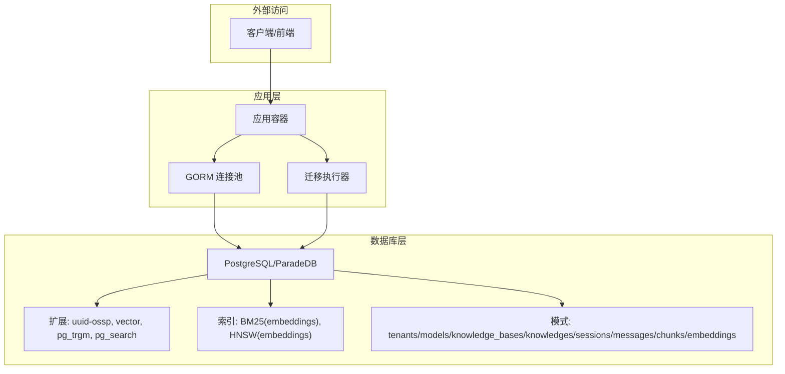
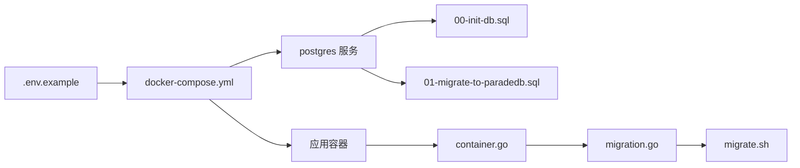

# PostgreSQL配置

<cite>
**本文引用的文件**
- [.env.example](file://.env.example)
- [docker-compose.yml](file://docker-compose.yml)
- [docker-compose.dev.yml](file://docker-compose.dev.yml)
- [scripts/check-env.sh](file://scripts/check-env.sh)
- [scripts/migrate.sh](file://scripts/migrate.sh)
- [migrations/paradedb/00-init-db.sql](file://migrations/paradedb/00-init-db.sql)
- [migrations/paradedb/01-migrate-to-paradedb.sql](file://migrations/paradedb/01-migrate-to-paradedb.sql)
- [internal/container/container.go](file://internal/container/container.go)
- [internal/database/migration.go](file://internal/database/migration.go)
- [config/config.yaml](file://config/config.yaml)
</cite>

## 目录
1. [简介](#简介)
2. [项目结构](#项目结构)
3. [核心组件](#核心组件)
4. [架构总览](#架构总览)
5. [详细组件分析](#详细组件分析)
6. [依赖分析](#依赖分析)
7. [性能考量](#性能考量)
8. [故障排查指南](#故障排查指南)
9. [结论](#结论)
10. [附录](#附录)

## 简介
本文件面向在 Weknora 中使用 PostgreSQL 作为主数据库与向量存储的用户，系统性说明如何通过 .env.example 中的 DB_DRIVER=postgres 启用 PostgreSQL，并配置 DB_USER、DB_PASSWORD、DB_NAME 等关键参数；结合 docker-compose.yml 中 postgres 服务定义，解释 ParadeDB 扩展的集成方式与初始化流程；详解 migrations/paradedb 目录下 SQL 脚本如何为 RAG 功能准备数据库环境，包括 pgvector 与 BM25 向量检索支持；并提供实际配置示例与最佳实践，引用 scripts/check-env.sh 的环境变量校验逻辑，指导开发与生产环境的部署与运维。

## 项目结构
与 PostgreSQL/ParadeDB 相关的关键文件与目录：
- 环境变量模板：.env.example
- 容器编排：docker-compose.yml、docker-compose.dev.yml
- 初始化脚本：scripts/check-env.sh、scripts/migrate.sh
- 数据库迁移：migrations/paradedb/00-init-db.sql、migrations/paradedb/01-migrate-to-paradedb.sql
- 应用容器数据库连接与迁移：internal/container/container.go、internal/database/migration.go
- 应用配置：config/config.yaml

图表来源
- [docker-compose.yml](file://docker-compose.yml#L144-L167)
- [docker-compose.dev.yml](file://docker-compose.dev.yml#L1-L27)
- [migrations/paradedb/00-init-db.sql](file://migrations/paradedb/00-init-db.sql#L1-L215)
- [migrations/paradedb/01-migrate-to-paradedb.sql](file://migrations/paradedb/01-migrate-to-paradedb.sql#L1-L70)
- [internal/container/container.go](file://internal/container/container.go#L250-L307)
- [internal/database/migration.go](file://internal/database/migration.go#L1-L127)
- [.env.example](file://.env.example#L13-L43)
- [scripts/check-env.sh](file://scripts/check-env.sh#L55-L83)
- [scripts/migrate.sh](file://scripts/migrate.sh#L33-L60)
- [config/config.yaml](file://config/config.yaml#L1-L20)

章节来源
- [docker-compose.yml](file://docker-compose.yml#L144-L167)
- [docker-compose.dev.yml](file://docker-compose.dev.yml#L1-L27)
- [.env.example](file://.env.example#L13-L43)

## 核心组件
- 环境变量与驱动选择
  - 通过 .env.example 设置 DB_DRIVER=postgres 与 RETRIEVE_DRIVER=postgres，启用 PostgreSQL 作为主数据库与向量检索后端。
  - 关键参数：DB_USER、DB_PASSWORD、DB_NAME、DB_HOST、DB_PORT 等。
- 容器编排与初始化
  - docker-compose.yml 中 postgres 服务使用 ParadeDB 镜像，挂载初始化 SQL 脚本，自动执行数据库与扩展初始化。
- 应用侧连接与迁移
  - internal/container/container.go 构造 DSN 并使用 gorm 连接数据库，自动执行迁移（可通过 AUTO_MIGRATE 控制）。
  - internal/database/migration.go 使用 golang-migrate 执行版本化迁移。
- RAG 环境准备
  - migrations/paradedb/00-init-db.sql 创建租户、模型、知识库、会话、消息、分片、向量嵌入等表，并启用 uuid-ossp、vector、pg_trgm、pg_search 扩展；为 embeddings 表创建 BM25 与 HNSW 索引，支持中文分词与向量检索。
  - migrations/paradedb/01-migrate-to-paradedb.sql 提供从 PostgreSQL 迁移到 ParadeDB 的步骤与示例。

章节来源
- [.env.example](file://.env.example#L13-L43)
- [docker-compose.yml](file://docker-compose.yml#L144-L167)
- [internal/container/container.go](file://internal/container/container.go#L250-L307)
- [internal/database/migration.go](file://internal/database/migration.go#L1-L127)
- [migrations/paradedb/00-init-db.sql](file://migrations/paradedb/00-init-db.sql#L1-L215)
- [migrations/paradedb/01-migrate-to-paradedb.sql](file://migrations/paradedb/01-migrate-to-paradedb.sql#L1-L70)

## 架构总览
PostgreSQL/ParadeDB 在 Weknora 中的集成架构如下：

图表来源
- [docker-compose.yml](file://docker-compose.yml#L144-L167)
- [migrations/paradedb/00-init-db.sql](file://migrations/paradedb/00-init-db.sql#L1-L215)
- [internal/container/container.go](file://internal/container/container.go#L250-L307)
- [internal/database/migration.go](file://internal/database/migration.go#L1-L127)

## 详细组件分析

### 环境变量与驱动配置
- DB_DRIVER=postgres 与 RETRIEVE_DRIVER=postgres
  - 作用：启用 PostgreSQL 作为主数据库与向量检索后端。
- 关键参数
  - DB_USER、DB_PASSWORD、DB_NAME：数据库凭据与库名。
  - DB_HOST、DB_PORT：数据库主机与端口（容器内默认 postgres:5432）。
- 开发与生产差异
  - docker-compose.yml 将 DB_HOST 设为 postgres，DB_PORT 为 5432。
  - docker-compose.dev.yml 提供本地开发映射端口，便于本地调试。

章节来源
- [.env.example](file://.env.example#L13-L43)
- [docker-compose.yml](file://docker-compose.yml#L41-L47)
- [docker-compose.dev.yml](file://docker-compose.dev.yml#L7-L9)

### 容器编排与 ParadeDB 初始化
- postgres 服务
  - 镜像：paradedb/paradedb:v0.18.9-pg17
  - 环境变量：POSTGRES_USER、POSTGRES_PASSWORD、POSTGRES_DB 来自 .env 中的 DB_*。
  - 挂载：将 migrations/paradedb/00-init-db.sql 与 01-migrate-to-paradedb.sql 挂载至 /docker-entrypoint-initdb.d，实现首次启动自动初始化。
  - 健康检查：pg_isready -U ${DB_USER}。
- 初始化流程
  - 容器启动时，PostgreSQL 首次初始化会执行挂载的 SQL 脚本，创建扩展与表结构，建立索引。

章节来源
- [docker-compose.yml](file://docker-compose.yml#L144-L167)
- [docker-compose.dev.yml](file://docker-compose.dev.yml#L1-L27)

### RAG 数据库环境准备（migrations/paradedb）
- 扩展启用
  - uuid-ossp、vector、pg_trgm、pg_search：为唯一标识、向量、模糊匹配与全文检索提供能力。
- 核心表与索引
  - tenants、models、knowledge_bases、knowledges、sessions、messages、chunks、embeddings。
  - embeddings 表：
    - BM25 索引：支持中文分词 tokenizer（chinese_lindera），检索 content、knowledge_id、knowledge_base_id、chunk_id 等字段。
    - HNSW 索引：基于 halfvec 向量，按维度构造 cosine 距离索引，支持向量检索。
- 中文检索示例
  - 01-migrate-to-paradedb.sql 中包含中文文档表与 BM25 索引示例，验证中文分词与检索可用性。

章节来源
- [migrations/paradedb/00-init-db.sql](file://migrations/paradedb/00-init-db.sql#L1-L215)
- [migrations/paradedb/01-migrate-to-paradedb.sql](file://migrations/paradedb/01-migrate-to-paradedb.sql#L1-L70)

### 应用侧数据库连接与迁移
- DSN 构造与 SSL
  - scripts/migrate.sh 与 internal/container/container.go 均将 sslmode=disable 注入 DSN，适配本地开发环境。
  - scripts/migrate.sh 对密码进行 URL 编码，确保特殊字符安全。
- 迁移执行
  - internal/database/migration.go 使用 golang-migrate 执行 migrations/versioned 下的版本化迁移。
  - internal/container/container.go 在应用启动时可自动执行迁移（受 AUTO_MIGRATE 控制），并设置连接池参数（最大空闲连接、连接最长存活时间）。
- 迁移状态与脏状态处理
  - 若数据库处于脏状态，迁移器会提示强制回滚到上一个成功版本，并提供修复指引。

章节来源
- [scripts/migrate.sh](file://scripts/migrate.sh#L33-L60)
- [internal/container/container.go](file://internal/container/container.go#L250-L307)
- [internal/database/migration.go](file://internal/database/migration.go#L1-L127)

### 向量检索与混合检索引擎
- 检索引擎注册
  - internal/container/container.go 会根据 RETRIEVE_DRIVER 是否包含 postgres，注册基于 PostgreSQL 的混合检索引擎（KV Hybrid）。
- RAG 参数配置
  - config/config.yaml 中包含 keyword_threshold、embedding_top_k、vector_threshold、rerank_top_k、rerank_threshold 等与检索与重排相关的参数，支撑检索流程。

章节来源
- [internal/container/container.go](file://internal/container/container.go#L358-L407)
- [config/config.yaml](file://config/config.yaml#L1-L60)

### 环境变量校验与最佳实践
- scripts/check-env.sh
  - 检查 .env 是否存在，以及 DB_DRIVER、DB_HOST、DB_PORT、DB_USER、DB_PASSWORD、DB_NAME 等关键变量是否设置。
  - 提示 Docker 与 Docker Compose 环境状态，确保开发环境可用。
- 最佳实践
  - 开发环境：使用 docker-compose.yml 或 docker-compose.dev.yml 启动，确认健康检查通过。
  - 生产环境：确保 DB_* 环境变量与 .env 一致，数据库与容器网络互通；如需 TLS，可在生产环境调整 sslmode。
  - 迁移策略：优先使用内部迁移器自动执行；若外部管理迁移，可设置 AUTO_MIGRATE=false。

章节来源
- [scripts/check-env.sh](file://scripts/check-env.sh#L55-L83)
- [scripts/check-env.sh](file://scripts/check-env.sh#L145-L172)

## 依赖分析
- 组件耦合
  - 应用容器通过环境变量与 docker-compose.yml 配置连接数据库。
  - 初始化脚本与迁移脚本在容器启动时自动执行，确保数据库具备 RAG 所需的扩展与表结构。
- 外部依赖
  - ParadeDB 镜像提供 PostgreSQL 与扩展能力。
  - golang-migrate 提供版本化迁移能力。
- 潜在循环依赖
  - 无直接循环依赖；初始化脚本与迁移脚本在容器生命周期早期执行，应用启动时再进行迁移。

图表来源
- [.env.example](file://.env.example#L13-L43)
- [docker-compose.yml](file://docker-compose.yml#L144-L167)
- [migrations/paradedb/00-init-db.sql](file://migrations/paradedb/00-init-db.sql#L1-L215)
- [migrations/paradedb/01-migrate-to-paradedb.sql](file://migrations/paradedb/01-migrate-to-paradedb.sql#L1-L70)
- [internal/container/container.go](file://internal/container/container.go#L250-L307)
- [internal/database/migration.go](file://internal/database/migration.go#L1-L127)
- [scripts/migrate.sh](file://scripts/migrate.sh#L33-L60)

## 性能考量
- 连接池
  - 应用侧设置了最大空闲连接与连接最长存活时间，有助于控制资源占用与连接复用。
- 索引设计
  - embeddings 表的 BM25 与 HNSW 索引分别面向关键词检索与向量检索，建议根据业务规模与查询特征调整索引参数（如 HNSW 的 m、ef_construction）。
- 中文检索
  - 使用 lindera 分词器，建议在大规模数据场景下评估分词与索引维护成本。

章节来源
- [internal/container/container.go](file://internal/container/container.go#L296-L306)
- [migrations/paradedb/00-init-db.sql](file://migrations/paradedb/00-init-db.sql#L200-L215)

## 故障排查指南
- 环境变量缺失
  - 使用 scripts/check-env.sh 检查 .env 是否存在，以及 DB_DRIVER、DB_HOST、DB_PORT、DB_USER、DB_PASSWORD、DB_NAME 是否设置。
- 数据库连接失败
  - 确认 docker-compose.yml 中 DB_HOST=postgres、DB_PORT=5432；检查 postgres 服务健康状态。
  - DSN 中 sslmode=disable 适用于本地开发；生产环境如需 TLS，需调整 sslmode。
- 迁移失败或脏状态
  - internal/database/migration.go 会在脏状态下提示强制回滚到上一个成功版本，并提供修复指引。
- 初始化脚本未生效
  - 确认 migrations/paradedb/00-init-db.sql 与 01-migrate-to-paradedb.sql 已正确挂载至 /docker-entrypoint-initdb.d。

章节来源
- [scripts/check-env.sh](file://scripts/check-env.sh#L55-L83)
- [docker-compose.yml](file://docker-compose.yml#L144-L167)
- [internal/database/migration.go](file://internal/database/migration.go#L1-L127)
- [migrations/paradedb/00-init-db.sql](file://migrations/paradedb/00-init-db.sql#L1-L215)
- [migrations/paradedb/01-migrate-to-paradedb.sql](file://migrations/paradedb/01-migrate-to-paradedb.sql#L1-L70)

## 结论
通过 .env.example 的 DB_DRIVER=postgres 与 RETRIEVE_DRIVER=postgres，结合 docker-compose.yml 中的 postgres 服务与 ParadeDB 镜像，Weknora 能够在容器内自动完成数据库扩展与表结构初始化。migrations/paradedb 目录下的 SQL 脚本为 RAG 功能提供了 pgvector 与 BM25 检索能力。应用侧通过 internal/container/container.go 与 internal/database/migration.go 实现 DSN 构造、自动迁移与连接池配置。配合 scripts/check-env.sh 的环境校验与 scripts/migrate.sh 的迁移脚本，开发者可在开发与生产环境中快速、稳定地部署 PostgreSQL/ParadeDB。

## 附录

### 实际配置示例（路径引用）
- 环境变量模板与关键参数
  - [DB_DRIVER、DB_USER、DB_PASSWORD、DB_NAME 等](file://.env.example#L13-L43)
- 容器编排与初始化
  - [postgres 服务定义与健康检查](file://docker-compose.yml#L144-L167)
  - [开发环境映射端口](file://docker-compose.dev.yml#L7-L9)
- RAG 数据库脚本
  - [扩展与表结构、索引](file://migrations/paradedb/00-init-db.sql#L1-L215)
  - [迁移至 ParadeDB 的步骤与示例](file://migrations/paradedb/01-migrate-to-paradedb.sql#L1-L70)
- 应用侧连接与迁移
  - [DSN 构造与 sslmode 处理](file://internal/container/container.go#L250-L263)
  - [自动迁移与连接池配置](file://internal/container/container.go#L280-L306)
  - [golang-migrate 执行与脏状态处理](file://internal/database/migration.go#L1-L127)
  - [迁移脚本 URL 编码与 sslmode](file://scripts/migrate.sh#L33-L60)
- 环境校验
  - [关键变量检查与 Docker 状态检测](file://scripts/check-env.sh#L55-L83)
  - [Docker 与 Compose 环境检查](file://scripts/check-env.sh#L145-L172)