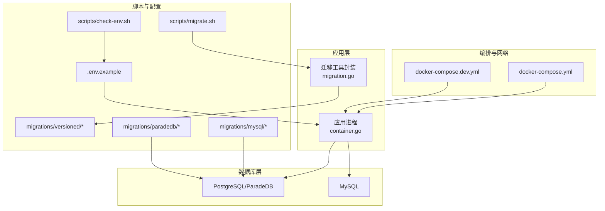
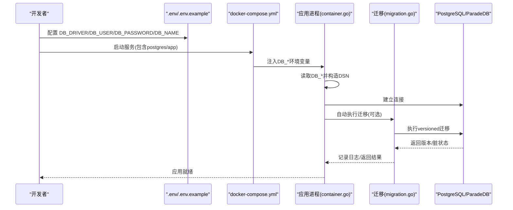
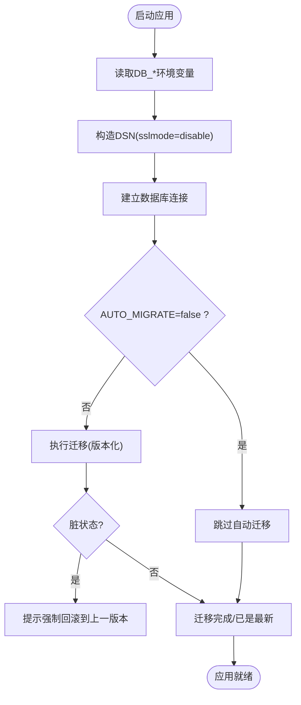
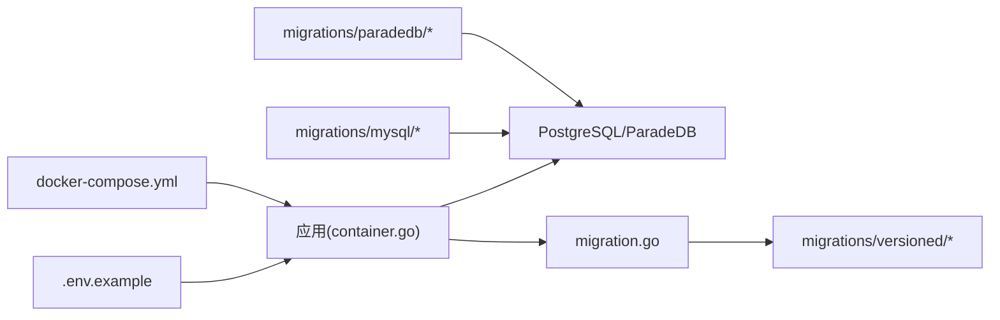

# 数据库配置

<cite>
**本文引用的文件**
- [.env.example](file://.env.example)
- [docker-compose.yml](file://docker-compose.yml)
- [docker-compose.dev.yml](file://docker-compose.dev.yml)
- [scripts/check-env.sh](file://scripts/check-env.sh)
- [scripts/migrate.sh](file://scripts/migrate.sh)
- [internal/container/container.go](file://internal/container/container.go)
- [internal/database/migration.go](file://internal/database/migration.go)
- [migrations/mysql/00-init-db.sql](file://migrations/mysql/00-init-db.sql)
- [migrations/paradedb/00-init-db.sql](file://migrations/paradedb/00-init-db.sql)
- [migrations/paradedb/01-migrate-to-paradedb.sql](file://migrations/paradedb/01-migrate-to-paradedb.sql)
- [migrations/versioned/000001_agent.up.sql](file://migrations/versioned/000001_agent.up.sql)
- [migrations/versioned/000001_agent.down.sql](file://migrations/versioned/000001_agent.down.sql)
</cite>

## 目录
1. [简介](#简介)
2. [项目结构与数据库相关组件](#项目结构与数据库相关组件)
3. [核心配置项与驱动选择](#核心配置项与驱动选择)
4. [架构总览](#架构总览)
5. [详细组件分析](#详细组件分析)
6. [依赖关系分析](#依赖关系分析)
7. [性能与可用性建议](#性能与可用性建议)
8. [故障排查指南](#故障排查指南)
9. [结论](#结论)
10. [附录](#附录)

## 简介
本文件面向数据库管理员与开发者，系统化梳理 WeKnora 的数据库配置与部署要点，重点覆盖 .env.example 中的 DB_DRIVER、DB_USER、DB_PASSWORD、DB_NAME 等关键环境变量；说明如何在 Docker 环境下配置 PostgreSQL 与 MySQL 作为主数据库；解释数据库初始化流程与迁移脚本（migrations/ 目录）的执行方式；并结合 scripts/check-env.sh 的环境校验逻辑，给出开发与生产环境的安全最佳实践。

## 项目结构与数据库相关组件
- 环境变量来源与默认值：
  - .env.example 定义了 DB_DRIVER、DB_USER、DB_PASSWORD、DB_NAME 等数据库相关变量的默认值与注释说明。
- Docker 编排：
  - docker-compose.yml 定义了 postgres 服务（ParadeDB），以及 app 服务如何注入数据库连接所需的环境变量。
  - docker-compose.dev.yml 提供开发模式下的独立数据库服务与端口映射。
- 迁移与初始化：
  - migrations/versioned/ 存放版本化迁移脚本。
  - migrations/mysql/ 与 migrations/paradedb/ 分别提供 MySQL 与 ParadeDB 的初始化脚本。
- 应用侧连接与迁移：
  - internal/container/container.go 负责根据 DB_DRIVER 构造 DSN 并建立数据库连接，同时在启动时自动执行迁移。
  - internal/database/migration.go 封装 golang-migrate 的调用，负责版本检测、脏状态处理与日志输出。

图表来源
- [docker-compose.yml](file://docker-compose.yml#L1-L254)
- [docker-compose.dev.yml](file://docker-compose.dev.yml#L1-L147)
- [internal/container/container.go](file://internal/container/container.go#L225-L307)
- [internal/database/migration.go](file://internal/database/migration.go#L1-L127)
- [.env.example](file://.env.example#L1-L150)
- [scripts/check-env.sh](file://scripts/check-env.sh#L1-L197)
- [scripts/migrate.sh](file://scripts/migrate.sh#L1-L119)

章节来源
- [docker-compose.yml](file://docker-compose.yml#L1-L254)
- [docker-compose.dev.yml](file://docker-compose.dev.yml#L1-L147)
- [internal/container/container.go](file://internal/container/container.go#L225-L307)
- [internal/database/migration.go](file://internal/database/migration.go#L1-L127)
- [.env.example](file://.env.example#L1-L150)
- [scripts/check-env.sh](file://scripts/check-env.sh#L1-L197)
- [scripts/migrate.sh](file://scripts/migrate.sh#L1-L119)

## 核心配置项与驱动选择
- DB_DRIVER：决定数据库驱动类型。当前应用侧仅支持 PostgreSQL（参见容器初始化逻辑）。若需使用 MySQL，需在应用侧增加对应驱动与 DSN 构造逻辑。
- DB_USER、DB_PASSWORD、DB_NAME：数据库用户、密码与数据库名。
- DB_HOST、DB_PORT：数据库主机与端口。在 Docker 环境中，DB_HOST 通常指向服务名（如 postgres），DB_PORT 为数据库默认端口。
- SSL 模式：应用侧默认使用 sslmode=disable，适用于本地开发与 Docker 内部网络。生产环境建议使用 sslmode=require 并配合证书校验。

章节来源
- [.env.example](file://.env.example#L1-L150)
- [docker-compose.yml](file://docker-compose.yml#L31-L90)
- [internal/container/container.go](file://internal/container/container.go#L235-L274)

## 架构总览
应用通过环境变量读取数据库配置，容器化部署时由 docker-compose.yml 注入 DB_* 变量。应用启动时根据 DB_DRIVER 选择数据库方言，构造 DSN 并建立连接；随后自动执行数据库迁移（除非显式禁用）。数据库初始化脚本在首次启动时由 Docker 入口脚本挂载并执行，完成表结构与索引的创建。

图表来源
- [docker-compose.yml](file://docker-compose.yml#L31-L90)
- [internal/container/container.go](file://internal/container/container.go#L225-L307)
- [internal/database/migration.go](file://internal/database/migration.go#L1-L127)

## 详细组件分析

### 环境变量与校验脚本
- .env.example 提供 DB_DRIVER、DB_USER、DB_PASSWORD、DB_NAME 等默认值与注释，强调不要将 .env 提交至版本控制。
- scripts/check-env.sh 会加载 .env 并校验 DB_DRIVER、DB_HOST、DB_PORT、DB_USER、DB_PASSWORD、DB_NAME 等关键变量是否已设置，缺失时提示修复方法。

章节来源
- [.env.example](file://.env.example#L1-L150)
- [scripts/check-env.sh](file://scripts/check-env.sh#L37-L110)

### Docker 编排与网络
- docker-compose.yml
  - app 服务通过 environment 注入 DB_DRIVER、DB_HOST、DB_PORT、DB_USER、DB_PASSWORD、DB_NAME 等变量。
  - postgres 服务使用 paradedb/paradedb 镜像，挂载初始化脚本，健康检查基于 pg_isready。
  - app 依赖 postgres 服务健康后才启动，保证数据库可用。
- docker-compose.dev.yml
  - 仅启动 postgres、redis、minio、neo4j、docreader、jaeger 等基础设施服务，便于本地开发调试。

章节来源
- [docker-compose.yml](file://docker-compose.yml#L1-L254)
- [docker-compose.dev.yml](file://docker-compose.dev.yml#L1-L147)

### 数据库初始化与迁移
- 初始化脚本
  - migrations/mysql/00-init-db.sql：提供 MySQL 初始化建表语句（含索引）。
  - migrations/paradedb/00-init-db.sql：提供 ParadeDB 初始化建表语句（含向量扩展、索引与 JSONB 字段）。
  - migrations/paradedb/01-migrate-to-paradedb.sql：演示从 PostgreSQL 迁移到 ParadeDB 的步骤与验证。
- 版本化迁移
  - migrations/versioned/000001_agent.up.sql 与 000001_agent.down.sql：示例迁移文件，展示 up/down 的结构。
- 迁移执行
  - internal/database/migration.go 使用 golang-migrate，自动检测版本与脏状态，记录日志并提供强制回滚指引。
  - scripts/migrate.sh 支持 up/down/create/version/force/goto 等命令，自动拼接 DSN（含 URL 编码与 sslmode=disable）。

图表来源
- [internal/container/container.go](file://internal/container/container.go#L225-L307)
- [internal/database/migration.go](file://internal/database/migration.go#L1-L127)
- [scripts/migrate.sh](file://scripts/migrate.sh#L1-L119)

章节来源
- [migrations/mysql/00-init-db.sql](file://migrations/mysql/00-init-db.sql#L1-L157)
- [migrations/paradedb/00-init-db.sql](file://migrations/paradedb/00-init-db.sql#L1-L215)
- [migrations/paradedb/01-migrate-to-paradedb.sql](file://migrations/paradedb/01-migrate-to-paradedb.sql#L1-L70)
- [migrations/versioned/000001_agent.up.sql](file://migrations/versioned/000001_agent.up.sql)
- [migrations/versioned/000001_agent.down.sql](file://migrations/versioned/000001_agent.down.sql)
- [internal/database/migration.go](file://internal/database/migration.go#L1-L127)
- [scripts/migrate.sh](file://scripts/migrate.sh#L1-L119)

### 应用侧数据库连接与迁移集成
- DB_DRIVER 选择：仅支持 postgres（当前实现）。
- DSN 构造：GORM 使用键值对形式；迁移使用 URL 形式，并对密码进行 URL 编码。
- 自动迁移：默认启用，可通过环境变量禁用；迁移失败时记录警告并继续启动。
- 连接池：设置最大空闲连接与连接最长生命周期。

章节来源
- [internal/container/container.go](file://internal/container/container.go#L225-L307)

## 依赖关系分析
- 环境变量依赖：应用侧依赖 DB_DRIVER、DB_HOST、DB_PORT、DB_USER、DB_PASSWORD、DB_NAME。
- Docker 服务依赖：app 依赖 postgres 服务健康；postgres 依赖初始化脚本完成表结构创建。
- 迁移依赖：golang-migrate 依赖 migrations/versioned 目录；scripts/migrate.sh 提供命令行入口。
- 初始化脚本依赖：migrations/mysql/ 与 migrations/paradedb/ 依赖数据库版本（MySQL vs PostgreSQL/ParadeDB）。

图表来源
- [.env.example](file://.env.example#L1-L150)
- [docker-compose.yml](file://docker-compose.yml#L1-L254)
- [internal/container/container.go](file://internal/container/container.go#L225-L307)
- [internal/database/migration.go](file://internal/database/migration.go#L1-L127)
- [migrations/mysql/00-init-db.sql](file://migrations/mysql/00-init-db.sql#L1-L157)
- [migrations/paradedb/00-init-db.sql](file://migrations/paradedb/00-init-db.sql#L1-L215)

章节来源
- [docker-compose.yml](file://docker-compose.yml#L1-L254)
- [internal/container/container.go](file://internal/container/container.go#L225-L307)
- [internal/database/migration.go](file://internal/database/migration.go#L1-L127)

## 性能与可用性建议
- 生产环境 SSL：建议将 sslmode=disable 替换为 sslmode=require，并配置证书校验，避免明文传输。
- 连接池：当前连接池参数为固定值，可根据业务并发调整最大连接数与生命周期。
- 迁移策略：生产环境建议手动执行迁移，避免自动迁移导致的不可控风险；必要时使用 scripts/migrate.sh 的 force 命令回滚到上一稳定版本。
- 健康检查：postgres 服务使用 pg_isready 健康检查，确保应用启动前数据库可用。

章节来源
- [internal/container/container.go](file://internal/container/container.go#L296-L306)
- [docker-compose.yml](file://docker-compose.yml#L148-L167)

## 故障排查指南
- 环境变量缺失
  - 症状：启动时报错或连接失败。
  - 排查：使用 scripts/check-env.sh 检查 .env 是否存在及 DB_DRIVER、DB_HOST、DB_PORT、DB_USER、DB_PASSWORD、DB_NAME 是否设置。
- 迁移失败或脏状态
  - 症状：应用启动后提示数据库处于脏状态或迁移失败。
  - 排查：查看 internal/database/migration.go 的错误信息与日志；按提示使用 scripts/migrate.sh 的 force 命令回滚到上一稳定版本。
- Docker 网络与端口
  - 症状：应用无法连接数据库。
  - 排查：确认 docker-compose.yml 中 app 依赖 postgres；检查 DB_HOST 与 DB_PORT；在 docker-compose.dev.yml 中验证本地端口映射。
- 密码特殊字符
  - 症状：连接报错或迁移 URL 不正确。
  - 排查：scripts/migrate.sh 会对密码进行 URL 编码；应用侧也使用 URL 编码处理；确保 .env 中密码符合要求。

章节来源
- [scripts/check-env.sh](file://scripts/check-env.sh#L37-L110)
- [internal/database/migration.go](file://internal/database/migration.go#L1-L127)
- [scripts/migrate.sh](file://scripts/migrate.sh#L1-L119)
- [docker-compose.yml](file://docker-compose.yml#L148-L167)

## 结论
本项目以 Docker 为核心，通过 .env 与 docker-compose.yml 注入数据库配置，应用启动时自动执行迁移。当前应用侧仅支持 PostgreSQL；如需使用 MySQL，需在应用侧增加相应驱动与 DSN 构造逻辑。生产环境应加强安全配置（SSL、密钥管理），并采用手动迁移策略降低风险。

## 附录

### 在 Docker 中配置 PostgreSQL 与 MySQL
- PostgreSQL（ParadeDB）
  - 使用 docker-compose.yml 中的 postgres 服务镜像与环境变量；初始化脚本挂载在 /docker-entrypoint-initdb.d 下，随容器启动自动执行。
  - 应用侧通过 DB_DRIVER=postgres 连接，DSN 使用 sslmode=disable。
- MySQL
  - 若需使用 MySQL，需在应用侧增加 MySQL 驱动与 DSN 构造逻辑（参考 DB_DRIVER 分支），并在 docker-compose.yml 中替换或新增 mysql 服务，注入 DB_* 变量。

章节来源
- [docker-compose.yml](file://docker-compose.yml#L144-L167)
- [migrations/mysql/00-init-db.sql](file://migrations/mysql/00-init-db.sql#L1-L157)
- [internal/container/container.go](file://internal/container/container.go#L235-L274)

### 连接字符串与端口映射
- 连接字符串
  - 应用侧 DSN（GORM）：键值对形式，包含 host、port、user、password、dbname、sslmode。
  - 迁移 DSN（golang-migrate）：URL 形式，包含 postgres:// 协议、用户、密码（URL 编码）、主机、端口、数据库名、sslmode=disable。
- 端口映射
  - docker-compose.yml 中 app 映射 8080:8080，postgres 默认 5432。
  - docker-compose.dev.yml 中 postgres 暴露 DB_PORT（默认 5432），便于本地直连。

章节来源
- [internal/container/container.go](file://internal/container/container.go#L235-L274)
- [scripts/migrate.sh](file://scripts/migrate.sh#L33-L60)
- [docker-compose.yml](file://docker-compose.yml#L21-L23)
- [docker-compose.dev.yml](file://docker-compose.dev.yml#L7-L9)

### 开发与生产环境安全最佳实践
- 开发环境
  - 使用 scripts/check-env.sh 校验关键变量；使用 sslmode=disable；本地端口映射便于调试。
- 生产环境
  - 使用 sslmode=require；将 .env 与敏感脚本纳入安全管控；使用只读账号执行迁移；限制 DB_HOST 为内网或受信网络；定期备份数据库。
  - 使用 scripts/migrate.sh 的 version/force/goto 命令进行可控迁移；禁止自动迁移或显式设置 AUTO_MIGRATE=false。

章节来源
- [scripts/check-env.sh](file://scripts/check-env.sh#L115-L196)
- [scripts/migrate.sh](file://scripts/migrate.sh#L1-L119)
- [internal/container/container.go](file://internal/container/container.go#L280-L294)