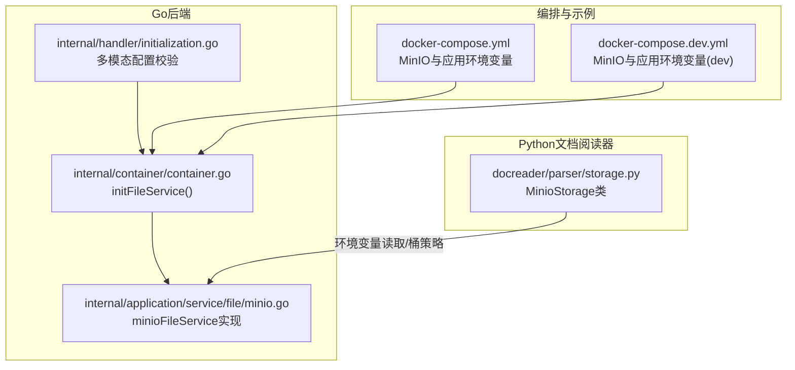
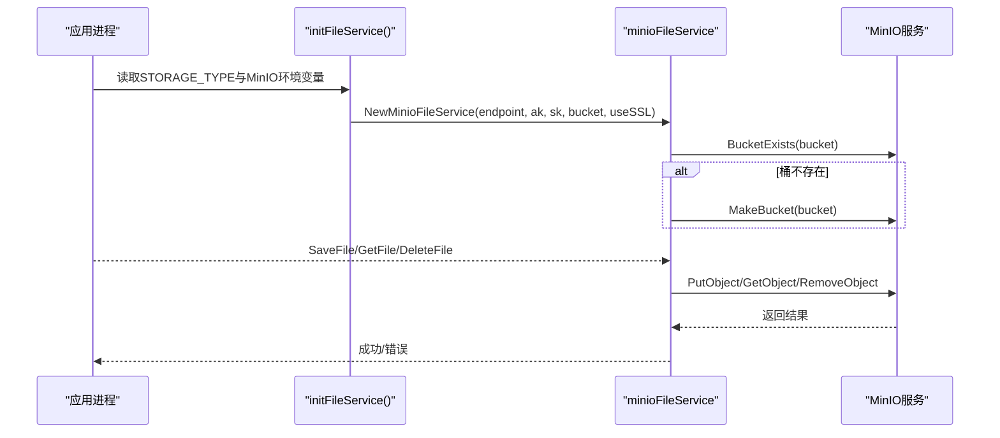
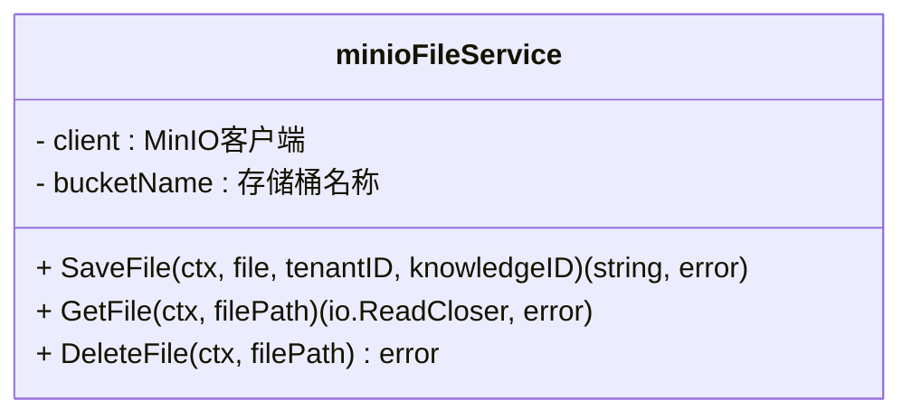
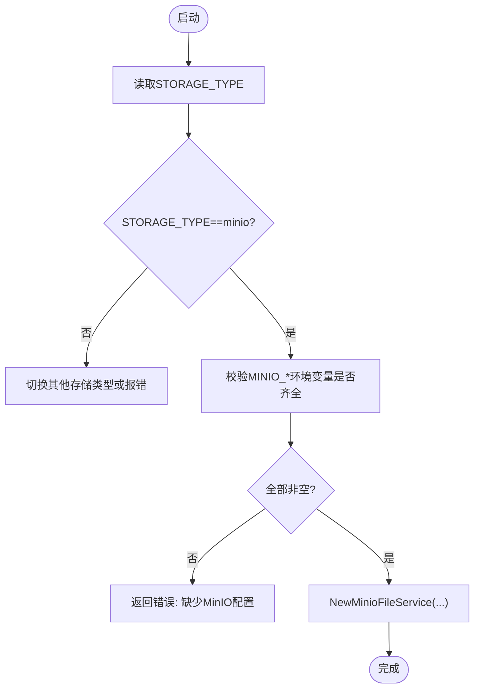
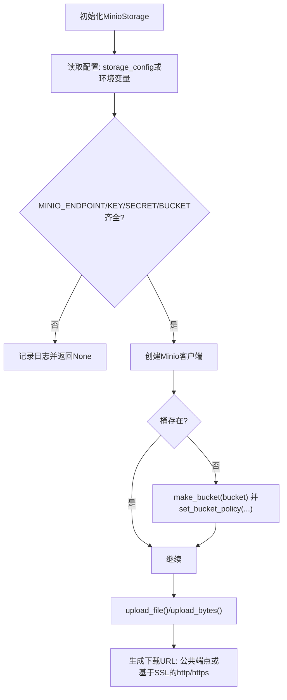
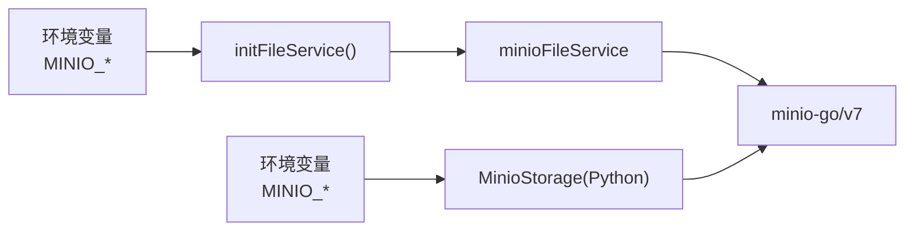

# MinIO存储配置

<cite>
**本文引用的文件**
- [minio.go](file://internal/application/service/file/minio.go)
- [container.go](file://internal/container/container.go)
- [initialization.go](file://internal/handler/initialization.go)
- [storage.py](file://docreader/parser/storage.py)
- [docker-compose.yml](file://docker-compose.yml)
- [docker-compose.dev.yml](file://docker-compose.dev.yml)
- [local.go](file://internal/application/service/file/local.go)
- [dummy.go](file://internal/application/service/file/dummy.go)
</cite>

## 目录
1. [简介](#简介)
2. [项目结构](#项目结构)
3. [核心组件](#核心组件)
4. [架构总览](#架构总览)
5. [详细组件分析](#详细组件分析)
6. [依赖关系分析](#依赖关系分析)
7. [性能与可靠性考量](#性能与可靠性考量)
8. [故障排查指南](#故障排查指南)
9. [结论](#结论)
10. [附录：配置清单与示例](#附录配置清单与示例)

## 简介
本文件面向在STORAGE_TYPE=minio模式下部署与运维WeKnora系统的工程师与平台管理员，系统性梳理MinIO文件存储的完整配置流程与实现细节。内容覆盖：
- 环境变量MINIO_ACCESS_KEY_ID、MINIO_SECRET_ACCESS_KEY、MINIO_BUCKET_NAME等的设置方法与优先级
- MinIO客户端初始化、存储桶自动创建、文件上传/下载/删除的API调用路径
- 连接本地MinIO实例与云托管MinIO服务的配置示例
- 错误处理机制与连接测试验证步骤

## 项目结构
围绕MinIO存储的关键代码分布在以下模块：
- Go后端文件服务实现：MinIO适配层
- 容器初始化：根据STORAGE_TYPE选择文件服务并校验MinIO环境变量
- 初始化处理器：多模态配置中对MinIO参数的校验与落盘
- Python文档阅读器存储：MinIO客户端初始化、桶策略与下载URL构造
- Compose编排：MinIO容器与应用容器的环境变量注入

图表来源
- [container.go](file://internal/container/container.go#L309-L356)
- [minio.go](file://internal/application/service/file/minio.go#L1-L128)
- [initialization.go](file://internal/handler/initialization.go#L480-L496)
- [storage.py](file://docreader/parser/storage.py#L200-L399)
- [docker-compose.yml](file://docker-compose.yml#L60-L70)
- [docker-compose.dev.yml](file://docker-compose.dev.yml#L93-L100)

章节来源
- [container.go](file://internal/container/container.go#L309-L356)
- [docker-compose.yml](file://docker-compose.yml#L60-L70)
- [docker-compose.dev.yml](file://docker-compose.dev.yml#L93-L100)

## 核心组件
- MinIO文件服务实现（Go）：负责MinIO客户端初始化、桶存在性检查与创建、文件上传/下载/删除。
- 容器初始化（Go）：依据STORAGE_TYPE=minio加载MinIO相关环境变量并创建MinIO文件服务实例。
- 初始化处理器（Go）：在多模态配置场景中对MinIO参数进行完整性校验。
- MinioStorage（Python）：文档阅读器侧的MinIO客户端初始化、桶策略设置与下载URL生成。
- 编排文件（Compose）：提供MinIO与应用容器的环境变量示例与默认值。

章节来源
- [minio.go](file://internal/application/service/file/minio.go#L1-L128)
- [container.go](file://internal/container/container.go#L309-L356)
- [initialization.go](file://internal/handler/initialization.go#L480-L496)
- [storage.py](file://docreader/parser/storage.py#L200-L399)
- [docker-compose.yml](file://docker-compose.yml#L60-L70)

## 架构总览
MinIO存储在系统中的工作流如下：
- 应用启动时，容器初始化根据STORAGE_TYPE选择MinIO文件服务，并从环境变量读取MINIO_ENDPOINT、MINIO_ACCESS_KEY_ID、MINIO_SECRET_ACCESS_KEY、MINIO_BUCKET_NAME。
- 若桶不存在，MinIO文件服务会自动创建桶；随后所有文件操作均通过MinIO SDK完成。
- 文档阅读器侧同样支持从环境变量或注入配置初始化MinIO客户端，并可设置桶策略与生成公开下载URL。

图表来源
- [container.go](file://internal/container/container.go#L309-L356)
- [minio.go](file://internal/application/service/file/minio.go#L22-L52)
- [minio.go](file://internal/application/service/file/minio.go#L54-L127)

## 详细组件分析

### MinIO文件服务实现（Go）
- 客户端初始化：使用endpoint、ak/sk凭据与SSL开关创建MinIO客户端。
- 存储桶管理：检查桶是否存在，不存在则创建；该逻辑在服务初始化阶段执行一次。
- 文件操作：
  - 上传：根据租户ID与知识库ID生成对象名，调用PutObject上传。
  - 下载：解析minio://协议路径，提取对象名后调用GetObject返回流。
  - 删除：解析minio://协议路径，提取对象名后调用RemoveObject删除。

图表来源
- [minio.go](file://internal/application/service/file/minio.go#L1-L128)

章节来源
- [minio.go](file://internal/application/service/file/minio.go#L22-L52)
- [minio.go](file://internal/application/service/file/minio.go#L54-L127)

### 容器初始化与环境变量校验（Go）
- 当STORAGE_TYPE=minio时，必须提供MINIO_ENDPOINT、MINIO_ACCESS_KEY_ID、MINIO_SECRET_ACCESS_KEY、MINIO_BUCKET_NAME，否则初始化失败。
- 初始化成功后，创建minioFileService实例并注入到应用。

图表来源
- [container.go](file://internal/container/container.go#L309-L356)

章节来源
- [container.go](file://internal/container/container.go#L309-L356)

### 多模态配置中的MinIO校验（Go）
- 在多模态启用且存储类型为minio时，要求MinIO配置完整（桶名与凭据），否则返回错误。
- 该校验确保后续知识库初始化不会因存储配置缺失而失败。

章节来源
- [initialization.go](file://internal/handler/initialization.go#L480-L496)

### 文档阅读器MinIO存储（Python）
- 客户端初始化：从storage_config或环境变量读取MINIO_ENDPOINT、MINIO_ACCESS_KEY_ID、MINIO_SECRET_ACCESS_KEY、MINIO_BUCKET_NAME、MINIO_PATH_PREFIX、MINIO_USE_SSL等。
- 桶策略：若桶不存在则创建，并设置公开读策略（允许匿名访问）。
- 下载URL：优先使用MINIO_PUBLIC_ENDPOINT，否则根据MINIO_USE_SSL决定https/http前缀。

图表来源
- [storage.py](file://docreader/parser/storage.py#L200-L399)

章节来源
- [storage.py](file://docreader/parser/storage.py#L200-L399)

### 本地与占位实现（对比参考）
- 本地文件服务：将文件写入本地目录树，便于开发调试。
- 占位文件服务：用于测试或无需真实存储的场景，不执行实际IO。

章节来源
- [local.go](file://internal/application/service/file/local.go#L1-L112)
- [dummy.go](file://internal/application/service/file/dummy.go#L1-L39)

## 依赖关系分析
- MinIO SDK版本：项目依赖minio-go/v7，确保与S3兼容接口一致。
- 组件耦合：
  - 容器初始化依赖环境变量与STORAGE_TYPE，解耦于具体实现。
  - MinIO文件服务实现依赖minio-go/v7，职责单一、内聚度高。
  - 文档阅读器侧MinioStorage与后端Go实现共享相同的环境变量约定，便于统一配置。

图表来源
- [container.go](file://internal/container/container.go#L309-L356)
- [minio.go](file://internal/application/service/file/minio.go#L1-L128)
- [storage.py](file://docreader/parser/storage.py#L200-L399)

章节来源
- [container.go](file://internal/container/container.go#L309-L356)
- [minio.go](file://internal/application/service/file/minio.go#L1-L128)
- [storage.py](file://docreader/parser/storage.py#L200-L399)

## 性能与可靠性考量
- 上传性能：PutObject为流式上传，建议控制文件大小与并发，避免单次请求过大导致内存压力。
- 桶策略：文档阅读器侧设置了公开读策略，便于直接访问对象URL；生产环境建议评估安全风险并按需收紧。
- 可靠性：初始化阶段即完成桶存在性检查与创建，避免运行期频繁失败；错误返回携带上下文信息，便于定位问题。

[本节为通用指导，不直接分析具体文件]

## 故障排查指南
- 启动时报“缺少MinIO配置”：确认STORAGE_TYPE=minio且MINIO_ENDPOINT、MINIO_ACCESS_KEY_ID、MINIO_SECRET_ACCESS_KEY、MINIO_BUCKET_NAME均已设置。
- 桶不存在或权限不足：检查MinIO服务端权限与网络连通性；如需自动创建，确认服务端具备创建桶权限。
- 下载失败：确认minio://协议路径格式正确，对象名与桶名匹配；若使用公共端点，确认MINIO_PUBLIC_ENDPOINT可用。
- 多模态配置报错：当启用多模态且存储类型为minio时，需确保MinIO配置完整并通过校验。

章节来源
- [container.go](file://internal/container/container.go#L309-L356)
- [minio.go](file://internal/application/service/file/minio.go#L54-L127)
- [initialization.go](file://internal/handler/initialization.go#L480-L496)
- [storage.py](file://docreader/parser/storage.py#L200-L399)

## 结论
在STORAGE_TYPE=minio模式下，WeKnora通过容器初始化与MinIO文件服务实现，实现了从环境变量读取、桶自动创建到文件上传/下载/删除的完整闭环。文档阅读器侧亦提供一致的环境变量约定与桶策略设置能力。建议在生产环境中严格管理凭据与桶策略，结合健康检查与日志监控，确保MinIO存储稳定可靠。

[本节为总结性内容，不直接分析具体文件]

## 附录：配置清单与示例

### 环境变量清单（Go侧）
- STORAGE_TYPE：存储类型，设为minio以启用MinIO文件服务。
- MINIO_ENDPOINT：MinIO服务地址（主机:端口）。
- MINIO_ACCESS_KEY_ID：访问密钥ID。
- MINIO_SECRET_ACCESS_KEY：私有访问密钥。
- MINIO_BUCKET_NAME：默认使用的存储桶名称。
- MINIO_USE_SSL：是否启用SSL（布尔字符串，true/false）。
- MINIO_PUBLIC_ENDPOINT：公开访问端点（可选，用于生成可访问URL）。

章节来源
- [container.go](file://internal/container/container.go#L309-L356)
- [minio.go](file://internal/application/service/file/minio.go#L22-L52)
- [storage.py](file://docreader/parser/storage.py#L200-L399)

### 环境变量清单（Python侧）
- STORAGE_TYPE：存储类型，设为minio以启用MinioStorage。
- MINIO_ENDPOINT：MinIO服务地址（主机:端口）。
- MINIO_ACCESS_KEY_ID：访问密钥ID。
- MINIO_SECRET_ACCESS_KEY：私有访问密钥。
- MINIO_BUCKET_NAME：默认使用的存储桶名称。
- MINIO_PATH_PREFIX：对象键前缀（可选）。
- MINIO_USE_SSL：是否启用SSL（布尔字符串，true/false）。
- MINIO_PUBLIC_ENDPOINT：公开访问端点（可选）。

章节来源
- [storage.py](file://docreader/parser/storage.py#L200-L399)

### 连接本地MinIO实例示例
- 使用Compose启动MinIO与应用容器，示例环境变量已在compose文件中给出。本地访问时可使用MINIO_PUBLIC_ENDPOINT指向本地端口，或根据MINIO_USE_SSL决定http/https前缀。

章节来源
- [docker-compose.yml](file://docker-compose.yml#L60-L70)
- [docker-compose.dev.yml](file://docker-compose.dev.yml#L93-L100)

### 连接云托管MinIO服务示例
- 将MINIO_ENDPOINT指向云托管服务域名与端口，MINIO_ACCESS_KEY_ID与MINIO_SECRET_ACCESS_KEY使用云厂商提供的凭据，MINIO_BUCKET_NAME设置为目标桶名。
- 如需公网访问，可在云厂商控制台开放对应对象的读权限，或在应用侧设置桶策略（参考文档阅读器侧策略设置逻辑）。

章节来源
- [storage.py](file://docreader/parser/storage.py#L200-L399)

### API调用细节（上传/下载/删除）
- 上传：调用PutObject，对象名为tenantID/knowledgeID/UUID.ext，返回minio://bucketName/对象名形式的路径。
- 下载：解析minio://协议路径，提取对象名后调用GetObject返回流。
- 删除：解析minio://协议路径，提取对象名后调用RemoveObject删除。

章节来源
- [minio.go](file://internal/application/service/file/minio.go#L54-L127)

### 连接测试与验证步骤
- 启动MinIO与应用容器，确认MinIO健康检查通过。
- 在应用侧尝试上传一个测试文件，观察返回的minio://路径。
- 使用minio://路径或MINIO_PUBLIC_ENDPOINT访问对象，验证可读性。
- 若使用文档阅读器，可调用其上传接口并验证返回URL可用。

章节来源
- [docker-compose.yml](file://docker-compose.yml#L176-L198)
- [docker-compose.dev.yml](file://docker-compose.dev.yml#L39-L58)
- [minio.go](file://internal/application/service/file/minio.go#L54-L127)
- [storage.py](file://docreader/parser/storage.py#L200-L399)