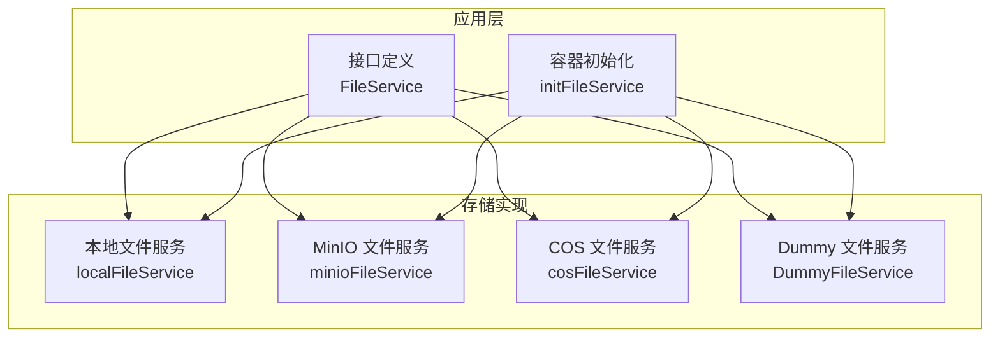
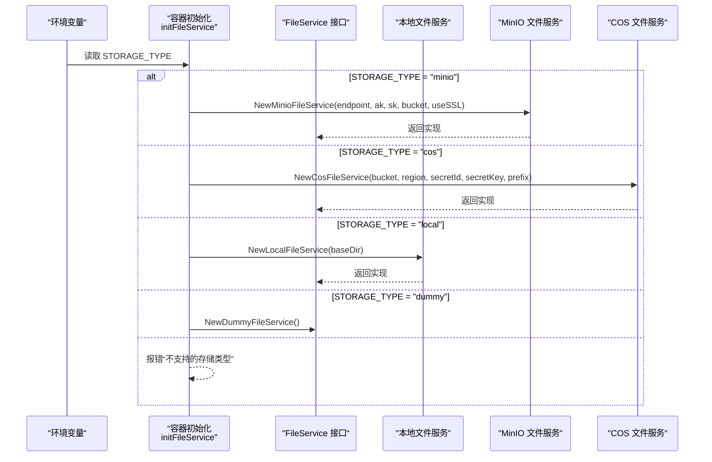
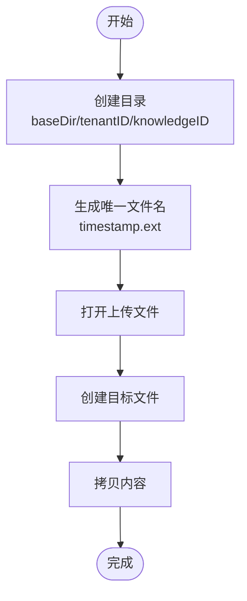
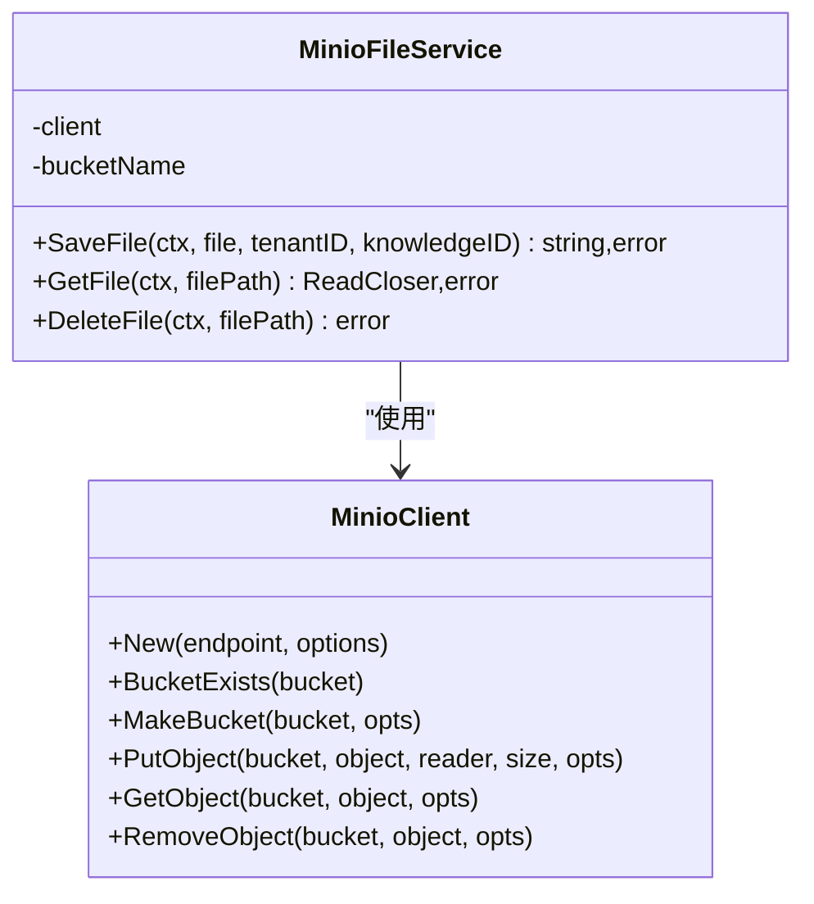
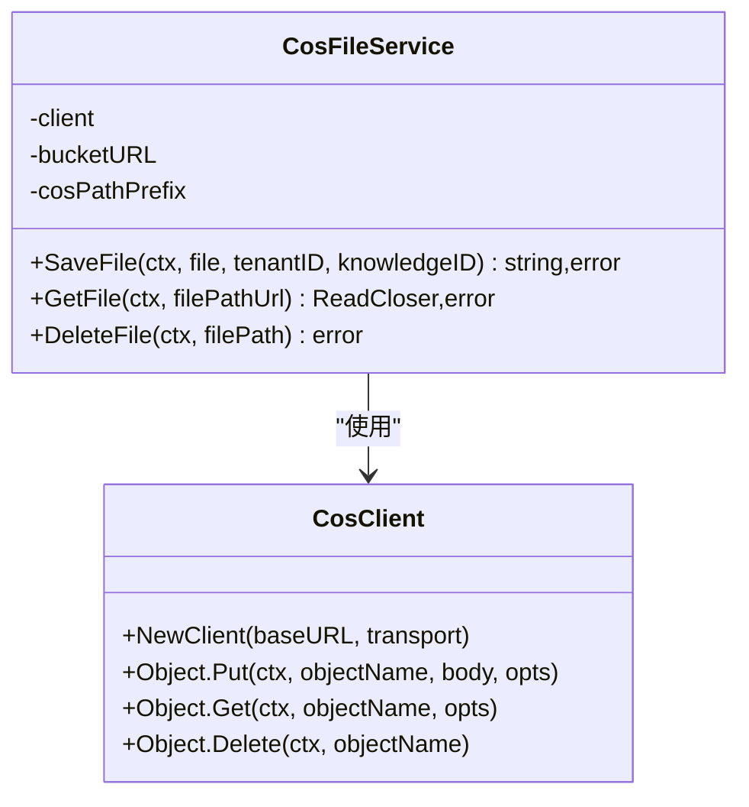
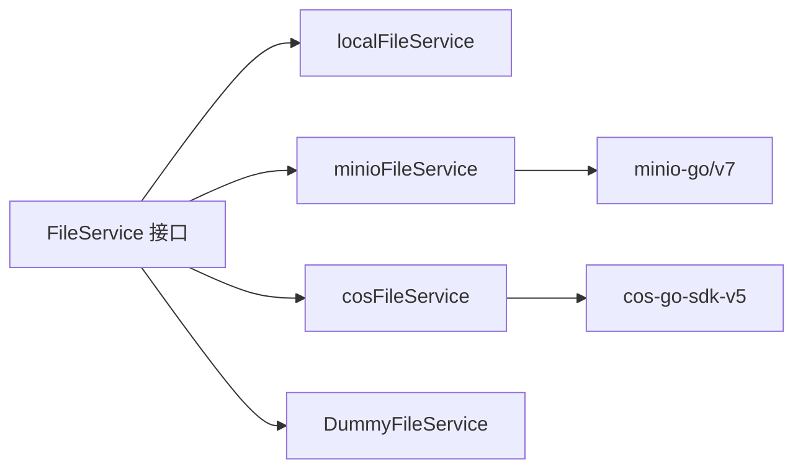

# 文件存储配置

<cite>
**本文引用的文件列表**
- [internal/container/container.go](file://internal/container/container.go)
- [internal/types/interfaces/file.go](file://internal/types/interfaces/file.go)
- [internal/application/service/file/local.go](file://internal/application/service/file/local.go)
- [internal/application/service/file/minio.go](file://internal/application/service/file/minio.go)
- [internal/application/service/file/cos.go](file://internal/application/service/file/cos.go)
- [internal/application/service/file/dummy.go](file://internal/application/service/file/dummy.go)
- [docker-compose.yml](file://docker-compose.yml)
- [docreader/parser/storage.py](file://docreader/parser/storage.py)
</cite>

## 目录
1. [简介](#简介)
2. [项目结构与角色定位](#项目结构与角色定位)
3. [核心组件](#核心组件)
4. [架构总览](#架构总览)
5. [详细组件解析](#详细组件解析)
6. [依赖关系分析](#依赖关系分析)
7. [性能与可靠性考量](#性能与可靠性考量)
8. [故障排查指南](#故障排查指南)
9. [结论](#结论)
10. [附录：环境变量与最佳实践](#附录环境变量与最佳实践)

## 简介
本文件存储配置文档聚焦于系统支持的三种存储后端：本地文件系统（local）、MinIO 对象存储（minio）与腾讯云对象存储（cos）。文档将结合 Go 服务代码，说明 STORAGE_TYPE 的选择逻辑、各后端所需的认证信息（如 MINIO_ACCESS_KEY_ID、MINIO_SECRET_ACCESS_KEY、COS_SECRET_ID、COS_SECRET_KEY 等）的配置方式；同时给出 LOCAL_STORAGE_BASE_DIR 的最佳实践，并说明在 Docker 环境中如何通过卷映射实现文件数据的持久化。

## 项目结构与角色定位
- 存储服务接口定义位于统一接口层，具体实现分别针对本地、MinIO、COS 与 Dummy 四类后端。
- 应用启动时根据 STORAGE_TYPE 选择对应的文件服务实现，从而决定上传、获取与删除文件的具体行为。
- Docker Compose 中为 MinIO、PostgreSQL、Redis、Jaeger、Neo4j 等服务提供了编排与持久化卷，便于在容器内稳定运行。

图表来源
- [internal/types/interfaces/file.go](file://internal/types/interfaces/file.go#L9-L19)
- [internal/container/container.go](file://internal/container/container.go#L309-L356)

章节来源
- [internal/types/interfaces/file.go](file://internal/types/interfaces/file.go#L9-L19)
- [internal/container/container.go](file://internal/container/container.go#L309-L356)

## 核心组件
- FileService 接口：统一定义保存、获取、删除文件的方法，确保不同后端实现的一致性。
- 本地文件服务（local）：将文件写入本地磁盘，按租户与知识库 ID 组织目录结构。
- MinIO 文件服务（minio）：基于 MinIO 客户端上传/下载/删除对象，自动确保桶存在。
- COS 文件服务（cos）：基于腾讯云 COS SDK 上传/下载/删除对象，支持路径前缀组织。
- Dummy 文件服务（dummy）：测试用途，不实际落盘或联网。

章节来源
- [internal/types/interfaces/file.go](file://internal/types/interfaces/file.go#L9-L19)
- [internal/application/service/file/local.go](file://internal/application/service/file/local.go#L16-L112)
- [internal/application/service/file/minio.go](file://internal/application/service/file/minio.go#L16-L128)
- [internal/application/service/file/cos.go](file://internal/application/service/file/cos.go#L18-L84)
- [internal/application/service/file/dummy.go](file://internal/application/service/file/dummy.go#L13-L38)

## 架构总览
下图展示应用启动时根据 STORAGE_TYPE 选择文件服务的流程，以及各后端的初始化要点。

图表来源
- [internal/container/container.go](file://internal/container/container.go#L309-L356)
- [internal/application/service/file/minio.go](file://internal/application/service/file/minio.go#L22-L52)
- [internal/application/service/file/cos.go](file://internal/application/service/file/cos.go#L25-L44)
- [internal/application/service/file/local.go](file://internal/application/service/file/local.go#L21-L26)
- [internal/application/service/file/dummy.go](file://internal/application/service/file/dummy.go#L18-L20)

## 详细组件解析

### 本地文件存储（local）
- 初始化：通过构造函数传入基础目录（LOCAL_STORAGE_BASE_DIR），并在该目录下按租户 ID 与知识库 ID 创建子目录。
- 保存文件：将上传文件写入目标路径，文件名采用纳秒级时间戳+原始扩展名，保证唯一性。
- 获取文件：以只读方式打开文件返回 ReadCloser。
- 删除文件：直接移除对应路径文件。
- 最佳实践：
  - 将基础目录挂载到持久化卷，避免容器重启丢失数据。
  - 为不同租户与知识库建立清晰的目录层级，便于运维与清理。
  - 控制并发写入，避免同路径竞争。

图表来源
- [internal/application/service/file/local.go](file://internal/application/service/file/local.go#L28-L79)

章节来源
- [internal/application/service/file/local.go](file://internal/application/service/file/local.go#L16-L112)

### MinIO 对象存储（minio）
- 初始化：使用 endpoint、access key、secret key、useSSL 参数创建 MinIO 客户端；若桶不存在则自动创建。
- 保存文件：将 multipart 文件头的内容上传为对象，对象名包含租户与知识库 ID，便于隔离与检索。
- 获取文件：解析 minio:// 协议路径，提取桶名与对象名后拉取对象。
- 删除文件：解析路径后删除对象。
- 认证与配置：
  - 必需环境变量：MINIO_ENDPOINT、MINIO_ACCESS_KEY_ID、MINIO_SECRET_ACCESS_KEY、MINIO_BUCKET_NAME。
  - 可选环境变量：MINIO_USE_SSL（布尔）、MINIO_PATH_PREFIX（路径前缀）。
  - Docker Compose 中默认提供 MinIO 服务与访问凭据示例。

图表来源
- [internal/application/service/file/minio.go](file://internal/application/service/file/minio.go#L16-L128)

章节来源
- [internal/application/service/file/minio.go](file://internal/application/service/file/minio.go#L16-L128)
- [docker-compose.yml](file://docker-compose.yml#L176-L198)

### 腾讯云 COS（cos）
- 初始化：根据桶名与区域构造 BucketURL，使用 SecretID/SecretKey 创建 COS 客户端。
- 保存文件：对象名包含路径前缀、租户 ID、知识库 ID 与随机 UUID，便于组织与检索。
- 获取文件：去除 BucketURL 前缀得到对象名后拉取对象。
- 删除文件：去除 BucketURL 前缀后删除对象。
- 认证与配置：
  - 必需环境变量：COS_BUCKET_NAME、COS_REGION、COS_SECRET_ID、COS_SECRET_KEY、COS_PATH_PREFIX。
  - Docker Compose 中为 COS 提供了示例环境变量。
  - Python 文档阅读器侧也实现了 COS 客户端初始化与上传逻辑，可作为参考。

图表来源
- [internal/application/service/file/cos.go](file://internal/application/service/file/cos.go#L18-L84)

章节来源
- [internal/application/service/file/cos.go](file://internal/application/service/file/cos.go#L18-L84)
- [docker-compose.yml](file://docker-compose.yml#L1-L100)

### Python 文档阅读器中的 MinIO/COS 集成（参考）
- MinIO：支持从 storage_config 或环境变量读取配置，自动创建桶并设置公开读策略；上传字节流时可带路径前缀。
- COS：支持从 storage_config 或环境变量读取配置，初始化 COS 客户端并生成下载 URL。
- 注意：该实现用于文档阅读器服务，与 Go 后端的 FileService 实现相互独立，但配置项命名一致，便于对照理解。

章节来源
- [docreader/parser/storage.py](file://docreader/parser/storage.py#L200-L273)
- [docreader/parser/storage.py](file://docreader/parser/storage.py#L345-L436)

## 依赖关系分析
- 接口与实现解耦：FileService 接口定义与具体实现分离，便于在不同部署场景切换存储后端。
- 容器初始化集中决策：initFileService 根据 STORAGE_TYPE 与环境变量决定实例化哪一个实现。
- 外部依赖：
  - MinIO：minio-go/v7 客户端库。
  - COS：cos-go-sdk-v5 客户端库。
  - Dummy：仅用于测试，无外部依赖。

图表来源
- [internal/types/interfaces/file.go](file://internal/types/interfaces/file.go#L9-L19)
- [internal/application/service/file/minio.go](file://internal/application/service/file/minio.go#L16-L21)
- [internal/application/service/file/cos.go](file://internal/application/service/file/cos.go#L18-L23)

章节来源
- [internal/types/interfaces/file.go](file://internal/types/interfaces/file.go#L9-L19)
- [internal/application/service/file/minio.go](file://internal/application/service/file/minio.go#L16-L21)
- [internal/application/service/file/cos.go](file://internal/application/service/file/cos.go#L18-L23)

## 性能与可靠性考量
- 本地存储
  - 写入性能取决于宿主机磁盘 I/O 与并发度；建议使用 SSD 并限制并发写入。
  - 目录层级越深，文件系统遍历成本越高；建议控制租户与知识库数量规模。
- MinIO
  - 通过桶隔离多租户与知识库数据，便于横向扩展与备份。
  - 建议开启 SSL 与合适的桶策略，确保安全与可访问性。
- COS
  - 通过路径前缀组织数据，便于跨地域与跨账号迁移。
  - 注意网络延迟与带宽对大文件上传/下载的影响。
- 通用建议
  - 所有后端均应做好错误处理与日志记录，便于问题定位。
  - 对大文件建议分片上传或使用断点续传（如 MinIO 支持）。

[本节为通用指导，无需列出章节来源]

## 故障排查指南
- STORAGE_TYPE 未设置或不支持
  - 现象：启动时报错“不支持的存储类型”。
  - 处理：确认 STORAGE_TYPE 为 local、minio、cos 或 dummy 之一。
- MinIO 配置缺失
  - 现象：启动时报错“缺少 MinIO 配置”。
  - 处理：补齐 MINIO_ENDPOINT、MINIO_ACCESS_KEY_ID、MINIO_SECRET_ACCESS_KEY、MINIO_BUCKET_NAME。
- COS 配置缺失
  - 现象：启动时报错“缺少 COS 配置”。
  - 处理：补齐 COS_BUCKET_NAME、COS_REGION、COS_SECRET_ID、COS_SECRET_KEY、COS_PATH_PREFIX。
- 本地存储路径不可写
  - 现象：保存文件报错“无法创建目录/无法写入文件”。
  - 处理：检查 LOCAL_STORAGE_BASE_DIR 权限与可用空间，确认容器已挂载持久化卷。
- MinIO 桶不存在或权限不足
  - 现象：上传失败或无法列出对象。
  - 处理：确认桶存在且具备相应权限；必要时手动创建桶并设置策略。
- COS 传输鉴权失败
  - 现象：上传/下载报鉴权错误。
  - 处理：核对 COS_SECRET_ID/COS_SECRET_KEY 与 COS_REGION 是否正确。

章节来源
- [internal/container/container.go](file://internal/container/container.go#L309-L356)
- [internal/application/service/file/local.go](file://internal/application/service/file/local.go#L28-L79)
- [internal/application/service/file/minio.go](file://internal/application/service/file/minio.go#L22-L52)
- [internal/application/service/file/cos.go](file://internal/application/service/file/cos.go#L25-L44)

## 结论
通过统一的 FileService 接口与容器初始化逻辑，系统可在本地、MinIO 与 COS 之间灵活切换。配置方面，STORAGE_TYPE 决定后端类型，各后端所需的关键认证信息已在 Go 服务与 Docker Compose 中明确。配合持久化卷与合理的目录组织，可实现稳定可靠的文件存储能力。

[本节为总结，无需列出章节来源]

## 附录：环境变量与最佳实践

### 环境变量清单
- STORAGE_TYPE：选择存储后端（local、minio、cos、dummy）。
- LOCAL_STORAGE_BASE_DIR：本地存储根目录（仅 local 模式生效）。
- MINIO_ENDPOINT：MinIO 服务地址。
- MINIO_ACCESS_KEY_ID：MinIO 访问密钥。
- MINIO_SECRET_ACCESS_KEY：MinIO 密钥。
- MINIO_BUCKET_NAME：MinIO 桶名。
- MINIO_USE_SSL：是否启用 SSL（布尔）。
- MINIO_PATH_PREFIX：MinIO 路径前缀（可选）。
- COS_BUCKET_NAME：COS 桶名。
- COS_REGION：COS 区域。
- COS_SECRET_ID：COS SecretId。
- COS_SECRET_KEY：COS SecretKey。
- COS_PATH_PREFIX：COS 路径前缀。
- COS_APP_ID：COS AppId（Python 文档阅读器侧）。
- COS_ENABLE_OLD_DOMAIN：是否启用旧域名（Python 文档阅读器侧）。

章节来源
- [internal/container/container.go](file://internal/container/container.go#L309-L356)
- [docker-compose.yml](file://docker-compose.yml#L1-L100)
- [docreader/parser/storage.py](file://docreader/parser/storage.py#L61-L113)
- [docreader/parser/storage.py](file://docreader/parser/storage.py#L200-L273)

### Docker 持久化最佳实践
- 卷映射
  - 应用服务通过卷将本地文件目录映射到容器内，确保重启不丢数据。
  - 示例：将宿主机目录映射到容器内的 LOCAL_STORAGE_BASE_DIR。
- MinIO
  - 使用独立卷存储 MinIO 数据，便于备份与迁移。
  - 在 Compose 中已提供 MinIO 服务与数据卷配置。
- 其他服务
  - PostgreSQL、Redis、Jaeger、Neo4j 等均配置了持久化卷，建议保持一致的备份策略。

章节来源
- [docker-compose.yml](file://docker-compose.yml#L1-L100)
- [docker-compose.yml](file://docker-compose.yml#L176-L198)
- [docker-compose.yml](file://docker-compose.yml#L248-L254)