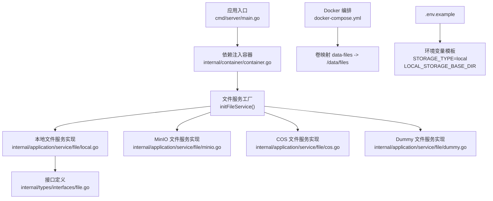
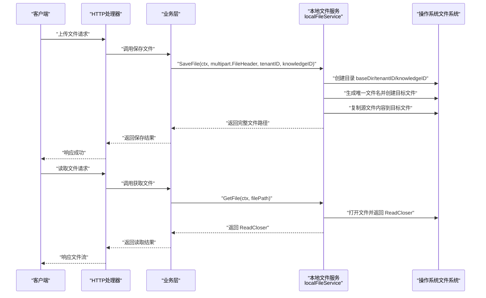
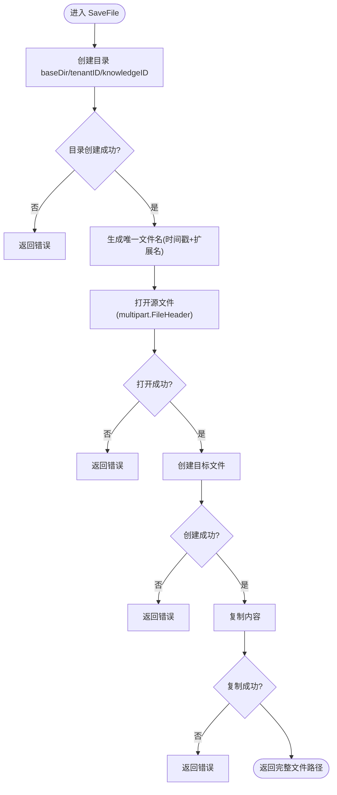
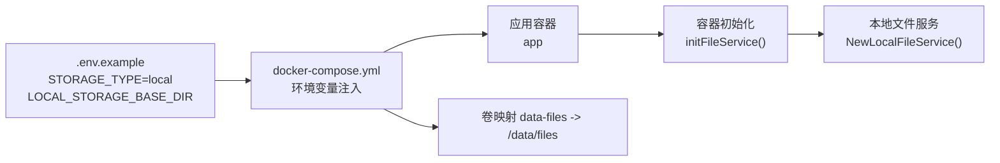

# 本地存储配置

<cite>
**本文引用的文件**
- [local.go](file://internal/application/service/file/local.go)
- [container.go](file://internal/container/container.go)
- [file.go](file://internal/types/interfaces/file.go)
- [docker-compose.yml](file://docker-compose.yml)
- [.env.example](file://.env.example)
- [minio.go](file://internal/application/service/file/minio.go)
- [cos.go](file://internal/application/service/file/cos.go)
- [dummy.go](file://internal/application/service/file/dummy.go)
- [main.go](file://cmd/server/main.go)
</cite>

## 目录
1. [简介](#简介)
2. [项目结构](#项目结构)
3. [核心组件](#核心组件)
4. [架构总览](#架构总览)
5. [详细组件分析](#详细组件分析)
6. [依赖关系分析](#依赖关系分析)
7. [性能考量](#性能考量)
8. [故障排查指南](#故障排查指南)
9. [结论](#结论)
10. [附录](#附录)

## 简介
本文件聚焦于 STORAGE_TYPE=local 模式下的本地文件存储配置与使用，围绕以下目标展开：
- 明确 LOCAL_STORAGE_BASE_DIR 的路径设置要求与最佳实践（目录权限、磁盘空间规划、备份策略）
- 基于 local.go 的实现，解释文件上传、存储路径生成与读取的完整流程
- 提供在 Docker 环境下通过卷映射实现数据持久化的配置示例
- 对比 MinIO 与 COS 云存储模式，说明本地存储的优缺点与适用场景

## 项目结构
与本地文件存储直接相关的代码位于 internal/application/service/file/local.go，容器初始化逻辑在 internal/container/container.go 中通过 initFileService 根据 STORAGE_TYPE 选择具体实现。Docker 编排文件 docker-compose.yml 提供了卷映射与环境变量示例，.env.example 提供了默认配置模板。

图表来源
- [main.go](file://cmd/server/main.go#L24-L104)
- [container.go](file://internal/container/container.go#L309-L357)
- [local.go](file://internal/application/service/file/local.go#L1-L112)
- [minio.go](file://internal/application/service/file/minio.go#L1-L128)
- [cos.go](file://internal/application/service/file/cos.go#L1-L84)
- [dummy.go](file://internal/application/service/file/dummy.go#L1-L39)
- [file.go](file://internal/types/interfaces/file.go#L1-L19)
- [docker-compose.yml](file://docker-compose.yml#L23-L25)
- [.env.example](file://.env.example#L20-L21)

章节来源
- [main.go](file://cmd/server/main.go#L24-L104)
- [container.go](file://internal/container/container.go#L309-L357)
- [docker-compose.yml](file://docker-compose.yml#L23-L25)
- [.env.example](file://.env.example#L20-L21)

## 核心组件
- 文件服务接口定义：统一 SaveFile、GetFile、DeleteFile 三个方法，便于切换存储后端。
- 本地文件服务实现：基于本地文件系统，按租户与知识库 ID 组织目录，生成唯一文件名并写入。
- 容器初始化：根据 STORAGE_TYPE 选择具体实现；当 STORAGE_TYPE=local 时，读取 LOCAL_STORAGE_BASE_DIR 并实例化本地服务。
- Docker 卷映射：将宿主机目录映射到容器内的 /data/files，实现持久化。

章节来源
- [file.go](file://internal/types/interfaces/file.go#L1-L19)
- [local.go](file://internal/application/service/file/local.go#L1-L112)
- [container.go](file://internal/container/container.go#L309-L357)
- [docker-compose.yml](file://docker-compose.yml#L23-L25)

## 架构总览
本地存储模式下的文件服务工作流如下：

图表来源
- [local.go](file://internal/application/service/file/local.go#L28-L112)
- [container.go](file://internal/container/container.go#L309-L357)

## 详细组件分析

### 本地文件服务实现（local.go）
- 目录组织策略
  - 存储根目录由 LOCAL_STORAGE_BASE_DIR 指定
  - 按租户 ID 与知识库 ID 创建两级目录，形成 baseDir/<tenantID>/<knowledgeID>/ 的层次结构
- 文件命名策略
  - 采用纳秒级时间戳作为文件名前缀，保留原扩展名，避免同名冲突
- 读写流程
  - 保存：打开源文件，创建目标文件，复制内容，记录日志
  - 读取：直接以只读方式打开文件并返回 ReadCloser
  - 删除：调用系统移除操作
- 日志与错误
  - 关键步骤均记录日志，错误包装为可传播的错误
  - 返回的文件路径为绝对路径，便于后续读取

图表来源
- [local.go](file://internal/application/service/file/local.go#L28-L79)

章节来源
- [local.go](file://internal/application/service/file/local.go#L1-L112)

### 容器初始化与存储类型选择（container.go）
- initFileService 根据 STORAGE_TYPE 选择实现：
  - STORAGE_TYPE=local：读取 LOCAL_STORAGE_BASE_DIR 并创建本地文件服务实例
  - STORAGE_TYPE=minio：校验 MinIO 环境变量并创建 MinIO 文件服务
  - STORAGE_TYPE=cos：校验 COS 环境变量并创建 COS 文件服务
  - STORAGE_TYPE=dummy：创建 Dummy 文件服务（测试用途）
- 未支持的类型将返回错误

章节来源
- [container.go](file://internal/container/container.go#L309-L357)

### 接口契约（file.go）
- FileService 接口定义了三类能力：保存、读取、删除
- 该接口在各后端实现中保持一致的行为契约，便于切换

章节来源
- [file.go](file://internal/types/interfaces/file.go#L1-L19)

### 与 MinIO/COS 的对比
- MinIO
  - 保存：生成基于租户与知识库 ID 的对象名，使用 UUID 保证唯一性
  - 读取/删除：通过对象名解析与 SDK 操作
  - 优点：分布式、可横向扩展、具备桶与对象管理能力
  - 适用：多租户、高并发、需要对象生命周期管理的场景
- COS
  - 保存：使用路径前缀 + 租户 + 知识库 + UUID 的对象名
  - 读取/删除：通过 URL 前缀解析对象名
  - 优点：云厂商生态完善、合规与安全能力较强
  - 适用：需要云原生能力与合规保障的企业场景
- 本地存储
  - 优点：部署简单、成本低、运维门槛低
  - 适用：单机或小规模部署、对性能与可靠性要求不高、无需对象管理能力的场景
  - 缺点：不具备分布式与高可用能力，需要自行处理备份与容灾

章节来源
- [minio.go](file://internal/application/service/file/minio.go#L54-L128)
- [cos.go](file://internal/application/service/file/cos.go#L46-L84)
- [local.go](file://internal/application/service/file/local.go#L28-L112)

## 依赖关系分析
- 应用入口 main.go 通过容器构建并启动 HTTP 服务
- 容器 container.go 在构建阶段注册 initFileService，从而注入 FileService
- STORAGE_TYPE 与 LOCAL_STORAGE_BASE_DIR 通过环境变量传递至容器
- Docker compose 将宿主机目录映射到容器内的 /data/files，实现持久化

图表来源
- [.env.example](file://.env.example#L20-L21)
- [.env.example](file://.env.example#L54-L56)
- [docker-compose.yml](file://docker-compose.yml#L23-L25)
- [docker-compose.yml](file://docker-compose.yml#L60-L61)
- [container.go](file://internal/container/container.go#L309-L357)
- [local.go](file://internal/application/service/file/local.go#L21-L26)

章节来源
- [main.go](file://cmd/server/main.go#L24-L104)
- [container.go](file://internal/container/container.go#L309-L357)
- [docker-compose.yml](file://docker-compose.yml#L23-L25)
- [.env.example](file://.env.example#L20-L21)

## 性能考量
- 本地存储的性能取决于宿主机磁盘 I/O 与并发写入能力。建议：
  - 使用高性能磁盘（如 SSD）并预留充足的可用空间
  - 控制并发上传，避免过多文件同时写入导致抖动
  - 对大文件上传采用分块或流式处理策略（如需要）
- 读取性能与磁盘吞吐相关，建议：
  - 合理规划目录层级，避免单目录下文件过多
  - 对热点文件进行缓存（如应用层缓存）

## 故障排查指南
- 保存失败
  - 检查 LOCAL_STORAGE_BASE_DIR 是否存在且具有写权限
  - 查看容器日志，确认目录创建与文件写入阶段是否报错
- 读取失败
  - 确认 filePath 是否为保存时返回的绝对路径
  - 检查容器内 /data/files 与宿主机卷映射是否正确
- 删除失败
  - 确认文件是否存在且未被占用
  - 检查权限与 SELinux/AppArmor 策略（如启用）

章节来源
- [local.go](file://internal/application/service/file/local.go#L28-L112)
- [docker-compose.yml](file://docker-compose.yml#L23-L25)

## 结论
- STORAGE_TYPE=local 模式下，LOCAL_STORAGE_BASE_DIR 是决定文件存储位置与持久化成败的关键参数
- 本地存储部署简单、成本低，适合小规模或单机场景；若需分布式、高可用与对象管理能力，建议选择 MinIO 或 COS
- 通过 Docker 卷映射与环境变量配置，可快速实现数据持久化与多环境一致性

## 附录

### 环境变量与默认值
- STORAGE_TYPE：默认 local
- LOCAL_STORAGE_BASE_DIR：默认 ./data/files
- 在 .env.example 中提供了完整的模板，可在生产环境复制为 .env 并按需修改

章节来源
- [.env.example](file://.env.example#L20-L21)
- [.env.example](file://.env.example#L54-L56)

### Docker 卷映射与持久化配置示例
- docker-compose.yml 中 app 服务通过 volumes 将宿主机目录映射到容器内的 /data/files，实现持久化
- 若需自定义宿主机目录，请在宿主机准备目标目录并赋予合适权限，再在 compose 中映射

章节来源
- [docker-compose.yml](file://docker-compose.yml#L23-L25)

### 与 MinIO/COS 的配置差异
- MinIO/COS 需要分别提供各自的端点、密钥、桶名等参数；本地存储仅需提供基础目录
- MinIO/COS 的对象名通常包含租户与知识库 ID，并使用 UUID 保证唯一性；本地存储使用时间戳+扩展名

章节来源
- [minio.go](file://internal/application/service/file/minio.go#L54-L128)
- [cos.go](file://internal/application/service/file/cos.go#L46-L84)
- [local.go](file://internal/application/service/file/local.go#L28-L79)