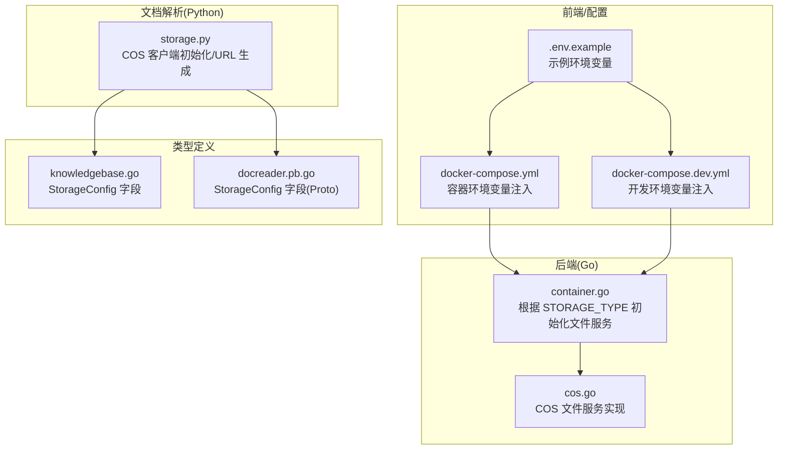
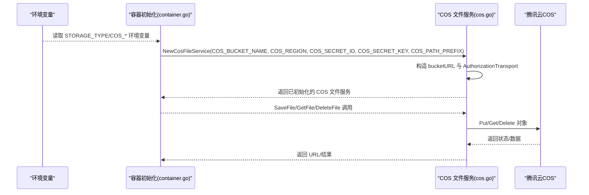
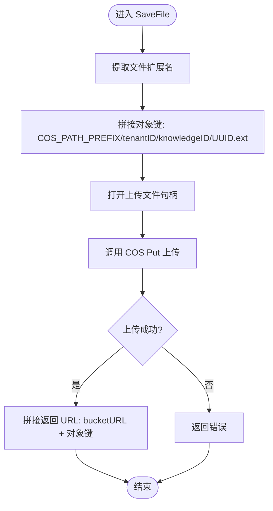
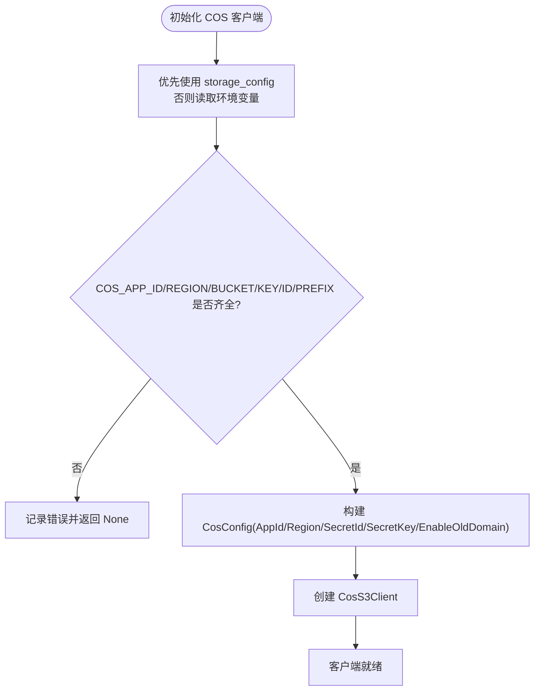
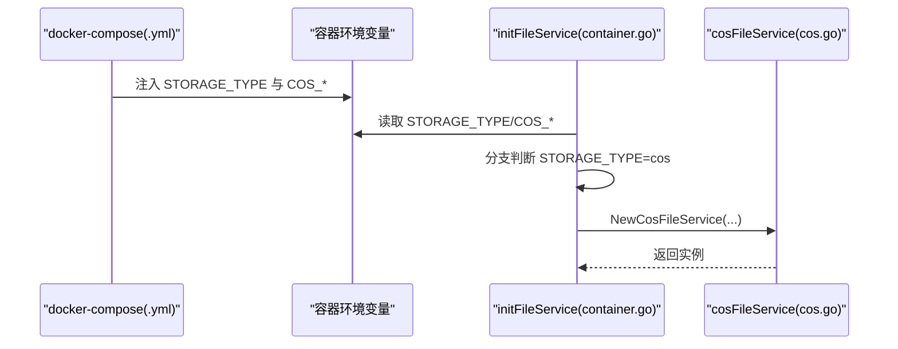
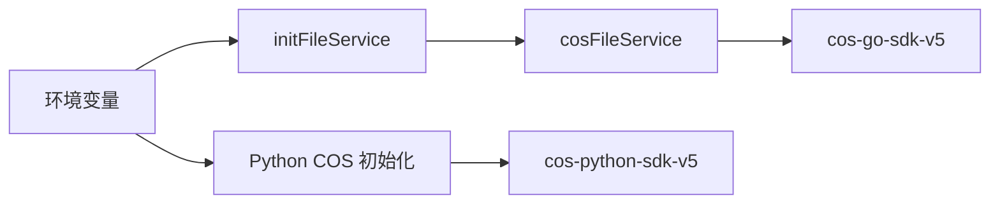

# 腾讯云COS存储配置

<cite>
**本文引用的文件列表**
- [cos.go](file://internal/application/service/file/cos.go)
- [container.go](file://internal/container/container.go)
- [.env.example](file://.env.example)
- [docker-compose.yml](file://docker-compose.yml)
- [docker-compose.dev.yml](file://docker-compose.dev.yml)
- [storage.py](file://docreader/parser/storage.py)
- [knowledgebase.go](file://internal/types/knowledgebase.go)
- [docreader.pb.go](file://docreader/proto/docreader.pb.go)
- [check-env.sh](file://scripts/check-env.sh)
</cite>

## 目录
1. [简介](#简介)
2. [项目结构](#项目结构)
3. [核心组件](#核心组件)
4. [架构总览](#架构总览)
5. [详细组件分析](#详细组件分析)
6. [依赖关系分析](#依赖关系分析)
7. [性能考虑](#性能考虑)
8. [故障排查指南](#故障排查指南)
9. [结论](#结论)
10. [附录](#附录)

## 简介
本文件面向在 WeKnora 中使用腾讯云 COS 作为文件存储后端的用户，聚焦于 STORAGE_TYPE=cos 模式下的配置要点与实现细节。内容涵盖：
- 关键环境变量的含义、来源与设置方式（COS_SECRET_ID、COS_SECRET_KEY、COS_REGION、COS_BUCKET_NAME、COS_PATH_PREFIX、COS_APP_ID、COS_ENABLE_OLD_DOMAIN）
- 客户端初始化流程、文件上传路径生成规则、URL 构造逻辑
- 权限策略配置建议与安全注意事项
- 连接测试与常见问题排查步骤

## 项目结构
围绕 COS 存储的关键代码分布在以下位置：
- Go 后端文件服务实现：internal/application/service/file/cos.go
- 容器初始化与环境变量读取：internal/container/container.go
- Python 文档解析存储实现：docreader/parser/storage.py
- 配置示例与容器编排：.env.example、docker-compose.yml、docker-compose.dev.yml
- 类型定义与协议字段：internal/types/knowledgebase.go、docreader/proto/docreader.pb.go
- 环境检查脚本：scripts/check-env.sh

图表来源
- [cos.go](file://internal/application/service/file/cos.go#L1-L84)
- [container.go](file://internal/container/container.go#L309-L356)
- [.env.example](file://.env.example#L114-L134)
- [docker-compose.yml](file://docker-compose.yml#L30-L40)
- [docker-compose.dev.yml](file://docker-compose.dev.yml#L83-L90)
- [storage.py](file://docreader/parser/storage.py#L61-L126)
- [knowledgebase.go](file://internal/types/knowledgebase.go#L108-L124)
- [docreader.pb.go](file://docreader/proto/docreader.pb.go#L74-L86)

章节来源
- [cos.go](file://internal/application/service/file/cos.go#L1-L84)
- [container.go](file://internal/container/container.go#L309-L356)
- [.env.example](file://.env.example#L114-L134)
- [docker-compose.yml](file://docker-compose.yml#L30-L40)
- [docker-compose.dev.yml](file://docker-compose.dev.yml#L83-L90)
- [storage.py](file://docreader/parser/storage.py#L61-L126)
- [knowledgebase.go](file://internal/types/knowledgebase.go#L108-L124)
- [docreader.pb.go](file://docreader/proto/docreader.pb.go#L74-L86)

## 核心组件
- Go 后端 COS 文件服务
  - 初始化：基于 COS_REGION、COS_BUCKET_NAME、COS_SECRET_ID、COS_SECRET_KEY、COS_PATH_PREFIX 构建 COS 客户端与基础 URL
  - 上传：生成带 COS_PATH_PREFIX 的对象键，使用唯一标识避免冲突
  - 下载/删除：基于完整 bucketURL 解析对象键进行操作
- Python 文档解析 COS 客户端
  - 初始化：支持从 storage_config 或环境变量加载 COS_APP_ID、COS_REGION、COS_BUCKET_NAME、COS_SECRET_ID、COS_SECRET_KEY、COS_PATH_PREFIX；支持 COS_ENABLE_OLD_DOMAIN 控制域名风格
  - URL 生成：按 bucket、region、object_key 生成下载 URL
- 容器初始化
  - 依据 STORAGE_TYPE=cos 读取 COS_* 环境变量并创建 COS 文件服务实例
- 类型与协议
  - Go/Python/Proto 中均包含 AppId、Region、BucketName、AccessKeyId、SecretAccessKey、PathPrefix 等字段，确保跨语言一致性

章节来源
- [cos.go](file://internal/application/service/file/cos.go#L25-L63)
- [storage.py](file://docreader/parser/storage.py#L61-L126)
- [container.go](file://internal/container/container.go#L334-L348)
- [knowledgebase.go](file://internal/types/knowledgebase.go#L108-L124)
- [docreader.pb.go](file://docreader/proto/docreader.pb.go#L74-L86)

## 架构总览
下图展示 STORAGETYPE=cos 时，应用如何读取环境变量、初始化 COS 客户端并执行文件操作：

图表来源
- [container.go](file://internal/container/container.go#L334-L348)
- [cos.go](file://internal/application/service/file/cos.go#L25-L63)

## 详细组件分析

### Go 后端 COS 文件服务
- 客户端初始化
  - 基于 COS_REGION、COS_BUCKET_NAME 组合基础 URL
  - 使用 COS_SECRET_ID/COS_SECRET_KEY 创建授权传输层
- 文件上传路径生成
  - 对象键由 COS_PATH_PREFIX + tenantID + knowledgeID + 唯一标识 + 扩展名组成
- URL 构造
  - 返回 bucketURL + 对象键
- 下载/删除
  - 通过去除 bucketURL 前缀得到对象键，再调用对应 API

图表来源
- [cos.go](file://internal/application/service/file/cos.go#L46-L63)

章节来源
- [cos.go](file://internal/application/service/file/cos.go#L25-L63)

### Python 文档解析 COS 客户端
- 客户端初始化
  - 支持 storage_config 或环境变量加载 COS_APP_ID、COS_REGION、COS_BUCKET_NAME、COS_SECRET_ID、COS_SECRET_KEY、COS_PATH_PREFIX
  - 支持 COS_ENABLE_OLD_DOMAIN 控制域名风格
- URL 生成
  - 采用标准域名格式 https://{bucket}.cos.{region}.myqcloud.com/{object_key}

图表来源
- [storage.py](file://docreader/parser/storage.py#L61-L112)

章节来源
- [storage.py](file://docreader/parser/storage.py#L61-L126)

### 容器初始化与环境变量
- 容器启动时从环境变量读取 STORAGE_TYPE 与 COS_*，当 STORAGE_TYPE=cos 时创建 COS 文件服务
- docker-compose.yml 与 docker-compose.dev.yml 将 COS_* 注入容器

图表来源
- [docker-compose.yml](file://docker-compose.yml#L30-L40)
- [docker-compose.dev.yml](file://docker-compose.dev.yml#L83-L90)
- [container.go](file://internal/container/container.go#L334-L348)

章节来源
- [docker-compose.yml](file://docker-compose.yml#L30-L40)
- [docker-compose.dev.yml](file://docker-compose.dev.yml#L83-L90)
- [container.go](file://internal/container/container.go#L334-L348)

### 关键环境变量与设置方法
- STORAGE_TYPE
  - 作用：选择文件存储后端类型
  - 设置：在 .env、docker-compose.yml 或 docker-compose.dev.yml 中设置为 cos
- COS_SECRET_ID
  - 作用：COS 访问密钥 ID
  - 来源：腾讯云 CAM 密钥管理
  - 设置：在 .env 或容器环境变量中配置
- COS_SECRET_KEY
  - 作用：COS 访问密钥 Key
  - 来源：腾讯云 CAM 密钥管理
  - 设置：同上
- COS_REGION
  - 作用：COS 所在地域
  - 示例：ap-beijing、ap-shanghai 等
  - 设置：在 .env 或容器环境变量中配置
- COS_BUCKET_NAME
  - 作用：COS 存储桶名称
  - 设置：在 .env 或容器环境变量中配置
- COS_APP_ID
  - 作用：COS 应用 ID（Python 文档解析侧）
  - 设置：在 .env 或 storage_config 中配置
- COS_PATH_PREFIX
  - 作用：文件对象键前缀，用于组织文件目录结构
  - 设置：在 .env 或容器环境变量中配置
- COS_ENABLE_OLD_DOMAIN
  - 作用：控制是否启用旧域名格式（Python 文档解析侧）
  - 默认：true
  - 设置：在 .env 或容器环境变量中配置

章节来源
- [.env.example](file://.env.example#L114-L134)
- [docker-compose.yml](file://docker-compose.yml#L30-L40)
- [docker-compose.dev.yml](file://docker-compose.dev.yml#L83-L90)
- [storage.py](file://docreader/parser/storage.py#L61-L126)
- [knowledgebase.go](file://internal/types/knowledgebase.go#L108-L124)
- [docreader.pb.go](file://docreader/proto/docreader.pb.go#L74-L86)

### 权限策略配置建议
- 最小权限原则
  - 仅授予必要权限：上传 PutObject、下载 GetObject、删除 DeleteObject
  - 限制范围：限定特定 Bucket 与前缀（如 COS_PATH_PREFIX）
- 域名访问控制
  - 若启用 COS_ENABLE_OLD_DOMAIN=false，注意客户端与服务端对新域名格式的支持
- 证书与网络
  - 确保容器网络可达 COS 域名与端点
  - 如需代理，参考 WEB_PROXY 配置（若适用）

章节来源
- [storage.py](file://docreader/parser/storage.py#L61-L126)

### URL 构造与下载
- Go 后端
  - 返回 bucketURL + 对象键
- Python 文档解析
  - 采用 https://{bucket}.cos.{region}.myqcloud.com/{object_key} 格式
- 注意事项
  - 对象键需与上传时一致（含 COS_PATH_PREFIX）
  - 下载 URL 有效期取决于 COS 策略与签名策略

章节来源
- [cos.go](file://internal/application/service/file/cos.go#L62-L63)
- [storage.py](file://docreader/parser/storage.py#L114-L126)

## 依赖关系分析
- Go 后端 COS 文件服务依赖腾讯云 COS SDK
- 容器初始化依赖环境变量（STORAGE_TYPE、COS_*）
- Python 文档解析 COS 客户端依赖 cos-python-sdk-v5
- 类型定义在 Go/Python/Proto 中保持一致字段

图表来源
- [container.go](file://internal/container/container.go#L334-L348)
- [cos.go](file://internal/application/service/file/cos.go#L1-L24)
- [storage.py](file://docreader/parser/storage.py#L61-L112)

章节来源
- [container.go](file://internal/container/container.go#L334-L348)
- [cos.go](file://internal/application/service/file/cos.go#L1-L24)
- [storage.py](file://docreader/parser/storage.py#L61-L112)

## 性能考虑
- 并发上传：合理设置并发度，避免触发 COS 速率限制
- 对象键设计：使用前缀与 UUID 组织，便于分片与清理
- CDN/加速：如需加速访问，可在 COS 控制台开启 CDN 或自定义域名
- 日志与监控：开启必要的日志与链路追踪，定位性能瓶颈

## 故障排查指南
- 环境变量缺失
  - 现象：初始化时报错或无法创建 COS 文件服务
  - 排查：确认 STORAGE_TYPE=cos 且 COS_BUCKET_NAME、COS_REGION、COS_SECRET_ID、COS_SECRET_KEY、COS_PATH_PREFIX 均已设置
  - 参考：容器初始化校验逻辑
- 权限不足
  - 现象：上传/下载/删除失败
  - 排查：核对密钥权限范围与 Bucket 策略；确认 COS_ENABLE_OLD_DOMAIN 与域名格式匹配
- URL 无法访问
  - 现象：下载链接 403/404
  - 排查：确认对象键与前缀一致；检查 COS 控制台访问策略与签名策略
- 网络连通性
  - 现象：连接超时或 DNS 解析失败
  - 排查：检查容器网络、代理设置与防火墙；确保可访问 cos.{region}.myqcloud.com
- 连接测试
  - 建议：使用 curl 或浏览器访问下载 URL，或在应用中执行一次上传/下载操作以验证
  - 参考：环境检查脚本可帮助快速定位缺失项

章节来源
- [container.go](file://internal/container/container.go#L334-L348)
- [storage.py](file://docreader/parser/storage.py#L61-L126)
- [check-env.sh](file://scripts/check-env.sh#L1-L197)

## 结论
在 WeKnora 中启用 STORAGE_TYPE=cos 时，务必正确配置 COS_* 环境变量，并理解对象键生成规则与 URL 构造方式。遵循最小权限原则与网络连通性要求，结合连接测试与日志排查，可有效保障文件上传与访问的稳定性。

## 附录
- 配置示例与注入位置
  - .env.example 提供了 COS_* 的注释示例
  - docker-compose.yml 与 docker-compose.dev.yml 将 COS_* 注入容器环境
- 类型字段一致性
  - Go/Python/Proto 中均包含 AppId、Region、BucketName、AccessKeyId、SecretAccessKey、PathPrefix 字段，便于跨模块协作

章节来源
- [.env.example](file://.env.example#L114-L134)
- [docker-compose.yml](file://docker-compose.yml#L30-L40)
- [docker-compose.dev.yml](file://docker-compose.dev.yml#L83-L90)
- [knowledgebase.go](file://internal/types/knowledgebase.go#L108-L124)
- [docreader.pb.go](file://docreader/proto/docreader.pb.go#L74-L86)