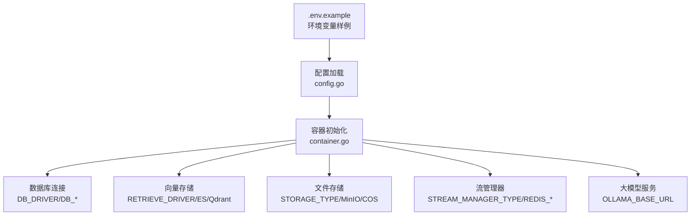
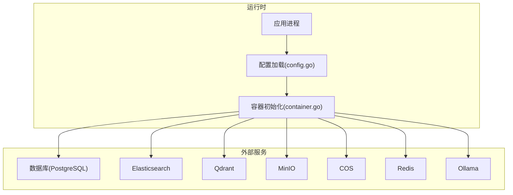
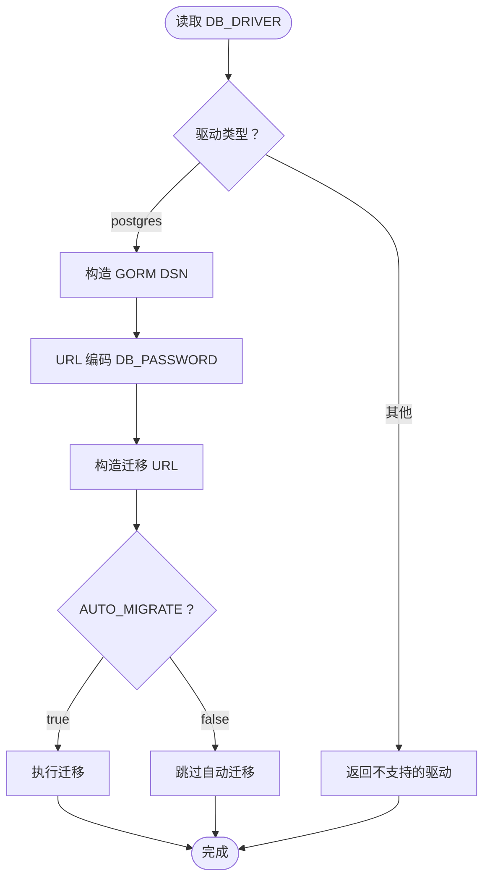
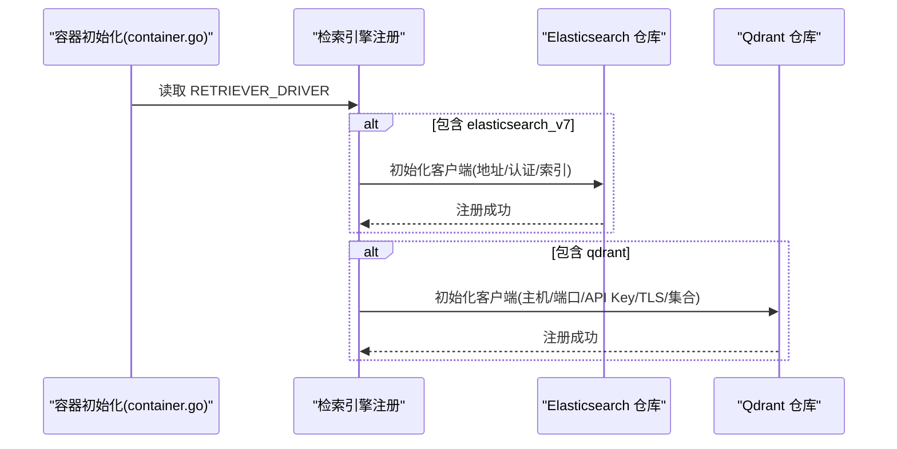
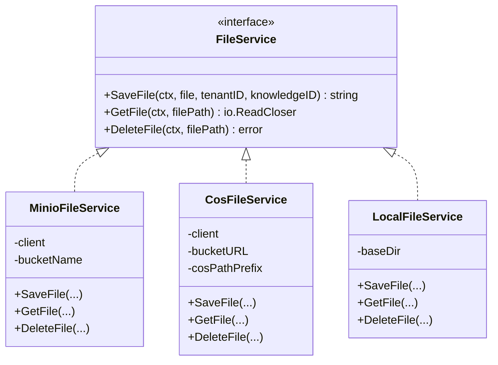
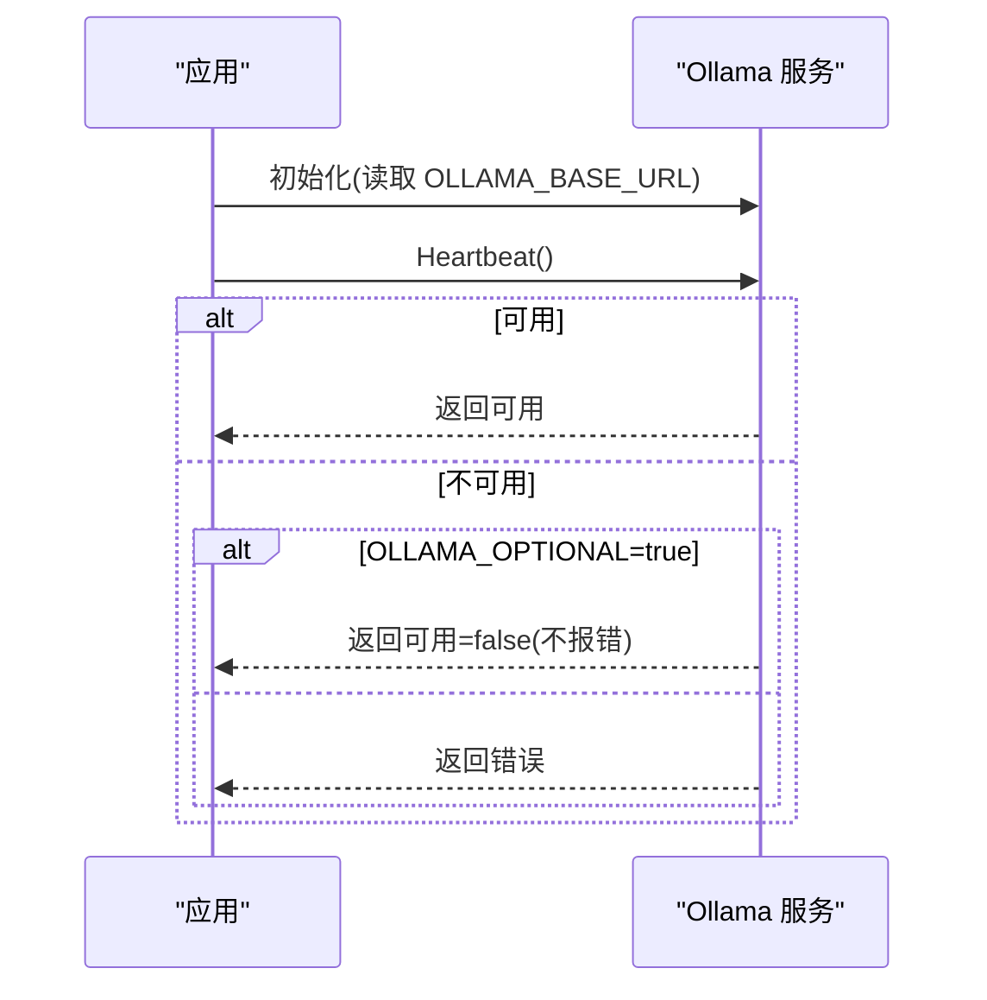
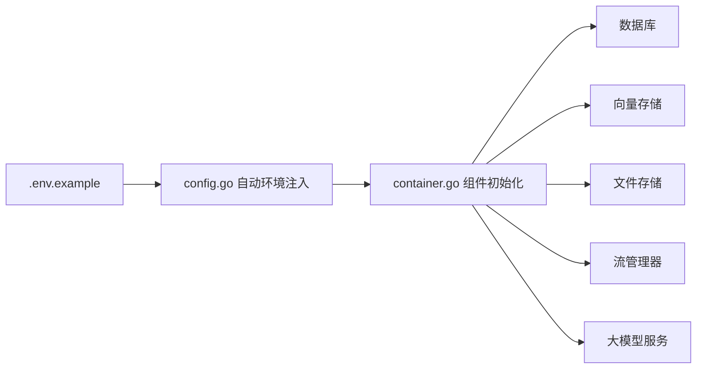

# 环境变量配置

<cite>
**本文引用的文件**
- [.env.example](file://.env.example)
- [开发指南.md](file://docs/开发指南.md)
- [快速开发模式说明.md](file://docs/快速开发模式说明.md)
- [container.go](file://internal/container/container.go)
- [config.go](file://internal/config/config.go)
- [minio.go](file://internal/application/service/file/minio.go)
- [cos.go](file://internal/application/service/file/cos.go)
- [local.go](file://internal/application/service/file/local.go)
- [ollama.go](file://internal/models/utils/ollama/ollama.go)
- [repository.go（Elasticsearch v7）](file://internal/application/repository/retriever/elasticsearch/v7/repository.go)
- [repository.go（Qdrant）](file://internal/application/repository/retriever/qdrant/repository.go)
- [storage.py](file://docreader/parser/storage.py)
</cite>

## 目录
1. [简介](#简介)
2. [项目结构与入口](#项目结构与入口)
3. [核心组件与分类](#核心组件与分类)
4. [架构概览](#架构概览)
5. [详细组件分析](#详细组件分析)
6. [依赖关系分析](#依赖关系分析)
7. [性能与安全建议](#性能与安全建议)
8. [故障排查指南](#故障排查指南)
9. [结论](#结论)

## 简介
本文件围绕 .env.example 中的关键环境变量进行系统化梳理，覆盖数据库、向量存储、文件存储、缓存、大模型服务连接等配置类别，并结合开发指南中的“快速开发模式”，给出开发、测试、生产三类环境的最佳实践与安全注意事项。读者无需深入源码即可理解各配置项的作用与取值范围。

## 项目结构与入口
- 环境变量样例位于根目录，提供各类服务的默认值与注释说明。
- 应用通过容器初始化逻辑读取环境变量，按配置选择数据库、向量存储、文件存储与流管理器等组件。
- YAML 配置文件可通过环境变量注入，实现灵活的运行时配置。

图表来源
- [.env.example](file://.env.example#L1-L150)
- [config.go](file://internal/config/config.go#L148-L196)
- [container.go](file://internal/container/container.go#L225-L307)

章节来源
- file://.env.example#L1-L150
- file://internal/config/config.go#L148-L196
- file://internal/container/container.go#L225-L307

## 核心组件与分类
本节对 .env.example 中的关键配置项进行分组说明，帮助快速定位与配置。

- 数据库配置
  - DB_DRIVER：数据库驱动类型（如 postgres），决定连接与迁移策略。
  - DB_USER/DB_PASSWORD/DB_NAME：数据库用户、密码与库名。
  - DB_HOST/DB_PORT/AUTO_MIGRATE：数据库主机、端口与迁移开关。
- 向量存储配置
  - RETRIEVE_DRIVER：向量检索引擎类型（如 postgres/elasticsearch_v7/elasticsearch_v8/qdrant）。
  - ELASTICSEARCH_ADDR/USERNAME/PASSWORD/INDEX：Elasticsearch 地址、认证与索引名。
  - QDRANT_HOST/PORT/API_KEY/USE_TLS/COLLECTION：Qdrant 主机、端口、API 密钥、TLS 与集合名。
- 文件存储配置
  - STORAGE_TYPE：存储类型（local/minio/cos/dummy）。
  - LOCAL_STORAGE_BASE_DIR：本地存储基础目录。
  - MINIO_ENDPOINT/ACCESS_KEY_ID/SECRET_ACCESS_KEY/BUCKET_NAME：MinIO 端点、凭据与桶名。
  - COS_*：COS 的 SecretId/SecretKey/Region/BucketName/PathPrefix/AppId 等。
- 缓存与流管理
  - STREAM_MANAGER_TYPE：流管理器类型（memory/redis）。
  - REDIS_ADDR/PASSWORD/DB/PREFIX：Redis 地址、密码、库号与键前缀。
- 大模型服务
  - OLLAMA_BASE_URL：Ollama 服务基准 URL；可选 OLLAMA_OPTIONAL 控制不可用时行为。
- 其他
  - APP_PORT/FRONTEND_PORT/DOCREADER_PORT：应用、前端与文档解析服务端口。
  - ENABLE_GRAPH_RAG/JWT_SECRET/TENANT_AES_KEY：图谱开关、JWT 与租户密钥。
  - CONCURRENCY_POOL_SIZE：嵌入并发池大小。
  - WEB_PROXY/NEO4J_*：网络代理与 Neo4j 开关与认证。

章节来源
- file://.env.example#L6-L150

## 架构概览
下图展示环境变量在启动时如何影响组件初始化与运行时行为。

图表来源
- [container.go](file://internal/container/container.go#L225-L307)
- [config.go](file://internal/config/config.go#L148-L196)

## 详细组件分析

### 数据库配置（DB_DRIVER、DB_USER、DB_PASSWORD、DB_NAME、DB_HOST、DB_PORT、AUTO_MIGRATE）
- 作用
  - DB_DRIVER 决定数据库方言与迁移 URL 格式。
  - DB_USER/DB_PASSWORD/DB_NAME/DB_HOST/DB_PORT 组成连接字符串。
  - AUTO_MIGRATE 控制是否自动执行迁移。
- 关键实现
  - 初始化函数根据 DB_DRIVER 选择方言并构造 DSN，同时以 URL 编码处理密码，确保特殊字符安全。
  - 迁移 URL 与 GORM DSN 分别生成，便于兼容不同工具链。
- 最佳实践
  - 生产环境建议显式设置 DB_HOST/DB_PORT/DB_NAME/DB_USER/DB_PASSWORD，避免默认值暴露。
  - 若使用外部迁移工具，可关闭 AUTO_MIGRATE 并手动执行迁移。
- 安全注意
  - 不要在版本控制中提交 .env；使用 CI/CD 注入密钥。
  - 密码包含特殊字符时，确保正确编码。

图表来源
- [container.go](file://internal/container/container.go#L235-L307)
- [migrate.sh](file://scripts/migrate.sh#L33-L60)

章节来源
- file://internal/container/container.go#L235-L307
- file://scripts/migrate.sh#L33-L60

### 向量存储配置（RETRIEVE_DRIVER、ELASTICSEARCH_ADDR、QDRANT_HOST、QDRANT_PORT、QDRANT_API_KEY、QDRANT_USE_TLS、QDRANT_COLLECTION）
- 作用
  - RETRIEVE_DRIVER 指定向量检索后端（支持多种）。
  - Elasticsearch 配置包括地址、认证与索引名。
  - Qdrant 支持主机、端口、API 密钥与 TLS 开关，集合名可自定义。
- 关键实现
  - 初始化时根据驱动注册对应检索引擎仓库。
  - Elasticsearch 仓库从环境变量读取索引名，未设置时使用默认值。
  - Qdrant 仓库从环境变量读取集合名，未设置时使用默认值；支持可选 TLS 与 API Key。
- 最佳实践
  - 生产环境为 Qdrant 启用 TLS 并配置 API Key。
  - Elasticsearch 索引名应与知识库/租户隔离策略一致。
- 安全注意
  - Qdrant API Key 与 Elasticsearch 凭据需妥善保管，避免泄露。

图表来源
- [container.go](file://internal/container/container.go#L405-L475)
- [repository.go（Elasticsearch v7）](file://internal/application/repository/retriever/elasticsearch/v7/repository.go#L33-L48)
- [repository.go（Qdrant）](file://internal/application/repository/retriever/qdrant/repository.go#L31-L48)

章节来源
- file://internal/container/container.go#L405-L475
- file://internal/application/repository/retriever/elasticsearch/v7/repository.go#L33-L48
- file://internal/application/repository/retriever/qdrant/repository.go#L31-L48

### 文件存储配置（STORAGE_TYPE、LOCAL_STORAGE_BASE_DIR、MINIO_*、COS_*）
- 作用
  - STORAGE_TYPE 决定文件存储后端（local/minio/cos/dummy）。
  - LOCAL_STORAGE_BASE_DIR 仅在本地存储时生效。
  - MinIO 需要端点、访问密钥、密钥与桶名。
  - COS 需要 SecretId/SecretKey/Region/BucketName/PathPrefix 等。
- 关键实现
  - 容器初始化根据 STORAGE_TYPE 选择具体实现，并校验必要字段。
  - MinIO/Local/COS 实现分别负责上传、下载与删除。
  - DocReader 的 Python 存储层同样支持从环境变量读取 MinIO 配置。
- 最佳实践
  - 生产环境优先使用 MinIO 或 COS，确保跨域与权限控制完善。
  - 本地存储仅用于开发与测试，避免在生产使用。
- 安全注意
  - MinIO/COS 凭据必须严格保密；限制最小权限与访问范围。

图表来源
- [minio.go](file://internal/application/service/file/minio.go#L1-L128)
- [cos.go](file://internal/application/service/file/cos.go#L1-L84)
- [local.go](file://internal/application/service/file/local.go#L1-L112)

章节来源
- file://internal/container/container.go#L318-L356
- file://internal/application/service/file/minio.go#L1-L128
- file://internal/application/service/file/cos.go#L1-L84
- file://internal/application/service/file/local.go#L1-L112
- file://docreader/parser/storage.py#L200-L436

### 缓存与流管理（STREAM_MANAGER_TYPE、REDIS_ADDR、REDIS_PASSWORD、REDIS_DB、REDIS_PREFIX）
- 作用
  - STREAM_MANAGER_TYPE 指定流管理器类型（memory/redis）。
  - REDIS_* 用于 Redis 连接与命名空间隔离。
- 关键实现
  - 初始化 Redis 客户端并执行 PING 校验连通性。
  - 上下文存储可基于 Redis 实现（如 LLM 上下文）。
- 最佳实践
  - 生产环境使用 Redis 作为流管理器，设置合理的 TTL 与键前缀。
  - 为不同租户/实例设置独立前缀，避免键冲突。
- 安全注意
  - Redis 若暴露公网，务必设置密码与防火墙策略。

章节来源
- file://internal/container/container.go#L196-L215
- file://internal/container/container.go#L217-L223

### 大模型服务连接（OLLAMA_BASE_URL、OLLAMA_OPTIONAL）
- 作用
  - OLLAMA_BASE_URL 指定 Ollama 服务地址；若为空则使用默认值。
  - OLLAMA_OPTIONAL 可使服务不可用时不中断应用启动。
- 关键实现
  - 服务启动时进行心跳检测；模型可用性检查与拉取由服务封装处理。
- 最佳实践
  - 开发环境可使用本地 Ollama；生产环境建议部署专用服务并启用 TLS。
  - 如需容错，可启用 OLLAMA_OPTIONAL，但需评估功能降级风险。
- 安全注意
  - 限制 Ollama 服务访问范围，避免未授权调用。

图表来源
- [ollama.go](file://internal/models/utils/ollama/ollama.go#L27-L60)
- [ollama.go](file://internal/models/utils/ollama/ollama.go#L62-L84)
- [initialization.go](file://internal/handler/initialization.go#L780-L810)

章节来源
- file://internal/models/utils/ollama/ollama.go#L27-L60
- file://internal/models/utils/ollama/ollama.go#L62-L84
- file://internal/handler/initialization.go#L780-L810

## 依赖关系分析
- 环境变量到组件的映射
  - DB_DRIVER → 数据库方言与迁移 URL
  - RETRIEVER_DRIVER → Elasticsearch/Qdrant 仓库注册
  - STORAGE_TYPE → MinIO/COS/Local 服务选择
  - STREAM_MANAGER_TYPE → Redis/memory
  - OLLAMA_BASE_URL → Ollama 客户端初始化
- 配置注入
  - YAML 配置通过环境变量替换机制注入，支持 ${ENV_VAR} 占位符。

图表来源
- [config.go](file://internal/config/config.go#L148-L196)
- [container.go](file://internal/container/container.go#L225-L307)

章节来源
- file://internal/config/config.go#L148-L196
- file://internal/container/container.go#L225-L307

## 性能与安全建议
- 性能
  - 向量检索：合理设置 TopK 与阈值，避免过度扫描；批量写入时利用仓库提供的批量接口。
  - 并发：根据服务负载调整 CONCURRENCY_POOL_SIZE，避免触发上游限流。
  - 缓存：为热点数据设置 TTL，减少重复计算与网络请求。
- 安全
  - 密钥管理：使用 CI/CD 注入密钥，不在仓库中保留明文；定期轮换。
  - 网络：对外暴露的服务启用 TLS；限制访问来源与端口。
  - 最小权限：为 MinIO/COS/Redis/数据库分配最小必要权限。
- 开发/测试/生产最佳实践
  - 开发：使用本地存储与内存流管理器，简化依赖；通过 Make 命令快速启动基础设施。
  - 测试：使用脚本启动完整环境，模拟生产条件。
  - 生产：使用 Docker Compose，集中管理密钥与网络；启用监控与日志审计。

章节来源
- file://docs/开发指南.md#L1-L284
- file://docs/快速开发模式说明.md#L1-L106

## 故障排查指南
- 数据库连接失败
  - 检查 DB_HOST/DB_PORT/DB_NAME/DB_USER/DB_PASSWORD 是否正确；确认网络可达。
  - 若使用外部迁移工具，设置 AUTO_MIGRATE=false 并手动迁移。
- 向量存储不可用
  - Elasticsearch：确认 ELASTICSEARCH_ADDR/USERNAME/PASSWORD/INDEX 正确。
  - Qdrant：确认 QDRANT_HOST/PORT/API_KEY/USE_TLS/COLLECTION 正确。
- 文件存储异常
  - MinIO：确认 MINIO_ENDPOINT/ACCESS_KEY_ID/SECRET_ACCESS_KEY/BUCKET_NAME。
  - COS：确认 COS_SECRET_ID/COS_SECRET_KEY/COS_REGION/COS_BUCKET_NAME/COS_PATH_PREFIX。
  - 本地存储：确认 LOCAL_STORAGE_BASE_DIR 权限与磁盘空间。
- 流管理器连接失败
  - 检查 REDIS_ADDR/PASSWORD/DB/PREFIX；确认 Redis 可达且无密码策略冲突。
- Ollama 不可用
  - 检查 OLLAMA_BASE_URL；若启用 OLLAMA_OPTIONAL，确认预期行为。

章节来源
- file://internal/container/container.go#L196-L215
- file://internal/container/container.go#L318-L356
- file://internal/container/container.go#L405-L475
- file://internal/models/utils/ollama/ollama.go#L27-L60

## 结论
通过 .env.example 与容器初始化逻辑的配合，系统实现了对数据库、向量存储、文件存储、缓存与大模型服务的灵活配置。遵循本文的分类说明与最佳实践，可在开发、测试与生产环境中稳定运行，并有效降低安全与运维风险。