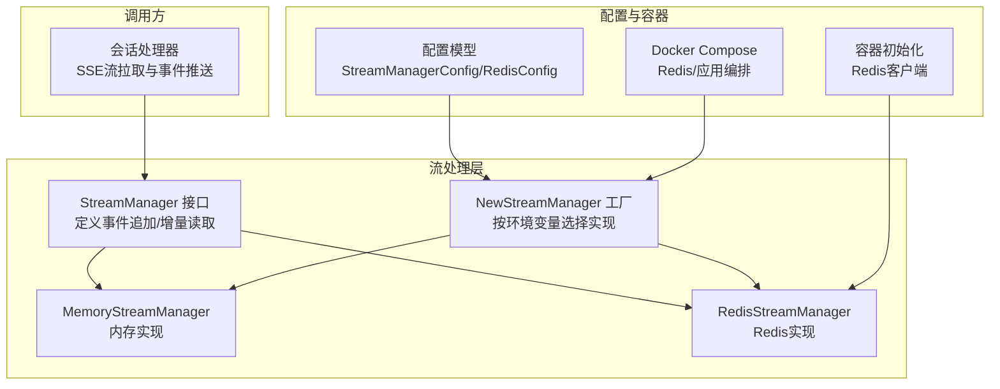
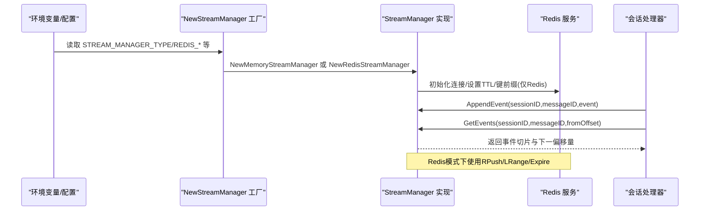
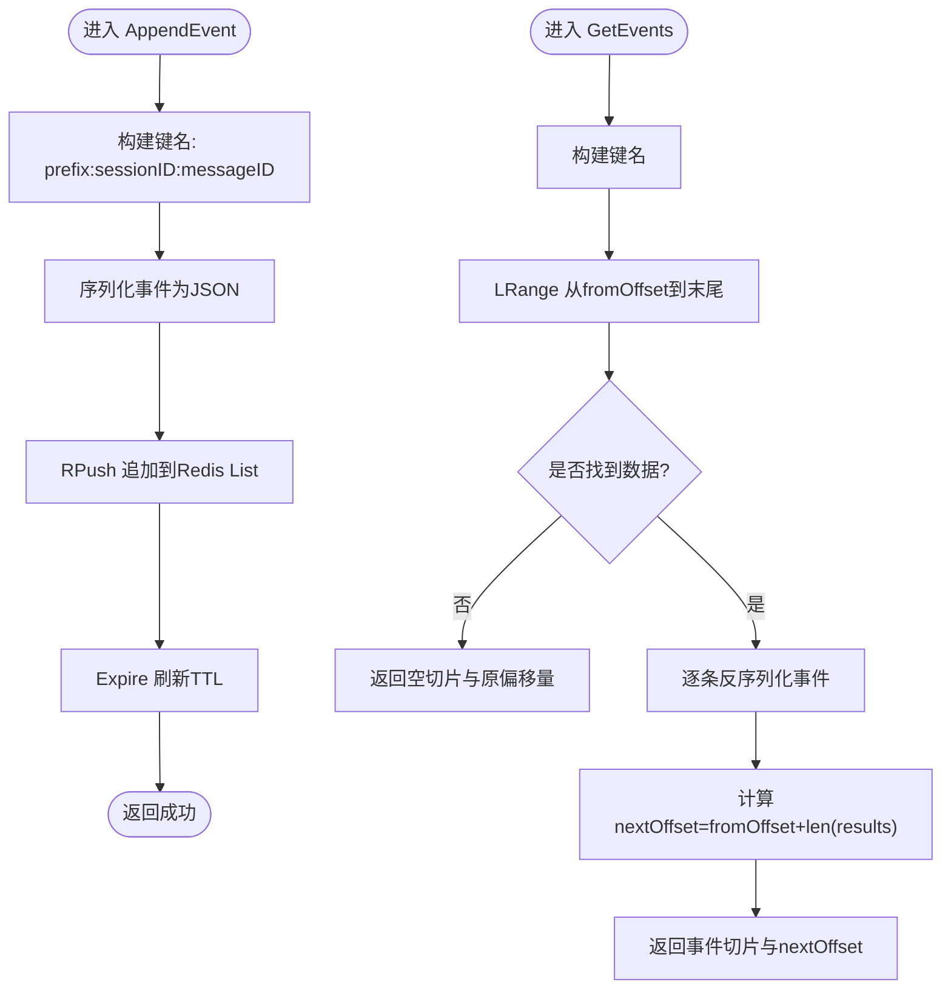
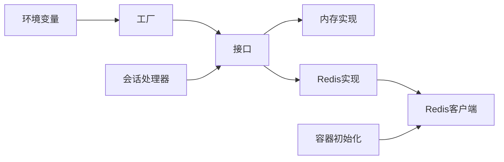

# 缓存与流处理配置

<cite>
**本文引用的文件**
- [factory.go](file://internal/stream/factory.go)
- [memory_manager.go](file://internal/stream/memory_manager.go)
- [redis_manager.go](file://internal/stream/redis_manager.go)
- [stream_manager.go](file://internal/types/interfaces/stream_manager.go)
- [config.go](file://internal/config/config.yaml)
- [container.go](file://internal/container/container.go)
- [docker-compose.yml](file://docker-compose.yml)
- [docker-compose.dev.yml](file://docker-compose.dev.yml)
- [stream.go](file://internal/handler/session/stream.go)
</cite>

## 目录
1. [简介](#简介)
2. [项目结构](#项目结构)
3. [核心组件](#核心组件)
4. [架构总览](#架构总览)
5. [详细组件分析](#详细组件分析)
6. [依赖分析](#依赖分析)
7. [性能考量](#性能考量)
8. [故障排查指南](#故障排查指南)
9. [结论](#结论)
10. [附录](#附录)

## 简介
本文件聚焦于缓存与流处理配置，围绕 STREAM_MANAGER_TYPE 设置为 memory 或 redis 的两种模式，系统性说明 REDIS_PASSWORD、REDIS_DB、REDIS_PREFIX 等参数的作用与安全配置建议；结合 Go 代码实现，解释 Redis 作为流管理后端时的消息队列机制与内存管理策略；并对比 memory 模式与 redis 模式的性能、可靠性与集群部署差异，提供生产环境推荐配置。

## 项目结构
与流处理配置直接相关的模块分布如下：
- 流管理器工厂：根据环境变量选择内存或 Redis 实现
- 流管理器接口：定义事件追加与增量拉取能力
- 内存流管理器：基于进程内映射表存储事件
- Redis 流管理器：基于 Redis List 的追加与过期策略
- 配置模型：支持 YAML 配置与环境变量注入
- 容器初始化：统一初始化 Redis 客户端（供上下文存储等使用）
- Docker Compose：提供开发与生产环境的 Redis 与应用容器编排

图表来源
- [factory.go](file://internal/stream/factory.go#L1-L37)
- [memory_manager.go](file://internal/stream/memory_manager.go#L1-L119)
- [redis_manager.go](file://internal/stream/redis_manager.go#L1-L137)
- [stream_manager.go](file://internal/types/interfaces/stream_manager.go#L1-L33)
- [config.go](file://internal/config/config.yaml#L110-L133)
- [container.go](file://internal/container/container.go#L196-L215)
- [docker-compose.yml](file://docker-compose.yml#L67-L71)
- [docker-compose.dev.yml](file://docker-compose.dev.yml#L28-L38)
- [stream.go](file://internal/handler/session/stream.go#L80-L174)

章节来源
- [factory.go](file://internal/stream/factory.go#L1-L37)
- [memory_manager.go](file://internal/stream/memory_manager.go#L1-L119)
- [redis_manager.go](file://internal/stream/redis_manager.go#L1-L137)
- [stream_manager.go](file://internal/types/interfaces/stream_manager.go#L1-L33)
- [config.go](file://internal/config/config.yaml#L110-L133)
- [container.go](file://internal/container/container.go#L196-L215)
- [docker-compose.yml](file://docker-compose.yml#L67-L71)
- [docker-compose.dev.yml](file://docker-compose.dev.yml#L28-L38)
- [stream.go](file://internal/handler/session/stream.go#L80-L174)

## 核心组件
- 流管理器接口：定义 AppendEvent 与 GetEvents 两个核心方法，分别负责事件追加与从偏移量开始的增量读取。
- 内存流管理器：以嵌套映射保存事件，提供线程安全的读写与偏移量推进。
- Redis 流管理器：以 Redis List 作为事件队列，RPush 追加，LRange 增量读取，Expire 控制过期。
- 工厂函数：根据 STREAM_MANAGER_TYPE 选择实现；当选择 Redis 时，从环境变量读取 REDIS_ADDR、REDIS_PASSWORD、REDIS_DB、REDIS_PREFIX，并设置默认 TTL。
- 配置模型：支持 YAML 配置中的 StreamManagerConfig 与 RedisConfig 字段，便于集中管理。
- 容器初始化：统一初始化 Redis 客户端，供上下文存储等模块复用。
- 调用方：会话处理器通过 SSE 持续轮询 GetEvents 并推送事件。

章节来源
- [stream_manager.go](file://internal/types/interfaces/stream_manager.go#L1-L33)
- [memory_manager.go](file://internal/stream/memory_manager.go#L1-L119)
- [redis_manager.go](file://internal/stream/redis_manager.go#L1-L137)
- [factory.go](file://internal/stream/factory.go#L1-L37)
- [config.go](file://internal/config/config.yaml#L110-L133)
- [container.go](file://internal/container/container.go#L196-L215)
- [stream.go](file://internal/handler/session/stream.go#L80-L174)

## 架构总览
下图展示了从工厂到实现再到调用方的整体交互流程，以及 Redis 模式下的键空间与过期策略。

图表来源
- [factory.go](file://internal/stream/factory.go#L1-L37)
- [redis_manager.go](file://internal/stream/redis_manager.go#L1-L137)
- [memory_manager.go](file://internal/stream/memory_manager.go#L1-L119)
- [stream.go](file://internal/handler/session/stream.go#L80-L174)

## 详细组件分析

### 参数与配置项说明
- STREAM_MANAGER_TYPE
  - 作用：决定流管理器实现类型，取值为 "memory" 或 "redis"。
  - 工厂行为：当等于 "redis" 时，工厂将读取 REDIS_ADDR、REDIS_PASSWORD、REDIS_DB、REDIS_PREFIX，并设置默认 TTL。
- REDIS_ADDR
  - 作用：Redis 服务地址，形如 host:port。
  - 工厂与容器均使用该变量初始化 Redis 客户端。
- REDIS_PASSWORD
  - 作用：Redis 认证密码；工厂与容器均会读取该变量。
  - 安全建议：生产环境务必设置，且通过密钥管理服务注入，避免硬编码在配置文件中。
- REDIS_DB
  - 作用：Redis 数据库编号；工厂将其转换为整数，缺省为 0。
  - 安全建议：生产环境建议使用独立 DB，便于隔离与审计。
- REDIS_PREFIX
  - 作用：Redis 键前缀，用于区分不同业务域或租户的数据。
  - 工厂与 Redis 实现均使用该前缀拼接键名。
  - 安全建议：建议包含业务标识与租户标识，避免键冲突。
- TTL（默认值）
  - 工厂默认 TTL 为 1 小时；Redis 实现会在构造时将 0 TTL 规范化为 24 小时。
  - 安全建议：根据业务 SLA 调整 TTL，过短可能导致客户端未及时消费导致数据丢失，过长会占用存储。

章节来源
- [factory.go](file://internal/stream/factory.go#L1-L37)
- [redis_manager.go](file://internal/stream/redis_manager.go#L1-L137)
- [container.go](file://internal/container/container.go#L196-L215)
- [docker-compose.yml](file://docker-compose.yml#L67-L71)
- [docker-compose.dev.yml](file://docker-compose.dev.yml#L28-L38)

### Redis 作为流管理后端的消息队列机制
- 键空间与命名
  - Redis 实现通过 buildKey(sessionID, messageID) 生成键名，格式为 "prefix:sessionID:messageID"。
  - 建议 prefix 包含业务域与租户信息，避免跨租户污染。
- 追加与过期
  - AppendEvent 使用 RPush 将事件 JSON 追加到列表末尾，复杂度 O(1)。
  - 每次追加都会刷新 Expire，确保键在 TTL 内保持活跃。
- 增量读取
  - GetEvents 使用 LRange 从 fromOffset 到末尾读取，返回事件切片与新的 nextOffset。
  - 若键不存在返回空切片，避免错误传播。
- 错误处理
  - 连接失败、序列化失败、过期设置失败等均包装为错误返回，便于上层感知。

图表来源
- [redis_manager.go](file://internal/stream/redis_manager.go#L1-L137)

章节来源
- [redis_manager.go](file://internal/stream/redis_manager.go#L1-L137)

### 内存模式与 Redis 模式的对比
- 性能
  - 内存模式：事件追加与读取均为进程内操作，延迟低；但受单实例内存限制。
  - Redis 模式：事件持久化至外部存储，具备更好的横向扩展能力，但引入网络与序列化开销。
- 可靠性
  - 内存模式：进程重启即丢失；适合短期会话或测试场景。
  - Redis 模式：具备过期控制与持久化能力（取决于 Redis 配置），适合多实例或多副本部署。
- 集群部署
  - 内存模式：天然不跨进程共享，不适合多实例共享状态。
  - Redis 模式：天然支持多实例共享状态，适合水平扩展与高可用部署。

章节来源
- [memory_manager.go](file://internal/stream/memory_manager.go#L1-L119)
- [redis_manager.go](file://internal/stream/redis_manager.go#L1-L137)

### 生产环境推荐配置
- 选择 Redis 模式
  - STREAM_MANAGER_TYPE=redis
  - REDIS_ADDR=redis:6379（或生产 Redis 集群地址）
  - REDIS_PASSWORD=your_redis_password（从密钥管理注入）
  - REDIS_DB=1（建议使用独立 DB）
  - REDIS_PREFIX=wk:stream:{tenant_id}:（包含租户标识）
  - TTL=24h（根据业务 SLA 调整）
- 安全建议
  - 密码与敏感参数通过环境变量注入，避免提交到版本库。
  - 使用独立 DB 与前缀，避免与其他业务键冲突。
  - 在容器编排中启用健康检查与自动重启策略。
- 配置模型
  - 若使用 YAML 配置，可在配置文件中定义 StreamManagerConfig 与 RedisConfig 字段，结合环境变量覆盖。
- 容器初始化
  - 容器层同样初始化 Redis 客户端，确保上下文存储等模块可用。

章节来源
- [factory.go](file://internal/stream/factory.go#L1-L37)
- [config.go](file://internal/config/config.yaml#L110-L133)
- [container.go](file://internal/container/container.go#L196-L215)
- [docker-compose.yml](file://docker-compose.yml#L67-L71)
- [docker-compose.dev.yml](file://docker-compose.dev.yml#L28-L38)

## 依赖分析
- 工厂依赖环境变量与实现接口
- Redis 实现依赖 Redis 客户端与事件结构体
- 内存实现依赖并发安全的映射与切片
- 容器初始化依赖环境变量统一创建 Redis 客户端
- 调用方依赖接口抽象，不关心具体实现

图表来源
- [factory.go](file://internal/stream/factory.go#L1-L37)
- [memory_manager.go](file://internal/stream/memory_manager.go#L1-L119)
- [redis_manager.go](file://internal/stream/redis_manager.go#L1-L137)
- [container.go](file://internal/container/container.go#L196-L215)
- [stream.go](file://internal/handler/session/stream.go#L80-L174)

章节来源
- [factory.go](file://internal/stream/factory.go#L1-L37)
- [memory_manager.go](file://internal/stream/memory_manager.go#L1-L119)
- [redis_manager.go](file://internal/stream/redis_manager.go#L1-L137)
- [container.go](file://internal/container/container.go#L196-L215)
- [stream.go](file://internal/handler/session/stream.go#L80-L174)

## 性能考量
- 追加性能
  - Redis 模式使用 RPush，时间复杂度 O(1)，适合高频事件追加。
  - 内存模式为切片追加，复杂度 O(1) 均摊，但受进程内存上限约束。
- 读取性能
  - Redis 模式使用 LRange，时间复杂度 O(n)，n 为返回事件数量；建议客户端以较小间隔轮询，避免一次性拉取过多。
  - 内存模式直接切片拷贝，复杂度 O(n)，注意避免频繁深拷贝带来的 GC 压力。
- 过期与存储
  - Redis 模式通过 Expire 控制键生命周期，避免无限增长；TTL 过小可能导致客户端未及时消费。
  - 内存模式无自动清理，需配合业务逻辑在会话完成后释放映射。

[本节为通用性能讨论，无需列出章节来源]

## 故障排查指南
- 连接失败
  - 现象：工厂或容器初始化时报 Redis 连接错误。
  - 排查：确认 REDIS_ADDR、REDIS_PASSWORD、REDIS_DB 是否正确；检查网络连通性与防火墙。
- 键冲突或数据错乱
  - 现象：不同租户或业务域事件相互影响。
  - 排查：确认 REDIS_PREFIX 是否包含业务域与租户标识；避免多个实例共享相同前缀。
- 事件丢失
  - 现象：客户端未及时消费导致数据过期消失。
  - 排查：适当增大 TTL；缩短轮询间隔；确保客户端持续拉取。
- 内存溢出（内存模式）
  - 现象：长时间运行后内存占用升高。
  - 排查：在会话结束时清理映射；或切换为 Redis 模式。

章节来源
- [factory.go](file://internal/stream/factory.go#L1-L37)
- [redis_manager.go](file://internal/stream/redis_manager.go#L1-L137)
- [container.go](file://internal/container/container.go#L196-L215)

## 结论
- 当需要多实例共享状态、持久化与横向扩展时，推荐使用 Redis 模式，并合理设置 REDIS_PREFIX、REDIS_DB、TTL。
- 当仅限单实例或测试场景，且对延迟敏感时，可使用内存模式。
- 生产环境务必通过环境变量注入敏感参数，采用独立 DB 与前缀，结合健康检查与自动重启策略保障稳定性。

[本节为总结性内容，无需列出章节来源]

## 附录
- 环境变量清单
  - STREAM_MANAGER_TYPE：选择 "memory" 或 "redis"
  - REDIS_ADDR：Redis 地址
  - REDIS_PASSWORD：Redis 密码
  - REDIS_DB：Redis 数据库编号
  - REDIS_PREFIX：Redis 键前缀
- Docker 编排
  - 开发环境：docker-compose.dev.yml 启动 Redis 并设置密码
  - 生产环境：docker-compose.yml 注入 REDIS_* 环境变量

章节来源
- [docker-compose.yml](file://docker-compose.yml#L67-L71)
- [docker-compose.dev.yml](file://docker-compose.dev.yml#L28-L38)