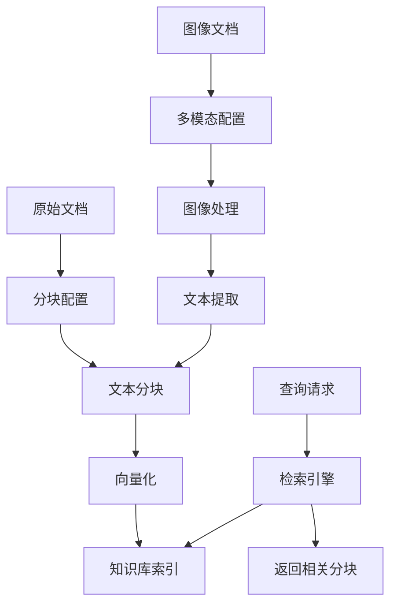
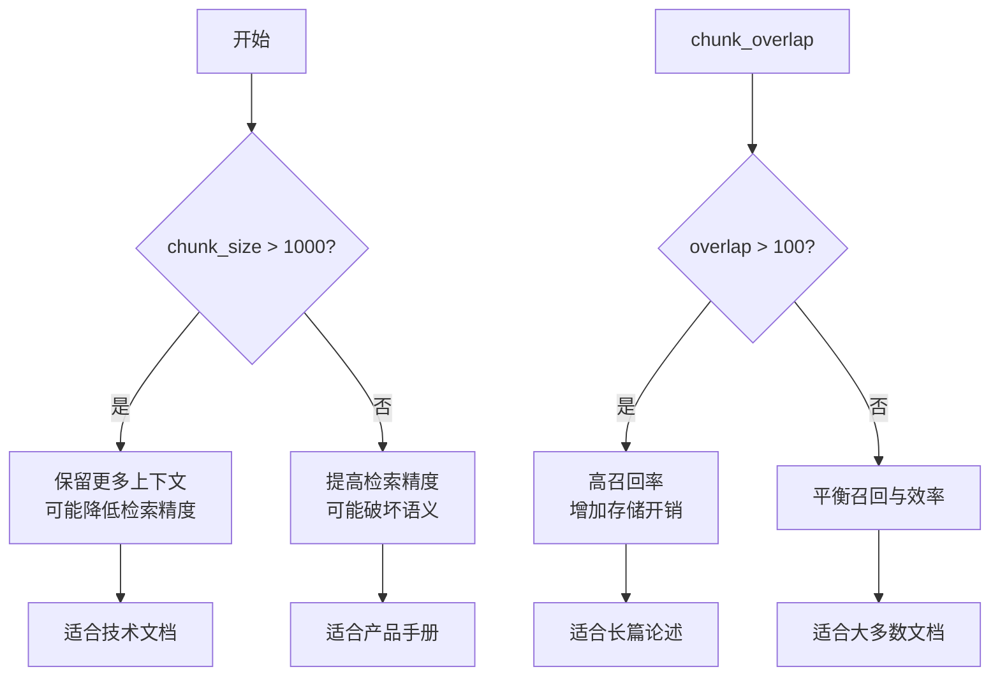
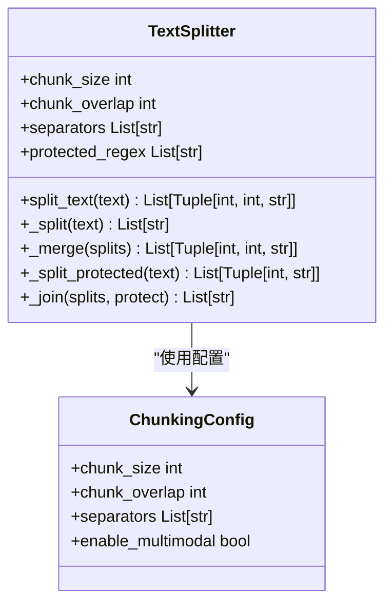
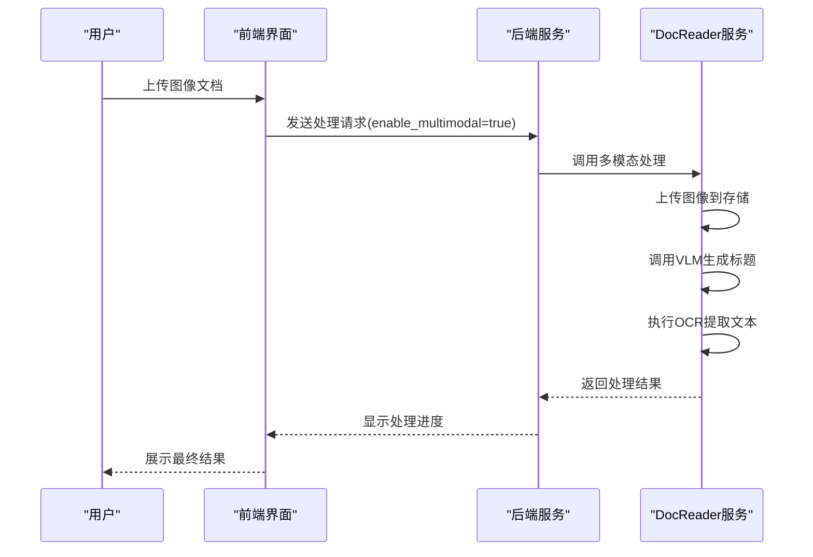

# 知识库配置

<cite>
**本文档引用的文件**   
- [config.yaml](file://config/config.yaml#L549-L556)
- [read_config.py](file://docreader/models/read_config.py#L4-L28)
- [splitter.py](file://docreader/splitter/splitter.py#L30-L424)
- [image_parser.py](file://docreader/parser/image_parser.py#L12-L45)
- [ocr_engine.py](file://docreader/parser/ocr_engine.py#L18-L335)
- [KBChunkingSettings.vue](file://frontend/src/views/knowledge/settings/KBChunkingSettings.vue#L1-L230)
- [knowledgebase.go](file://internal/types/knowledgebase.go#L96-L200)
- [knowledge.go](file://internal/application/service/knowledge.go#L628-L4544)
</cite>

## 目录
1. [知识库分块配置](#知识库分块配置)
2. [分块参数详解](#分块参数详解)
3. [文本分割标记](#文本分割标记)
4. [多模态图像处理](#多模态图像处理)
5. [最佳实践与案例](#最佳实践与案例)

## 知识库分块配置

知识库配置是文档处理和检索质量的核心。`config.yaml`文件中的`knowledge_base`配置块定义了文档分块和处理的关键参数，直接影响知识库的构建效果和查询性能。这些配置通过前端界面和后端服务协同工作，确保文档能够被有效分割、处理和索引。



**图示来源**
- [config.yaml](file://config/config.yaml#L549-L556)
- [splitter.py](file://docreader/splitter/splitter.py#L30-L424)
- [knowledge.go](file://internal/application/service/knowledge.go#L628-L4544)

**本节来源**
- [config.yaml](file://config/config.yaml#L549-L556)
- [knowledgebase.go](file://internal/types/knowledgebase.go#L96-L200)

## 分块参数详解

分块参数`chunk_size`和`chunk_overlap`是影响文本分块效果和检索质量的关键因素。`chunk_size`决定了每个文本块的最大长度，而`chunk_overlap`则定义了相邻文本块之间的重叠部分，以确保语义的连续性。

### chunk_size参数

`chunk_size`参数控制每个文本块的最大字符数。较大的`chunk_size`可以保留更多的上下文信息，但可能导致检索精度下降，因为单个块可能包含多个不相关的主题。较小的`chunk_size`则能提高检索的精确度，但可能破坏语义完整性。

- **技术文档**：建议设置为1024-2048，以保留完整的代码示例和API说明。
- **学术论文**：建议设置为512-1024，以保持段落的完整性。
- **产品手册**：建议设置为256-512，以确保每个步骤或功能描述的独立性。

### chunk_overlap参数

`chunk_overlap`参数定义了相邻文本块之间的重叠字符数。适当的重叠可以确保关键信息不会被分割在两个不相关的块中，从而提高检索的召回率。

- **高重叠（100-200）**：适用于内容连贯性强的文档，如小说或长篇论述。
- **中等重叠（50-100）**：适用于大多数文档类型，平衡了上下文保留和检索效率。
- **低重叠（0-50）**：适用于结构清晰、段落独立的文档，如FAQ或列表。



**图示来源**
- [splitter.py](file://docreader/splitter/splitter.py#L30-L424)
- [read_config.py](file://docreader/models/read_config.py#L4-L28)

**本节来源**
- [splitter.py](file://docreader/splitter/splitter.py#L30-L424)
- [read_config.py](file://docreader/models/read_config.py#L4-L28)

## 文本分割标记

`split_markers`配置项定义了文本分割的优先级，通过指定一系列分隔符来控制文档的分块方式。这些标记按优先级顺序排列，系统会优先使用列表中靠前的分隔符进行分割。

### 分割标记优先级

默认的分割标记为`["\n\n", "\n", "。"]`，表示系统首先尝试使用双换行符进行分割，如果无法分割则使用单换行符，最后使用句号。这种分层分割策略能够有效保持文档的结构完整性。

- **双换行符（\n\n）**：通常表示段落分隔，是最高优先级的分割标记。
- **单换行符（\n）**：表示行内换行或列表项分隔。
- **句号（。）**：表示句子结束，作为最后的分割手段。

### 优化分割策略

根据文档的结构特征，可以优化`split_markers`配置以获得更好的分块效果：

- **技术文档**：添加代码块标记如```作为分割符，确保代码示例的完整性。
- **学术论文**：添加章节标题标记如"## "或"### "，以保持章节结构。
- **产品手册**：添加项目符号如"- "或"* "，确保每个功能点的独立性。



**图示来源**
- [splitter.py](file://docreader/splitter/splitter.py#L30-L424)
- [read_config.py](file://docreader/models/read_config.py#L4-L28)

**本节来源**
- [splitter.py](file://docreader/splitter/splitter.py#L30-L424)
- [read_config.py](file://docreader/models/read_config.py#L4-L28)

## 多模态图像处理

`image_processing.enable_multimodal`参数控制是否启用多模态处理，这对于包含图像的文档至关重要。启用多模态处理后，系统能够从图像中提取文本内容并生成描述性标题，显著提升知识库的完整性和检索质量。

### 多模态处理流程

当`enable_multimodal`设置为`true`时，系统会执行以下处理流程：

1. **图像上传**：将图像文件上传到指定的存储服务（如COS或MinIO）。
2. **标题生成**：使用视觉语言模型（VLM）生成图像的描述性标题。
3. **OCR识别**：通过OCR引擎提取图像中的文本内容。
4. **内容整合**：将提取的文本和生成的标题整合到文档内容中。

### 配置要求

启用多模态处理需要配置相应的VLM和存储服务：

- **VLM配置**：指定模型ID、API密钥和接口类型（如Ollama或OpenAI）。
- **存储配置**：根据选择的存储类型（COS或MinIO）提供相应的认证信息。



**图示来源**
- [image_parser.py](file://docreader/parser/image_parser.py#L12-L45)
- [ocr_engine.py](file://docreader/parser/ocr_engine.py#L18-L335)
- [knowledgebase.go](file://internal/types/knowledgebase.go#L181-L209)

**本节来源**
- [image_parser.py](file://docreader/parser/image_parser.py#L12-L45)
- [ocr_engine.py](file://docreader/parser/ocr_engine.py#L18-L335)
- [knowledgebase.go](file://internal/types/knowledgebase.go#L181-L209)

## 最佳实践与案例

结合实际案例，展示不同配置组合对知识库构建效果的差异，为用户提供最佳实践指导。

### 技术文档配置案例

对于技术文档，建议采用大分块和高重叠策略，以保留完整的代码示例和API说明：

```yaml
knowledge_base:
  chunk_size: 2048
  chunk_overlap: 200
  split_markers: ["\n\n", "\n", "```", "。"]
  image_processing:
    enable_multimodal: true
```

这种配置能够确保代码块的完整性，同时通过多模态处理提取图表中的关键信息。

### 学术论文配置案例

对于学术论文，建议采用中等分块和适中重叠策略，以保持段落的完整性和检索精度：

```yaml
knowledge_base:
  chunk_size: 1024
  chunk_overlap: 100
  split_markers: ["\n\n", "## ", "### ", "\n", "。"]
  image_processing:
    enable_multimodal: true
```

通过添加章节标题作为分割标记，可以更好地保持论文的结构特征。

### 产品手册配置案例

对于产品手册，建议采用小分块和低重叠策略，以确保每个功能点的独立性：

```yaml
knowledge_base:
  chunk_size: 512
  chunk_overlap: 50
  split_markers: ["\n\n", "- ", "* ", "\n", "。"]
  image_processing:
    enable_multimodal: true
```

这种配置能够提高检索的精确度，使用户能够快速找到特定功能的说明。

**本节来源**
- [config.yaml](file://config/config.yaml#L549-L556)
- [splitter.py](file://docreader/splitter/splitter.py#L30-L424)
- [knowledge.go](file://internal/application/service/knowledge.go#L628-L4544)