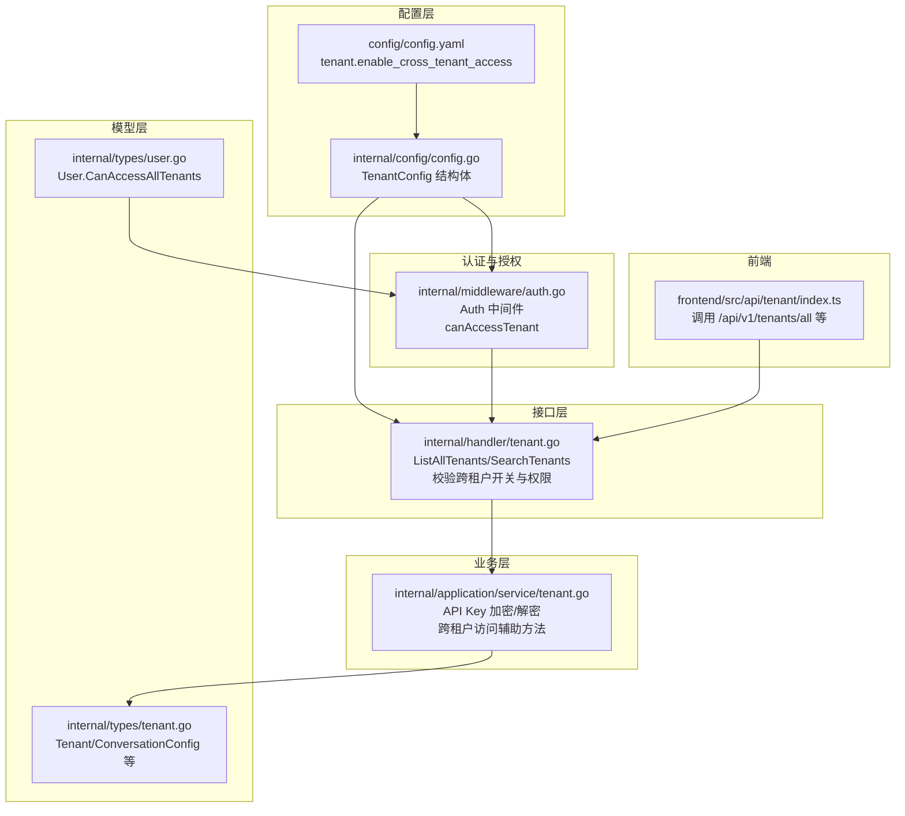
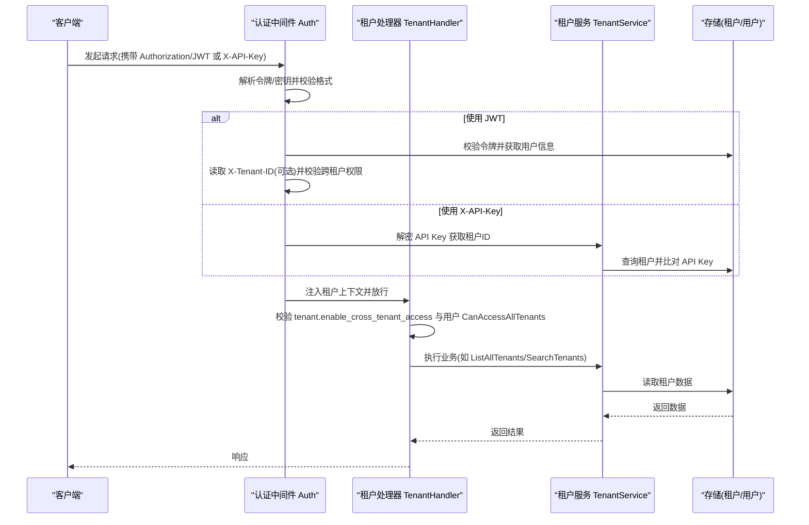
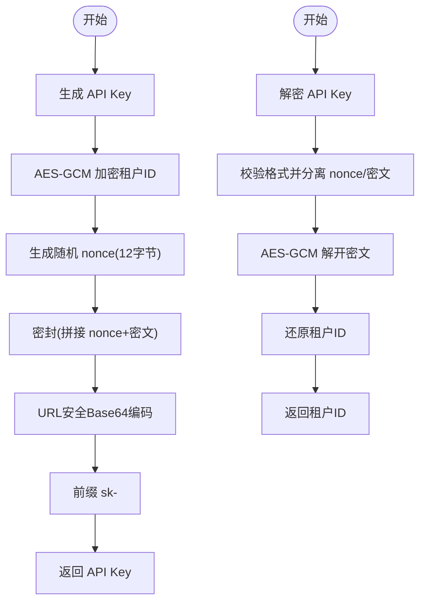
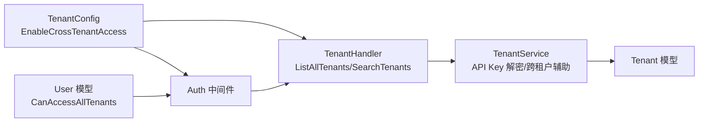

# 租户配置

<cite>
**本文引用的文件**
- [config/config.yaml](file://config/config.yaml)
- [internal/config/config.go](file://internal/config/config.go)
- [internal/handler/tenant.go](file://internal/handler/tenant.go)
- [internal/middleware/auth.go](file://internal/middleware/auth.go)
- [internal/application/service/tenant.go](file://internal/application/service/tenant.go)
- [internal/types/tenant.go](file://internal/types/tenant.go)
- [internal/types/user.go](file://internal/types/user.go)
- [frontend/src/api/tenant/index.ts](file://frontend/src/api/tenant/index.ts)
</cite>

## 目录
1. [简介](#简介)
2. [项目结构](#项目结构)
3. [核心组件](#核心组件)
4. [架构总览](#架构总览)
5. [详细组件分析](#详细组件分析)
6. [依赖分析](#依赖分析)
7. [性能考量](#性能考量)
8. [故障排查指南](#故障排查指南)
9. [结论](#结论)
10. [附录](#附录)

## 简介
本文件聚焦于系统中的“租户配置”，特别是 config.yaml 中的 tenant 配置块，围绕 enable_cross_tenant_access 参数展开，解释其在内网与公网环境下的配置策略差异、安全影响与最佳实践。同时结合系统架构，阐述多租户隔离机制、跨租户访问的控制流程，以及 TENANT_AES_KEY 在租户 API Key 加密中的作用，帮助读者在保障安全的前提下实现必要的跨租户协作。

## 项目结构
与租户配置相关的关键文件分布如下：
- 配置定义与加载：internal/config/config.go
- 配置文件：config/config.yaml
- 租户业务服务：internal/application/service/tenant.go
- 租户 HTTP 处理器：internal/handler/tenant.go
- 认证与跨租户访问控制：internal/middleware/auth.go
- 数据模型：internal/types/tenant.go、internal/types/user.go
- 前端调用示例：frontend/src/api/tenant/index.ts

图表来源
- [config/config.yaml](file://config/config.yaml#L645-L649)
- [internal/config/config.go](file://internal/config/config.go#L102-L109)
- [internal/middleware/auth.go](file://internal/middleware/auth.go#L41-L57)
- [internal/application/service/tenant.go](file://internal/application/service/tenant.go#L210-L282)
- [internal/handler/tenant.go](file://internal/handler/tenant.go#L240-L320)
- [internal/types/tenant.go](file://internal/types/tenant.go#L11-L45)
- [internal/types/user.go](file://internal/types/user.go#L22-L36)
- [frontend/src/api/tenant/index.ts](file://frontend/src/api/tenant/index.ts#L37-L51)

章节来源
- [config/config.yaml](file://config/config.yaml#L645-L649)
- [internal/config/config.go](file://internal/config/config.go#L102-L109)

## 核心组件
- 配置项 tenant.enable_cross_tenant_access：控制是否允许具备跨租户权限的用户访问其他租户的数据与管理接口。
- 认证中间件 Auth：负责解析 JWT/X-API-Key，注入当前租户上下文；当启用跨租户访问时，校验用户是否具备跨租户权限。
- 租户处理器 TenantHandler：对 ListAllTenants/SearchTenants 等接口进行跨租户访问开关与权限校验。
- 租户服务 TenantService：提供 API Key 的生成与解密能力，用于 X-API-Key 认证路径。
- 用户模型 User：包含 CanAccessAllTenants 字段，决定用户是否具备跨租户访问资格。
- 数据模型 Tenant：承载租户基本信息与全局配置（如对话配置、Web 搜索配置等）。

章节来源
- [internal/config/config.go](file://internal/config/config.go#L102-L109)
- [internal/middleware/auth.go](file://internal/middleware/auth.go#L41-L57)
- [internal/handler/tenant.go](file://internal/handler/tenant.go#L240-L320)
- [internal/application/service/tenant.go](file://internal/application/service/tenant.go#L210-L282)
- [internal/types/user.go](file://internal/types/user.go#L22-L36)
- [internal/types/tenant.go](file://internal/types/tenant.go#L11-L45)

## 架构总览
下图展示了跨租户访问的端到端流程，从请求进入、认证、权限校验到业务处理与响应返回。

图表来源
- [internal/middleware/auth.go](file://internal/middleware/auth.go#L60-L196)
- [internal/handler/tenant.go](file://internal/handler/tenant.go#L240-L320)
- [internal/application/service/tenant.go](file://internal/application/service/tenant.go#L210-L282)

## 详细组件分析

### 配置项：tenant.enable_cross_tenant_access
- 作用：控制是否允许具备跨租户访问权限的用户访问其他租户的数据与管理接口。
- 默认值：false（默认关闭跨租户访问）
- 影响范围：
  - 当为 false 时，ListAllTenants/SearchTenants 等接口将直接返回禁止访问错误。
  - 当为 true 时，仍需满足用户具备 CanAccessAllTenants 权限，否则同样会被拒绝。

章节来源
- [config/config.yaml](file://config/config.yaml#L645-L649)
- [internal/config/config.go](file://internal/config/config.go#L102-L109)
- [internal/handler/tenant.go](file://internal/handler/tenant.go#L256-L319)

### 认证与跨租户访问控制
- JWT 认证路径：
  - 中间件解析 Authorization: Bearer <token>，校验通过后获取用户信息。
  - 若请求头携带 X-Tenant-ID，则校验用户是否具备跨租户访问权限（EnableCrossTenantAccess 且 CanAccessAllTenants），并验证目标租户存在。
- X-API-Key 认证路径：
  - 从请求头读取 X-API-Key，调用服务层解密 API Key，获取租户ID并校验 API Key 有效性。
- 跨租户访问判定：
  - 仅当配置启用且用户具备 CanAccessAllTenants 时，才允许访问其他租户。
  - 若目标租户即为用户所属租户，则始终允许访问。

章节来源
- [internal/middleware/auth.go](file://internal/middleware/auth.go#L60-L196)
- [internal/application/service/tenant.go](file://internal/application/service/tenant.go#L242-L282)
- [internal/types/user.go](file://internal/types/user.go#L22-L36)

### 租户处理器：跨租户访问开关与权限校验
- ListAllTenants/SearchTenants：
  - 首先检查配置中的 EnableCrossTenantAccess。
  - 再检查当前用户是否具备 CanAccessAllTenants。
  - 任一条件不满足则返回禁止访问错误。
- 其他租户相关接口（如获取租户详情、更新配置等）通常基于当前上下文租户执行，不涉及跨租户访问开关。

章节来源
- [internal/handler/tenant.go](file://internal/handler/tenant.go#L240-L320)

### API Key 加密与解密：TENANT_AES_KEY 的作用
- 生成 API Key：
  - 将租户ID转换为字节序列，使用 AES-GCM 加密，随机生成 12 字节 nonce，拼接后进行 URL 安全 Base64 编码，前缀为 sk-。
- 解密 API Key：
  - 校验格式与编码，分离 nonce 与密文，使用相同密钥解密，还原租户ID。
- 密钥来源：
  - 从环境变量 TENANT_AES_KEY 读取，作为 AES-GCM 的密钥材料。
- 安全意义：
  - API Key 中嵌入了租户标识，即使泄露，也必须拥有密钥才能解密出租户ID。
  - 通过环境变量集中管理密钥，避免硬编码在代码或配置文件中。

图表来源
- [internal/application/service/tenant.go](file://internal/application/service/tenant.go#L210-L282)

章节来源
- [internal/application/service/tenant.go](file://internal/application/service/tenant.go#L210-L282)

### 多租户隔离机制
- 租户隔离体现在：
  - 认证中间件在上下文中注入当前租户ID与租户信息，后续业务逻辑均基于当前租户上下文执行。
  - 跨租户访问仅在配置开启且用户具备权限时生效，否则默认按当前租户隔离。
  - API Key 与租户ID绑定，X-API-Key 认证路径同样受当前租户上下文约束。

章节来源
- [internal/middleware/auth.go](file://internal/middleware/auth.go#L119-L143)
- [internal/application/service/tenant.go](file://internal/application/service/tenant.go#L242-L282)

### 前端调用示例与注意事项
- 前端可通过 /api/v1/tenants/all 获取所有租户列表（需跨租户访问权限）。
- 建议优先使用分页搜索接口，减少一次性拉取大量数据带来的风险与负载。

章节来源
- [frontend/src/api/tenant/index.ts](file://frontend/src/api/tenant/index.ts#L37-L51)

## 依赖分析
- 配置依赖：
  - config/config.go 定义 TenantConfig 结构体，映射 config/config.yaml 中的 tenant 配置。
- 控制流依赖：
  - Handler 依赖 Config 与 UserService/tenantService，用于校验开关与权限。
  - Middleware 依赖 Config 与 UserService/tenantService，用于认证与跨租户判定。
- 数据模型依赖：
  - User 模型包含 CanAccessAllTenants 字段，直接影响跨租户访问决策。
  - Tenant 模型包含全局配置字段，影响对话与检索行为。

图表来源
- [internal/config/config.go](file://internal/config/config.go#L102-L109)
- [internal/handler/tenant.go](file://internal/handler/tenant.go#L240-L320)
- [internal/middleware/auth.go](file://internal/middleware/auth.go#L41-L57)
- [internal/application/service/tenant.go](file://internal/application/service/tenant.go#L242-L282)
- [internal/types/tenant.go](file://internal/types/tenant.go#L11-L45)
- [internal/types/user.go](file://internal/types/user.go#L22-L36)

章节来源
- [internal/config/config.go](file://internal/config/config.go#L102-L109)
- [internal/handler/tenant.go](file://internal/handler/tenant.go#L240-L320)
- [internal/middleware/auth.go](file://internal/middleware/auth.go#L41-L57)
- [internal/application/service/tenant.go](file://internal/application/service/tenant.go#L242-L282)
- [internal/types/tenant.go](file://internal/types/tenant.go#L11-L45)
- [internal/types/user.go](file://internal/types/user.go#L22-L36)

## 性能考量
- 跨租户访问开关为布尔判断，对性能影响极小。
- API Key 加密/解密采用 AES-GCM，计算开销低，适合高频认证场景。
- 建议：
  - 在公网部署时谨慎开启跨租户访问，避免扩大攻击面。
  - 对 ListAllTenants/SearchTenants 等接口增加必要的限流与审计日志。

[本节为通用指导，不直接分析具体文件]

## 故障排查指南
- 现象：调用 /api/v1/tenants/all 返回禁止访问
  - 检查 config.yaml 中 tenant.enable_cross_tenant_access 是否为 true。
  - 检查当前用户是否具备 CanAccessAllTenants 权限。
  - 检查中间件是否正确注入租户上下文。
- 现象：使用 X-API-Key 认证失败
  - 检查 TENANT_AES_KEY 环境变量是否正确设置且与生成 API Key 时一致。
  - 检查 API Key 是否被篡改或过期。
- 现象：跨租户切换无效
  - 检查请求头 X-Tenant-ID 是否为目标租户ID。
  - 确认用户具备跨租户访问权限。

章节来源
- [internal/handler/tenant.go](file://internal/handler/tenant.go#L256-L319)
- [internal/middleware/auth.go](file://internal/middleware/auth.go#L86-L118)
- [internal/application/service/tenant.go](file://internal/application/service/tenant.go#L242-L282)

## 结论
- enable_cross_tenant_access 是跨租户访问的“开关”，默认关闭以强化隔离。
- 在内网环境中，若确有运维或审计需求，可在严格权限控制下开启；在公网环境中应保持关闭，避免不必要的安全风险。
- TENANT_AES_KEY 用于保护租户 API Key，确保即使泄露也无法直接推导出租户ID。
- 通过认证中间件与处理器的双重校验，系统在保证安全的前提下，为必要的跨租户协作提供了可控通道。

[本节为总结性内容，不直接分析具体文件]

## 附录

### 配置项与环境变量清单
- tenant.enable_cross_tenant_access：是否启用跨租户访问（布尔）
- TENANT_AES_KEY：用于 API Key 加密/解密的对称密钥（字符串）

章节来源
- [config/config.yaml](file://config/config.yaml#L645-L649)
- [internal/config/config.go](file://internal/config/config.go#L102-L109)
- [internal/application/service/tenant.go](file://internal/application/service/tenant.go#L210-L240)