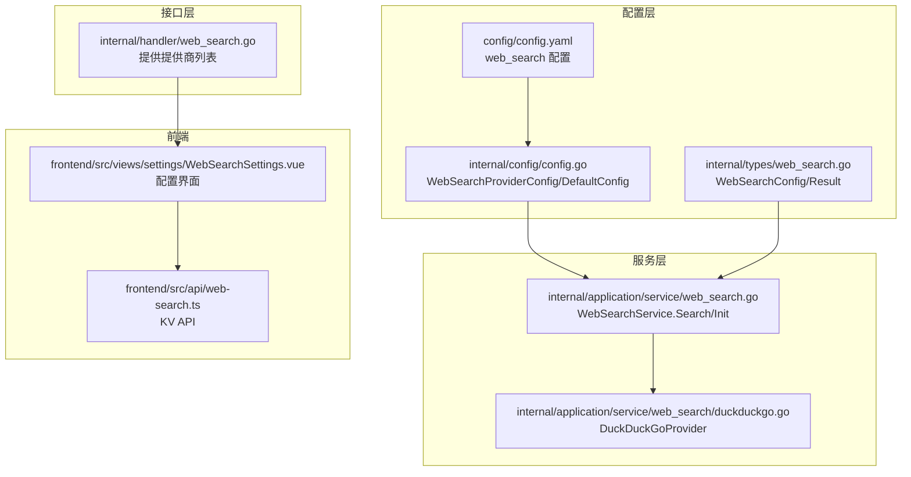
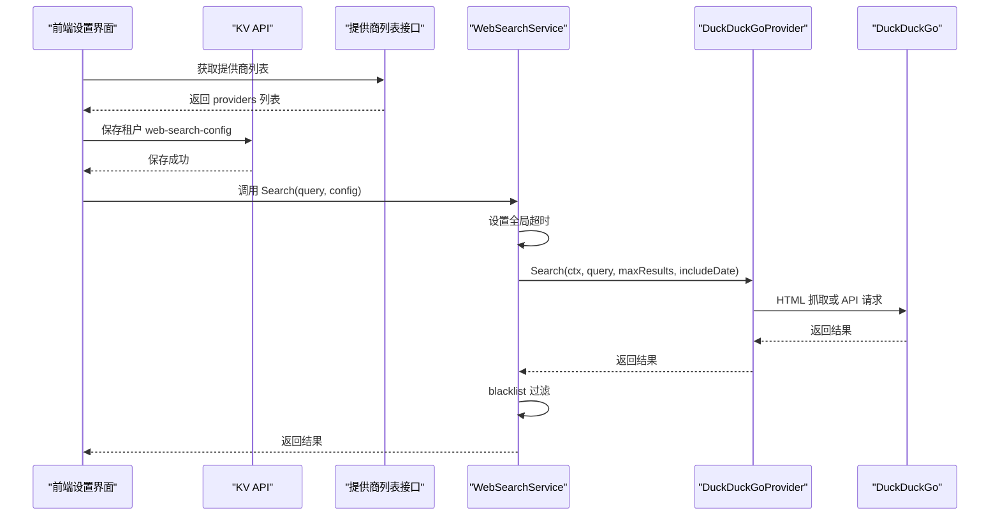
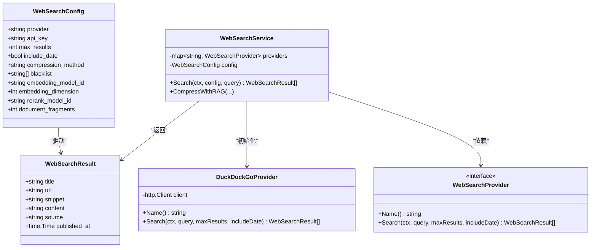
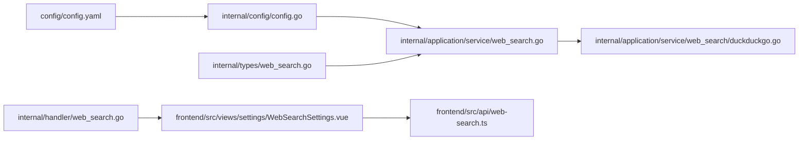

# 网络搜索配置

<cite>
**本文引用的文件**
- [config/config.yaml](file://config/config.yaml)
- [internal/config/config.go](file://internal/config/config.go)
- [internal/types/web_search.go](file://internal/types/web_search.go)
- [internal/application/service/web_search.go](file://internal/application/service/web_search.go)
- [internal/application/service/web_search/duckduckgo.go](file://internal/application/service/web_search/duckduckgo.go)
- [internal/types/interfaces/web_search.go](file://internal/types/interfaces/web_search.go)
- [frontend/src/views/settings/WebSearchSettings.vue](file://frontend/src/views/settings/WebSearchSettings.vue)
- [frontend/src/api/web-search.ts](file://frontend/src/api/web-search.ts)
- [internal/handler/web_search.go](file://internal/handler/web_search.go)
</cite>

## 目录
1. [简介](#简介)
2. [项目结构](#项目结构)
3. [核心组件](#核心组件)
4. [架构概览](#架构概览)
5. [详细组件分析](#详细组件分析)
6. [依赖分析](#依赖分析)
7. [性能考量](#性能考量)
8. [故障排查指南](#故障排查指南)
9. [结论](#结论)
10. [附录](#附录)

## 简介
本文件面向使用者与维护者，系统化解读配置文件 config.yaml 中的 web_search 配置块，重点说明 providers 与 default 两大子配置如何共同决定网络搜索的行为与结果质量；并结合实现代码，解释 timeout 全局超时、blacklist 黑名单过滤机制，以及如何通过配置优化搜索性能与结果相关性。本文同时提供配置多个搜索引擎的实践建议与最佳实践。

## 项目结构
与网络搜索配置直接相关的文件分布如下：
- 配置文件：config/config.yaml
- 配置结构定义：internal/config/config.go
- 类型与结果结构：internal/types/web_search.go
- 服务层实现：internal/application/service/web_search.go
- DuckDuckGo 提供商实现：internal/application/service/web_search/duckduckgo.go
- 前端配置界面与接口：frontend/src/views/settings/WebSearchSettings.vue、frontend/src/api/web-search.ts
- 提供商列表接口：internal/handler/web_search.go

图表来源
- [config/config.yaml](file://config/config.yaml#L623-L644)
- [internal/config/config.go](file://internal/config/config.go#L205-L222)
- [internal/types/web_search.go](file://internal/types/web_search.go#L9-L59)
- [internal/application/service/web_search.go](file://internal/application/service/web_search.go#L245-L318)
- [internal/application/service/web_search/duckduckgo.go](file://internal/application/service/web_search/duckduckgo.go#L21-L64)
- [frontend/src/views/settings/WebSearchSettings.vue](file://frontend/src/views/settings/WebSearchSettings.vue#L1-L39)
- [frontend/src/api/web-search.ts](file://frontend/src/api/web-search.ts#L1-L42)
- [internal/handler/web_search.go](file://internal/handler/web_search.go#L45-L63)

章节来源
- [config/config.yaml](file://config/config.yaml#L623-L644)
- [internal/config/config.go](file://internal/config/config.go#L205-L222)
- [internal/types/web_search.go](file://internal/types/web_search.go#L9-L59)
- [internal/application/service/web_search.go](file://internal/application/service/web_search.go#L245-L318)
- [internal/application/service/web_search/duckduckgo.go](file://internal/application/service/web_search/duckduckgo.go#L21-L64)
- [frontend/src/views/settings/WebSearchSettings.vue](file://frontend/src/views/settings/WebSearchSettings.vue#L1-L39)
- [frontend/src/api/web-search.ts](file://frontend/src/api/web-search.ts#L1-L42)
- [internal/handler/web_search.go](file://internal/handler/web_search.go#L45-L63)

## 核心组件
- providers 配置块：定义可用的搜索引擎列表，每个搜索引擎包含 id、name、free、requires_api_key、description、api_url 等字段。系统当前支持 duckduckgo。
- default 配置块：定义默认搜索行为，包含 provider、max_results、include_date、compression_method、blacklist 等参数。
- timeout 全局超时：控制搜索请求的整体超时时间，避免长时间阻塞。
- blacklist 黑名单：对搜索结果 URL 进行过滤，支持通配符与正则两种规则。

章节来源
- [config/config.yaml](file://config/config.yaml#L623-L644)
- [internal/config/config.go](file://internal/config/config.go#L205-L222)
- [internal/types/web_search.go](file://internal/types/web_search.go#L9-L22)
- [internal/application/service/web_search.go](file://internal/application/service/web_search.go#L245-L286)

## 架构概览
下图展示了从配置到搜索执行的关键流程，以及 DuckDuckGo 提供商的实现细节。

图表来源
- [internal/handler/web_search.go](file://internal/handler/web_search.go#L45-L63)
- [frontend/src/views/settings/WebSearchSettings.vue](file://frontend/src/views/settings/WebSearchSettings.vue#L117-L132)
- [frontend/src/api/web-search.ts](file://frontend/src/api/web-search.ts#L28-L41)
- [internal/application/service/web_search.go](file://internal/application/service/web_search.go#L245-L286)
- [internal/application/service/web_search/duckduckgo.go](file://internal/application/service/web_search/duckduckgo.go#L40-L64)

## 详细组件分析

### providers 配置项详解（以 duckduckgo 为例）
- id：搜索引擎唯一标识，用于在 default.provider 与前端选择器中引用。系统当前支持 duckduckgo。
- name：搜索引擎显示名称，便于前端展示。
- free：是否免费。用于前端提示与策略判断。
- requires_api_key：是否需要 API 密钥。当前 duckduckgo 不需要密钥。
- description：提供商描述，便于理解用途。
- api_url：提供商 API 地址（可选）。当前 duckduckgo 通过内部实现的 HTML 与 API 两种抓取路径。

章节来源
- [config/config.yaml](file://config/config.yaml#L626-L632)
- [internal/config/config.go](file://internal/config/config.go#L205-L213)
- [internal/types/interfaces/web_search.go](file://internal/types/interfaces/web_search.go#L9-L16)
- [internal/handler/web_search.go](file://internal/handler/web_search.go#L45-L63)

### default 配置块参数说明
- provider：默认搜索引擎 id，必须与 providers 中某一项一致。
- max_results：最大返回结果数，影响搜索覆盖面与后续处理开销。
- include_date：是否包含发布时间（在 DuckDuckGo 实现中作为参数传入，具体是否使用取决于提供商能力）。
- compression_method：压缩方法，支持 none、summary、extract、rag 等。none 表示不进行压缩；rag 会在集成层进行 RAG 压缩。
- blacklist：URL 过滤规则列表，支持通配符与正则两种写法。

章节来源
- [config/config.yaml](file://config/config.yaml#L635-L641)
- [internal/config/config.go](file://internal/config/config.go#L215-L222)
- [internal/types/web_search.go](file://internal/types/web_search.go#L9-L22)
- [internal/application/service/web_search.go](file://internal/application/service/web_search.go#L245-L286)

### timeout 全局超时设置
- 全局超时来自 config.yaml 的 timeout 字段，单位为秒。服务层会将其转换为 context 超时，确保搜索不会无限等待。
- 若未显式设置或为 0，服务层会回退到默认超时。

章节来源
- [config/config.yaml](file://config/config.yaml#L643-L643)
- [internal/application/service/web_search.go](file://internal/application/service/web_search.go#L261-L268)

### blacklist 黑名单过滤机制
- 支持两种规则：
  - 通配符规则：例如 *://*.example.com/*，内部会被转换为正则表达式进行匹配。
  - 正则规则：以 / 开头与结尾，例如 /example\.(net|org)/。
- 匹配失败时会记录警告日志，但不会中断整体流程。

章节来源
- [internal/application/service/web_search.go](file://internal/application/service/web_search.go#L320-L372)

### DuckDuckGo 提供商实现要点
- 优先使用 HTML 抓取（更稳定，适合通用搜索），失败后再回退到 DuckDuckGo API。
- HTML 抓取时会设置合理的 User-Agent 并清洗链接，确保结果可用。
- API 抓取时会解析返回的摘要、相关主题与结果列表，组装为统一的结果结构。
- include_date 参数会传递给提供商，具体是否生效取决于提供商能力。

章节来源
- [internal/application/service/web_search/duckduckgo.go](file://internal/application/service/web_search/duckduckgo.go#L40-L64)
- [internal/application/service/web_search/duckduckgo.go](file://internal/application/service/web_search/duckduckgo.go#L66-L136)
- [internal/application/service/web_search/duckduckgo.go](file://internal/application/service/web_search/duckduckgo.go#L138-L223)

### 前端配置界面与 KV API
- 前端通过 KV API 获取与更新租户的 web-search-config，支持 provider、max_results、include_date、compression_method、blacklist 等字段。
- 黑名单以多行字符串形式输入，保存时会转换为数组。

章节来源
- [frontend/src/views/settings/WebSearchSettings.vue](file://frontend/src/views/settings/WebSearchSettings.vue#L117-L132)
- [frontend/src/views/settings/WebSearchSettings.vue](file://frontend/src/views/settings/WebSearchSettings.vue#L254-L332)
- [frontend/src/api/web-search.ts](file://frontend/src/api/web-search.ts#L13-L25)
- [frontend/src/api/web-search.ts](file://frontend/src/api/web-search.ts#L28-L41)

### 类图：WebSearch 相关类型与接口

图表来源
- [internal/types/web_search.go](file://internal/types/web_search.go#L9-L59)
- [internal/types/interfaces/web_search.go](file://internal/types/interfaces/web_search.go#L9-L29)
- [internal/application/service/web_search.go](file://internal/application/service/web_search.go#L18-L38)
- [internal/application/service/web_search/duckduckgo.go](file://internal/application/service/web_search/duckduckgo.go#L21-L33)

## 依赖分析
- 配置层依赖：config/config.yaml 与 internal/config/config.go 定义了 providers 与 default 的结构。
- 类型层依赖：internal/types/web_search.go 定义了 WebSearchConfig/Result，贯穿服务层与前端。
- 服务层依赖：internal/application/service/web_search.go 依赖 providers 列表初始化 DuckDuckGoProvider，并在 Search 中应用 timeout 与 blacklist。
- 前端依赖：frontend/src/views/settings/WebSearchSettings.vue 与 frontend/src/api/web-search.ts 通过 KV API 读写配置；internal/handler/web_search.go 提供提供商列表接口。

图表来源
- [config/config.yaml](file://config/config.yaml#L623-L644)
- [internal/config/config.go](file://internal/config/config.go#L205-L222)
- [internal/types/web_search.go](file://internal/types/web_search.go#L9-L59)
- [internal/application/service/web_search.go](file://internal/application/service/web_search.go#L245-L318)
- [internal/application/service/web_search/duckduckgo.go](file://internal/application/service/web_search/duckduckgo.go#L21-L64)
- [frontend/src/views/settings/WebSearchSettings.vue](file://frontend/src/views/settings/WebSearchSettings.vue#L1-L39)
- [frontend/src/api/web-search.ts](file://frontend/src/api/web-search.ts#L1-L42)
- [internal/handler/web_search.go](file://internal/handler/web_search.go#L45-L63)

章节来源
- [internal/application/service/web_search.go](file://internal/application/service/web_search.go#L288-L318)
- [internal/application/service/web_search/duckduckgo.go](file://internal/application/service/web_search/duckduckgo.go#L21-L33)
- [internal/handler/web_search.go](file://internal/handler/web_search.go#L45-L63)

## 性能考量
- 控制 max_results：较小的 max_results 可减少网络与解析开销，提升响应速度；较大的 max_results 有助于召回更多潜在相关结果，但会增加后续处理成本。
- 合理设置 timeout：全局超时过小可能导致提供商尚未完成抓取即被取消；过大则可能阻塞请求。建议根据网络状况与提供商响应时间调优。
- blacklist 规则：在前端配置中使用精确的通配符或正则，避免误伤有效结果，同时减少无效结果的后续处理。
- compression_method：none 时不做压缩，性能最优；rag 需要额外的嵌入与重排计算，适合对结果质量要求较高但对延迟敏感度较低的场景。

章节来源
- [config/config.yaml](file://config/config.yaml#L635-L641)
- [internal/application/service/web_search.go](file://internal/application/service/web_search.go#L261-L268)
- [internal/application/service/web_search.go](file://internal/application/service/web_search.go#L320-L372)

## 故障排查指南
- 未知提供商：当 default.provider 与 providers 列表不匹配时，服务层会报错。请检查 id 是否一致。
- 超时问题：若搜索长时间无响应，检查 timeout 设置与网络状况；必要时增大超时或优化 blacklist 规则。
- 黑名单无效：若规则无效，请确认是否使用了正确的通配符或正则语法；非法规则会被记录警告但不影响整体流程。
- DuckDuckGo 抓取失败：HTML 抓取失败会回退到 API；若两者均失败，会返回错误。可检查网络连通性与提供商状态。

章节来源
- [internal/application/service/web_search.go](file://internal/application/service/web_search.go#L256-L259)
- [internal/application/service/web_search.go](file://internal/application/service/web_search.go#L261-L268)
- [internal/application/service/web_search.go](file://internal/application/service/web_search.go#L320-L372)
- [internal/application/service/web_search/duckduckgo.go](file://internal/application/service/web_search/duckduckgo.go#L40-L64)

## 结论
通过合理配置 web_search 的 providers 与 default 块，并结合 timeout 与 blacklist，可以在保证性能的同时提升搜索结果的相关性与可用性。当前系统以 DuckDuckGo 为主要提供商，具备稳定的 HTML 抓取与 API 回退机制。建议在生产环境中根据业务需求调整 max_results、timeout 与 blacklist，并在需要高质量压缩时启用 rag。

## 附录

### 配置示例与最佳实践
- 配置多个搜索引擎
  - 在 providers 中新增条目，确保 id 唯一且与 default.provider 一致。
  - 为每个提供商设置 name、free、requires_api_key、description、api_url（如适用）。
  - 在 default 中选择合适的 provider、max_results、include_date、compression_method、blacklist。
- 优化搜索性能与相关性
  - 将 max_results 设为业务可接受的上限，避免过多无效结果。
  - 使用 blacklist 精确过滤低价值或高噪声站点。
  - 适当增大 timeout 以平衡稳定性与响应速度。
  - 在对结果质量要求高的场景启用 rag 压缩，但注意延迟与资源消耗。

章节来源
- [config/config.yaml](file://config/config.yaml#L626-L641)
- [internal/config/config.go](file://internal/config/config.go#L205-L222)
- [internal/application/service/web_search.go](file://internal/application/service/web_search.go#L245-L286)