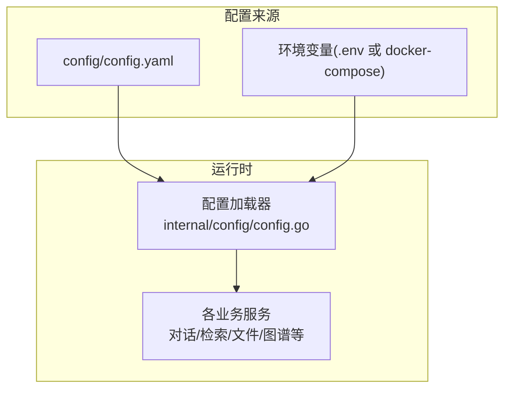
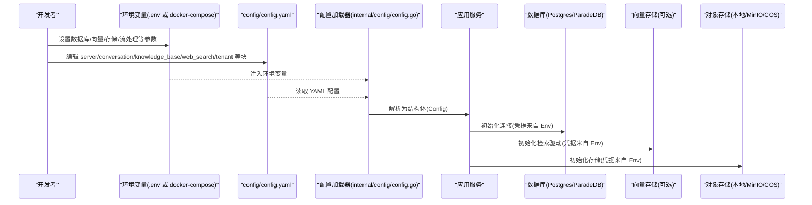
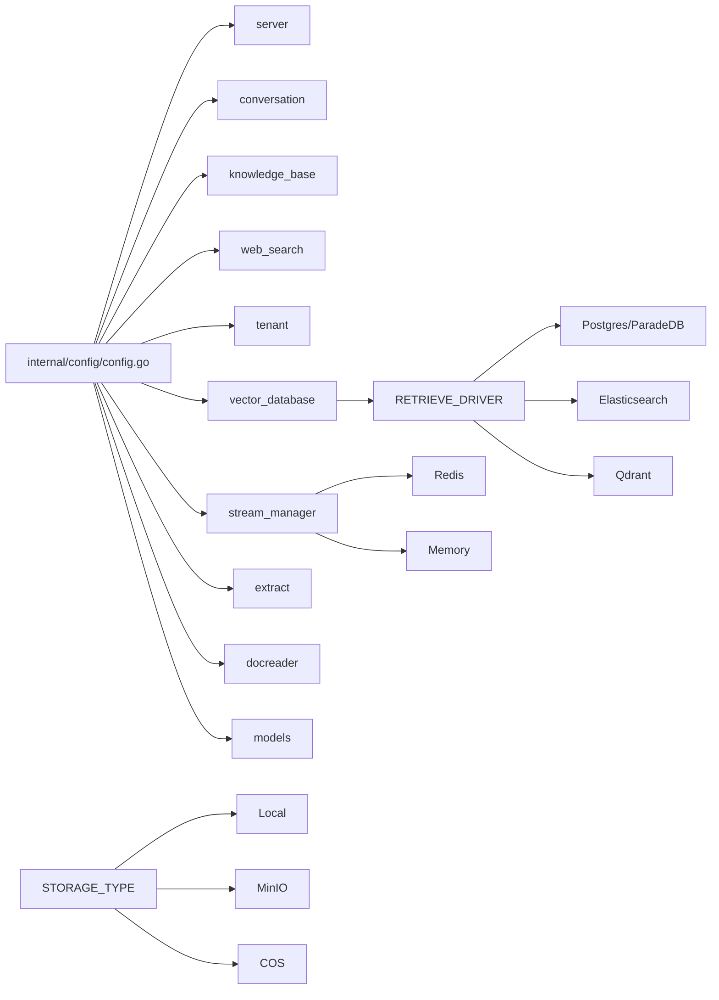
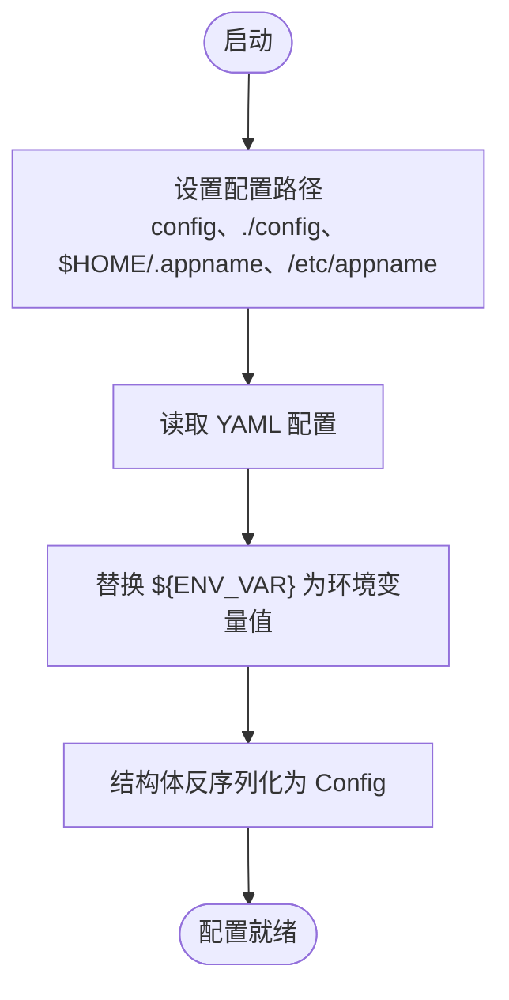

# 配置指南

<cite>
**本文引用的文件**
- [config/config.yaml](file://config/config.yaml)
- [.env.example](file://.env.example)
- [internal/config/config.go](file://internal/config/config.go)
- [docker-compose.yml](file://docker-compose.yml)
- [docs/开发指南.md](file://docs/开发指南.md)
- [docs/快速开发模式说明.md](file://docs/快速开发模式说明.md)
- [internal/handler/system.go](file://internal/handler/system.go)
- [internal/application/repository/retriever/postgres/structs.go](file://internal/application/repository/retriever/postgres/structs.go)
- [internal/application/repository/retriever/postgres/repository.go](file://internal/application/repository/retriever/postgres/repository.go)
- [internal/application/service/file/local.go](file://internal/application/service/file/local.go)
- [internal/application/service/chat_pipline/chat_pipline.go](file://internal/application/service/chat_pipline/chat_pipline.go)
- [internal/application/service/retriever/composite.go](file://internal/application/service/retriever/composite.go)
</cite>

## 目录
1. [简介](#简介)
2. [项目结构](#项目结构)
3. [核心组件](#核心组件)
4. [架构总览](#架构总览)
5. [详细组件分析](#详细组件分析)
6. [依赖关系分析](#依赖关系分析)
7. [性能考量](#性能考量)
8. [故障排查指南](#故障排查指南)
9. [结论](#结论)
10. [附录](#附录)

## 简介
本指南聚焦 WeKnora 的配置体系，围绕 config.yaml 与 .env 文件展开，逐项解释 server、conversation、knowledge_base、web_search、tenant 等配置块的参数含义、默认值与使用场景；并说明如何通过 .env 文件配置数据库、向量数据库、对象存储等外部服务。结合开发指南中的“快速开发模式”，给出不同环境（开发、生产）的最佳实践建议。

## 项目结构
WeKnora 的配置由两部分组成：
- config/config.yaml：应用运行期的 YAML 配置，涵盖服务器、对话、知识库、Web 搜索、租户等模块。
- .env 或 docker-compose 环境变量：用于注入数据库、向量数据库、对象存储、流处理、模型等外部服务的连接参数。

下图展示了配置文件与运行时的关系：

图表来源
- [internal/config/config.go](file://internal/config/config.go#L148-L196)
- [docker-compose.yml](file://docker-compose.yml#L32-L91)

章节来源
- [config/config.yaml](file://config/config.yaml#L1-L649)
- [.env.example](file://.env.example#L1-L150)
- [internal/config/config.go](file://internal/config/config.go#L148-L196)
- [docker-compose.yml](file://docker-compose.yml#L32-L91)

## 核心组件
本节概述 WeKnora 的配置核心模块及其职责：
- server：应用监听的主机与端口、日志路径、优雅停机超时等。
- conversation：对话轮次上限、关键词/向量/重排阈值与 TopK、重写策略、提示词模板、摘要/标题生成、实体抽取与关系抽取等。
- knowledge_base：分片大小、重叠、切分标记、图像处理开关等。
- web_search：搜索引擎提供商、默认配置（结果数、是否包含时间、压缩方式、黑名单）、全局超时。
- tenant：租户默认会话信息、跨租户访问开关等。
- vector_database：向量数据库驱动（来自 YAML 的 driver 字段）。
- stream_manager：流管理器类型与 Redis 参数（TTL、前缀、DB、密码等）。
- extract：抽取模板（图谱抽取、实体抽取、文本生成）。
- docreader：文档解析服务地址。
- models：模型配置（类型、来源、模型名、参数）。

章节来源
- [internal/config/config.go](file://internal/config/config.go#L15-L110)
- [config/config.yaml](file://config/config.yaml#L1-L649)

## 架构总览
下图展示配置在系统中的作用与流向：

图表来源
- [internal/config/config.go](file://internal/config/config.go#L148-L196)
- [docker-compose.yml](file://docker-compose.yml#L32-L91)
- [config/config.yaml](file://config/config.yaml#L1-L649)

## 详细组件分析

### server 配置块
- 参数
  - port：应用监听端口，默认 8080。
  - host：绑定地址，默认 0.0.0.0。
  - log_path：日志文件路径（可选）。
  - shutdown_timeout：优雅停机超时，默认 30s。
- 使用场景
  - 开发环境通常使用默认端口 8080；生产环境可通过环境变量覆盖。
  - 日志路径用于集中化日志收集（如容器日志挂载）。
- 最佳实践
  - 开发：保持默认；生产：通过 docker-compose 环境变量统一管理端口与超时。

章节来源
- [internal/config/config.go](file://internal/config/config.go#L80-L86)
- [config/config.yaml](file://config/config.yaml#L1-L6)
- [docker-compose.yml](file://docker-compose.yml#L21-L23)

### conversation 配置块
- 关键参数与含义
  - max_rounds：对话最大轮次，默认 5。
  - keyword_threshold：关键词检索阈值，默认 0.3。
  - embedding_top_k：嵌入检索 TopK，默认 10。
  - vector_threshold：向量相似度阈值，默认 0.5。
  - rerank_threshold：重排阈值，默认 0.5。
  - rerank_top_k：重排 TopK，默认 5。
  - fallback_strategy：兜底策略（如 fixed），默认 "fixed"。
  - fallback_response：兜底响应文本，默认提示无法回答。
  - fallback_prompt：兜底提示词模板（用于生成礼貌回复）。
  - enable_rewrite：是否启用问题重写，默认 true。
  - enable_query_expansion：是否启用查询扩展，默认 true。
  - enable_rerank：是否启用重排，默认 true。
  - rewrite_prompt_system：重写系统提示词模板。
  - rewrite_prompt_user：重写用户提示词模板（包含历史对话）。
  - keywords_extraction_prompt：关键词提取提示词模板。
  - keywords_extraction_prompt_user：关键词提取用户提示词模板。
  - generate_summary_prompt：摘要生成提示词模板。
  - generate_session_title_prompt：会话标题生成提示词模板。
  - summary.repeat_penalty、summary.top_p、summary.frequency_penalty、summary.presence_penalty、summary.temperature、summary.max_completion_tokens、summary.no_match_prefix、summary.prompt、summary.context_template：摘要生成的 LLM 参数与模板。
  - extract_entities_prompt：实体抽取提示词模板。
  - extract_relationships_prompt：关系抽取提示词模板。
  - generate_questions_prompt：为文档分片生成问题以提升召回的提示词模板。
- 影响行为说明
  - max_rounds 控制多轮对话上限，避免无限轮次导致资源消耗。
  - keyword_threshold/vector_threshold/rerank_threshold 控制检索与重排的严格程度，阈值越高越严格，召回越少。
  - embedding_top_k/rerank_top_k 控制候选集规模，越大召回越多但成本更高。
  - enable_rewrite/enable_query_expansion/enable_rerank 决定是否启用指代消解、查询扩展与重排，直接影响检索质量与稳定性。
  - 兜底策略 fallback_strategy/fallback_response/fallback_prompt 用于兜底不可回答场景，提升用户体验。
  - 重写、关键词提取、摘要、标题、实体/关系抽取、问题生成等提示词模板决定对话与检索的“语言风格”与“结构化产出”。

章节来源
- [config/config.yaml](file://config/config.yaml#L7-L206)
- [internal/config/config.go](file://internal/config/config.go#L37-L62)
- [internal/config/config.go](file://internal/config/config.go#L64-L78)

### knowledge_base 配置块
- 关键参数与含义
  - chunk_size：分片大小，默认 512。
  - chunk_overlap：分片重叠，默认 50。
  - split_markers：切分标记（如换行、段落、中文句号），默认 ["\n\n", "\n", "。"]。
  - image_processing.enable_multimodal：是否启用多模态图像处理，默认 true。
- 使用场景
  - 文档入库前的预处理参数，影响向量化与检索效果。
  - 多模态启用时，图像内容会被纳入处理流程。
- 最佳实践
  - 文档类型偏向长文本时，适当增大 chunk_size 并减少重叠以降低碎片化。
  - 图像较多时保持 enable_multimodal 为 true，确保图像信息参与检索。

章节来源
- [config/config.yaml](file://config/config.yaml#L549-L560)
- [internal/config/config.go](file://internal/config/config.go#L88-L101)

### web_search 配置块
- 关键参数与含义
  - providers：可用搜索引擎列表，示例包含 DuckDuckGo，字段包括 id、name、free、requires_api_key、description。
  - default：默认配置，包含 provider、max_results、include_date、compression_method、blacklist。
  - timeout：全局超时（秒），默认 10。
- 使用场景
  - 当对话需要联网检索时生效；默认使用 DuckDuckGo。
- 最佳实践
  - 生产环境可根据需求增加更多提供商并在 default 中统一配置。
  - 调整 max_results 与 include_date 以平衡召回质量与响应速度。

章节来源
- [config/config.yaml](file://config/config.yaml#L623-L644)
- [internal/config/config.go](file://internal/config/config.go#L198-L223)

### tenant 配置块
- 关键参数与含义
  - default_session_name、default_session_title、default_session_description：租户默认会话信息。
  - enable_cross_tenant_access：是否允许具备权限的用户跨租户访问，默认 false。
- 使用场景
  - 多租户平台中，统一默认会话信息与跨租户访问策略。
- 最佳实践
  - 开发/测试：关闭跨租户访问；生产：根据安全策略谨慎开启。

章节来源
- [config/config.yaml](file://config/config.yaml#L645-L649)
- [internal/config/config.go](file://internal/config/config.go#L102-L109)

### vector_database 配置块
- 关键参数与含义
  - driver：向量数据库驱动（来自 YAML 的 driver 字段），用于指示检索引擎类型。
- 使用场景
  - 与环境变量 RETRIEVE_DRIVER 协同：当 YAML 未显式配置时，系统会回退到环境变量 RETRIEVE_DRIVER。
- 最佳实践
  - 开发：可使用 Postgres/ParadeDB；生产：根据容量与性能选择合适的向量存储（如 ElasticSearch v8、Qdrant 等，需在环境变量中配置）。

章节来源
- [internal/config/config.go](file://internal/config/config.go#L29-L36)
- [internal/handler/system.go](file://internal/handler/system.go#L105-L132)

### stream_manager 配置块
- 关键参数与含义
  - type：流管理器类型，支持 "memory" 或 "redis"。
  - redis.address、redis.password、redis.db、redis.prefix、redis.ttl：Redis 连接与命名空间参数。
  - cleanup_timeout：清理超时（秒）。
- 使用场景
  - 用于会话流式输出的后端存储（内存或 Redis）。
- 最佳实践
  - 开发：memory；生产：redis，合理设置 TTL 与前缀以隔离命名空间。

章节来源
- [internal/config/config.go](file://internal/config/config.go#L119-L134)

### extract 配置块
- 关键参数与含义
  - extract_graph.description：图谱抽取的总体描述与步骤。
  - extract_graph.tags：抽取标签列表（如作者、别名）。
  - extract_graph.examples：示例节点与关系。
  - extract_entity.description：实体抽取描述与步骤。
  - fabri_text.with_tag、fabri_text.with_no_tag：用于生成示例文本的提示词模板。
- 使用场景
  - 知识图谱构建与抽取流程的提示词与示例配置。
- 最佳实践
  - 根据业务领域定制 tags 与示例，提升抽取质量。

章节来源
- [config/config.yaml](file://config/config.yaml#L557-L622)
- [internal/config/config.go](file://internal/config/config.go#L135-L146)

### docreader 配置块
- 关键参数与含义
  - addr：文档解析服务地址（来自 YAML 的 addr 字段）。
- 使用场景
  - 文档解析服务的地址配置。
- 最佳实践
  - 与 docker-compose 中的 docreader 服务保持一致。

章节来源
- [internal/config/config.go](file://internal/config/config.go#L29-L32)

### models 配置块
- 关键参数与含义
  - type、source、model_name、parameters：模型类型、来源、模型名与参数。
- 使用场景
  - 初始化 LLM、Embedding、Rerank 等模型。
- 最佳实践
  - 开发：使用本地 Ollama；生产：配置远程 API 与密钥。

章节来源
- [internal/config/config.go](file://internal/config/config.go#L111-L118)
- [docker-compose.yml](file://docker-compose.yml#L61-L91)

## 依赖关系分析
- 配置加载
  - internal/config/config.go 负责从 YAML 与环境变量加载配置，支持环境变量替换与结构体映射。
- 向量数据库与检索
  - vector_database.driver 与 RETRIEVE_DRIVER 共同决定检索引擎类型；系统会回退到环境变量。
  - Postgres/ParadeDB 的向量检索实现位于 internal/application/repository/retriever/postgres。
- 文件存储
  - STORAGE_TYPE 与 LOCAL_STORAGE_BASE_DIR 决定本地存储；MinIO/COS 配置在 .env 或 docker-compose 中。
- 流管理
  - STREAM_MANAGER_TYPE 与 Redis 参数决定流式输出后端。

图表来源
- [internal/config/config.go](file://internal/config/config.go#L148-L196)
- [docker-compose.yml](file://docker-compose.yml#L32-L91)
- [internal/handler/system.go](file://internal/handler/system.go#L105-L132)
- [internal/application/repository/retriever/postgres/repository.go](file://internal/application/repository/retriever/postgres/repository.go#L1-L120)

章节来源
- [internal/config/config.go](file://internal/config/config.go#L148-L196)
- [docker-compose.yml](file://docker-compose.yml#L32-L91)
- [internal/handler/system.go](file://internal/handler/system.go#L105-L132)

## 性能考量
- 检索参数
  - vector_threshold 与 rerank_threshold 过高会导致召回过少，影响回答质量；过低则召回过多，增加计算与延迟。
  - embedding_top_k 与 rerank_top_k 增大可提升召回，但会显著增加向量计算与重排成本。
- 向量存储
  - Postgres/ParadeDB 的向量检索使用 HNSW 索引，维度与过滤条件会影响性能；建议在生产环境评估索引大小与查询计划。
- 流管理
  - Redis 流管理器适合高并发场景，需合理设置 TTL 与前缀，避免键冲突与内存膨胀。
- 文件存储
  - 本地存储适合开发；生产建议使用 MinIO/COS，注意桶与路径配置，避免 IO 瓶颈。

[本节为通用指导，不直接分析具体文件]

## 故障排查指南
- 配置加载失败
  - 确认 config/config.yaml 语法正确，字段拼写无误；检查环境变量是否被正确替换。
- 向量数据库未配置
  - 若 vector_database.driver 为空，系统会回退到 RETRIEVE_DRIVER；确认环境变量已设置且包含受支持的驱动（如 postgres、elasticsearch_v8）。
- 检索结果为空
  - 检查 vector_threshold/rerank_threshold 是否过高；确认 embedding_top_k/rerank_top_k 是否足够大。
- 流管理异常
  - 检查 STREAM_MANAGER_TYPE 与 Redis 参数（地址、密码、DB、前缀、TTL）是否正确。
- 文件存储异常
  - 检查 STORAGE_TYPE 与 LOCAL_STORAGE_BASE_DIR；若使用 MinIO/COS，确认端点、密钥、桶名与路径配置正确。

章节来源
- [internal/config/config.go](file://internal/config/config.go#L148-L196)
- [internal/handler/system.go](file://internal/handler/system.go#L105-L132)
- [internal/application/service/file/local.go](file://internal/application/service/file/local.go#L1-L112)

## 结论
WeKnora 的配置体系通过 YAML 与环境变量协同工作，既满足开发期的灵活性，又能在生产环境实现标准化与可运维性。合理设置 conversation 的阈值与 TopK、knowledge_base 的分片参数、web_search 的默认配置、tenant 的跨租户策略，以及 vector_database、stream_manager、storage 的外部服务参数，是获得稳定、高性能对话体验的关键。

[本节为总结性内容，不直接分析具体文件]

## 附录

### 环境变量与 .env 文件对照
- 数据库
  - DB_DRIVER：数据库驱动（postgres/mysql），默认 postgres。
  - DB_HOST、DB_PORT、DB_USER、DB_PASSWORD、DB_NAME：数据库连接参数。
- 向量数据库
  - RETRIEVE_DRIVER：向量存储驱动（postgres/elasticsearch_v7/elasticsearch_v8/qdrant），默认 postgres。
  - ELASTICSEARCH_ADDR、ELASTICSEARCH_USERNAME、ELASTICSEARCH_PASSWORD、ELASTICSEARCH_INDEX：ElasticSearch 配置。
  - QDRANT_HOST、QDRANT_PORT、QDRANT_COLLECTION、QDRANT_API_KEY、QDRANT_USE_TLS：Qdrant 配置。
- 对象存储
  - STORAGE_TYPE：存储类型（local/minio/cos），默认 local。
  - LOCAL_STORAGE_BASE_DIR：本地存储基础目录。
  - MINIO_ENDPOINT、MINIO_ACCESS_KEY_ID、MINIO_SECRET_ACCESS_KEY、MINIO_BUCKET_NAME：MinIO 配置。
  - COS_SECRET_ID、COS_SECRET_KEY、COS_REGION、COS_BUCKET_NAME、COS_APP_ID、COS_PATH_PREFIX、COS_ENABLE_OLD_DOMAIN：COS 配置。
- 流管理
  - STREAM_MANAGER_TYPE：流管理器类型（memory/redis），默认 redis。
  - REDIS_ADDR、REDIS_PASSWORD、REDIS_DB、REDIS_PREFIX：Redis 连接参数。
- 其他
  - GIN_MODE：应用模式（debug/release），默认 debug。
  - APP_PORT、FRONTEND_PORT、DOCREADER_PORT：应用、前端、文档解析服务端口。
  - OLLAMA_BASE_URL：Ollama 基础地址。
  - ENABLE_GRAPH_RAG：是否启用知识图谱构建与检索。
  - JWT_SECRET：前端登录刷新 Token 的密钥。
  - CONCURRENCY_POOL_SIZE：Embedding 并发池大小。
  - WEB_PROXY：网络代理。
  - NEO4J_ENABLE、NEO4J_URI、NEO4J_USERNAME、NEO4J_PASSWORD：Neo4j 图数据库配置。

章节来源
- [.env.example](file://.env.example#L1-L150)
- [docker-compose.yml](file://docker-compose.yml#L32-L91)

### 开发与生产最佳实践
- 快速开发模式
  - 使用 make dev-start 启动基础设施（Postgres、Redis、MinIO、Neo4j、DocReader、Jaeger）。
  - 使用 make dev-app 与 make dev-frontend 分别启动后端与前端，支持热重载。
  - 使用 docker-compose.yml 将 .env 中的变量注入容器环境。
- 生产部署
  - 通过 scripts/build_images.sh 构建镜像，再使用 scripts/start_all.sh 启动。
  - 在 docker-compose.yml 中统一管理端口与环境变量，确保与 .env 一致。
- 配置一致性
  - YAML 与 .env 的关键参数保持一致，避免运行时差异。
  - 向量数据库与文件存储在开发与生产环境采用相同驱动与参数，便于迁移。

章节来源
- [docs/开发指南.md](file://docs/开发指南.md#L1-L284)
- [docs/快速开发模式说明.md](file://docs/快速开发模式说明.md#L1-L106)
- [docker-compose.yml](file://docker-compose.yml#L1-L120)

### 配置加载流程（代码级）

图表来源
- [internal/config/config.go](file://internal/config/config.go#L148-L196)