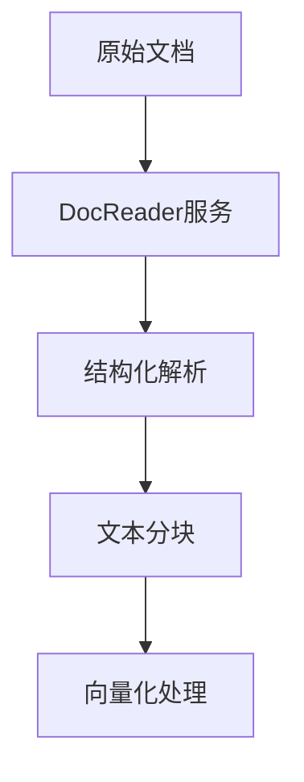
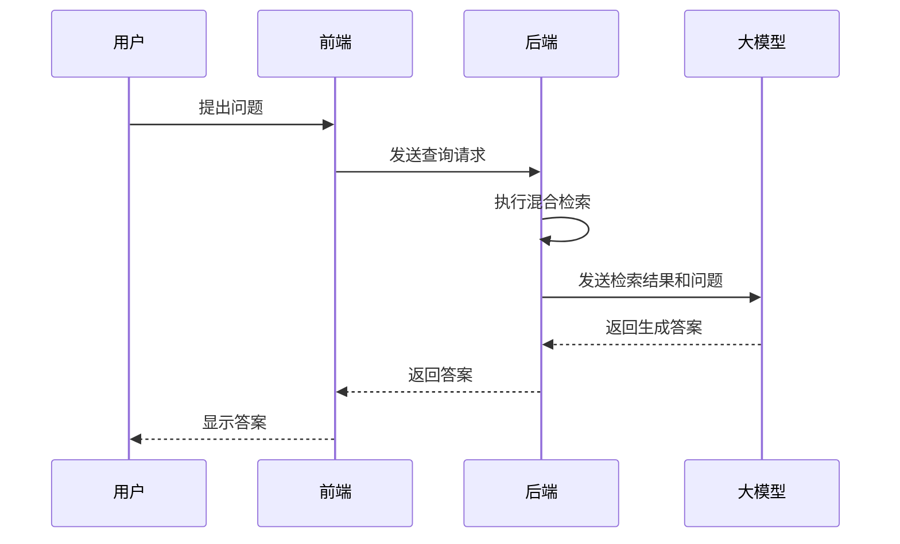

# 项目概述

<cite>
**本文档引用的文件**   
- [README.md](file://README.md)
- [README_CN.md](file://README_CN.md)
- [config.yaml](file://config/config.yaml)
- [engine.go](file://internal/agent/engine.go)
- [chat_pipline.go](file://internal/application/service/chat_pipline/chat_pipline.go)
- [embedder.go](file://internal/models/embedding/embedder.go)
- [composite.go](file://internal/application/service/retriever/composite.go)
- [main.py](file://docreader/main.py)
- [handler.go](file://internal/handler/session/handler.go)
- [router.go](file://internal/router/router.go)
- [agent.go](file://internal/types/agent.go)
- [registry.go](file://internal/agent/tools/registry.go)
</cite>

## 目录
1. [项目介绍](#-项目介绍)
2. [架构设计](#-架构设计)
3. [核心特性](#-核心特性)
4. [应用场景](#-应用场景)
5. [模块化设计](#-模块化设计)
6. [Agent模式](#-agent模式)
7. [混合检索](#-混合检索)
8. [MCP工具集成](#-mcp工具集成)
9. [系统架构图说明](#-系统架构图说明)
10. [代码库结构](#-代码库结构)

## 项目介绍

[**WeKnora（维娜拉）**](https://weknora.weixin.qq.com) 是一款基于大语言模型（LLM）的文档理解与语义检索框架，专为结构复杂、内容异构的文档场景而打造。

框架采用模块化架构，融合多模态预处理、语义向量索引、智能召回与大模型生成推理，构建起高效、可控的文档问答流程。核心检索流程基于 **RAG（Retrieval-Augmented Generation）** 机制，将上下文相关片段与语言模型结合，实现更高质量的语义回答。

**官网：** https://weknora.weixin.qq.com

**Section sources**
- [README_CN.md](file://README_CN.md#L38-L42)

## 架构设计


WeKnora 采用现代化模块化设计，构建了一条完整的文档理解与检索流水线。系统主要包括文档解析、向量化处理、检索引擎和大模型推理等核心模块，每个组件均可灵活配置与扩展。

**Diagram sources**
- [README_CN.md](file://README_CN.md#L67-L69)

**Section sources**
- [README_CN.md](file://README_CN.md#L67-L69)

## 核心特性

- **🤖 Agent模式**：支持ReACT Agent模式，可调用内置工具检索知识库、MCP工具和网络搜索，通过多次迭代和反思给出全面总结报告
- **🔍 精准理解**：支持 PDF、Word、图片等文档的结构化内容提取，统一构建语义视图
- **🧠 智能推理**：借助大语言模型理解文档上下文与用户意图，支持精准问答与多轮对话
- **📚 多类型知识库**：支持FAQ和文档两种类型知识库，支持文件夹导入、URL导入、标签管理和在线录入
- **🔧 灵活扩展**：从解析、嵌入、召回到生成全流程解耦，便于灵活集成与定制扩展
- **⚡ 高效检索**：混合多种检索策略：关键词、向量、知识图谱，支持跨知识库检索
- **🌐 网络搜索**：支持可扩展的网络搜索引擎，内置DuckDuckGo搜索引擎
- **🔌 MCP工具集成**：支持通过MCP扩展Agent能力，内置uvx、npx启动工具，支持多种传输方式
- **⚙️ 对话策略**：支持配置Agent模型、普通模式模型、检索阈值和Prompt，精确控制多轮对话行为
- **🎯 简单易用**：直观的Web界面与标准API，零技术门槛快速上手
- **🔒 安全可控**：支持本地化与私有云部署，数据完全自主可控

**Section sources**
- [README_CN.md](file://README_CN.md#L73-L83)

## 应用场景

| 应用场景 | 具体应用 | 核心价值 |
|---------|----------|----------|
| **企业知识管理** | 内部文档检索、规章制度问答、操作手册查询 | 提升知识查找效率，降低培训成本 |
| **科研文献分析** | 论文检索、研究报告分析、学术资料整理 | 加速文献调研，辅助研究决策 |
| **产品技术支持** | 产品手册问答、技术文档检索、故障排查 | 提升客户服务质量，减少技术支持负担 |
| **法律合规审查** | 合同条款检索、法规政策查询、案例分析 | 提高合规效率，降低法律风险 |
| **医疗知识辅助** | 医学文献检索、诊疗指南查询、病例分析 | 辅助临床决策，提升诊疗质量 |

**Section sources**
- [README_CN.md](file://README_CN.md#L87-L93)

## 模块化设计

WeKnora 的系统架构由多个核心模块协同工作，每个模块都具有明确的职责和接口。

### 文档解析模块

文档解析模块负责处理各种格式的文档，包括PDF、Word、文本、Markdown和图片等。该模块通过 `docreader` 服务实现，采用gRPC协议提供服务，支持从文件或URL读取内容，并进行结构化解析。



**Diagram sources**
- [main.py](file://docreader/main.py#L130-L327)

**Section sources**
- [main.py](file://docreader/main.py#L130-L327)

### 向量化处理模块

向量化处理模块负责将文本内容转换为向量表示。该模块通过 `Embedder` 接口实现，支持本地模型（如Ollama）和远程API（如OpenAI）等多种向量生成方式。

```go
// Embedder defines the interface for text vectorization
type Embedder interface {
    // Embed converts text to vector
    Embed(ctx context.Context, text string) ([]float32, error)
    
    // BatchEmbed converts multiple texts to vectors in batch
    BatchEmbed(ctx context.Context, texts []string) ([][]float32, error)
    
    // GetModelName returns the model name
    GetModelName() string
    
    // GetDimensions returns the vector dimensions
    GetDimensions() int
    
    // GetModelID returns the model ID
    GetModelID() string
    
    EmbedderPooler
}
```

**Section sources**
- [embedder.go](file://internal/models/embedding/embedder.go#L13-L30)

### 检索引擎模块

检索引擎模块负责执行混合检索策略，结合关键词、向量和知识图谱等多种检索方式。该模块通过 `CompositeRetrieveEngine` 实现，支持并发执行多种检索策略。

```go
// CompositeRetrieveEngine implements a composite pattern for retrieval engines,
// delegating operations to all registered engines
type CompositeRetrieveEngine struct {
    engineInfos []*engineInfo
}
```

**Section sources**
- [composite.go](file://internal/application/service/retriever/composite.go#L26-L30)

### 大模型推理模块

大模型推理模块负责调用大语言模型进行生成推理。该模块通过 `Chat` 接口实现，支持多种大模型服务，包括Qwen、DeepSeek等。



**Diagram sources**
- [engine.go](file://internal/agent/engine.go#L72-L487)

**Section sources**
- [engine.go](file://internal/agent/engine.go#L72-L487)

## Agent模式

WeKnora 支持ReACT Agent模式，这是一种基于"思考-行动-观察"循环的智能代理模式。Agent可以调用多种工具来完成复杂任务，包括知识库检索、MCP工具调用和网络搜索等。

```go
// AgentEngine is the core engine for running ReAct agents
type AgentEngine struct {
    config               *types.AgentConfig
    toolRegistry         *tools.ToolRegistry
    chatModel            chat.Chat
    eventBus             *event.EventBus
    knowledgeBasesInfo   []*KnowledgeBaseInfo
    contextManager       interfaces.ContextManager
    sessionID            string
    systemPromptTemplate string
}
```

Agent的执行流程包括：
1. **思考（Think）**：调用大模型生成思考过程
2. **行动（Act）**：根据思考结果调用相应工具
3. **观察（Observe）**：获取工具执行结果
4. **迭代**：重复上述过程直到任务完成

**Section sources**
- [engine.go](file://internal/agent/engine.go#L25-L35)

## 混合检索

WeKnora 采用混合检索策略，结合多种检索方法以提高召回率和准确率。系统支持BM25稀疏检索、密集向量检索和知识图谱增强检索等多种策略。

```go
// conversation strategy configuration
conversation:
  max_rounds: 5
  keyword_threshold: 0.3
  embedding_top_k: 10
  vector_threshold: 0.5
  rerank_threshold: 0.5
  rerank_top_k: 5
```

混合检索的优势在于：
- **关键词检索**：基于传统信息检索技术，对精确匹配效果好
- **向量检索**：基于语义相似度，对语义相关但文字不同的内容效果好
- **知识图谱检索**：基于实体关系，对需要推理的复杂查询效果好

**Section sources**
- [config.yaml](file://config/config.yaml#L7-L13)

## MCP工具集成

WeKnora 支持通过MCP（Model Control Protocol）扩展Agent能力。MCP工具可以访问外部服务，为Agent提供额外的功能。

```go
// ToolRegistry manages the registration and retrieval of tools
type ToolRegistry struct {
    tools            map[string]types.Tool
    knowledgeService interfaces.KnowledgeService
    chunkService     interfaces.ChunkService
    db               *gorm.DB
}
```

内置的MCP工具包括：
- **uvx和npx启动工具**：支持多种传输方式
- **数据库查询工具**：访问外部数据库
- **网络搜索工具**：访问互联网信息
- **知识图谱查询工具**：查询结构化知识

**Section sources**
- [registry.go](file://internal/agent/tools/registry.go#L13-L19)

## 系统架构图说明

WeKnora 的系统架构图展示了各个组件之间的关系和数据流。主要组件包括：

- **前端界面**：提供用户交互界面，支持Agent模式和普通模式切换
- **后端服务**：处理业务逻辑，协调各个模块的工作
- **文档解析服务**：负责文档的解析和分块
- **向量数据库**：存储和检索向量数据，支持PostgreSQL（pgvector）和Elasticsearch
- **大模型服务**：提供语言模型推理能力，支持本地部署和外部API
- **MCP服务器**：扩展Agent能力，连接外部服务

架构图体现了WeKnora的模块化设计思想，各个组件之间通过清晰的接口进行通信，便于维护和扩展。

**Section sources**
- [README_CN.md](file://README_CN.md#L67-L69)

## 代码库结构

WeKnora 的代码库采用清晰的目录结构，便于开发和维护。

```
WeKnora/
├── client/      # go客户端
├── cmd/         # 应用入口
├── config/      # 配置文件
├── docker/      # docker 镜像文件
├── docreader/   # 文档解析项目
├── docs/        # 项目文档
├── frontend/    # 前端项目
├── internal/    # 核心业务逻辑
├── mcp-server/  # MCP服务器
├── migrations/  # 数据库迁移脚本
└── scripts/     # 启动与工具脚本
```

其中，`internal` 目录包含核心业务逻辑，分为多个子模块：
- **agent**：Agent模式相关逻辑
- **application**：应用服务层
- **models**：模型相关逻辑
- **types**：数据类型定义

这种分层架构使得代码结构清晰，职责分明，便于团队协作开发。

**Section sources**
- [README_CN.md](file://README_CN.md#L352-L367)