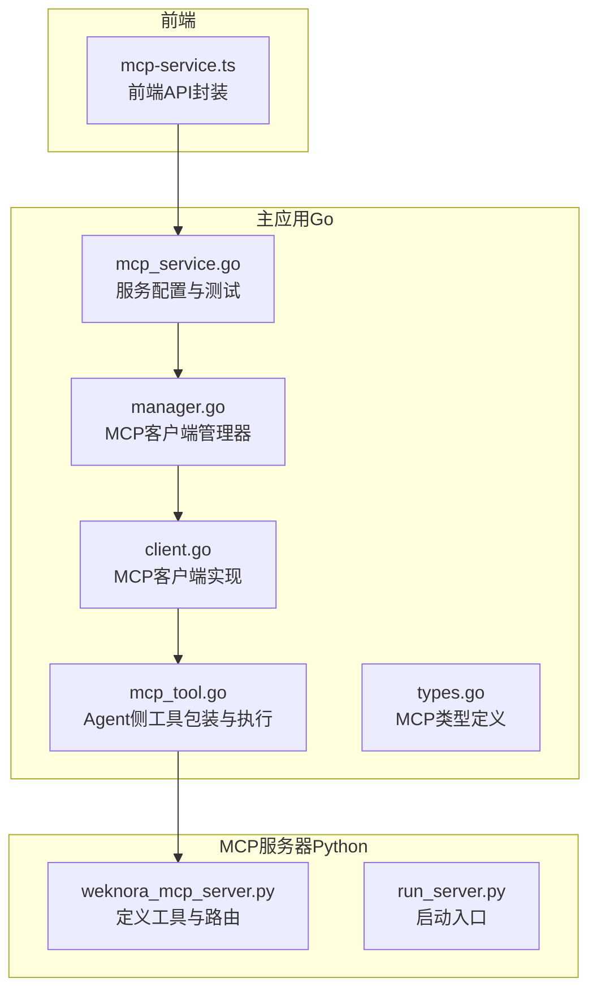
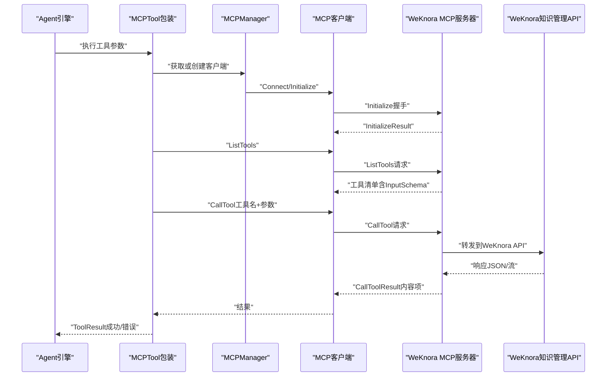
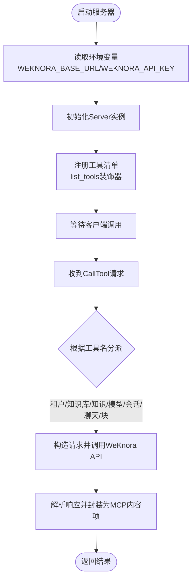
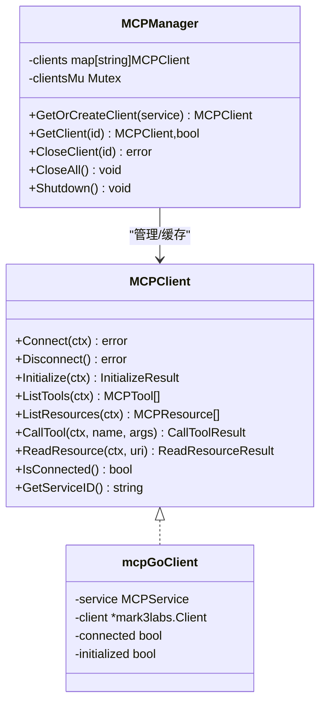
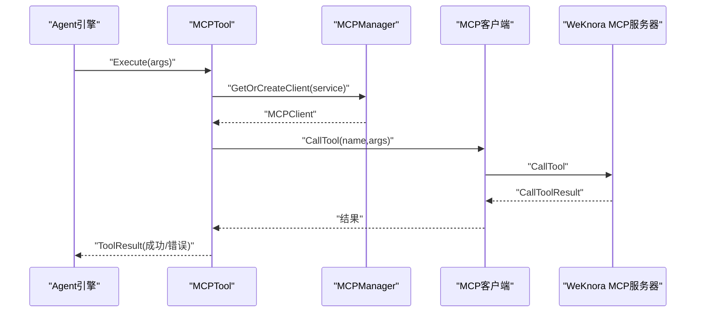
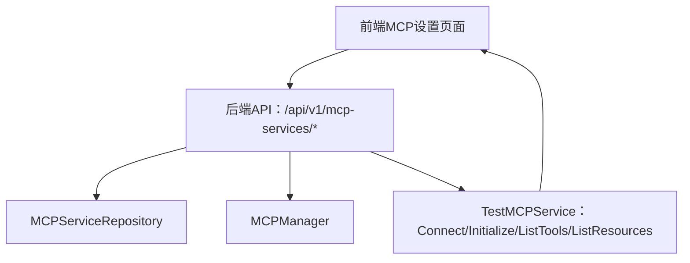
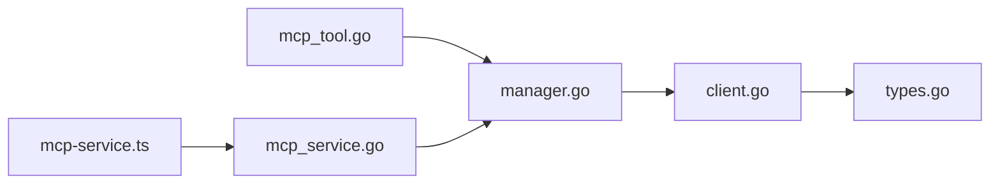

# MCP服务器集成

<cite>
**本文引用的文件**
- [weknora_mcp_server.py](file://mcp-server/weknora_mcp_server.py)
- [run_server.py](file://mcp-server/run_server.py)
- [README.md](file://mcp-server/README.md)
- [mcp_tool.go](file://internal/agent/tools/mcp_tool.go)
- [client.go](file://internal/mcp/client.go)
- [manager.go](file://internal/mcp/manager.go)
- [types.go](file://internal/mcp/types.go)
- [mcp_service.go](file://internal/application/service/mcp_service.go)
- [mcp-service.ts](file://frontend/src/api/mcp-service.ts)
- [MCP功能使用说明.md](file://docs/MCP功能使用说明.md)
- [config.yaml](file://config/config.yaml)
</cite>

## 目录
1. [简介](#简介)
2. [项目结构](#项目结构)
3. [核心组件](#核心组件)
4. [架构总览](#架构总览)
5. [详细组件分析](#详细组件分析)
6. [依赖分析](#依赖分析)
7. [性能考量](#性能考量)
8. [故障排查指南](#故障排查指南)
9. [结论](#结论)
10. [附录](#附录)

## 简介
本指南面向希望在WeKnora中集成MCP（Model Context Protocol）服务器的开发者与运维人员。文档聚焦于：
- WeKnora MCP服务器如何实现MCP协议，暴露工具（tools）以扩展Agent能力（如知识库管理、会话与聊天、模型管理、块管理等）。
- 主应用侧mcp_tool.go如何作为客户端与MCP服务器通信，包括连接管理、请求序列化与响应处理。
- 如何配置MCP服务（系统设置中注册服务器端点、认证信息、传输方式与高级参数）。
- 从定义工具规范到在Agent中调用的完整流程示例。
- 错误处理、超时配置与安全注意事项。

## 项目结构
WeKnora的MCP集成横跨Python MCP服务器与Go主应用两端：
- Python MCP服务器位于mcp-server目录，提供WeKnora知识管理API的MCP工具集。
- Go主应用在internal/mcp、internal/agent/tools、internal/application/service等目录中实现MCP客户端、管理器与服务层。
- 前端通过API接口管理MCP服务配置与测试。

图表来源
- [weknora_mcp_server.py](file://mcp-server/weknora_mcp_server.py#L247-L847)
- [run_server.py](file://mcp-server/run_server.py#L1-L50)
- [mcp_tool.go](file://internal/agent/tools/mcp_tool.go#L1-L308)
- [manager.go](file://internal/mcp/manager.go#L1-L252)
- [client.go](file://internal/mcp/client.go#L1-L374)
- [types.go](file://internal/mcp/types.go#L1-L67)
- [mcp_service.go](file://internal/application/service/mcp_service.go#L1-L378)
- [mcp-service.ts](file://frontend/src/api/mcp-service.ts#L1-L104)

章节来源
- [README.md](file://mcp-server/README.md#L1-L143)
- [MCP功能使用说明.md](file://docs/MCP功能使用说明.md#L1-L30)

## 核心组件
- Python MCP服务器（weknora_mcp_server.py）
  - 定义并注册工具清单（list_tools），为每个工具提供输入Schema。
  - 实现工具调用路由（call_tool），将请求转发至WeKnora知识管理API。
  - 通过环境变量配置基础URL与API Key。
- Go MCP客户端（client.go、manager.go、types.go）
  - 支持SSE、HTTP Streamable、Stdio三种传输方式。
  - 提供连接、初始化、列出工具、调用工具、读取资源等能力。
  - 管理器负责缓存与生命周期管理，支持超时与重试策略。
- Agent侧工具包装（mcp_tool.go）
  - 将MCP工具包装为Agent可用的工具，负责参数校验、调用与结果序列化。
  - 对Stdio传输在每次调用后释放连接，确保资源回收。
- 服务配置与测试（mcp_service.go、mcp-service.ts）
  - 提供创建、更新、删除、测试MCP服务的后端接口与前端封装。
  - 测试流程包含连接、初始化、列出工具与资源，便于排错。

章节来源
- [weknora_mcp_server.py](file://mcp-server/weknora_mcp_server.py#L247-L847)
- [client.go](file://internal/mcp/client.go#L1-L374)
- [manager.go](file://internal/mcp/manager.go#L1-L252)
- [types.go](file://internal/mcp/types.go#L1-L67)
- [mcp_tool.go](file://internal/agent/tools/mcp_tool.go#L1-L308)
- [mcp_service.go](file://internal/application/service/mcp_service.go#L1-L378)
- [mcp-service.ts](file://frontend/src/api/mcp-service.ts#L1-L104)

## 架构总览
下图展示了MCP从Agent到服务器的端到端交互路径，以及主应用侧的管理与封装。

图表来源
- [mcp_tool.go](file://internal/agent/tools/mcp_tool.go#L62-L122)
- [manager.go](file://internal/mcp/manager.go#L37-L122)
- [client.go](file://internal/mcp/client.go#L151-L323)
- [weknora_mcp_server.py](file://mcp-server/weknora_mcp_server.py#L247-L847)

## 详细组件分析

### Python MCP服务器（weknora_mcp_server.py）
- 工具注册与Schema
  - 通过装饰器注册工具清单，为每个工具提供名称、描述与输入Schema（JSON Schema）。
  - 工具覆盖租户管理、知识库管理、知识管理、模型管理、会话管理、聊天、块管理等。
- 工具调用路由
  - 根据工具名分派到对应WeKnora API方法，组装参数并发起HTTP请求。
  - 返回内容项（文本、图像、资源）以MCP内容格式返回。
- 认证与配置
  - 通过环境变量加载基础URL与API Key，统一注入到请求头。
- 运行入口
  - 提供启动脚本与多种运行方式，支持检查环境、详细日志与版本信息。

图表来源
- [weknora_mcp_server.py](file://mcp-server/weknora_mcp_server.py#L247-L847)
- [run_server.py](file://mcp-server/run_server.py#L1-L50)

章节来源
- [weknora_mcp_server.py](file://mcp-server/weknora_mcp_server.py#L247-L847)
- [README.md](file://mcp-server/README.md#L1-L143)

### Go MCP客户端与管理器（client.go、manager.go、types.go）
- 类型与协议
  - 定义InitializeResult、CallToolResult、ContentItem、ReadResourceResult等类型，映射MCP协议数据结构。
- 客户端实现
  - 支持SSE、HTTP Streamable、Stdio三种传输方式，按配置构建HTTP客户端与头部。
  - 提供Connect/Disconnect、Initialize、ListTools、CallTool、ReadResource等方法。
  - 对Stdio传输每次调用后释放连接，避免资源泄漏。
- 管理器职责
  - GetOrCreateClient：按传输类型决定是否缓存连接；Stdio总是新建客户端；SSE/HTTP Streamable复用连接。
  - 初始化超时控制与清理空闲连接的周期性任务。
  - CloseAll/Shutdown优雅关闭所有连接。

图表来源
- [client.go](file://internal/mcp/client.go#L1-L374)
- [manager.go](file://internal/mcp/manager.go#L1-L252)
- [types.go](file://internal/mcp/types.go#L1-L67)

章节来源
- [client.go](file://internal/mcp/client.go#L1-L374)
- [manager.go](file://internal/mcp/manager.go#L1-L252)
- [types.go](file://internal/mcp/types.go#L1-L67)

### Agent侧工具包装（mcp_tool.go）
- 工具命名与描述
  - Name()将服务名与工具名规范化为唯一标识，Description()拼接服务描述与工具描述。
- 参数Schema
  - Parameters()返回工具的InputSchema（若为空则返回默认空对象）。
- 执行流程
  - GetOrCreateClient：通过MCPManager获取或创建客户端，Stdio传输在调用后断开。
  - CallTool：调用MCP工具，解析结果为文本内容，构造ToolResult。
  - 错误处理：当结果指示错误或调用失败时，返回错误信息而非抛出异常。
- 结果序列化
  - 提供序列化函数，将ToolResult转换为字符串，便于前端展示。

图表来源
- [mcp_tool.go](file://internal/agent/tools/mcp_tool.go#L62-L122)
- [client.go](file://internal/mcp/client.go#L284-L323)
- [manager.go](file://internal/mcp/manager.go#L37-L122)

章节来源
- [mcp_tool.go](file://internal/agent/tools/mcp_tool.go#L1-L308)

### 服务配置与测试（mcp_service.go、mcp-service.ts）
- 服务配置
  - 支持SSE、HTTP Streamable、Stdio三种传输方式；Stdio需提供命令与参数；可配置Headers、AuthConfig（API Key、Token、自定义Header）、AdvancedConfig（超时、重试次数、重试延迟）。
  - 更新服务时检测关键配置变更（URL/Stdio配置、传输类型、认证配置），必要时关闭旧连接并重建。
- 前端API
  - 提供列表、创建、更新、删除、测试、获取工具与资源等接口。
- 测试流程
  - 创建临时客户端，Connect/Initialize/ListTools/ListResources，返回测试结果（含工具与资源清单）。

图表来源
- [mcp_service.go](file://internal/application/service/mcp_service.go#L231-L304)
- [mcp-service.ts](file://frontend/src/api/mcp-service.ts#L1-L104)

章节来源
- [mcp_service.go](file://internal/application/service/mcp_service.go#L1-L378)
- [mcp-service.ts](file://frontend/src/api/mcp-service.ts#L1-L104)
- [MCP功能使用说明.md](file://docs/MCP功能使用说明.md#L1-L30)

## 依赖分析
- 组件耦合
  - Agent工具包装依赖MCPManager与MCP类型；MCPManager依赖MCP客户端实现；客户端依赖mark3labs/mcp-go库与HTTP客户端。
  - 服务层依赖仓库接口与MCPManager，负责配置持久化与测试。
- 传输与认证
  - SSE/HTTP Streamable：通过HTTP客户端与Headers/AuthConfig注入认证。
  - Stdio：通过命令与参数启动子进程，适合本地调试与离线场景。
- 超时与重试
  - 客户端HTTP超时与初始化超时受AdvancedConfig控制；管理器清理空闲连接，避免资源泄露。

图表来源
- [mcp_tool.go](file://internal/agent/tools/mcp_tool.go#L1-L308)
- [manager.go](file://internal/mcp/manager.go#L1-L252)
- [client.go](file://internal/mcp/client.go#L1-L374)
- [types.go](file://internal/mcp/types.go#L1-L67)
- [mcp_service.go](file://internal/application/service/mcp_service.go#L1-L378)
- [mcp-service.ts](file://frontend/src/api/mcp-service.ts#L1-L104)

章节来源
- [client.go](file://internal/mcp/client.go#L1-L374)
- [manager.go](file://internal/mcp/manager.go#L1-L252)
- [mcp_service.go](file://internal/application/service/mcp_service.go#L1-L378)

## 性能考量
- 连接复用
  - SSE/HTTP Streamable传输在管理器中缓存连接，减少重复握手成本。
- 超时控制
  - 客户端HTTP超时与初始化超时均受AdvancedConfig约束，默认30秒，最长不超过60秒。
- 清理策略
  - 管理器定时清理断开的客户端，降低内存占用与句柄泄漏风险。
- 建议
  - 对公网或第三方服务适当提高retry_count与retry_delay，避免间歇性超时导致Agent中断。
  - SSE优先用于需要流式体验的场景；Stdio适合本地调试与离线环境。

[本节为通用指导，无需列出章节来源]

## 故障排查指南
- 服务器启动与环境
  - 确认WEKNORA_BASE_URL与WEKNORA_API_KEY已正确设置；使用启动脚本进行环境检查与版本信息查看。
- 连接与初始化
  - 测试连接：通过后端TestMCPService接口触发Connect/Initialize；若失败，检查URL、认证头、网络连通性。
- 工具调用
  - 若CallTool失败，检查工具名是否存在于服务端工具清单；核对InputSchema与传入参数。
- Stdio传输
  - Stdio每次调用后会断开连接，若频繁调用建议切换为SSE/HTTP Streamable以复用连接。
- 前端配置
  - 在设置页面中查看服务列表、启停状态与测试结果；对认证信息进行掩码显示，避免泄露。

章节来源
- [run_server.py](file://mcp-server/run_server.py#L1-L50)
- [mcp_service.go](file://internal/application/service/mcp_service.go#L231-L304)
- [mcp-tool.go](file://internal/agent/tools/mcp_tool.go#L62-L122)
- [MCP功能使用说明.md](file://docs/MCP功能使用说明.md#L1-L30)

## 结论
WeKnora通过MCP协议实现了Agent对外部能力的扩展：Python MCP服务器提供WeKnora知识管理API的工具集，Go主应用侧以标准化客户端与管理器实现连接、初始化、工具列举与调用，前端提供可视化的服务配置与测试能力。通过合理的传输方式选择、超时与重试配置、认证与安全策略，用户可以安全可靠地集成与使用MCP扩展功能。

[本节为总结性内容，无需列出章节来源]

## 附录

### 配置MCP服务步骤（系统设置）
- 新建服务
  - 填写名称与描述，选择传输方式（SSE/HTTP Streamable/Stdio）。
  - SSE/HTTP Streamable需提供可访问的服务URL；Stdio需配置命令（uvx/npx）与参数，可附加环境变量。
  - 根据需要填写API Key、Bearer Token、超时与重试策略，保存后服务出现在列表中。
- 启停服务
  - 切换启用状态，系统即时调用后端更新接口；失败时自动回滚并提示。
- 连接测试
  - 通过“测试”菜单触发Connect/Initialize/ListTools/ListResources，成功时展示工具清单与资源列表，失败时显示错误信息。
- 编辑/删除
  - “编辑”带出原有配置，修改后保存；“删除”需确认后完成。

章节来源
- [MCP功能使用说明.md](file://docs/MCP功能使用说明.md#L1-L30)
- [mcp-service.ts](file://frontend/src/api/mcp-service.ts#L1-L104)
- [mcp_service.go](file://internal/application/service/mcp_service.go#L231-L304)

### 创建新的MCP工具（示例流程）
- 定义工具规范
  - 在服务器端添加工具定义与输入Schema（参考现有工具清单），确保名称唯一、描述清晰、Schema完整。
- 注册与暴露
  - 通过装饰器注册工具清单，确保Agent侧能通过ListTools发现新工具。
- 在Agent中调用
  - Agent侧工具包装会自动注册MCP工具，名称格式为“mcp.{service_name}.{tool_name}”，Description包含服务信息。
  - 执行时传入参数需满足InputSchema，客户端将参数序列化并调用CallTool。
- 验证与测试
  - 使用前端“测试”功能验证连接、初始化与工具清单；在Agent中执行工具并观察结果序列化输出。

章节来源
- [weknora_mcp_server.py](file://mcp-server/weknora_mcp_server.py#L247-L847)
- [mcp_tool.go](file://internal/agent/tools/mcp_tool.go#L1-L308)
- [mcp_service.go](file://internal/application/service/mcp_service.go#L306-L334)

### 安全与认证
- 认证方式
  - 支持API Key与Bearer Token，也可配置自定义Header；敏感信息在列表视图中进行掩码显示。
- 传输建议
  - 优先使用HTTPS与SSE；在可信内网环境可考虑HTTP Streamable；本地调试使用Stdio。
- 凭据管理
  - 生产环境建议使用最小权限Key并定期轮换；避免在配置中硬编码明文密钥。

章节来源
- [types.go](file://internal/types/mcp.go#L1-L227)
- [client.go](file://internal/mcp/client.go#L72-L118)
- [MCP功能使用说明.md](file://docs/MCP功能使用说明.md#L27-L30)

### 超时与重试配置
- 客户端HTTP超时与初始化超时
  - 默认30秒，可通过AdvancedConfig.timeout调整，上限60秒。
- 重试策略
  - AdvancedConfig.retry_count与retry_delay用于控制重试次数与间隔。
- 管理器清理
  - 定期清理断开的客户端，避免资源泄漏。

章节来源
- [client.go](file://internal/mcp/client.go#L60-L118)
- [manager.go](file://internal/mcp/manager.go#L124-L146)
- [types.go](file://internal/types/mcp.go#L50-L56)