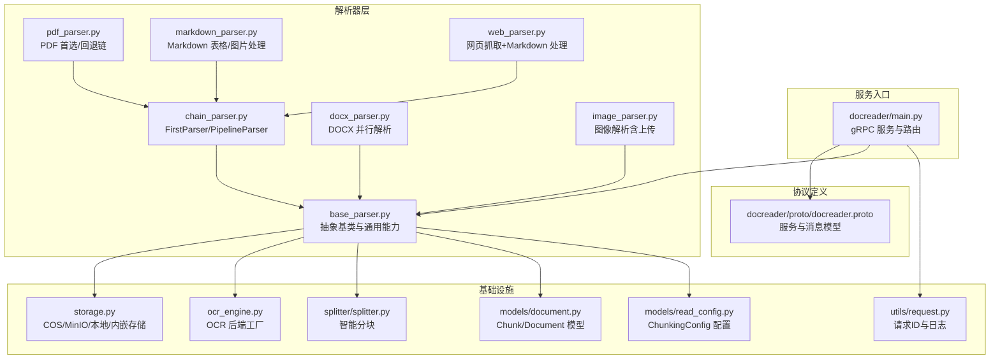
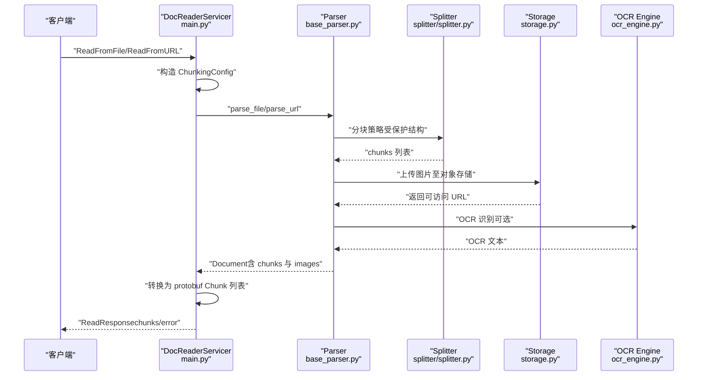
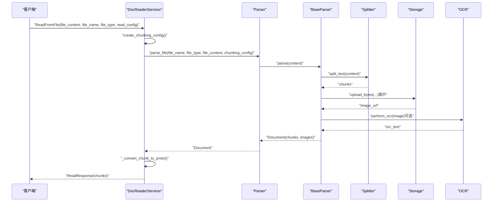
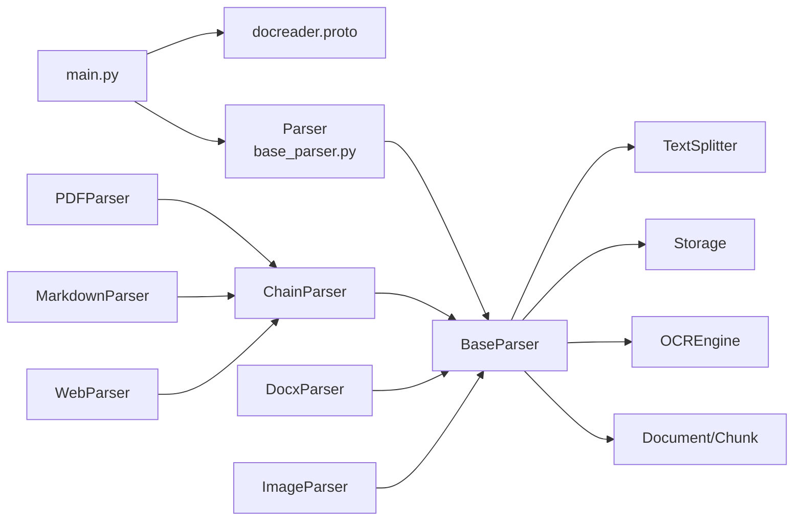

# 文档解析服务

<cite>
**本文引用的文件**
- [docreader/main.py](file://docreader/main.py)
- [docreader/parser/base_parser.py](file://docreader/parser/base_parser.py)
- [docreader/parser/chain_parser.py](file://docreader/parser/chain_parser.py)
- [docreader/parser/storage.py](file://docreader/parser/storage.py)
- [docreader/proto/docreader.proto](file://docreader/proto/docreader.proto)
- [docreader/parser/pdf_parser.py](file://docreader/parser/pdf_parser.py)
- [docreader/parser/docx_parser.py](file://docreader/parser/docx_parser.py)
- [docreader/parser/image_parser.py](file://docreader/parser/image_parser.py)
- [docreader/parser/ocr_engine.py](file://docreader/parser/ocr_engine.py)
- [docreader/parser/markdown_parser.py](file://docreader/parser/markdown_parser.py)
- [docreader/parser/web_parser.py](file://docreader/parser/web_parser.py)
- [docreader/models/read_config.py](file://docreader/models/read_config.py)
- [docreader/models/document.py](file://docreader/models/document.py)
- [docreader/splitter/splitter.py](file://docreader/splitter/splitter.py)
- [docreader/utils/request.py](file://docreader/utils/request.py)
- [docreader/testdata/test.md](file://docreader/testdata/test.md)
- [docreader/testdata/test.html](file://docreader/testdata/test.html)
</cite>

## 目录
1. [简介](#简介)
2. [项目结构](#项目结构)
3. [核心组件](#核心组件)
4. [架构总览](#架构总览)
5. [详细组件分析](#详细组件分析)
6. [依赖关系分析](#依赖关系分析)
7. [性能与调优](#性能与调优)
8. [故障排查指南](#故障排查指南)
9. [结论](#结论)
10. [附录](#附录)

## 简介
本文件面向开发者，系统性梳理“文档解析服务”（docreader/）的架构与实现，重点覆盖：
- 支持的文档格式与解析器家族：PDF、Word、Excel、Markdown、HTML、图像（OCR）等
- 解析流程：文档加载、内容提取、文本分割、元数据生成与多模态处理
- 处理链路：chain_parser.py 如何组合多个解析器形成“首个成功”或“流水线”链
- 存储管理：storage.py 如何对接 COS/MinIO/本地/内嵌等存储后端
- OCR 引擎：ocr_engine.py 的多后端工厂与性能调优
- gRPC 协议：docreader.proto 的接口定义与 main.py 的服务实现
- 扩展指南：如何基于 base_parser.py 接口实现自定义解析器

## 项目结构
docreader/ 是一个独立的 Python 微服务，提供 gRPC 接口，负责将各类文档解析为可检索的文本块（chunks），并可选地生成图像描述与 OCR 文本，最终返回给上游应用。

图表来源
- [docreader/main.py](file://docreader/main.py#L1-L328)
- [docreader/proto/docreader.proto](file://docreader/proto/docreader.proto#L1-L89)
- [docreader/parser/base_parser.py](file://docreader/parser/base_parser.py#L1-L946)
- [docreader/parser/chain_parser.py](file://docreader/parser/chain_parser.py#L1-L169)
- [docreader/parser/pdf_parser.py](file://docreader/parser/pdf_parser.py#L1-L17)
- [docreader/parser/docx_parser.py](file://docreader/parser/docx_parser.py#L1-L1487)
- [docreader/parser/image_parser.py](file://docreader/parser/image_parser.py#L1-L45)
- [docreader/parser/markdown_parser.py](file://docreader/parser/markdown_parser.py#L1-L441)
- [docreader/parser/web_parser.py](file://docreader/parser/web_parser.py#L1-L143)
- [docreader/parser/ocr_engine.py](file://docreader/parser/ocr_engine.py#L1-L335)
- [docreader/parser/storage.py](file://docreader/parser/storage.py#L1-L437)
- [docreader/splitter/splitter.py](file://docreader/splitter/splitter.py#L1-L424)
- [docreader/utils/request.py](file://docreader/utils/request.py#L1-L150)
- [docreader/models/document.py](file://docreader/models/document.py#L1-L88)
- [docreader/models/read_config.py](file://docreader/models/read_config.py#L1-L28)

章节来源
- [docreader/main.py](file://docreader/main.py#L1-L328)
- [docreader/proto/docreader.proto](file://docreader/proto/docreader.proto#L1-L89)

## 核心组件
- 服务入口与 gRPC：main.py 提供 ReadFromFile/ReadFromURL 两个 RPC，封装请求上下文、日志、ChunkingConfig 构造、结果转换与错误码。
- 抽象解析器：base_parser.py 定义统一接口 parse_into_text，内置 OCR、图像下载/上传、并发处理、分块策略、多模态（VLM）集成。
- 处理链：chain_parser.py 提供 FirstParser（首个成功）与 PipelineParser（流水线串联）两种模式，便于组合不同解析器。
- 存储后端：storage.py 统一封装 COS/MinIO/本地/内嵌存储，自动上传图片并返回可访问 URL。
- OCR 引擎：ocr_engine.py 工厂模式支持 PaddleOCR、Nanonets（OpenAI 兼容接口）、Dummy 后端，适配 CPU/AVX 等环境差异。
- 文本分块：splitter/splitter.py 采用受保护正则与分隔符优先策略，保证表格、代码块、公式、图片、链接等结构完整性。
- 数据模型：models/document.py 定义 Chunk/Document；models/read_config.py 定义分块与多模态配置。

章节来源
- [docreader/parser/base_parser.py](file://docreader/parser/base_parser.py#L1-L946)
- [docreader/parser/chain_parser.py](file://docreader/parser/chain_parser.py#L1-L169)
- [docreader/parser/storage.py](file://docreader/parser/storage.py#L1-L437)
- [docreader/parser/ocr_engine.py](file://docreader/parser/ocr_engine.py#L1-L335)
- [docreader/splitter/splitter.py](file://docreader/splitter/splitter.py#L1-L424)
- [docreader/models/document.py](file://docreader/models/document.py#L1-L88)
- [docreader/models/read_config.py](file://docreader/models/read_config.py#L1-L28)

## 架构总览
服务采用“gRPC + 解析器链 + 存储 + OCR”的分层设计：
- gRPC 层：接收文件字节流或 URL，构造 ChunkingConfig，委派 Parser 执行解析
- 解析层：根据文件类型选择解析器（PDF/DOCX/Markdown/HTML/图像），或通过链式解析器组合
- 基础设施层：OCR 引擎、对象存储、文本分块、日志与请求上下文

图表来源
- [docreader/main.py](file://docreader/main.py#L130-L274)
- [docreader/parser/base_parser.py](file://docreader/parser/base_parser.py#L326-L616)
- [docreader/splitter/splitter.py](file://docreader/splitter/splitter.py#L116-L288)
- [docreader/parser/storage.py](file://docreader/parser/storage.py#L413-L437)
- [docreader/parser/ocr_engine.py](file://docreader/parser/ocr_engine.py#L301-L335)

## 详细组件分析

### 服务与协议（docreader.proto + main.py）
- 协议定义：服务包含 ReadFromFile 与 ReadFromURL 两个 RPC；消息体包含文件内容/URL、文件名/类型、ReadConfig、请求ID等；返回 ReadResponse，包含 Chunk 列表与错误信息。
- 服务实现：DocReaderServicer 在 ReadFromFile 中根据文件类型与内容调用 Parser.parse_file，在 ReadFromURL 中调用 Parser.parse_url；将内部 Document 转换为 protobuf Chunk 并返回；对异常设置 gRPC 错误码。

章节来源
- [docreader/proto/docreader.proto](file://docreader/proto/docreader.proto#L1-L89)
- [docreader/main.py](file://docreader/main.py#L130-L274)

### 解析器抽象与通用能力（base_parser.py）
- 接口：parse_into_text(content: bytes) -> Document，统一解析入口
- OCR：get_ocr_engine/perform_ocr/_resize_image_if_needed，支持多后端与图像尺寸控制
- 图像并发：process_multiple_images/process_with_limit/process_image_async，带超时与资源清理
- 文本分块：parse -> TextSplitter.split_text -> _str_to_chunk，支持受保护结构（表格、代码、公式、图片、链接）
- 多模态：enable_multimodal 下，抽取每块中的图片信息，下载/上传并生成 OCR 文本与 VLM 描述
- 配置：ChunkingConfig、OCR 后端与并发度、最大块数等

章节来源
- [docreader/parser/base_parser.py](file://docreader/parser/base_parser.py#L1-L946)
- [docreader/models/read_config.py](file://docreader/models/read_config.py#L1-L28)
- [docreader/splitter/splitter.py](file://docreader/splitter/splitter.py#L1-L424)

### 处理链（chain_parser.py）
- FirstParser：按注册顺序尝试多个解析器，首个成功即返回
- PipelineParser：按顺序将前一解析器输出作为下一解析器输入，累积各阶段图像映射
- 示例：PDFParser 使用 MinerUParser 为主、MarkitdownParser 为回退；MarkdownParser 使用 MarkdownTableFormatter + MarkdownImageBase64 的流水线

章节来源
- [docreader/parser/chain_parser.py](file://docreader/parser/chain_parser.py#L1-L169)
- [docreader/parser/pdf_parser.py](file://docreader/parser/pdf_parser.py#L1-L17)
- [docreader/parser/markdown_parser.py](file://docreader/parser/markdown_parser.py#L412-L441)

### 存储管理（storage.py）
- 抽象：Storage.upload_file/upload_bytes
- 实现：CosStorage（COS）、MinioStorage（S3 兼容）、LocalStorage（本地）、Base64Storage（内嵌）
- 自动化：根据环境变量或注入配置初始化客户端；上传图片生成公开 URL；MinIO 自动创建桶并设置公开策略
- 选择：create_storage 根据 STORAGE_TYPE 或配置选择具体实现

章节来源
- [docreader/parser/storage.py](file://docreader/parser/storage.py#L1-L437)

### OCR 引擎（ocr_engine.py）
- 工厂：OCREngine.get_instance(backend_type)，缓存实例
- 后端：
  - PaddleOCRBackend：禁用 GPU、CPU 指令集检测与兼容模式、PP-OCRv4 参数
  - NanonetsOCRBackend：OpenAI 兼容接口，提示词要求输出 Markdown 表格与 LaTeX 公式
  - DummyOCRBackend：占位返回空串
- 性能建议：CPU 环境优先考虑 Dummy 或 Nanonets；MinIO/本地部署建议使用 Nanonets 后端

章节来源
- [docreader/parser/ocr_engine.py](file://docreader/parser/ocr_engine.py#L1-L335)

### 文本分块（splitter/splitter.py）
- 受保护正则：公式、图片、链接、表格、代码块等结构保持完整
- 分隔符优先：按优先级尝试换行/中文句号/空格等分隔
- 重叠与上下文：维护头部标题追踪，确保重叠块包含必要上下文
- 输出：返回 (start, end, text) 的块列表，供后续转为 Chunk

章节来源
- [docreader/splitter/splitter.py](file://docreader/splitter/splitter.py#L1-L424)

### 数据模型（models/document.py）
- Chunk：content、seq、start、end、images、metadata
- Document：content、images、chunks、metadata、is_valid()

章节来源
- [docreader/models/document.py](file://docreader/models/document.py#L1-L88)

### 典型解析器族

#### PDF 解析（pdf_parser.py + chain_parser.py）
- PDFParser 继承 FirstParser，按 MinerUParser → MarkitdownParser 顺序尝试
- 适合复杂版式 PDF 的首选/回退策略

章节来源
- [docreader/parser/pdf_parser.py](file://docreader/parser/pdf_parser.py#L1-L17)
- [docreader/parser/chain_parser.py](file://docreader/parser/chain_parser.py#L1-L85)

#### Word 解析（docx_parser.py）
- DocxParser：并发处理页面，支持大文档分页与进程池；提取文本、表格、图片，图片上传存储并生成 base64 映射
- Docx 类：页面映射、图片提取、并行处理、临时文件管理与清理

章节来源
- [docreader/parser/docx_parser.py](file://docreader/parser/docx_parser.py#L1-L1487)

#### Markdown 解析（markdown_parser.py）
- MarkdownTableFormatter：标准化表格格式
- MarkdownImageBase64：提取 base64 图片、上传存储、替换为 URL、返回 images 映射
- MarkdownParser：流水线（表格格式化 → 图片处理）

章节来源
- [docreader/parser/markdown_parser.py](file://docreader/parser/markdown_parser.py#L1-L441)

#### HTML/网页解析（web_parser.py）
- StdWebParser：Playwright WebKit 抓取 + Trafilatura 提取为 Markdown
- WebParser：流水线（网页抓取 → Markdown 处理）

章节来源
- [docreader/parser/web_parser.py](file://docreader/parser/web_parser.py#L1-L143)

#### 图像解析（image_parser.py）
- ImageParser：上传图像到存储，生成 Markdown 图片链接，返回 images 映射

章节来源
- [docreader/parser/image_parser.py](file://docreader/parser/image_parser.py#L1-L45)

### 解析流程时序（文件/URL）

图表来源
- [docreader/main.py](file://docreader/main.py#L130-L274)
- [docreader/parser/base_parser.py](file://docreader/parser/base_parser.py#L326-L616)
- [docreader/splitter/splitter.py](file://docreader/splitter/splitter.py#L116-L288)
- [docreader/parser/storage.py](file://docreader/parser/storage.py#L413-L437)
- [docreader/parser/ocr_engine.py](file://docreader/parser/ocr_engine.py#L301-L335)

## 依赖关系分析
- 组件耦合
  - base_parser.py 是所有解析器的共同基类，向上依赖 splitter、storage、ocr_engine、models
  - chain_parser.py 仅依赖 base_parser 与 endecode，解耦具体解析器
  - main.py 依赖 proto、models、parser.Parser 与 utils.request
- 关键依赖链
  - DocReaderServicer → Parser → BaseParser → Splitter/Storage/OCR
  - ChainParser → BaseParser → 具体解析器
- 外部依赖
  - gRPC、Playwright、Trafilatura、Pillow、numpy、paddleocr、minio、qcloud_cos 等

图表来源
- [docreader/main.py](file://docreader/main.py#L1-L328)
- [docreader/parser/base_parser.py](file://docreader/parser/base_parser.py#L1-L946)
- [docreader/parser/chain_parser.py](file://docreader/parser/chain_parser.py#L1-L169)
- [docreader/parser/pdf_parser.py](file://docreader/parser/pdf_parser.py#L1-L17)
- [docreader/parser/docx_parser.py](file://docreader/parser/docx_parser.py#L1-L1487)
- [docreader/parser/image_parser.py](file://docreader/parser/image_parser.py#L1-L45)
- [docreader/parser/markdown_parser.py](file://docreader/parser/markdown_parser.py#L1-L441)
- [docreader/parser/web_parser.py](file://docreader/parser/web_parser.py#L1-L143)
- [docreader/splitter/splitter.py](file://docreader/splitter/splitter.py#L1-L424)
- [docreader/parser/storage.py](file://docreader/parser/storage.py#L1-L437)
- [docreader/parser/ocr_engine.py](file://docreader/parser/ocr_engine.py#L1-L335)
- [docreader/models/document.py](file://docreader/models/document.py#L1-L88)

## 性能与调优
- OCR 后端选择
  - PaddleOCR：CPU 环境需注意 AVX 指令集；若不支持会降级兼容模式
  - Nanonets：OpenAI 兼容接口，适合远程推理；可通过环境变量配置 base_url/api_key/model
  - Dummy：仅用于占位或调试
- 并发与资源
  - base_parser 中 max_concurrent_tasks 控制图像并发；process_multiple_images 使用 asyncio.Semaphore 限流
  - DocxParser 使用进程池（ProcessPoolExecutor）并按文档规模动态调整 worker 数
- 分块策略
  - chunk_size/chunk_overlap/separators 可调；splitter 会保护表格、代码、公式、图片、链接结构
- 存储与网络
  - MinIO/COS 上传前先生成 UUID 路径避免冲突；MinIO 自动设置公开策略
  - 图像下载支持代理（EXTERNAL_HTTP_PROXY/EXTERNAL_HTTPS_PROXY）
- gRPC 与日志
  - 最大消息长度 50MB；日志包含请求ID与耗时，便于定位问题

章节来源
- [docreader/parser/ocr_engine.py](file://docreader/parser/ocr_engine.py#L1-L335)
- [docreader/parser/base_parser.py](file://docreader/parser/base_parser.py#L180-L296)
- [docreader/parser/docx_parser.py](file://docreader/parser/docx_parser.py#L646-L740)
- [docreader/splitter/splitter.py](file://docreader/splitter/splitter.py#L1-L424)
- [docreader/parser/storage.py](file://docreader/parser/storage.py#L280-L377)
- [docreader/utils/request.py](file://docreader/utils/request.py#L1-L150)
- [docreader/main.py](file://docreader/main.py#L283-L328)

## 故障排查指南
- 常见错误
  - gRPC 内部错误：ReadFromFile/ReadFromURL 返回 error 字段或设置 INTERNAL 状态码
  - OCR 初始化失败：检查 OCR_BACKEND 与依赖安装（paddleocr/nanonets）
  - 存储配置缺失：COS/MinIO 环境变量不完整会导致初始化失败
  - 图像下载失败：检查 EXTERNAL_HTTP_PROXY 设置与网络连通性
- 日志与追踪
  - 使用 request_id_context 生成请求ID，日志中包含 elapsed_ms
  - base_parser 中对 OCR/图像处理增加超时与异常捕获，避免阻塞
- 建议排查步骤
  - 确认 gRPC 端口与 worker 数（GRPC_PORT/GRPC_MAX_WORKERS）
  - 检查 STORAGE_TYPE 与对应环境变量（COS_* 或 MINIO_*）
  - 验证 OCR 后端可用性与模型参数
  - 使用测试数据（test.md/test.html）验证 Markdown/Web 解析链路

章节来源
- [docreader/main.py](file://docreader/main.py#L130-L274)
- [docreader/utils/request.py](file://docreader/utils/request.py#L1-L150)
- [docreader/testdata/test.md](file://docreader/testdata/test.md#L1-L37)
- [docreader/testdata/test.html](file://docreader/testdata/test.html#L1-L56)

## 结论
文档解析服务通过模块化的解析器体系、灵活的处理链与完善的基础设施，实现了对多格式文档的高可靠解析与多模态增强。结合 gRPC 接口与可插拔的 OCR/存储后端，服务具备良好的扩展性与运维弹性。建议在生产环境中：
- 明确 OCR 与存储后端，合理设置并发与分块参数
- 使用请求ID与日志追踪定位问题
- 通过 ChainParser 组合解析器以提升鲁棒性

## 附录

### API 使用示例（路径指引）
- gRPC 客户端调用 ReadFromFile/ReadFromURL 的示例可参考：
  - [docreader/main.py](file://docreader/main.py#L130-L274)
  - [docreader/proto/docreader.proto](file://docreader/proto/docreader.proto#L1-L89)
- 服务启动与环境变量：
  - [docreader/main.py](file://docreader/main.py#L283-L328)
- 请求上下文与日志：
  - [docreader/utils/request.py](file://docreader/utils/request.py#L1-L150)

### 配置项一览
- gRPC
  - GRPC_PORT：监听端口，默认 50051
  - GRPC_MAX_WORKERS：工作线程数，默认 4
  - 最大消息长度：50MB
- 存储
  - STORAGE_TYPE：cos/minio/local/base64
  - COS_*：COS_SECRET_ID/SECRET_KEY/REGION/BUCKET_NAME/APP_ID/PATH_PREFIX/ENABLE_OLD_DOMAIN
  - MINIO_*：ENDPOINT/ACCESS_KEY_ID/SECRET_ACCESS_KEY/BUCKET_NAME/USE_SSL/PATH_PREFIX/PUBLIC_ENDPOINT
  - LOCAL_STORAGE_BASE_DIR：本地存储根目录
- OCR
  - OCR_BACKEND：paddle/nanonets/dummy
  - OCR_API_BASE_URL/OCR_API_KEY/OCR_MODEL：Nanonets 后端配置
- 多模态与分块
  - enable_multimodal：启用多模态（文本+图像）
  - chunk_size/chunk_overlap/separators：分块参数
  - VLM 配置：model_name/base_url/api_key/interface_type

章节来源
- [docreader/main.py](file://docreader/main.py#L276-L328)
- [docreader/parser/storage.py](file://docreader/parser/storage.py#L413-L437)
- [docreader/parser/ocr_engine.py](file://docreader/parser/ocr_engine.py#L204-L225)
- [docreader/models/read_config.py](file://docreader/models/read_config.py#L1-L28)

### 扩展自定义解析器（基于 base_parser.py）
- 实现步骤
  - 继承 BaseParser，实现 parse_into_text(content: bytes) -> Document
  - 若涉及图像：复用 BaseParser 的图像下载/上传/OCR/并发处理能力
  - 若需要分块：直接使用 self.chunk_text 或委托 TextSplitter
  - 若需要存储：使用 self.storage.upload_bytes
- 推荐模式
  - 简单文本：直接返回 Document(content=..., images={})
  - 复杂结构：先提取文本，再通过 ChainParser 组合其他解析器
- 注意事项
  - 保持 parse_into_text 的幂等与健壮性
  - 对异常进行捕获并返回空 Document，避免中断链路
  - 合理设置 chunk_size/overlap 与 separators

章节来源
- [docreader/parser/base_parser.py](file://docreader/parser/base_parser.py#L122-L133)
- [docreader/parser/chain_parser.py](file://docreader/parser/chain_parser.py#L1-L169)