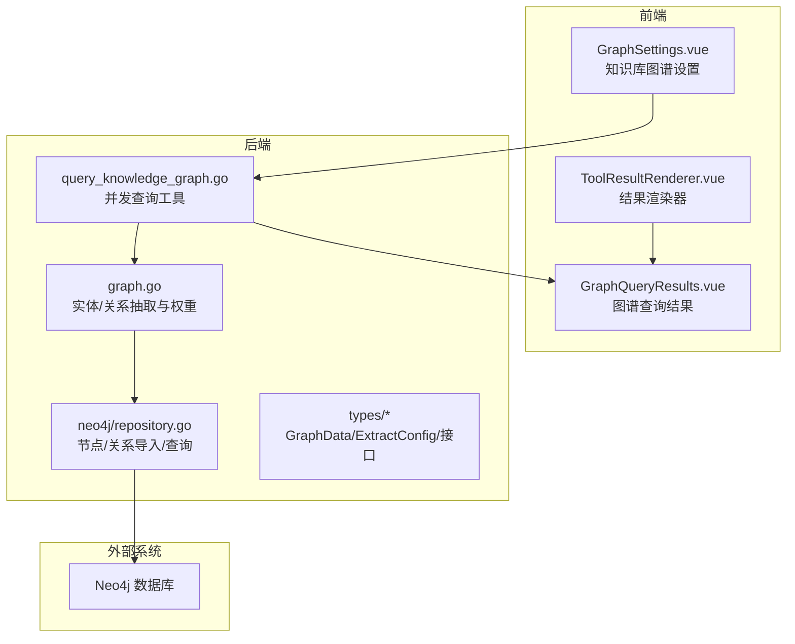
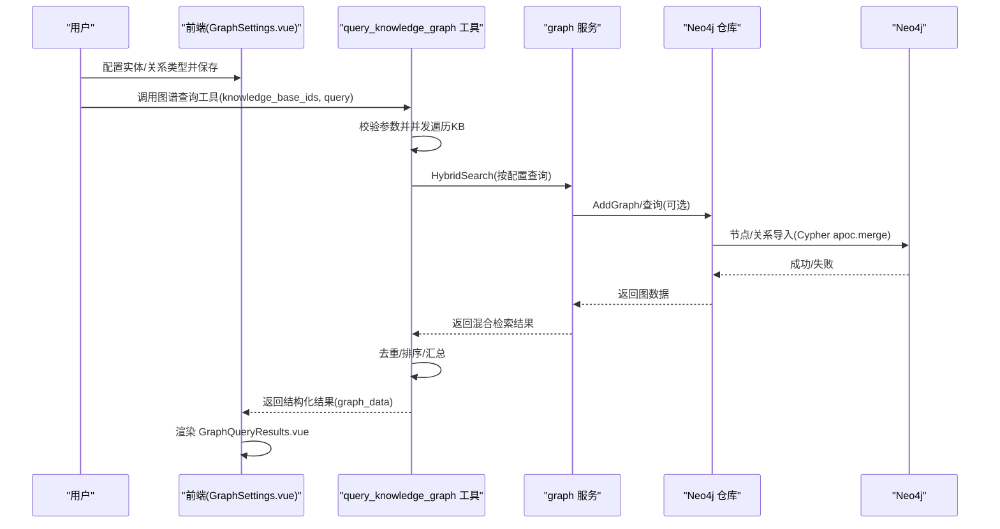
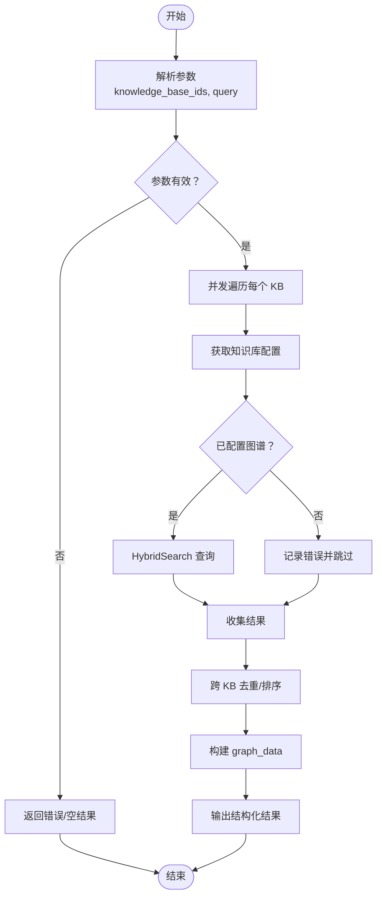
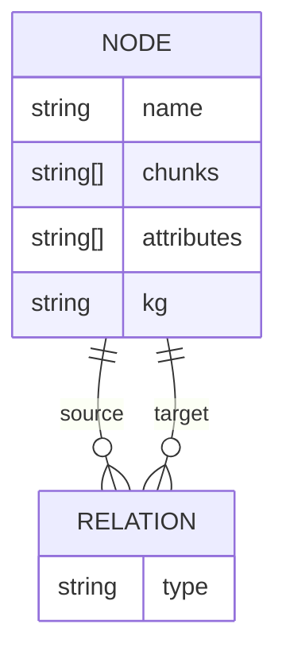
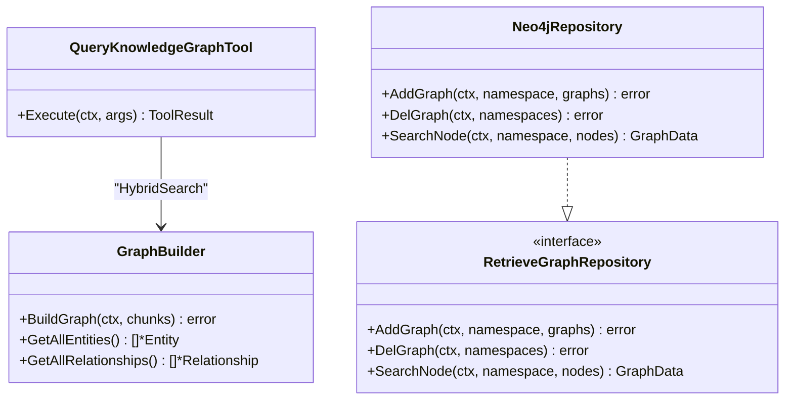

# 知识图谱功能

<cite>
**本文引用的文件**
- [docs/KnowledgeGraph.md](file://docs/KnowledgeGraph.md)
- [docs/开启知识图谱功能.md](file://docs/开启知识图谱功能.md)
- [internal/agent/tools/query_knowledge_graph.go](file://internal/agent/tools/query_knowledge_graph.go)
- [internal/application/repository/retriever/neo4j/repository.go](file://internal/application/repository/retriever/neo4j/repository.go)
- [frontend/src/views/knowledge/settings/GraphSettings.vue](file://frontend/src/views/knowledge/settings/GraphSettings.vue)
- [frontend/src/views/chat/components/tool-results/GraphQueryResults.vue](file://frontend/src/views/chat/components/tool-results/GraphQueryResults.vue)
- [frontend/src/views/chat/components/ToolResultRenderer.vue](file://frontend/src/views/chat/components/ToolResultRenderer.vue)
- [internal/types/extract_graph.go](file://internal/types/extract_graph.go)
- [internal/types/interfaces/retriever_graph.go](file://internal/types/interfaces/retriever_graph.go)
- [internal/types/knowledgebase.go](file://internal/types/knowledgebase.go)
- [internal/application/service/graph.go](file://internal/application/service/graph.go)
- [client/knowledgebase.go](file://client/knowledgebase.go)
</cite>

## 目录
1. [简介](#简介)
2. [项目结构](#项目结构)
3. [核心组件](#核心组件)
4. [架构总览](#架构总览)
5. [详细组件分析](#详细组件分析)
6. [依赖分析](#依赖分析)
7. [性能考虑](#性能考虑)
8. [故障排除指南](#故障排除指南)
9. [结论](#结论)
10. [附录](#附录)

## 简介
本文件系统性梳理 WeKnora 的知识图谱能力，涵盖从环境与配置、实体/关系抽取、Neo4j 存储结构、工具链并发查询、到前端可视化的完整闭环。重点说明如何在知识库设置中开启图谱抽取功能，配置实体类型（Nodes）与关系类型（Relations），解释 query_knowledge_graph 工具如何并发查询多个配置了图谱的知识库，并处理未启用图谱的回退逻辑；同时基于 Neo4j 仓库中的 Cypher 语句，阐述节点与关系的创建过程；最后说明前端如何利用返回的 graph_data 结构进行可视化展示，并提供最佳实践与故障排除建议。

## 项目结构
围绕知识图谱的关键模块分布如下：
- 文档与配置
  - docs/KnowledgeGraph.md：快速开始与图谱查看指引
  - docs/开启知识图谱功能.md：Neo4j 环境准备、变量配置、前端启用与验证流程
- 后端工具与服务
  - internal/agent/tools/query_knowledge_graph.go：知识图谱查询工具，支持并发查询与回退
  - internal/application/repository/retriever/neo4j/repository.go：Neo4j 图数据仓库，负责节点/关系导入与查询
  - internal/application/service/graph.go：实体/关系抽取与权重计算、图构建
  - internal/types/extract_graph.go、internal/types/interfaces/retriever_graph.go、internal/types/knowledgebase.go：图数据结构与接口定义
  - client/knowledgebase.go：客户端侧知识库配置结构（ExtractConfig、GraphData 等）
- 前端设置与展示
  - frontend/src/views/knowledge/settings/GraphSettings.vue：知识库图谱设置界面，支持实体/关系配置与示例生成
  - frontend/src/views/chat/components/tool-results/GraphQueryResults.vue：图谱查询结果渲染
  - frontend/src/views/chat/components/ToolResultRenderer.vue：统一渲染器，按 display_type 分发到不同结果组件

图表来源
- [internal/agent/tools/query_knowledge_graph.go](file://internal/agent/tools/query_knowledge_graph.go#L1-L404)
- [internal/application/repository/retriever/neo4j/repository.go](file://internal/application/repository/retriever/neo4j/repository.go#L1-L237)
- [frontend/src/views/knowledge/settings/GraphSettings.vue](file://frontend/src/views/knowledge/settings/GraphSettings.vue#L1-L791)
- [frontend/src/views/chat/components/tool-results/GraphQueryResults.vue](file://frontend/src/views/chat/components/tool-results/GraphQueryResults.vue#L1-L139)
- [frontend/src/views/chat/components/ToolResultRenderer.vue](file://frontend/src/views/chat/components/ToolResultRenderer.vue#L1-L53)
- [internal/types/extract_graph.go](file://internal/types/extract_graph.go#L1-L110)
- [internal/types/interfaces/retriever_graph.go](file://internal/types/interfaces/retriever_graph.go#L1-L18)
- [internal/application/service/graph.go](file://internal/application/service/graph.go#L1-L200)

章节来源
- [docs/KnowledgeGraph.md](file://docs/KnowledgeGraph.md#L1-L29)
- [docs/开启知识图谱功能.md](file://docs/开启知识图谱功能.md#L1-L86)

## 核心组件
- 知识库图谱设置（前端）
  - 支持开启“实体抽取”“关系抽取”，配置实体类型（Nodes）、关系类型（Relations），并提供示例生成与校验
- 并发查询工具（后端）
  - 对多个知识库并发查询，自动识别未配置图谱的 KB 并回退为常规搜索，跨 KB 去重并按相关度排序
- Neo4j 仓库（后端）
  - 基于 apoc.merge 节点/关系导入，支持删除命名空间下的节点与关系，读写会话查询邻接节点
- 图数据结构（类型）
  - GraphData、GraphNode、GraphRelation、NameSpace、RetrieveGraphRepository 接口等
- 实体/关系抽取（后端服务）
  - 基于 LLM 的实体抽取、关系抽取、权重计算、连通分量与图可视化

章节来源
- [frontend/src/views/knowledge/settings/GraphSettings.vue](file://frontend/src/views/knowledge/settings/GraphSettings.vue#L1-L791)
- [internal/agent/tools/query_knowledge_graph.go](file://internal/agent/tools/query_knowledge_graph.go#L1-L404)
- [internal/application/repository/retriever/neo4j/repository.go](file://internal/application/repository/retriever/neo4j/repository.go#L1-L237)
- [internal/types/extract_graph.go](file://internal/types/extract_graph.go#L1-L110)
- [internal/types/interfaces/retriever_graph.go](file://internal/types/interfaces/retriever_graph.go#L1-L18)
- [internal/application/service/graph.go](file://internal/application/service/graph.go#L1-L200)

## 架构总览
下图展示了从知识库设置到图谱查询与可视化的端到端流程，以及与 Neo4j 的交互。

图表来源
- [internal/agent/tools/query_knowledge_graph.go](file://internal/agent/tools/query_knowledge_graph.go#L88-L369)
- [internal/application/repository/retriever/neo4j/repository.go](file://internal/application/repository/retriever/neo4j/repository.go#L45-L115)
- [frontend/src/views/chat/components/tool-results/GraphQueryResults.vue](file://frontend/src/views/chat/components/tool-results/GraphQueryResults.vue#L1-L139)

## 详细组件分析

### 知识库设置：开启图谱抽取与配置实体/关系
- 功能要点
  - 前端 GraphSettings.vue 提供“启用实体抽取/关系抽取”开关
  - 支持配置实体类型（Nodes）与关系类型（Relations），并提供示例生成与校验
  - 当图数据库未启用时，显示引导提示，跳转到知识文档
- 配置结构
  - ExtractConfig.Enabled、Text、Tags、Nodes、Relations
  - GraphNode/GraphRelation 作为配置项
- 最佳实践
  - 实体类型建议覆盖业务关键概念（如技术栈、组织、人名、术语）
  - 关系类型建议明确语义（如“依赖于”、“包含”、“作者”、“使用”）

章节来源
- [frontend/src/views/knowledge/settings/GraphSettings.vue](file://frontend/src/views/knowledge/settings/GraphSettings.vue#L1-L791)
- [client/knowledgebase.go](file://client/knowledgebase.go#L81-L112)
- [docs/开启知识图谱功能.md](file://docs/开启知识图谱功能.md#L57-L86)

### 并发查询工具：query_knowledge_graph
- 并发策略
  - 对传入的多个知识库 ID 并发发起查询，使用 WaitGroup 等待全部完成
  - 使用互斥锁保护中间结果，避免竞态
- 回退逻辑
  - 若某知识库未配置图谱（ExtractConfig.Nodes/Relations 为空），则记录错误并跳过该 KB 的图查询
  - 若无任何有效结果，返回常规搜索结果提示
- 结果处理
  - 跨 KB 去重（基于 chunk ID），按分数降序排序
  - 输出结构化结果，包含 results、graph_configs、kb_counts、graph_data、has_graph_config、errors 等字段
- 可视化数据
  - buildGraphVisualizationData 构建 graph_data，包含 nodes、edges、统计信息，便于前端渲染

图表来源
- [internal/agent/tools/query_knowledge_graph.go](file://internal/agent/tools/query_knowledge_graph.go#L88-L369)

章节来源
- [internal/agent/tools/query_knowledge_graph.go](file://internal/agent/tools/query_knowledge_graph.go#L88-L369)

### Neo4j 存储结构与 Cypher 创建过程
- 节点创建
  - 使用 apoc.merge.node，基于 labels/name/kg 唯一键合并节点，属性包含 attributes、chunks
  - 节点属性中维护 chunks 列表，用于回溯到原始 chunk
- 关系创建
  - 使用 apoc.merge.node 获取源/目标节点，再用 apoc.merge.relationship 创建关系
  - 关系类型为 GraphRelation.Type，属性可扩展
- 删除与查询
  - 删除：按命名空间（kg）批量删除节点与关系
  - 查询：按节点名模糊匹配，返回邻接节点与关系，转换为 GraphData

图表来源
- [internal/application/repository/retriever/neo4j/repository.go](file://internal/application/repository/retriever/neo4j/repository.go#L64-L115)
- [internal/application/repository/retriever/neo4j/repository.go](file://internal/application/repository/retriever/neo4j/repository.go#L163-L228)

章节来源
- [internal/application/repository/retriever/neo4j/repository.go](file://internal/application/repository/retriever/neo4j/repository.go#L45-L115)
- [internal/application/repository/retriever/neo4j/repository.go](file://internal/application/repository/retriever/neo4j/repository.go#L163-L228)

### 图数据结构与接口
- GraphData/GraphNode/GraphRelation：用于前后端传递图数据
- NameSpace：命名空间，包含 knowledge_base 与 knowledge 字段，用于区分不同知识库的图
- RetrieveGraphRepository：定义 AddGraph/DelGraph/SearchNode 接口，Neo4j 仓库实现该接口

章节来源
- [internal/types/extract_graph.go](file://internal/types/extract_graph.go#L74-L110)
- [internal/types/interfaces/retriever_graph.go](file://internal/types/interfaces/retriever_graph.go#L1-L18)

### 实体/关系抽取与权重计算
- 实体抽取：调用 LLM，解析 JSON，去重并聚合 chunk 引用
- 关系抽取：按批处理实体集合，调用 LLM 生成关系，计算权重与实体度数
- 连通分量：DFS 遍历构建连通分量，辅助图分析
- 可视化：生成 Mermaid 图，辅助理解图结构

章节来源
- [internal/application/service/graph.go](file://internal/application/service/graph.go#L88-L181)
- [internal/application/service/graph.go](file://internal/application/service/graph.go#L183-L489)

### 前端可视化：GraphQueryResults
- 展示图谱配置状态（实体类型/关系类型）
- 列表展示检索结果，支持展开查看内容
- 通过 ToolResultRenderer.vue 按 display_type 分发到 GraphQueryResults.vue

章节来源
- [frontend/src/views/chat/components/tool-results/GraphQueryResults.vue](file://frontend/src/views/chat/components/tool-results/GraphQueryResults.vue#L1-L139)
- [frontend/src/views/chat/components/ToolResultRenderer.vue](file://frontend/src/views/chat/components/ToolResultRenderer.vue#L1-L53)

## 依赖分析
- 组件耦合
  - query_knowledge_graph 依赖知识库服务接口，HybridSearch 作为统一检索入口
  - Neo4j 仓库实现 RetrieveGraphRepository 接口，解耦存储层
  - 前端通过统一渲染器分发结果组件
- 外部依赖
  - Neo4j 驱动与 apoc 扩展（apoc.merge.node/relationship、apoc.periodic.iterate）
  - LLM 模型（用于实体/关系抽取）

图表来源
- [internal/agent/tools/query_knowledge_graph.go](file://internal/agent/tools/query_knowledge_graph.go#L88-L369)
- [internal/application/service/graph.go](file://internal/application/service/graph.go#L1-L200)
- [internal/application/repository/retriever/neo4j/repository.go](file://internal/application/repository/retriever/neo4j/repository.go#L1-L115)
- [internal/types/interfaces/retriever_graph.go](file://internal/types/interfaces/retriever_graph.go#L1-L18)

章节来源
- [internal/agent/tools/query_knowledge_graph.go](file://internal/agent/tools/query_knowledge_graph.go#L88-L369)
- [internal/application/repository/retriever/neo4j/repository.go](file://internal/application/repository/retriever/neo4j/repository.go#L1-L115)
- [internal/types/interfaces/retriever_graph.go](file://internal/types/interfaces/retriever_graph.go#L1-L18)

## 性能考虑
- 并发查询
  - 对多个 KB 并发查询，缩短整体响应时间；注意控制并发度，避免资源争用
- 去重与排序
  - 基于 chunk ID 去重，减少重复内容；按分数排序，优先返回高质量结果
- Neo4j 导入
  - 使用 apoc.merge 减少重复节点/关系；批量导入与事务提交降低开销
- 关系抽取
  - 分批处理实体集合，限制最大并发，避免 LLM 调用抖动
- 前端渲染
  - 列表懒加载、折叠展开，减少 DOM 压力

[本节为通用指导，无需列出具体文件来源]

## 故障排除指南
- 无法连接 Neo4j
  - 检查 NEO4J_ENABLE、NEO4J_URI、用户名密码是否正确
  - 确认容器运行状态与端口可达
- 未生成节点/关系
  - 确认知识库已开启“实体抽取/关系抽取”
  - 确认上传文档已完成解析，查看后端日志是否存在抽取任务异常
- 查询无结果
  - 在 Neo4j 控制台执行 schema 可视化，确认标签/关系存在
  - 尝试重新导入文档或调整实体/关系类型配置
- 图谱查询失败
  - 检查 query_knowledge_graph 的错误列表，定位具体 KB 的失败原因
  - 若 KB 未配置图谱，工具会回退为常规搜索，需在知识库设置中补齐配置

章节来源
- [docs/开启知识图谱功能.md](file://docs/开启知识图谱功能.md#L79-L86)
- [internal/agent/tools/query_knowledge_graph.go](file://internal/agent/tools/query_knowledge_graph.go#L122-L176)

## 结论
WeKnora 的知识图谱能力以“前端配置 + 后端抽取/查询 + Neo4j 存储 + 前端可视化”为核心闭环。通过并发查询工具与 Neo4j 的 apoc 能力，系统实现了高效、可扩展的实体/关系抽取与检索。建议在实际应用中，先完善实体/关系类型配置，再结合检索与对话流程，持续优化抽取提示词与权重策略，以获得更精准的图谱结果。

[本节为总结性内容，无需列出具体文件来源]

## 附录

### 如何在知识库设置中开启图谱抽取
- 在前端“知识库设置”中勾选“启用实体抽取”“启用关系抽取”
- 配置实体类型（Nodes）与关系类型（Relations），可使用示例生成
- 保存后，系统会在文档入库阶段触发实体与关系抽取任务

章节来源
- [docs/开启知识图谱功能.md](file://docs/开启知识图谱功能.md#L57-L66)
- [frontend/src/views/knowledge/settings/GraphSettings.vue](file://frontend/src/views/knowledge/settings/GraphSettings.vue#L1-L791)

### 前端如何利用 graph_data 进行可视化展示
- 后端返回的 graph_data 包含 nodes、edges、统计信息
- 前端 GraphQueryResults.vue 仅展示查询结果列表；若需图谱可视化，可在前端引入图可视化库（如 D3/Vis.js/React Flow）消费 graph_data
- ToolResultRenderer.vue 按 display_type 分发到 GraphQueryResults.vue

章节来源
- [internal/agent/tools/query_knowledge_graph.go](file://internal/agent/tools/query_knowledge_graph.go#L350-L403)
- [frontend/src/views/chat/components/tool-results/GraphQueryResults.vue](file://frontend/src/views/chat/components/tool-results/GraphQueryResults.vue#L1-L139)
- [frontend/src/views/chat/components/ToolResultRenderer.vue](file://frontend/src/views/chat/components/ToolResultRenderer.vue#L1-L53)

### 最佳实践
- 实体/关系模式设计
  - 实体类型应覆盖业务关键概念，避免过于宽泛或碎片化
  - 关系类型应语义清晰、可解释性强，便于后续检索与分析
- 与知识搜索工具结合
  - 先用知识搜索工具进行广泛检索，再用 query_knowledge_graph 深入探索实体间关系
  - 对重要实体，结合“相关 chunk”“文档详情”进一步扩展上下文
- 抽取与存储
  - 合理设置 LLM 温度与提示词，提高抽取稳定性
  - 定期清理无效节点/关系，保持图谱健康

[本节为通用指导，无需列出具体文件来源]