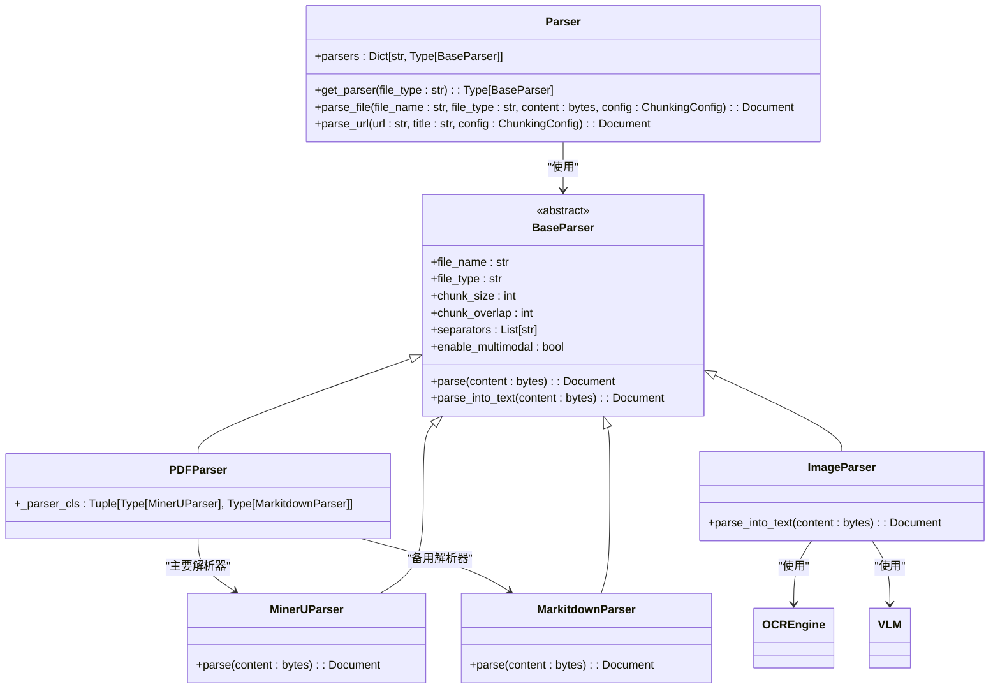
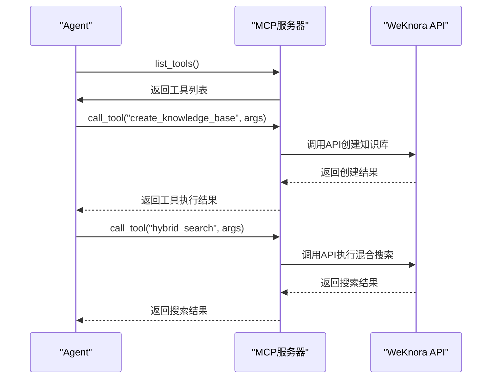
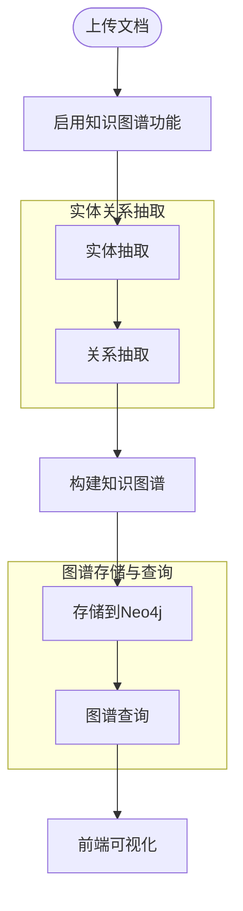

# 高级功能

<cite>
**本文档引用的文件**   
- [main.py](file://docreader/main.py)
- [parser.py](file://docreader/parser/parser.py)
- [pdf_parser.py](file://docreader/parser/pdf_parser.py)
- [image_parser.py](file://docreader/parser/image_parser.py)
- [ocr_engine.py](file://docreader/parser/ocr_engine.py)
- [main.py](file://mcp-server/main.py)
- [weknora_mcp_server.py](file://mcp-server/weknora_mcp_server.py)
- [graph.go](file://internal/application/service/graph.go)
- [KnowledgeGraph.md](file://docs/KnowledgeGraph.md)
- [开启知识图谱功能.md](file://docs/开启知识图谱功能.md)
- [MCP功能使用说明.md](file://docs/MCP功能使用说明.md)
- [query_knowledge_graph.go](file://internal/agent/tools/query_knowledge_graph.go)
- [GraphSettings.vue](file://frontend/src/views/knowledge/settings/GraphSettings.vue)
</cite>

## 目录
1. [文档解析服务](#文档解析服务)
2. [MCP服务器扩展](#mcp服务器扩展)
3. [知识图谱功能](#知识图谱功能)
4. [高级集成与优化](#高级集成与优化)

## 文档解析服务

WeKnora的文档解析服务（docreader/）是一个强大的多格式文档处理引擎，通过gRPC接口提供统一的文档解析能力。该服务支持多种文档格式，包括PDF、Word、Excel、CSV、Markdown、HTML以及图片格式（JPG、PNG等），并具备OCR和多模态处理能力。

文档解析服务的核心是`Parser`类，它采用策略模式（Strategy Pattern）为不同文件类型选择合适的解析器。系统通过文件扩展名映射到相应的解析器类，如`PDFParser`处理PDF文件，`Docx2Parser`处理Word文档，`ImageParser`处理图片文件等。这种设计确保了系统的可扩展性，可以轻松添加新的文档格式支持。

**Diagram sources**
- [parser.py](file://docreader/parser/parser.py#L20-L176)
- [pdf_parser.py](file://docreader/parser/pdf_parser.py#L6-L17)
- [image_parser.py](file://docreader/parser/image_parser.py#L12-L45)

文档解析流程从`DocReaderServicer`接收gRPC请求开始，根据文件类型调用相应的解析器。对于PDF文件，系统采用链式责任模式（Chain of Responsibility Pattern），首先尝试使用`MinerUParser`进行解析，如果失败则回退到`MarkitdownParser`。这种双重解析机制确保了高解析成功率。

图片文件的处理尤为复杂，`ImageParser`不仅负责上传图片到对象存储（COS或MinIO），还集成了OCR引擎和视觉语言模型（VLM）。系统首先使用OCR引擎（默认为PaddleOCR）提取图片中的文字内容，然后利用VLM生成图片的描述性标题。这种多模态处理能力使得系统能够将图片内容转化为可搜索的文本信息。

**Section sources**
- [main.py](file://docreader/main.py#L130-L240)
- [parser.py](file://docreader/parser/parser.py#L73-L129)

## MCP服务器扩展

MCP（Model Context Protocol）服务器是WeKnora系统的核心扩展机制，它通过标准化协议连接外部工具和服务，极大地扩展了Agent的能力边界。MCP服务器作为WeKnora API的代理，将外部工具的能力以标准化的方式暴露给Agent，使其能够安全地调用各种功能。

MCP服务器的架构基于Python实现，通过`mcp.server`库提供标准的MCP协议支持。服务器启动时会注册一系列工具（Tools），每个工具都定义了清晰的输入输出模式。这些工具涵盖了WeKnora系统的各个方面，包括租户管理、知识库操作、模型配置、会话管理等。

**Diagram sources**
- [weknora_mcp_server.py](file://mcp-server/weknora_mcp_server.py#L254-L633)
- [main.py](file://mcp-server/main.py#L89-L121)

MCP服务器支持三种传输方式：SSE（Server-Sent Events）、HTTP流式传输和Stdio。SSE方式提供了最佳的流式体验，适合需要实时响应的场景；HTTP流式传输提供了更好的兼容性；Stdio方式则适合本地调试和离线环境。用户可以通过前端界面（McpSettings.vue）集中管理所有MCP服务，无需手动修改配置文件。

MCP工具的注册过程通过装饰器模式实现。每个工具都通过`@app.list_tools()`装饰器注册，并定义了详细的JSON Schema来描述其参数。例如，`create_knowledge_base`工具需要知识库名称、描述、嵌入模型ID等参数，而`hybrid_search`工具则需要知识库ID、查询文本和搜索阈值等参数。这种标准化的接口设计使得Agent能够准确理解每个工具的功能和使用方法。

**Section sources**
- [weknora_mcp_server.py](file://mcp-server/weknora_mcp_server.py#L254-L800)
- [MCP功能使用说明.md](file://docs/MCP功能使用说明.md#L1-L30)

## 知识图谱功能

知识图谱功能是WeKnora系统的核心高级能力之一，它将文档内容转化为结构化的图数据，实现更深层次的知识关联和推理。该功能基于Neo4j图数据库实现，通过实体和关系抽取技术，将非结构化文本转化为节点和边的图结构。

知识图谱的启用需要两个步骤：首先在环境变量中配置Neo4j连接信息，然后在知识库设置中启用实体和关系抽取。系统通过`NEO4J_ENABLE`环境变量控制功能开关，当设置为`true`时，系统会初始化Neo4j存储库并启用图谱相关逻辑。

**Diagram sources**
- [graph.go](file://internal/application/service/graph.go#L75-L889)
- [开启知识图谱功能.md](file://docs/开启知识图谱功能.md#L1-L86)

知识图谱的构建过程由`graphBuilder`类负责，它实现了`GraphBuilder`接口。构建过程分为三个主要阶段：实体抽取、关系抽取和图结构构建。实体抽取使用LLM分析文本内容，识别出有意义的概念、人物、地点等实体；关系抽取则分析实体之间的语义连接，建立关系；最后，系统将实体和关系存储到Neo4j中，形成完整的知识图谱。

在知识库设置中，用户可以配置要抽取的实体类型（Nodes）和关系类型（Relations）。例如，可以定义"技术"、"工具"、"概念"作为实体类型，"依赖于"、"使用"、"包含"作为关系类型。这些配置决定了图谱抽取的范围和精度。系统会对配置进行验证，确保没有空值或重复名称。

知识图谱查询通过`query_knowledge_graph`工具实现。该工具首先检查目标知识库是否启用了图谱抽取，然后执行混合搜索。查询结果不仅包含相关文本片段，还包含图谱结构数据，用于前端可视化。系统会自动去重并按相关度排序结果，提供更精准的查询体验。

**Section sources**
- [graph.go](file://internal/application/service/graph.go#L75-L889)
- [query_knowledge_graph.go](file://internal/agent/tools/query_knowledge_graph.go#L13-L369)
- [GraphSettings.vue](file://frontend/src/views/knowledge/settings/GraphSettings.vue#L1-L35)

## 高级集成与优化

为了实现最佳的系统性能和用户体验，WeKnora提供了多种高级集成和优化选项。这些功能主要集中在文档解析配置、MCP服务管理和知识图谱优化三个方面。

文档解析服务支持高度可配置的分块（chunking）策略。用户可以通过`ReadConfig`消息设置分块大小、重叠长度和分隔符。默认的分块大小为512个字符，重叠长度为50个字符，分隔符包括"\n\n"、"\n"和"。"。这些参数可以根据文档类型和内容特点进行调整，以优化检索效果。

MCP服务的管理提供了丰富的配置选项，包括认证信息、超时设置和重试策略。对于公网或第三方服务，建议适当提高重试次数和延迟时间，以应对网络波动。同时，建议为生产环境创建最小权限的API密钥，并定期轮换，以提高系统安全性。

知识图谱的性能优化主要体现在关系权重计算和实体度数计算上。系统使用PMI（点互信息）和关系强度的加权组合来计算关系权重，其中PMI权重为0.6，强度权重为0.4。实体度数表示一个实体与其他实体的连接数量，是图结构分析的重要指标。这些计算确保了图谱查询的相关性和准确性。

**Section sources**
- [main.py](file://docreader/main.py#L67-L127)
- [weknora_mcp_server.py](file://mcp-server/weknora_mcp_server.py#L254-L800)
- [graph.go](file://internal/application/service/graph.go#L491-L620)