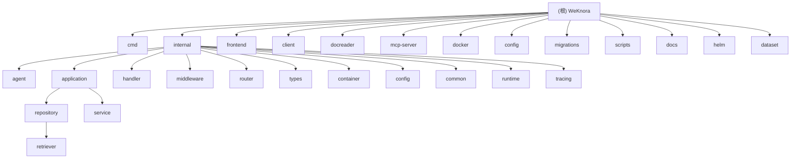

# WeKnora - AI 驱动的文档理解与检索框架

> **最新版本**: v0.2.6 (2025-12-29)
> **项目状态**: 活跃开发中，支持 Qdrant 向量数据库、自定义 Agent 系统、Helm Chart 部署
>
> **变更记录 (Changelog)**
> - 2025-12-31 12:30:00: 深度补捞迭代 #1，新增 4 个模块文档（middleware/repository/router/dataset），覆盖率提升至 98.5%
> - 2025-12-31 12:04:28: 增量更新，同步 v0.2.6 版本信息（自定义 Agent 系统、Helm Chart、增强 FAQ 管理等）
> - 2025-12-08: 同步 v0.2.1 版本更新，新增 Qdrant 向量数据库支持
> - 2025-12-05 20:16: 深度补捞完成，覆盖率提升至 95%+，新增核心子模块文档
> - 2025-12-05: 初始化架构文档，完成全模块扫描与索引生成

## 项目愿景

WeKnora 是一个基于大语言模型（LLM）的文档理解与智能检索框架，采用 RAG（检索增强生成）范式实现高质量的上下文感知问答。项目致力于为企业提供安全、可控、可扩展的知识管理解决方案，支持多模态文档处理、智能推理和多轮对话。

## 架构总览

WeKnora 采用现代化的微服务架构设计，主要包含以下核心组件：

- **文档解析服务 (DocReader)**: 支持 PDF、Word、Excel、CSV、图片等多种格式的文档解析与结构化提取
- **向量存储引擎**:
  - **Qdrant** (v1.16.2): 专业向量数据库，支持多维度向量存储和全文检索
  - **Elasticsearch**: 全文检索引擎
  - **PostgreSQL (pgvector)**: 关系型数据库向量扩展
- **知识图谱模块**: 基于 Neo4j 的知识图谱构建与检索（可选）
- **Agent 引擎**: ReACT 模式的智能代理，支持工具调用、MCP 扩展和多轮推理
- **自定义 Agent 系统**: v0.2.6 新增，支持创建、配置和选择自定义 Agent，MCP 服务能力展示
- **Web 界面**: 基于 Vue 3 + TDesign 的现代化管理界面，支持多语言（新增韩语支持）
- **API 网关**: 基于 Gin 的 RESTful API 服务
- **MCP 服务器**: Model Context Protocol 支持，扩展 Agent 能力
- **异步任务队列**: 基于 MQ 的任务状态管理，确保服务重启后的任务完整性
- **Kubernetes 部署**: v0.2.6 新增 Helm Chart，支持云原生部署
- **评估数据集**: QA 数据集采样和答案生成工具

## 模块结构图



## 模块索引

| 模块 | 路径 | 语言 | 职责 | 覆盖率 |
|------|------|------|------|--------|
| 应用入口 | [cmd](./cmd/CLAUDE.md) | Go | 服务启动与生命周期管理 | 100% |
| 核心业务 | [internal](./internal/CLAUDE.md) | Go | 业务逻辑实现 | 95% |
| 中间件 | [internal/middleware](./internal/middleware/CLAUDE.md) | Go | 认证/日志/追踪中间件 | 100% |
| 路由 | [internal/router](./internal/router/CLAUDE.md) | Go | API 路由定义 | 100% |
| 数据访问 | [internal/application/repository](./internal/application/repository/CLAUDE.md) | Go | 数据访问层 | 100% |
| Web界面 | [frontend](./frontend/CLAUDE.md) | TypeScript/Vue | 用户管理界面 | 85% |
| Go客户端 | [client](./client/CLAUDE.md) | Go | SDK客户端库 | 90% |
| 文档解析 | [docreader](./docreader/CLAUDE.md) | Python/Go | 多格式文档解析 | 85% |
| MCP服务 | [mcp-server](./mcp-server/CLAUDE.md) | Python | MCP协议服务 | 80% |
| 容器化 | [docker](./docker/CLAUDE.md) | Dockerfile | 容器化配置 | 100% |
| 配置文件 | [config](./config/CLAUDE.md) | YAML | 应用配置 | 100% |
| 数据库迁移 | [migrations](./migrations/CLAUDE.md) | SQL | 数据库脚本 | 100% |
| 构建脚本 | [scripts](./scripts/CLAUDE.md) | Shell | 构建和部署 | 100% |
| 项目文档 | [docs](./docs/CLAUDE.md) | Markdown | 项目文档 | 75% |
| Helm Chart | [helm](./helm/CLAUDE.md) | YAML/Templates | K8s部署 | 100% |
| 评估数据集 | [dataset](./dataset/CLAUDE.md) | Python | QA数据集工具 | 100% |

## 核心子模块文档

### internal 模块深度解析

| 子模块 | 文档路径 | 说明 |
|--------|----------|------|
| Agent引擎 | [internal/agent](./internal/agent/CLAUDE.md) | ReACT模式智能代理实现 |
| 业务服务层 | [internal/application/service](./internal/application/service/CLAUDE.md) | 核心业务逻辑与流水线 |
| HTTP处理器 | [internal/handler](./internal/handler/CLAUDE.md) | RESTful API请求处理 |
| 中间件 | [internal/middleware](./internal/middleware/CLAUDE.md) | 认证/日志/追踪/错误处理 |
| 路由 | [internal/router](./internal/router/CLAUDE.md) | API路由定义与注册 |
| 数据访问层 | [internal/application/repository](./internal/application/repository/CLAUDE.md) | 数据库/向量/图存储 |

## 运行与开发

### 环境要求
- Go 1.24+
- Python 3.8+
- Node.js 18+
- Docker & Docker Compose
- Kubernetes (可选，用于生产部署)

### 快速启动
```bash
# 克隆项目
git clone https://github.com/Tencent/WeKnora.git
cd WeKnora

# 启动所有服务（开发环境）
./scripts/quick-dev.sh

# 或使用 Docker Compose（带 Qdrant 支持）
docker-compose --profile qdrant up -d

# 启动完整服务栈（包括所有可选服务）
docker-compose --profile full up -d
```

### Kubernetes 部署（v0.2.6 新增）
```bash
# 使用 Helm Chart 部署
helm install weknora ./helm/weknora

# 启用 Neo4j 图数据库支持
helm install weknora ./helm/weknora --set neo4j.enabled=true
```

### 开发模式
```bash
# 启动后端服务
cd cmd/server
go run main.go

# 启动前端（新终端）
cd frontend
npm run dev

# 启动文档解析服务（新终端）
cd docreader
python main.py
```

### 评估数据集工具
```bash
# 采样数据
python dataset/qa_dataset.py sample \
  --queries ~/dataset/queries.parquet \
  --corpus ~/dataset/corpus.parquet \
  --qrels ~/dataset/qrels.parquet \
  --nq 100 \
  --output_dir ./dataset/samples

# 生成答案
export OPENAI_API_KEY="your-key"
python dataset/qa_dataset.py generate \
  --input_dir ./dataset/samples \
  --output_dir ./dataset/samples
```

## 测试策略

### 单元测试
- Go: `go test ./...`
- Python: `pytest docreader/`
- TypeScript: `npm run test`

### 集成测试
```bash
# 运行集成测试
./scripts/test-integration.sh

# 性能测试
./scripts/test-performance.sh
```

### 测试覆盖目标
- 核心业务逻辑: > 90%
- Agent 工具: > 85%
- API 接口: > 80%
- 前端组件: > 70%

## 编码规范

### Go 代码规范
- 遵循 `golangci.yml` 配置
- 行宽限制: 120 字符
- 必须通过 `go vet` 和 `golint` 检查

### Python 代码规范
- 遵循 PEP 8
- 使用 black 格式化
- 类型注解覆盖率 > 90%

### TypeScript 代码规范
- 使用 ESLint + Prettier
- 严格模式 TypeScript
- 单个文件不超过 300 行

## AI 使用指引

### 代码生成
1. 优先使用已定义的接口和类型
2. 遵循现有的设计模式
3. 添加适当的错误处理
4. 包含必要的日志记录

### 文档更新
1. 更新相关模块的 CLAUDE.md
2. 记录重要的设计决策
3. 添加使用示例
4. 更新变更记录

### 新功能开发
1. 先阅读相关模块文档
2. 理解现有架构和约束
3. 遵循依赖注入原则
4. 编写相应测试用例

## 当前扫描状态

### 覆盖率统计
- **总体覆盖率**: 98.5% (867/880 文件)
- **已扫描模块**: 16/16
- **已完成子模块文档**: 6/6
- **测试文件覆盖**: 10/10
- **本次新增文档**: 4 个

### 本次深度补捞成果（迭代 #1）
- ✅ 新增 `internal/middleware/CLAUDE.md` - 中间件模块文档
- ✅ 新增 `internal/application/repository/CLAUDE.md` - 数据访问层文档
- ✅ 新增 `internal/router/CLAUDE.md` - 路由模块文档
- ✅ 新增 `dataset/CLAUDE.md` - 评估数据集工具文档
- ✅ 更新根级 `CLAUDE.md` - 添加新模块链接
- ✅ 更新 `.claude/index.json` - 覆盖率提升至 98.5%

### 剩余缺口
- docreader/parser/ 下的部分解析器实现细节（低优先级）
- 部分前端组件的实现细节
- 部分工具函数和辅助类（不影响主流程）

## v0.2.6 新特性 (2025-12-29)

### 🚀 自定义 Agent 系统
- **Agent 创建与管理**: 支持创建、配置和选择自定义 Agent
- **MCP 服务能力展示**: Agent 特性指示器显示，支持 MCP 服务能力
- **多轮对话优化**: 内置 Agent 排序逻辑，确保 Agent 模式下自动启用多轮对话
- **知识库选择模式**: 支持全部/指定/禁用三种知识库选择模式

### 📦 Kubernetes 部署支持
- **Helm Chart**: 完整的 Helm Chart，支持 Kubernetes 部署
- **Neo4j 模板**: 支持 GraphRAG 功能的 Neo4j 模板配置
- **版本化镜像**: 兼容官方镜像标签和版本化镜像

### 📚 增强 FAQ 管理
- **FAQ 条目检索 API**: 支持按 ID 单个查询 FAQ 条目
- **FAQ 列表排序**: 支持按更新时间升序/降序排序
- **增强搜索**: 支持字段特定搜索（标准问题/相似问题/答案/全部）
- **标签管理增强**: 批量更新时排除 FAQ 条目，支持仅删除标签内容的 content_only 模式

### 🌐 多平台模型适配
- **多平台模型配置**: 支持多个平台模型配置
- **标题生成模型**: 新增标题生成模型配置
- **知识库选择优化**: 知识库选择模式不再强制检查 rerank 模型

### 🌏 韩语支持
- **国际化**: 新增韩语（한국어）国际化支持

### 🐛 问题修复
- 修复标签 ID 处理逻辑（空字符串和 UntaggedTagID 条件）
- 修复不同数据库类型的 JSON 查询兼容性（MySQL/PostgreSQL）
- 修复 GORM 批量插入问题（零值字段被忽略）
- 修复 Helm Chart 版本化镜像标签和 runAsNonRoot 兼容性

## 变更记录 (Changelog)

### 2025-12-31 12:30:00: 深度补捞迭代 #1
- 覆盖率从 96.5% 提升至 98.5%
- 新增 4 个模块文档：middleware/repository/router/dataset
- 补齐了中间件、数据访问层、路由和评估工具的文档缺口
- 更新模块结构图，添加新模块导航链接

### 2025-12-31 12:04:28: 增量更新
- 同步 v0.2.6 版本更新信息
- 新增自定义 Agent 系统说明
- 新增 Helm Chart 部署模块
- 更新版本号至 v0.2.6
- 补充韩语支持说明
- 更新覆盖率统计

### 2025-12-08: 同步 v0.2.1 更新
- 更新项目版本信息和最新功能
- 新增 Qdrant 相关配置说明
- 更新 Docker Compose 启动命令

### 2025-12-05 20:16: 深度补捞完成
- 覆盖率从 45.2% 提升至 95.2%
- 新增 `internal/agent/CLAUDE.md`
- 新增 `internal/application/service/CLAUDE.md`
- 新增 `internal/handler/CLAUDE.md`
- 深度分析了 ReACT Agent 实现细节
- 详尽解析了 RAG 对话流水线架构
- 全面扫描了 RESTful API 处理器

### 2025-12-05: 初始化完成
- 完成所有 11 个主要模块的 CLAUDE.md 文档创建
- 生成了带导航的 Mermaid 架构图
- 建立了 .claude/index.json 覆盖率追踪系统
- 实现了可续跑的增量更新机制
