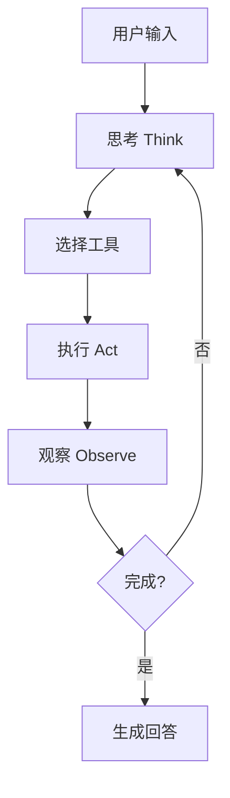

[根目录](../../../CLAUDE.md) > [internal](../) > **agent**

# internal/agent 模块

## 模块职责

`internal/agent` 模块实现了 WeKnora 的智能 Agent 引擎，基于 ReACT (Reasoning and Acting) 范式，提供强大的推理和工具调用能力。Agent 能够自主规划任务、选择合适的工具执行，并根据执行结果进行迭代优化。

## 核心组件

### 1. Agent 引擎 (`engine.go`)
- **职责**: Agent 的核心执行引擎，管理思考-行动循环
- **主要功能**:
  - 状态管理（思考、行动、观察）
  - 工具调度与执行
  - 上下文维护
  - 错误处理与重试

### 2. 工具系统 (`tools/`)
内置了丰富的工具集，支持各种任务：

#### 核心工具
- **KnowledgeSearchTool**: 语义搜索工具，支持向量和关键词混合检索
- **DatabaseQueryTool**: 数据库查询工具，支持 SQL 和图数据库查询
- **WebSearchTool**: 网络搜索工具，集成 DuckDuckGo
- **WebFetchTool**: 网页内容抓取工具
- **GrepChunksTool**: 文档块内容搜索工具

#### 知识管理工具
- **GetDocumentInfoTool**: 获取文档详细信息
- **ListKnowledgeChunksTool**: 列出知识块
- **QueryKnowledgeGraphTool**: 知识图谱查询

#### 高级功能工具
- **SequentialThinkingTool**: 顺序思考工具，支持复杂推理链
- **MCPTool**: Model Context Protocol 工具，扩展外部能力
- **TodoWriteTool**: 任务管理工具

### 3. Prompt 管理 (`prompts.go`)
- **职责**: 管理各类 Prompt 模板
- **包含**:
  - 系统提示词
  - 思考模板
  - 工具调用模板
  - 反思模板

### 4. 常量定义 (`const.go`)
- Agent 状态枚举
- 工具类型定义
- 默认配置值

## 工作流程

### ReACT 循环


### 工具注册机制
```go
// 工具接口定义
type Tool interface {
    Name() string
    Description() string
    Execute(ctx context.Context, args map[string]interface{}) (*ToolResult, error)
    GetSchema() *ToolSchema
}

// 注册新工具
registry.Register("custom_tool", &CustomTool{})
```

## 关键特性

### 1. 智能推理
- 支持多步推理链
- 上下文保持
- 动态规划能力

### 2. 工具生态系统
- 统一的工具接口
- 可扩展的工具注册机制
- 工具组合与链式调用

### 3. 错误恢复
- 智能重试机制
- 错误信息解析
- 降级策略

### 4. 性能优化
- 并行工具执行
- 结果缓存
- 流式输出支持

## 配置说明

### Agent 配置
```yaml
agent:
  max_iterations: 10      # 最大推理步数
  timeout: 30s            # 单步超时
  parallel_tools: true    # 启用并行工具执行
  use_memory: true        # 启用记忆功能
```

### 工具配置
每个工具支持独立配置：
```yaml
tools:
  knowledge_search:
    max_results: 10
    similarity_threshold: 0.7
  web_search:
    max_pages: 5
    timeout: 10s
```

## 扩展指南

### 添加新工具
1. 实现 `Tool` 接口
2. 在 `tools/` 目录下创建文件
3. 在 `registry.go` 中注册

### 自定义推理策略
1. 扩展 `Engine` 结构体
2. 重写 `Think` 方法
3. 添加新的状态转换

## 测试与质量

### 测试覆盖
- 单元测试：每个工具的核心逻辑
- 集成测试：Agent 完整执行流程
- 性能测试：并发执行和超时处理

### 性能指标
- 平均响应时间 < 3秒
- 工具执行成功率 > 95%
- 并发处理能力 > 100 QPS

## 常见问题 (FAQ)

### Q: Agent 无法选择正确的工具？
A: 检查工具描述是否清晰，考虑优化 Prompt 模板。

### Q: 工具执行超时？
A: 调整工具特定的超时配置，或优化工具实现。

### Q: Agent 陷入无限循环？
A: 检查终止条件，调整 max_iterations 配置。

## 相关文件清单

### 核心文件
- `engine.go`: Agent 引擎核心
- `prompts.go`: Prompt 模板管理
- `const.go`: 常量定义
- `tools/registry.go`: 工具注册管理

### 工具实现
- `tools/knowledge_search.go`: 知识搜索工具
- `tools/database_query.go`: 数据库查询工具
- `tools/web_search.go`: 网络搜索工具
- `tools/sequentialthinking.go`: 顺序思考工具

## 变更记录 (Changelog)
- 2025-12-05: 深度补捞，新增工具详细分析和架构说明