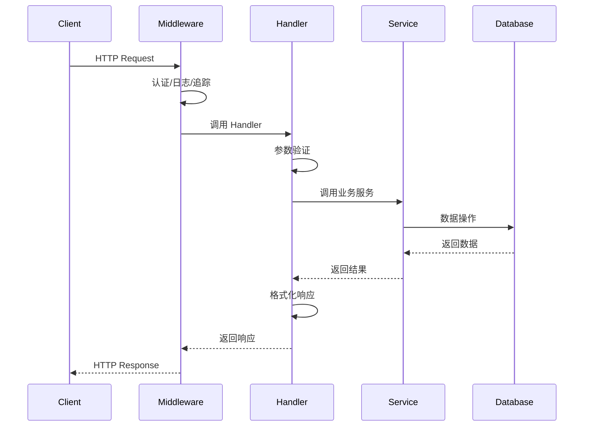

[根目录](../../../CLAUDE.md) > [internal](../) > **handler**

# internal/handler 模块

## 模块职责

`internal/handler` 模块是 WeKnora 的 HTTP 请求处理层，负责接收和解析 HTTP 请求、调用业务服务、处理响应和错误。该层是外部世界与内部业务逻辑的桥梁，遵循 RESTful API 设计原则。

## 核心处理器

### 1. 认证处理器 (`auth.go`)
- **功能**: 用户认证和授权
- **主要接口**:
  - `POST /auth/login`: 用户登录
  - `POST /auth/logout`: 用户登出
  - `POST /auth/refresh`: 刷新令牌
  - `GET /auth/profile`: 获取用户信息

### 2. 知识库处理器 (`knowledgebase.go`)
- **功能**: 知识库的 CRUD 操作
- **主要接口**:
  - `GET /knowledgebases`: 获取知识库列表
  - `POST /knowledgebases`: 创建知识库
  - `PUT /knowledgebases/{id}`: 更新知识库
  - `DELETE /knowledgebases/{id}`: 删除知识库
  - `POST /knowledgebases/{id}/sync`: 同步知识库

### 3. 知识管理处理器 (`knowledge.go`)
- **功能**: 知识点的管理
- **主要接口**:
  - `GET /knowledge`: 查询知识点
  - `POST /knowledge`: 添加知识点
  - `PUT /knowledge/{id}`: 更新知识点
  - `DELETE /knowledge/{id}`: 删除知识点
  - `POST /knowledge/batch`: 批量操作

### 4. 会话处理器 (`session/`)
管理对话会话和聊天功能。

#### 核心文件
- `handler.go`: 会话处理器主逻辑
- `qa.go`: 问答处理
- `stream.go`: 流式响应
- `agent_stream_handler.go`: Agent 流式处理
- `types.go`: 类型定义

#### 主要接口
- `POST /sessions`: 创建会话
- `GET /sessions/{id}`: 获取会话详情
- `POST /sessions/{id}/chat`: 发送消息
- `POST /sessions/{id}/agent`: Agent 对话
- `DELETE /sessions/{id}`: 删除会话

### 5. 文档分块处理器 (`chunk.go`)
- **功能**: 管理文档分块
- **主要接口**:
  - `GET /chunks`: 查询分块
  - `POST /chunks`: 创建分块
  - `PUT /chunks/{id}`: 更新分块
  - `DELETE /chunks/{id}`: 删除分块

### 6. 模型处理器 (`model.go`)
- **功能**: AI 模型管理
- **主要接口**:
  - `GET /models`: 获取模型列表
  - `POST /models`: 添加模型
  - `PUT /models/{id}`: 更新模型
  - `DELETE /models/{id}`: 删除模型
  - `POST /models/{id}/test`: 测试模型

### 7. 评估处理器 (`evaluation.go`)
- **功能**: 评估任务管理
- **主要接口**:
  - `GET /evaluations`: 获取评估列表
  - `POST /evaluations`: 创建评估
  - `GET /evaluations/{id}/results`: 获取评估结果
  - `POST /evaluations/{id}/run`: 运行评估

### 8. 标签处理器 (`tag.go`)
- **功能**: 标签管理
- **主要接口**:
  - `GET /tags`: 获取标签列表
  - `POST /tags`: 创建标签
  - `PUT /tags/{id}`: 更新标签
  - `DELETE /tags/{id}`: 删除标签

### 9. 租户处理器 (`tenant.go`)
- **功能**: 多租户管理
- **主要接口**:
  - `GET /tenant/info`: 获取租户信息
  - `PUT /tenant/settings`: 更新租户设置
  - `GET /tenant/stats`: 获取租户统计

### 10. 系统处理器 (`system.go`)
- **功能**: 系统级操作
- **主要接口**:
  - `GET /system/info`: 系统信息
  - `GET /system/health`: 健康检查
  - `POST /system/init`: 系统初始化

### 11. MCP 服务处理器 (`mcp_service.go`)
- **功能**: MCP 服务管理
- **主要接口**:
  - `GET /mcp-services`: 获取 MCP 服务列表
  - `POST /mcp-services`: 注册 MCP 服务
  - `PUT /mcp-services/{id}`: 更新服务配置
  - `DELETE /mcp-services/{id}`: 删除服务

### 12. 网络搜索处理器 (`web_search.go`)
- **功能**: 网络搜索功能
- **主要接口**:
  - `POST /web-search`: 执行网络搜索
  - `GET /web-search/history`: 搜索历史

### 13. 初始化处理器 (`initialization.go`)
- **功能**: 系统初始化
- **主要接口**:
  - `GET /initialization/status`: 初始化状态
  - `POST /initialization/setup`: 执行初始化

### 14. FAQ 处理器 (`faq.go`)
- **功能**: FAQ 管理
- **主要接口**:
  - `GET /faqs`: 获取 FAQ 列表
  - `POST /faqs`: 添加 FAQ
  - `PUT /faqs/{id}`: 更新 FAQ
  - `DELETE /faqs/{id}`: 删除 FAQ

## 设计模式

### 1. 中间件模式
使用 Gin 中间件处理横切关注点：
```go
func (h *Handler) Handle(c *gin.Context) {
    // 认证
    if err := h.authMiddleware(c); err != nil {
        c.JSON(http.StatusUnauthorized, gin.H{"error": err.Error()})
        return
    }

    // 业务逻辑
    result, err := h.service.Process(c.Request.Context(), request)
    if err != nil {
        c.JSON(http.StatusInternalServerError, gin.H{"error": err.Error()})
        return
    }

    // 响应
    c.JSON(http.StatusOK, result)
}
```

### 2. 依赖注入
通过构造函数注入依赖：
```go
func NewHandler(
    service interfaces.Service,
    auth interfaces.AuthService,
    logger logger.Logger,
) *Handler {
    return &Handler{
        service: service,
        auth:    auth,
        logger:  logger,
    }
}
```

### 3. 错误处理
统一的错误处理机制：
```go
type ErrorResponse struct {
    Code    string `json:"code"`
    Message string `json:"message"`
    Details string `json:"details,omitempty"`
}
```

## 请求处理流程



## 响应格式

### 成功响应
```json
{
    "code": 0,
    "message": "success",
    "data": {
        // 具体数据
    },
    "timestamp": "2025-12-05T20:16:27Z"
}
```

### 错误响应
```json
{
    "code": 40001,
    "message": "参数错误",
    "details": "知识库名称不能为空",
    "timestamp": "2025-12-05T20:16:27Z"
}
```

### 分页响应
```json
{
    "code": 0,
    "message": "success",
    "data": {
        "items": [...],
        "total": 100,
        "page": 1,
        "size": 20
    },
    "timestamp": "2025-12-05T20:16:27Z"
}
```

## 性能优化

### 1. 请求验证
- 参数绑定验证
- 请求大小限制
- 频率限制

### 2. 响应优化
- 响应压缩 (gzip)
- 字段选择 (fields)
- 条件请求 (ETag)

### 3. 并发控制
- 连接池管理
- 超时控制
- 断路器模式

## 安全措施

### 1. 认证授权
- JWT Token 验证
- RBAC 权限控制
- API Key 管理

### 2. 输入验证
- SQL 注入防护
- XSS 防护
- 文件上传验证

### 3. 传输安全
- HTTPS 强制
- CORS 配置
- 安全头设置

## 监控与日志

### 1. 请求追踪
- Request ID 生成
- 链路追踪集成
- 性能指标记录

### 2. 日志记录
- 结构化日志
- 敏感信息脱敏
- 日志级别控制

### 3. 错误监控
- 错误统计
- 告警通知
- 错误分析

## 常见问题 (FAQ)

### Q: 如何处理大文件上传？
A: 使用分片上传、流式处理、进度回调。

### Q: 如何实现 API 版本管理？
A: 使用 URL 路径版本、Header 版本、兼容性处理。

### Q: 如何优化响应时间？
A: 使用缓存、异步处理、批量操作。

## 相关文件清单

### 核心处理器
- `auth.go`: 认证处理
- `knowledgebase.go`: 知识库管理
- `session/`: 会话管理
- `model.go`: 模型管理
- `evaluation.go`: 评估管理

### 支撑处理器
- `chunk.go`: 文档分块
- `tag.go`: 标签管理
- `tenant.go`: 租户管理
- `system.go`: 系统操作

## 变更记录 (Changelog)
- 2025-12-05: 深度补捞，新增处理器详细分析和设计模式说明